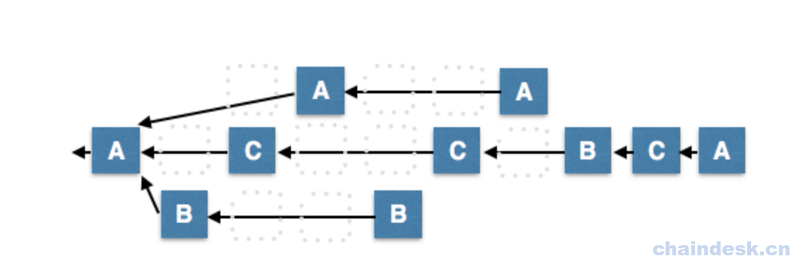

# 第十章 DPOS

## 什么是 DPoS

DPoS 即股份授权证明，英文全称是`Delegated Proof of Stake`。它是 PoS 算法的改造版。
最早于 2013 年由比特股 Bitshares 提出，目的为解决 PoW 和 PoS 机制的不足。

## DPoS 基本原理

PoS 解决了 PoW 的算力问题，但是依据权益结余来选择出块者，会导致首富账户的权力更大，有可能支配记账权。为改善这种中心化的负面影响，DPoS 引进了代理人机制，类似于人民代表选举，被选举者就是这里的代理人。代理人是由所有持币者根据自己的意愿选出来的，他理论上能够代表大众的权益。以 eos 为例，它有 21 个超级节点，每个节点都是持币人选举出来的。

一般选举过程是这样的，首先设立一个评审委员会，全球所有节点都可以报名参加，报名的前提是交纳保证金，通过审核的最为满足条件的前 N 个节点将作为候选节点，进入下一轮，也就是竞选阶段。这些候选节点会将会各种演说游说其他的持币人，让他们给自己投票，这里可能场外会给投票人某些好处。最终投票总数前 m 名的候选节点成为公链的代理人，负责出块。每次出块时，系统会随机顺序挑选指定某个代理人出块。每次选举出来的代理人都有任期，任期期间如果被监管发现某些作恶行为将会被追责和卸任。

代理人的职责主要有：

1.提供一台服务器节点，保证节点的正常运行；
2.节点服务器收集网络里的交易；
3.节点验证交易，把交易打包到区块；
4.节点广播区块，其他节点验证后把区块添加到自己的数据库；
5.带领并促进区块链项目的发展；

代理人的节点服务器相当于比特币网络里的矿机，在完成本职工作的同时可以领取区块奖励和交易的手续费。

普通节点不能直接参与出块，利益何在？
每个节点都有自己的选举权和监督权，对代理人的行为进行监视，保证链的正常运行。链稳定了，持币人在生态中的操作才能安心。同时，tps 的速度快了，在链上的交易秒级可以实现，使持币人感受到了极大的方便。整个链的生态如果因为良好的运行，会吸引更多的人或应用加入，使币的价格升值，持币人当然开心。当然这些都是理想情况下，在实际中很难得以实现。

### DPoS 的伪代码实现

```go
for round i //分成很多个 round，round 无限持续
   dlist_i = get N delegates sort by votes //根据投票结果选出得票率最高的 N 个受托人
   dlist_i = shuffle(dlist_i) //随机改变顺序
   loop //round 完了，退出循环
       slot = global_time_offset / block_interval
       pos = slot % N
       if dlist_i[pos] exists in this node //delegate 在这个节点
           generateBlock(keypair of dlist_i[pos]) //产生 block
       else
           skip 
```

### DPoS 运行机制

DPoS 的运作机制如下：

1.  所有持币者先选出代理人负责签署区块：选举过程比较类似由股东会选举出董事会（101 人代表），代替股东会做出日常营运决策。授权董事会后，决策会更有效率 （相较于 PoW 每 10 分钟产生一个区块，DPoS 每 3 秒钟即可产生一个区块。）

2.  与 PoW 相同，DPoS 的规则也是最长链胜出。其中每个受托人必须按照生产排程，轮流产生区块，拿一间工厂作为比方，假设排程排定 A、Ｂ、Ｃ分别轮早、中、晚班生产，Ａ在晚上是无法刷门禁卡进入厂房生产的，同样地，C 在早班时段也是无法进厂房的。

    

3.  今天有一些恶意的节点生产了分叉区块，假设Ａ、Ｃ都是诚实的节点，只有 B 节点是恶意的，由于 B 产生区块的速度（每 9 秒只能产生 1 个）慢于 A、Ｃ合力产生区块的速度（每 9 秒产生 2 个），根据最长链胜出的规则，诚实的节点还是会胜出。

    

4.  同理，因为一个节点要产生重复两个区块的速度必定慢于诚实区块产生的速度，所以根据最长链胜出的规则，诚实的节点还是会胜出。

    

5.  如果今天 A、Ｂ、Ｃ三个代理人的网络有段时间是碎片化、各自为政的呢？在短期内的确有可能三链并行，但一旦网络连结恢复，短链自然会向最长的链回归。

    

因为代理可签署人数为奇数，所以两大派系势均力敌僵持不下的情况不会维持太久，最终势必会有其中一方的链更长。

## DPoS 的优缺点

### 优点

1.  能耗更低。DPoS 机制将节点数量进一步减少到 101 个，在保证网络安全的前提下，整个网络的能耗进一步降低，网络运行成本最低。

2.  更加去中心化。目前，对于比特币而言，个人挖矿已经不现实了，比特币的算力都集中在几个大的矿池手里，每个矿池都是中心化的，就像 DPoS 的一个受托人，因此 DPoS 机制的加密货币更加去中心化。PoS 机制的加密货币（比如未来币），要求用户开着客户端，事实上用户并不会天天开着电脑，因此真正的网络节点是由几个股东保持的，去中心化程度也不能与 DPoS 机制的加密货币相比。

3.  更快的确认速度。每个块的时间为 10 秒，一笔交易（在得到 6-10 个确认后）大概 1 分钟，一个完整的 101 个块的周期大概仅仅需要 16 分钟。而比特币（PoW 机制）产生一个区块需要 10 分钟，一笔交易完成（6 个区块确认后）需要 1 个小时。点点币（PoS 机制）确认一笔交易大概也需要 1 小时。

### 缺点

1.  投票的积极性并不高。绝大多数持股人（90％+）从未参与投票。这是因为投票需要时间、精力以及技能，而这恰恰是大多数投资者所缺乏的。

2.  对于坏节点的处理存在诸多困难。社区选举不能及时有效的阻止一些破坏节点的出现，给网络造成安全隐患。

### 知名 DPoS 项目

1.Bitshares

最早应用 DPoS 机制的项目，其 DPoS 机制里包含见证人(Witnesses)和代理人(Delegates)， 见证人负责区块的打包，代理人负责系统参数的修改和出块。

2.EOS

共识算法我 DPoS + BFT， 有 21 个代理人。

3.Asch

共识算法为 DPoS + PBFT， 有 101 个代理人。

## 用 Go 实现一个简单的 DPOS 项目

通过这个简易的项目，让大家对 DPOS 的工作加深下了解。
工程思路：
1.手动创建一个数组，将里面的元素作为代理人
2.每 30 秒将代理人的顺序随机打乱 1 次
3.乱序后的委员会将顺序出块

```go
package main

import (
    "strconv"
    "crypto/sha256"
    "encoding/hex"
    "time"
    "math/rand"
    "fmt"
)

//DPoS 原理

//创建区块
type Block struct {
    Index int
    PreHash string
    HashCode string
    BMP int
    validator string
    TimeStamp string
}

//区块链
var Blockchain []Block

//生成 block
func GenerateNextBlock(oldBlock Block,BMP int ,adds string) Block {
    var newBlock Block
    newBlock.Index = oldBlock.Index + 1
    newBlock.PreHash = oldBlock.HashCode
    newBlock.BMP = BMP
    newBlock.TimeStamp = time.Now().String()
    newBlock.validator = adds
    newBlock.HashCode = GenerateHashValue(newBlock)
    return newBlock
}

//产生区块的 hash
func GenerateHashValue(block Block) string {
    var hashCode = block.PreHash+block.validator+block.TimeStamp+
        strconv.Itoa(block.Index)+strconv.Itoa(block.BMP)

    var sha = sha256.New()
    sha.Write([]byte(hashCode))
    hashed:=sha.Sum(nil)
    return hex.EncodeToString(hashed)
}

//存放代理人,存放 delegete 的地址信息
var delegate =[]string{"aaa","bbb","ccc","dddd"}

//随机委托人的位置
func RandDelegate()  {
    rand.Seed(time.Now().Unix())
    var r = rand.Intn(3)
    t:=delegate[r]
    delegate[r]=delegate[3]
    delegate[3]=t
}

func main()  {
    fmt.Println(delegate)

    //创世区块
    var firstBlock Block
    Blockchain = append(Blockchain,firstBlock)
    //通过 n 按顺序让 delegate 作为矿工
    var n = 0
    ch1:=make(chan bool)
    ch2:=make(chan bool)

    go func() {
    flag:<-ch1
        count:=0
        for {
            //每间隔 3 秒产生新的区块，通过 count 记录睡眠次数
            count++
            time.Sleep(time.Second*3)
            //轮到的节点进行出块
            var nextBlock = GenerateNextBlock(firstBlock,1,delegate[n])
            n++
            n=n%len(delegate)
            firstBlock = nextBlock
            //上链
            Blockchain = append(Blockchain,nextBlock)
            fmt.Println(Blockchain)
            fmt.Println(count)
            //每 30 秒将代理人顺序打乱一次
            if count==10{
                count=0
                ch2<-true
                goto flag
            }
        }
    }()

go func() {
    for ; ;  {

        RandDelegate()
        fmt.Println("更换顺序后的代理人",delegate)
        ch1<-true
        <-ch2

    }

}()

    for  {
        ;
    }
} 
```