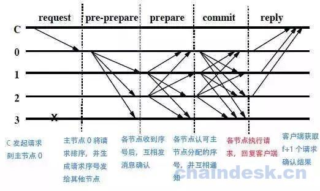

# 第十三章 PBFT

PBFT 即实用拜占庭容错系统，英文全称`Practical Byzantine Fault Tolerance`。它是第一个基于 BFT 理论并结合实际产生的新的共识算法。但应用场景是私有链和联盟链，如果用于公链，需要和其他共识算法进行灵活的混用。

## PBFT 算法原理

PBFT 是一类状态机拜占庭系统，要求共同维护一个状态，所有节点采用的行动一致。为此，需要运行三类基本协议，包括一致性协议（Agreement）、验证确认协议（Validity）和视图更换协议（Viewchange）。

1.一致性协议：
在 PBFT 系统中，节点分为两类：主节点（Lead）和从节点（Follow）。主节点就一个，其他剩余节点都是从节点。在实现 PBFT 系统功能之前，所有节点都是从节点，经过选举，产生一个主节点。每个节点都有被选举权和选举权，选举过程每个节点的概率都是平等的。

一致性协议包含若干个阶段：请求（Request）>序列分配（Pre-prepare）>相互交互（Prepare） >确认（Commit） >响应（Reply）。过程如下图：


注：C 为客户端或叫请求节点；0 为当前视图下的主节点；1，2，3 是从节点，其中 3 为宕机节点。
该视图满足拜占庭容错，即系统节点总数 4 >故障节点个数 1x3

1）Request 阶段
也就是 Lead 生成请求阶段。
客户端发送请求到主节点，或者主节点主动从某数据源获取数据作为请求

2）Pre-prepare 阶段
也就是 Lead 给其他所有 Follow 发送请求阶段。
主节点将收到的请求进行处理，给请求赋值一个序列号 n，形成一个带序号的副本，然后分发给其从节点。其中序号 n 必须在水线（watermark）上下限 h 和 H 之间。水线存在的意义在于防止一个失效节点使用一个很大的序号消耗序号空间。发送副本的格式是<<pre-prepare>,m>，这里 v 是视图编号，m 是客户端发送的请求消息，d 是请求消息 m 的摘要，n 是序号。</pre-prepare>

3）Prepare 阶段
也就是 Follow 收到请求，但不知道其他节点请求是什么，就给收到的请求签名发给其他所有节点，告诉他们我收到了这样一个请求。
从节点接收到副本后，对副本进行校验和确认。检查副本中请求是否签名合法；检查 d 与 m 的摘要是否一致；检查当前视图编号是是否与副本 v 一致。满足这些条件后，从节点将副本存入消息日志中，然后对副本进行签名并转发给其他的所有节点（包括主节点）。如果不满足，则该验证节点就会进入 View change 阶段。

4）Commit 阶段
也就是每个节点收到其他所有节点的签名请求，把这个合法请求跟自己之前保存的请求进行比较，如果超过有 2f 个请求一样，那么这个请求他会认为是大家共识的请求。然后对这个请求进行处理。
当前阶段所有节点，包括主节点，对接收到的签名副本进行签名验证和确认。签名验证通过后的副本与自己保存的副本进行比较，设和自己一样的副本个数记为 s，满足 s+1>=2f，故障节点的个数为 f，则该节点将会对这个请求进行响应，给予运算结果，并做签名。

5）Reply 阶段
也就是将处理结果发送给客户端，客户端收到 f+1 个一样结果，那么客户端会认为该结果正确。
每个收到请求的节点都会对请求进行响应处理，将结果广播给客户端。当客户端接收到 f+1 的响应相同时，则会认为该响应就是请求的结果。

2.验证确认协议：

在一致性协议使用时都用到了这个协议。在 PBFT 系统中，时刻保证数据的准确性，要进行数据校验和签名确认。对 Lead 的任何行为要进行监视，如果 Lead 有做越权或错误的事件，其他节点可以对其进行举报。

3.视图更换协议：

此阶段主要是用户在设计 PBFT 系统时，对 Lead 节点权限的设定。比如定时多长时间，正常更换 Lead，其他 Follow 节点都有机会成为新的 Lead。在 Lead 任期时期，如果超过 2/3 的节点反映它有问题，那么也会触发 view change。还有 Lead 在运行中突然挂掉，也会触发 view change。我们需要确保在新的 view 中如何来延续上一个 view 最终的状态，比如给这时来的新请求的编号，还有如何处理上一个 view 还没来得及完全处理好的请求。

## PBFT 算法在公链中的应用

PBFT 机制不需要挖矿，也不需要权益计算，所以通过它达成共识的时间会很快，为了提高公链的 tps，将 PBFT 灵活改进并引入公链，和 pow 算法或 pos 相结合形成一套新的混合机制，非常明智。目前这样应用的公链比较多，我下边主要讲解初链（TrueChain）是怎么实现的。

初链使用双链结构，即快链和慢链。运用 PBFT 和 POW 混合共识算法，前者生成快链，后者生成慢链。交易确认和挖矿是分开的。交易被打包后，通过 PBFT 委员会确认，生成 fastBlock，此时交易已经得到确认；慢链将快链里的 fastBlock 打包成为一个 snailBlock，经过矿工挖矿确认，实现上链。通过这种混合共识算法，tps 得到很大的提升，达到 3000 左右，而且使用 POW 挖矿，实现了去中心化的思想。PBFT 委员会每两天换届一次，候选委员都是 POW 挖矿成功后的矿工，保证了公平公正的原则。

虽然 PBFT 算法的设计初期是服务于私有链和公有链的，但是随着人们对它的不断改进和灵活使用，未来公链它将在共识机制中处于重要地位。

## Go 语言实现一个网络交互的 PBFT 工程

工程思路：
1.开启 4 个终端，分别代表 4 个小国，开启 http 监听，监听路径有 4 个，分别是"/req"，"/prePrepare", "/prepare", "/commit"。
2.任意一个节点通过 http 网页发起请求；
3.该被请求节点会将数据写入自己的数组，然后并通过"/prePrepare"路径向其他节点广播该请求数据；
4.其他节点通过节点监听接收到请求数据，将请求数据写入自己的数组，并通过"/Prepare"路径向其他节点广播该请求数据；
5.所有节点将收到的数据进行校验，如果当前数组的长度大于所有节点个数的 2/3，则输出 OK，并将 OK 数据通过路径"/commit"广播给其他所有节点；
6.当节点收到 OK 数量达到所有节点个数的 1/3，则就是最后的结果。

```go
package main

import (
    "os"
    "fmt"
    "net/http"
    "io"
)

//声明 nodeInfo 节点，代表各个小国家
type nodeInfo struct {
    //节点名称
    id string
    //节点路径
    path string
    //http 响应
    writer http.ResponseWriter
}

//创建 map，存储各个国家的 ip 地址,也就是 url
var nodeTable = make(map[string]string)

//当 http 服务器，接收到网络请求并且/req 则回调 request
func (node *nodeInfo) request(writer http.ResponseWriter, request *http.Request) {
    //该命令允许 request 请求参数
    request.ParseForm()//解析完毕，打包返回。所以该方法不需要返回值。
    if (len(request.Form["warTime"]) > 0) {
        node.writer = writer
        fmt.Println("主节点接收到的参数信息为", request.Form["warTime"][0])
        //fmt.Println(request.Form["warTime"])打印出来是个数组，如果 warTime=1111&2222 等等，等号后边的是数组，warTime 是 map 的 key
        //激活主节点后，向其他的节点发送广播
        node.broadcast(request.Form["warTime"][0], "/prePrepare")
    }
}

//节点发送广播的方法
func (node *nodeInfo) broadcast(msg string, path string) {
    fmt.Println("广播", path)
    //遍历所有的节点
    for nodeId, url := range nodeTable {
        if nodeId == node.id {
            continue
        }
        //使当前节点以外的节点做响应
        http.Get("http://" + url + path + "?warTime=" + msg + "&nodeId=" + node.id)
    }
}

//处理广播后接收到的数据
func (node *nodeInfo) prePrepare(writer http.ResponseWriter, request *http.Request) {
    request.ParseForm()
    fmt.Println("接收到的广播为", request.Form["warTime"][0])
    if len(request.Form["warTime"]) > 0 {
        node.broadcast(request.Form["warTime"][0], "/prepare")
    }
}

//接收子节点的广播
func (node *nodeInfo) prepare(writer http.ResponseWriter, request *http.Request) {
    request.ParseForm()
    //打印消息
    fmt.Println("接收到的子节点的广播", request.Form["warTime"][0])
    //校验
    if len(request.Form["warTime"]) > 2/3*len(nodeTable) {
        node.authentication(request)
    }
}

var authenticationNodeMap = make(map[string]string)
var authenticationSuceess = false

//校验拜占庭
func (node *nodeInfo) authentication(request *http.Request) {
    if !authenticationSuceess {
        if len(request.Form["nodeId"]) > 0 {
            authenticationNodeMap[request.Form["nodeId"][0]] = "OK"
            //如果有两个国家节点正确的返回了结果
            if len(authenticationNodeMap) > len(nodeTable)/3 {
                authenticationSuceess = true
                node.broadcast(request.Form["warTime"][0], "/commit")
            }
        }
    }
}

//返回成功响应
func (node *nodeInfo) commit(writer http.ResponseWriter, request *http.Request) {
    if writer != nil {
        fmt.Println("拜占庭校验成功")
        //在网页上显示 ok
        io.WriteString(node.writer, "ok")
    }
}

func main() {
    //接受终端参数
    userId := os.Args[1]
    fmt.Println(userId)
    //存储 4 个国家的 IP 地址
    nodeTable = map[string]string{
        "Apple":  "localhost:1111",
        "MS":     "localhost:1112",
        "Google": "localhost:1113",
        "IBM":    "localhost:1114",
    }

    //创建国家对象
    node := nodeInfo{id: userId, path: nodeTable[userId]}

    //http 协议的回调函数
    http.HandleFunc("/req", node.request)
    http.HandleFunc("/prePrepare", node.prePrepare)
    http.HandleFunc("/prepare", node.prepare)
    http.HandleFunc("/commit", node.commit)
    //启动服务器
    if err := http.ListenAndServe(node.path, nil); err != nil {
        fmt.Println(err)
    }
} 
```