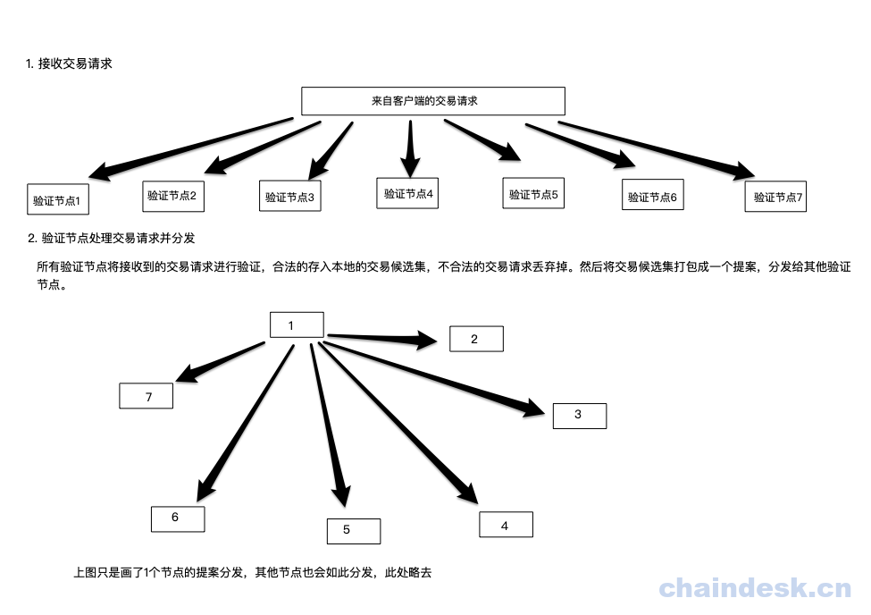
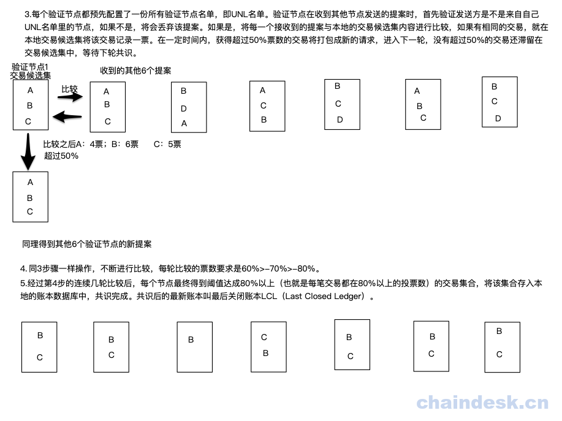
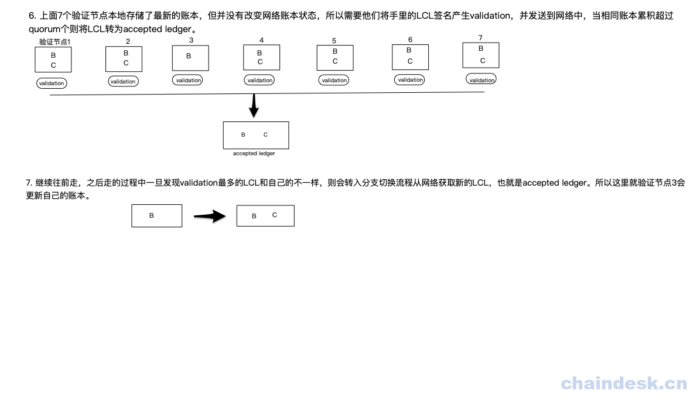

# 第十五章 Ripple 共识算法

Ripple（瑞波）是一种基于互联网的开源支付协议，可以实现去中心化的货币兑换、支付与清算功能。在 Ripple 的网络中，交易由客户端发起，经过追踪节点（tracking node）或验证节点（validating node）把交易广播到整个网络中。追踪节点的主要功能是分发交易信息以及相应客户端的账本请求。验证节点除了包含追踪节点的所有功能外，还能通过共识协议，在账本中增加新的账本实例数据。

下面我用在图形中分析具体的共识过程：

