# 第二章 【比特币钱包开发 二】通过助记词扩展子地址的原理与编码实现

## 课程目标

1.  掌握生成助记词的原理
2.  掌握助记词生成种子的原理
3.  掌握种子生成子秘钥的原理
4.  编程实践：从生成助记词到子地址

## 前言

为了安全尽量保证比特币地址的公钥未在网络上出现过，这就需要我们每次支付时，将支付额转到一个新的账户发起转账，而收款时使用一个新账号地址。为了满足这样的场景，就需要安全管理很多的账号与对应的秘钥，这样显然是不科学的。因此，这里讲解通过助记词生成很多子地址，这样，我们只需保存一份助记词就相当于保存好了 2³¹ 个账号的私钥。

## 一、助记词的生成过程

BIP39 是助记词标准的实现，助记词是一个随机数的字序列，用来作为种子产生一个确定性的钱包。单词序列足以重新创建种子，然后再创建钱包和所有派生的密钥。一个实现带有助记词的确定性钱包应用程序在首次创建钱包时将向用户显示 12 到 24 个单词的序列。该单词序列是钱包备份，可用于恢复和重新创建相同或任何兼容的钱包应用程序中的所有密钥。记忆单词使用户更容易备份钱包，因为与随机数字序列相比，它们易于阅读和正确地转录。所有的助记词在这里可以查看：[助记词词库](https://github.com/bitcoin/bips/blob/master/bip-0039/english.txt)。

使用 BIP39 中定义的标准化过程，钱包自动生成助记词。钱包从一个熵源开始，添加一个校验和，然后将熵映射到一个单词列表，具体步骤如下:

1.  创建 128 到 256 位的随机序列（熵）。
2.  通过获取 SHA256 哈希的第一（熵长度/ 32）位来创建随机序列的校验和。
3.  将校验和添加到随机序列的末尾。
4.  将序列分成 11 位的部分。
5.  将每个 11 位值映射到来自 2048 个单词的预定义字典中的单词。
6.  助记词是单词序列。

生成助记词的步骤如下图。

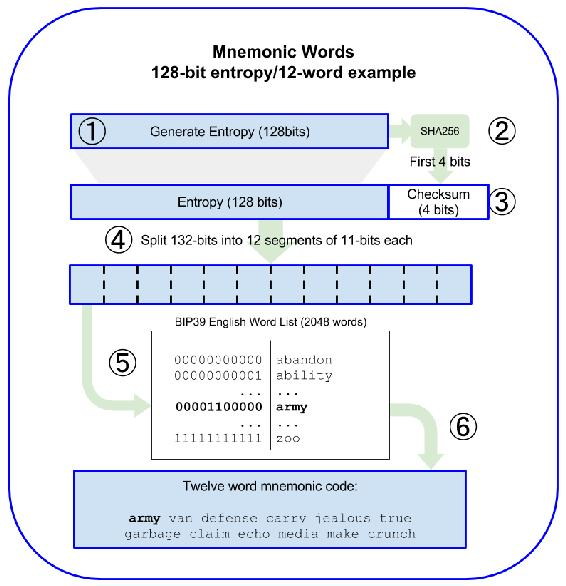

下表描述了初始熵长度（ENT），校验和长度（CS）和单词中生成的助记词（MS）的长度之间的关系。

| 熵（bits） | Checksum（bits） | 熵+Checksum（bits） | 助记词长度（words） |
| --- | --- | --- | --- |
| 128 | 4 | 132 | 12 |
| 160 | 5 | 165 | 15 |
| 192 | 6 | 198 | 18 |
| 224 | 7 | 231 | 21 |
| 256 | 8 | 264 | 24 |

## 二、从助记词到种子

用户可以决定用密码来保护他们的助记符。如果不存在密码短语，则使用空字符串“”。

助记词代表长度为 128 到 256 位的熵。然后使用熵通过使用密钥扩展函数 PBKDF2 来导出更长（512 位）的种子。然后，所产生的种子用于构建确定性钱包并获得其密钥。

密钥扩展功能有两个参数：助记词和盐（salt）。密钥扩展功能中的盐的目的是使得难以构建能够进行暴力攻击的查找表。在 BIP-39 标准中，salt 具有另一个目的 - 它允许引入密码短语作为保护种子的额外安全因子。

1.  PBKDF2 密钥扩展功能的第一个参数是从步骤 6 产生的助记词。
2.  PBKDF2 密钥扩展功能的第二个参数是 salt。salt 由字符串常量“mnemonic”和可选的用户提供的密码短语字符串组成。
3.  PBKDF2 使用 2048 轮 HMAC-SHA512 哈希算法来扩展助记词和 salt 参数，产生 512 位值作为其最终输出。那个 512 位的值就是种子。

使用助记词来生成种子的步骤如下图。

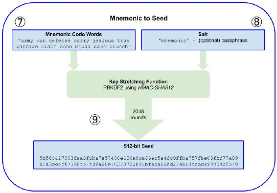

下面演示一下助记词生成种子的实例：

*   12 个长度的助记词，无密码生成种子

    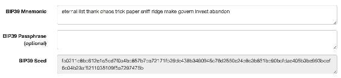

*   12 个长度的助记词，有密码生成种子

    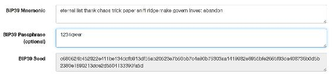

*   24 个长度的助记词，无密码生成种子

    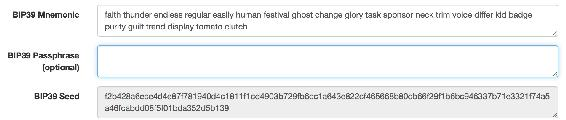

*   12 个长度的助记词，有密码生成种子

    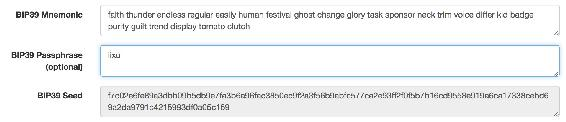

## 三、种子生成子秘钥

种子通过不可逆 HMAC-SHA512 算法推算出 512 位的哈希串，前 256 位是主私钥 Master Private Key (m)，后 256 位是主链码 Master Chain Code（c）。

1.  给定父扩展私钥和索引 i，可以计算相应的子扩展私钥。

2.  函数 CKDpriv（（kpar，cpar），i）→（ki，ci）

3.  如果 i ≥ 2³¹（硬化的子密钥）：让 I= HMAC-SHA512（Key = cpar，Data = 0x00 || ser256（kpar）|| ser32（i））。 （注意：0x00 将私钥补齐到 33 字节长。）

4.  如果 i<2³¹（普通的子密钥）：让 I= HMAC-SHA512（Key = cpar，Data = serP（point（kpar））|| ser32（i））。

5.  给定父扩展公钥和索引 i，可以计算相应的子扩展公钥。它只针对未硬化的子密钥定义。

6.  如果 i ≥ 2³¹(硬化子密钥)：返回失败

7.  如果 i<2³¹(普通子密钥)：让 I= HMAC-SHA512(Key = cpar, Data = serP(Kpar) || ser32(i)).

扩展私钥的前缀是 xprv，如：

```js
tprv8iGPAfgu51nkCZZtua8jFgzVoCQLqHZrLCQonxTo7qdtzutL8ZFZt1yAtpcUF8sHdNyiVhece3SSRsBvtUCKpGkRvxXgV2TMdcDbKQzstta 
```

扩展公钥的前缀是 tpub，如：

```js
tpubDExRK5j9DPUR62bgoDoKf6ecNDvGzckkuW1b5UW6Y7SHqQ96kx5A4Wb34w6bkHUStdq5w7ZHPQHkipwRdSQMbGnqTAQj1sEBaJmL9wXvBSu 
```

每个扩展密钥有 2³¹ 个普通子密钥，2³¹ 个硬化子密钥。这些子密钥都有一个索引，普通子密钥使用索引 0 到 2³¹-1，硬化的子密钥使用索引 2³¹ 到 2³²-1，为了简化硬化密钥索引的符号，数字 iH 表示 i + 2³¹。

以上过程再结合 BIP43，BIP44，HD 钱包就实现了多币种、多账户、多用途等功能。

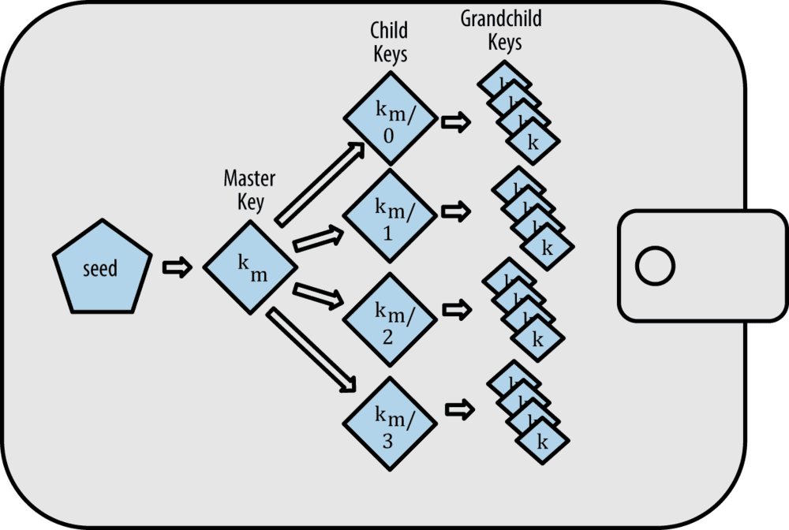

## 四、编程实践：从生成助记词到扩展子地址

### 代码

```js
var bitcoin = require('bitcoinjs-lib');
var bip39 = require("bip39")
var bip32 = require("bip32")

const myNetwork = bitcoin.networks.testnet

const mnemonic = 'eternal list thank chaos trick paper sniff ridge make govern invest abandon'
// const mnemonic = bip39.generateMnemonic()
const seed = bip39.mnemonicToSeed(mnemonic, "lixu1234qwer")
const root = bip32.fromSeed(seed, myNetwork)

for(var i = 0; i < 3; i++) {
    const path = "m/44'/1'/0'/0/"+i
    console.log("路径：", path)
    const keyPair = root.derivePath(path)

    const privateKey = keyPair.toWIF()
    console.log("私钥", privateKey)

    const publicKey = keyPair.publicKey.toString("hex")
    console.log("公钥：", publicKey)

    let address = getAddress(keyPair, myNetwork)
    console.log("地址：", address, "\n")
}

function getAddress(keyPair, network) {
    const { address } = bitcoin.payments.p2pkh({ pubkey: keyPair.publicKey , network:network})
    return address
} 
```

### 输出

1.  下面是在测试网络下生成的私钥、公钥、地址

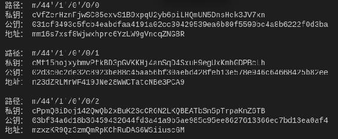

1.  下面是在正式网络下生成的私钥、公钥、地址

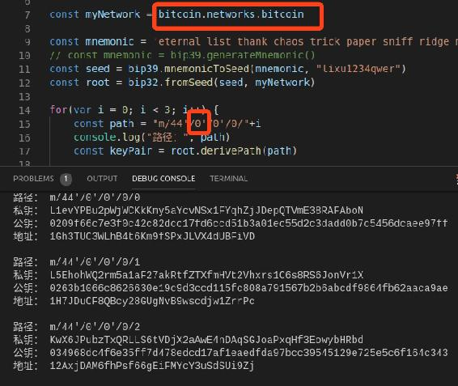

### 验证

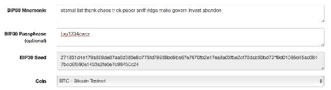

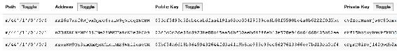

### 代码解析

*   需要安装库：bitcoinjs-lib、bip39、bip32。
*   bitcoin.networks.testnet：指定为测试网络，若切换到正式网络，则为 bitcoin.networks.bitcoin，同时需要改变路径。
*   bip39.generateMnemonic()：用于生成助记词。
*   bip39.mnemonicToSeed(mnemonic, "lixu1234qwer")：将助记词与密码转成种子。
*   bip32.fromSeed(seed, myNetwork)：将种子转为相应网络下的 root。
*   const path = "m/44'/1'/0'/0/"+i：指定第一个账号的第 i 个扩展子账号路径。若切换到正式网络，路径则是"m/44'/0'/0'/0/"+i
*   root.derivePath(path)：获取指定路径的 keyPair。
*   keyPair.toWIF()：获取私钥。
*   keyPair.publicKey.toString("hex")：获取公钥。
*   const { address } = bitcoin.payments.p2pkh({ pubkey: keyPair.publicKey , network:network})：获取普通比特币地址，p2pkh 这是最常见的比特币交易地址类型。可见：在测试网络中的地址是以 m 或 n 开头，在正式网络中是以 1 开头。

**版权声明：博客中的文章版权归博主所有，未经授权禁止转载，转载请联系作者（微信：lixu1770105）取得同意并注明出处。**