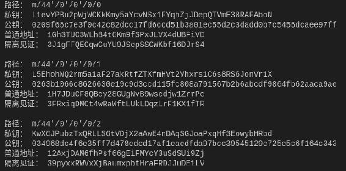
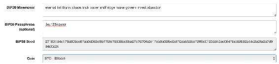
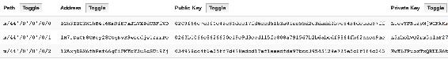

# 第三章 【比特币钱包开发 三】隔离见证剖析与编程实践

## 课程目标

1.  理解什么是隔离见证
2.  交易地址类型
3.  编程实践：生成隔离见证地址

大家可能会想，这个隔离见证对我们比特币钱包开发有什么影响呢？接下来你就知道了。

## 一、什么是隔离见证

隔离见证的英文叫做**SegWit**，是 Segregated Witness 的简称，隔离见证是对比特币提出的一种升级方案，用于解决比特币面临的一系列严重问题，由 Pieter Wuille（比特币核心开发人员、Blockstream 联合创始人）在 2015 年 12 月首次提出。主要由 BIP-141 定义。

我们可以这样来理解隔离见证：

见证：在比特币里指的是对交易合法性的验证，用于证明自己拥有某些交易的输出的见证数据。

隔离：就是把见证数据从交易信息里抽离出来，单独存放。

### SegWit 解决的问题

SegWit 是由 Bitcoin Core 的拟议更新，Bitcoin Core 是当前最受欢迎的比特币标准客户端，大多数企业使用。最初，该更新旨在解决交易的可扩展性，这也是比特币软件中众所周知的弱点。虽然这种攻击向量对用户来说并不是最具破坏性的，但目前为止已经在多个攻击案例中被利用，因此也就凸显了修补这一漏洞的必要性。

目前，比特币可扩展性问题主要源自区块容量不足，这里的问题就在于当前区块的硬编码限制为 1 兆字节，而这并不足以承担用户每分钟尝试发送的数百笔交易。因此，很多用户必须排队等候，直到他们的交易得到确认，这个等待的时间可能是几个小时，甚或是几天。随着网络规模的扩大，交易强度也随之增加，但区块容量限制则保持不变，这就意味着问题会不断恶化。

SegWit 的解决方案由两部分组成的：

*   第一，它可以立即将区块容量限制增加到 4 兆字节。这里就有一点需要注意：4 MB 是绝对最大值，而实际区块容量将取决于网络条件。SegWit 激活后，专家预测区块容量将在 2 到 2.1 兆的范围内。

*   第二，解决交易的可扩展性，将大量交易移出区块链使用雷电网络（Lightning Network）进行快速处理，预计将大大增加网络容量。

### segwit 的优点

*   增加块可以执行的事务数。
*   降低交易费用。
*   减少每笔交易的规模。
*   现在可以更快地确认交易，因为等待时间将减少。
*   有助于比特币的可扩展性。
*   由于每个区块的交易数量将增加，因此可能会增加矿工可能收取的总费用。
*   消除交易延展性。
*   有助于激活雷电协议。

## 二、交易地址类型

地址是使用 Base58check 格式化的 20 字节哈希值，去生成 P2PKH 或 P2SH 比特币地址。目前最常用的方式是用户交换支付信息。

普通的比特币交易地址有两种类型：

*   P2PKH（Pay-to-Public-Key-Hash）：支付给公钥哈希。是最常用的模板，它被中本聪定义，允许简单的支付给一个单一的公钥。
*   P2SH（Pay-to-Script-Hash）：支付到脚本，这是多重签名交易输出。在 BIP16 定义，它允许付款到任意复杂的脚本。

隔离见证为比特币建立了两种新的交易地址：

*   P2WPKH（Pay-to-Witness-Public-Key-Hash）：支付到隔离见证公钥哈希，类似 P2PKH，在 BIP141 新定义的。它嵌入在 P2SH 脚本中，所以它可以被不知道 segwit 的钱包使用。
*   P2WSH（Pay-to-Witness-Script-Hash）：支付到多重签名隔离见证脚本哈希，类似 P2SH，是 BIP141 定义的另一个新的脚本格式。它可以嵌入到 P2SH 脚本和地址中，使得任何钱包都可以进行与 segwit 兼容的支付。

隔离见证不会在整个网络中同时实施，为了新老客户可以共存，钱包开发人员将应独立升级钱包软件以添加隔离见证功能。都升级为 segwit 的钱包后，使用 P2WPKH 和 P2WSH 付款类型，传统的钱包使用 P2PKH 和 P2SH 付款类型。两种形式的见证脚本 P2WPKH 和 P2WSH 都可以嵌入到 P2SH 地址中，是以“3”开始的地址。P2PKH 是以“1”开头的地址。

举个例子，假设有两个人：lixu、zhangsan，lixu 的钱包没有升级到 segwit，但是 zhangsan 的钱包已经升级，可以处理 segwit 交易。lixu 和 zhangsan 都可以使用正常地址交易，但是 zhangsan 很可能会使用 segwit 来降低交易费用。在这种情况下，zhangsan 的钱包就需要构建一个包含一个 segwit 脚本的 P2SH 地址。lixu 的钱包认为这是一个正常的 P2SH 地址，并可以在没有任何 segwit 的知识的情况下付款。然后，zhangsan 的钱包可以通过隔离交易来支付这笔款项，充分利用隔离交易并降低交易费用。

因此我们需要构建 segwit 地址兼容普通地址。

## 三、编程实践：生成隔离见证地址

### 代码

```go
var bitcoin = require('bitcoinjs-lib');
var bip39 = require("bip39")
var bip32 = require("bip32")

const myNetwork = bitcoin.networks.bitcoin

const mnemonic = 'eternal list thank chaos trick paper sniff ridge make govern invest abandon'
// const mnemonic = bip39.generateMnemonic()
const seed = bip39.mnemonicToSeed(mnemonic, "lixu1234qwer")
const root = bip32.fromSeed(seed, myNetwork)

for(var i = 0; i < 3; i++) {
    const path = "m/44'/0'/0'/0/"+i
    console.log("路径：", path)
    const keyPair = root.derivePath(path)

    const privateKey = keyPair.toWIF()
    console.log("私钥：", privateKey)

    const publicKey = keyPair.publicKey.toString("hex")
    console.log("公钥：", publicKey)

    let address = getAddress(keyPair, myNetwork)
    console.log("普通地址：", address)
    let segWitAddress = getSegWitAddress(keyPair, myNetwork)
    console.log("隔离见证：", segWitAddress, "\n")
}

function getAddress(keyPair, network) {
    const { address } = bitcoin.payments.p2pkh({ pubkey: keyPair.publicKey , network:network})
    return address
}

function getSegWitAddress(keyPair,myNetwork) {
    const { address } = bitcoin.payments.p2sh({
        redeem: bitcoin.payments.p2wpkh({ pubkey: keyPair.publicKey, network: myNetwork}),
        network: myNetwork
    })
    return address
} 
```

### 输出



### 验证





### 代码解析

这里只解 getSegWitAddress 方法的实现，其它代码解析请查看上一章“从生成助记词到扩展子地址”的内容。

```go
const { address } = bitcoin.payments.p2sh({
        redeem: bitcoin.payments.p2wpkh({ pubkey: keyPair.publicKey, network: myNetwork}),
        network: myNetwork
    }) 
```

这是将 p2wpkh 地址嵌套在 p2sh 地址中，作为它的 redeem 字段。同时需要注意，在两种地址类型中都需要指定网络类型。上面的代码是在比特币正式网络中运行的，即指定了`const myNetwork = bitcoin.networks.bitcoin`。

版权声明：博客中的文章版权归博主所有，未经授权禁止转载，转载请联系作者（微信：lixu1770105）取得同意并注明出处。