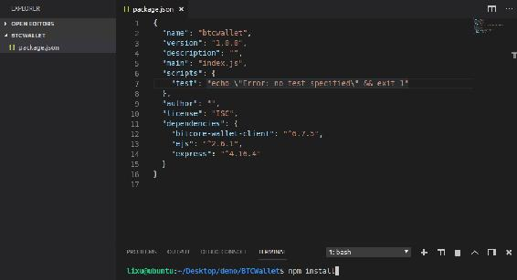
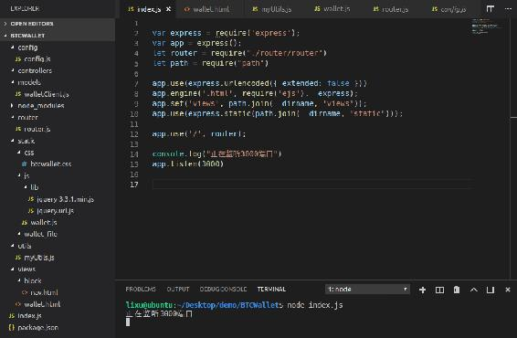
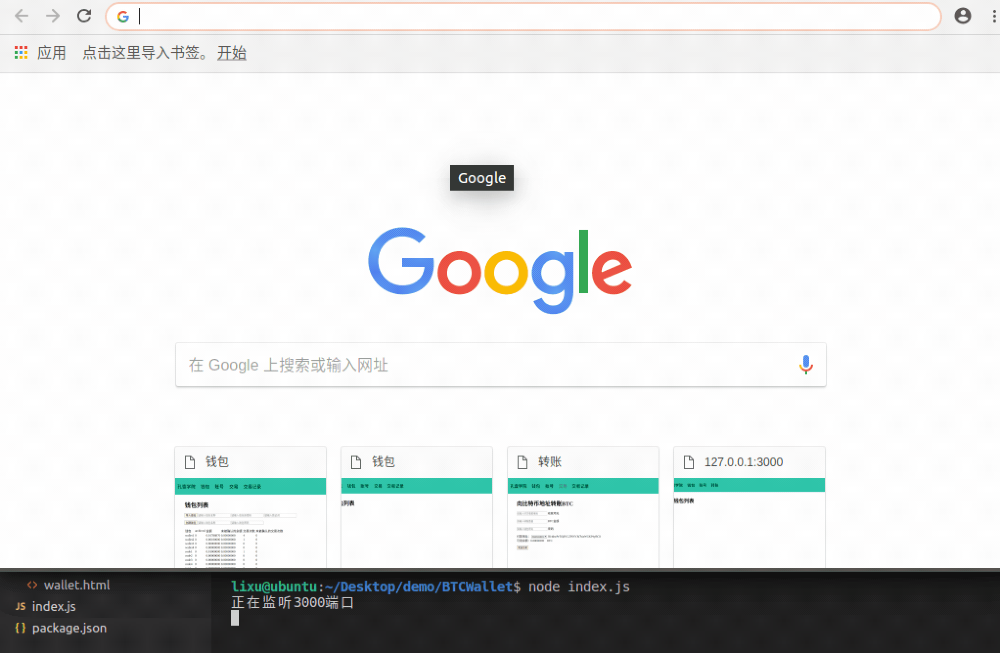

# 第四章 【比特币钱包开发 四】钱包项目整体架构设计

## 课程目标

1.  搭建 NodeJS 后端框架
2.  搭建前端 web 框架
3.  前后端交互

## 前言

本课程是比特币钱包开发，后端使用的 NodeJS 搭建，客户端使用的 web 前端，VSCode 开发工具，Ubuntu16.04 系统（当然，Mac、windows 系统也可以），node v8.11.3，npm v5.6.0。

## 一、前端架构

咱们的开发重点是在后端实现上，因此为了让大家快速上手，web 客户端没有使用其它流行的框架，这里只使用了 jQuery 框架简化代码，另外还有个 jQuery Validate 插件简化了表单验证。

*   web 前端整体技术：

    **`html + css + javascript + jQuery`**。

*   web 前端功能：

    1.  钱包模块
        *   创建钱包
        *   助记词导入钱包
        *   钱包列表
        *   导出钱包助记词
    2.  账号模块
        *   查询余额
        *   创建子账号
        *   查询子账号：地址、路径、私钥
    3.  比特币转账
    4.  交易记录


## 二、后端架构

这个钱包应用程序与比特币区块链交互，我们使用了 Bitpay 开发的 bitcore-wallet-client 库，使用它便于我们的开发，封装了比较全面的 API 给我们使用。

另外，后端 Http 框架使用的是强大的 express，里面封装了很多功能，因为 bitcore-wallet-client 库中提供的 API 会通过异步 callback 返回数据，所以就不用 koa。

在这个项目中使用了第三方库较少，如下：

*   bitcore-wallet-client：是 bitcore-wallet-service 的客户端库，使用 REST API 与 BWS bitcore-wallet-service 进行通信，所有 REST 端点都包装为简单的异步方法。bitcore-wallet-service 库实现了多重签名的比特币 HD 钱包服务，使用该服务的有 Copay、Bitpay 钱包。
*   express：是一个 web 框架，提供的 HTTP 服务器工具非常强大，且集成与使用简单，与 koa 类似。
*   ejs：是一种 JavaScript 模版引擎，可以动态的设置变量值到 html。需要与模板渲染中间件 koa-views 配合使用。

整体架构使用了成熟的 MVC 架构。项目的入口是 index.js 文件，对项目做了配置，将后端服务绑定到了 3000 端口并处于简体状态，当前端访问服务时，router.js 路由文件根据 URL 将任务分配到 controllers 文件夹下的业务文件中。

这里为了让快速上手开发比特币钱包项目，前后端都在一个项目上同时开发，将前端的页面文件放在了 static 与 views 文件夹中，当然，同时支持移动端（iOS、安卓）的调用。若是需要前后端分离，可直接将 static 与 views 文件夹分离出来即可。

## 三、项目初始化

新建项目跟文件夹 BTCWallet，然后按照如下步骤执行

```js
lixu@ubuntu:~$ cd '/home/lixu/Desktop/demo/BTCWallet/' 
lixu@ubuntu:~/Desktop/demo/BTCWallet$ npm init 
```

然后不断回车初始化项目。然后后自动生成`package.json`文件，是项目包的配置文件，下面我们引入项目中需要用到的库，拷贝下面 json 到`package.json`文件的最后一个字段。

```js
,
  "dependencies": {
    "bitcore-wallet-client": "⁶.7.5",
    "ejs": "².6.1",
    "express": "⁴.16.4"
  } 
```

项目的界面如下：



然后运行以下命令按照上面的依赖库。

```js
npm install 
```

下载完成后会将所有的依赖库下载到项目根目录自动新建的`node_modules`文件夹。

## 四、项目源码

按照如下结构搭建项目。



### index.js

项目的入口文件。首先实例化 express 对象，然后将 express.urlencoded、ejs、views、static 路由注册到中间件，服务绑定到 3000 端口。

```js
var express = require('express');
var app = express();
let router = require("./router/router")
let path = require("path")

app.use(express.urlencoded({ extended: false }))
app.engine('.html', require('ejs').__express);
app.set('views', path.join(__dirname, 'views'));
app.use(express.static(path.join(__dirname, "static")));

app.use('/', router);

console.log("正在监听 3000 端口")
app.listen(3000) 
```

### config/config.js

项目的配置文件。

```js
var path = require('path');

module.exports = {
    BWS_URL: 'https://bws.bitpay.com/bws/api',
    networkType: "testnet",//livenet,testnet
    coinType: "bch",
    copayerName: "lixu",
    walletFilePath: path.join(__dirname, "../static/wallet_file"),
} 
```

各字断含有：

*   BWS_URL: bitcore-wallet 服务端地址，我们使用的是 bitpay 的地址，你也可以自己搭建一个钱包服务端。

*   networkType: 钱包连接的网络类型，支持正式网络和测试网络，分别表示为：livenet、testnet。

*   coinType: 币种类型，支持比特币和比特币现金，分别表示为：btc、bch。

*   copayerName: 钱包的拥有者，创建钱包的一个必填字断，这里我就指定为常量“lixu”。

*   walletFilePath: 创建钱包后导出的文件的存放位置。

### Models/walletClient.js

出来 wallet 的 model 文件，这里只有一个方法，实例化 bitcore-wallet 客户端。

```js
let config = require("../config/config")

module.exports = {
    getWalletClient: () => {
        var Client = require('bitcore-wallet-client');

        var client = new Client({
            baseUrl: config.BWS_URL,
            verbose: false,
        });
        return client
    },

} 
```

### router/router.js

路由文件。

```js
let router = require('express').Router();

router.get("/wallet.html", (req, res) => {
    res.render("wallet.html");
})

module.exports = router 
```

### utils/myUtils.js

项目工具类，提供返回给前端成功与失败的基本数据结构、判断字符串是否以某个字符串结尾。

```js
module.exports = {

    success: (data) => {
        responseData = {
            code: 0,
            status: "success",
            data: data
        }
        return responseData
    },

    fail: (msg) => {
        responseData = {
            code: 1,
            status: "fail",
            data: msg
        }
        return responseData
    },

    //判断字符串是否以某个字符串结尾
    stringWithSubstrEnd: (str, substr) => {
        var start = str.length - substr.length;
        var sub = str.substr(start, substr.length);
        if (sub == substr) {
            return true;
        }
        return false;
    },
} 
```

### static/js/wallet.js

前端处理钱包模块的 js 文件。

```js
$(document).ready(function () {
    alert("Welcome to KongYiXueYuan!")
}) 
```

### static/css/btcwallet.css

前端唯一的 css 文件。

```js
#main{
    /*background-color: #8bc34a;*/
    margin: 120px 50px 50px 50px;

}
.error{
    color: red;
}
a{
    color: black;
    text-decoration: none;
}
a:hover{
    color: #666;
}
body{
    margin: 0px;
}
ul>li{
    list-style: none;
    margin: 0px;
}

.global-color{
    color: #0abc9c;
}

ul{
    list-style: none;
    padding: 0px;
}

.row{
    display: inline-block;
    margin-right: 70px;
}
.top{
    vertical-align: top
}
a[class=button]{
    background-color: beige;
    padding: 2px 10px;
    border: 1px solid gray;
}
button{
    background-color: beige;
    border: 1px solid gray;
}

/*导航-------------------------------------------------------------------------------------------------------*/
#nav{
    display: flex;
    justify-content: space-between;
    background-color: #0abc9c;
    position: fixed;
    top: 0px;
    left: 0px;
    right: 0px;
}
#nav li{
    display: inline-block;
    margin: 10px 2px;
}
#nav ul{
    padding: 0px;
}
#nav a{
    padding: 10px;
    font-size: 24px;
}
#nav-left{
    margin-left: 20px;
}
#nav-right{
    margin-right: 20px;
} 
```

### views/wallet.html

前端：钱包列表的初始页面。

```js
<html>

<head>
    <title>钱包</title>
    <script src="/js/lib/jquery-3.3.1.min.js"></script>
    <script src="/js/lib/jquery.url.js"></script>
    <script src="/js/wallet.js"></script>
    <link rel="stylesheet" href="/css/btcwallet.css">
</head>

<body>
    <%include block/nav.html%>

    <div id="main">
        <h1>钱包列表</h1>
    </div>
</body>

</html> 
```

### views/block/nav.html

前端的导航栏，使用 ejs 库的方法`<%include block/nav.html%>`载入。

```js
<div id="nav">
    <div id="nav-center">
        <ul>
            <li><a href="http://www.kongyixueyuan.com">孔壹学院</a></li>
            <li><a href="/wallet.html">钱包</a></li>
            <li><a href="/walletinfo.html">账号</a></li>
            <li><a href="/transaction.html">交易</a></li>
            <li><a href="/transactionrecord.html">交易记录</a></li>
        </ul>
    </div>
</div> 
```

### 其它

static/js/lib 下的文件请到 github 中下载。

## 五、项目运行效果

使用如下命令运行项目

```js
node index.js 
```

然后使用浏览器客户端访问`http://localhost:3000/wallet.html`地址，效果如下：



**参考资料**

express 的 github：[`github.com/expressjs/express`](https://github.com/expressjs/express)

ejs 的 github：[`github.com/tj/ejs`](https://github.com/tj/ejs)

bitcore-wallet-client 的 github：[`github.com/bitpay/bitcore-wallet-client`](https://github.com/bitpay/bitcore-wallet-client)

**[项目源码 Github 地址](https://github.com/lixuCode/BTCWallet)**

**版权声明：博客中的文章版权归博主所有，未经授权禁止转载，转载请联系作者（微信：lixu1770105）取得同意并注明出处。**