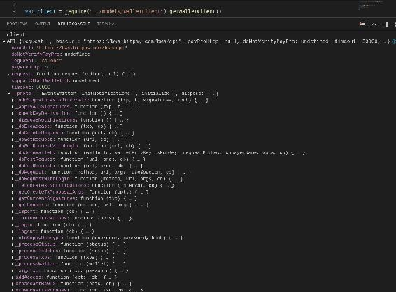
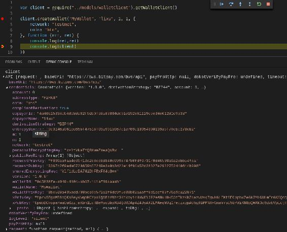
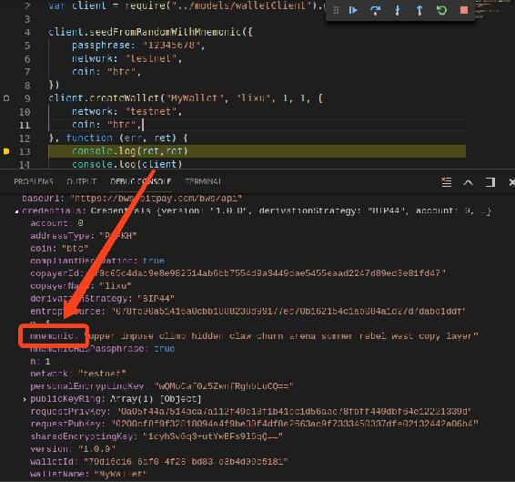
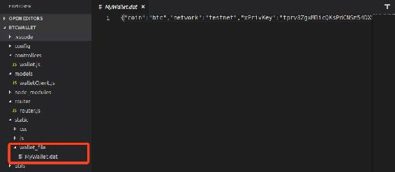
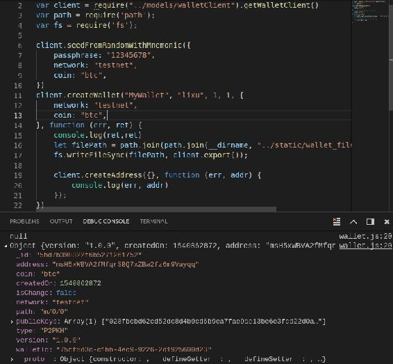
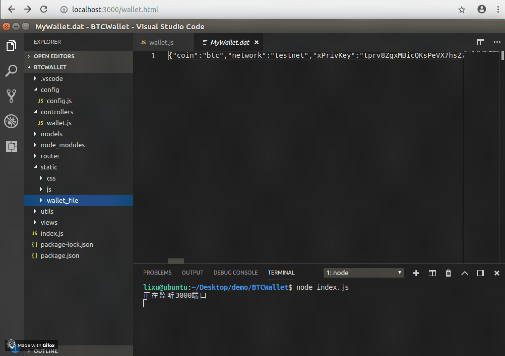

# 第五章 【比特币钱包开发 五】新建钱包：生成子账号地址与路径

## 课程目标

1.  掌握连接到比特币正式网络与测试网进行开发
2.  学会创建钱包与备份钱包
3.  生成账号地址

## 前言

比特币的账号是通过 bip 协议生成种子，然后扩展成多个子地址，这些子地址都由同一个种子可以推导出来，而知道其中一个子账号的私钥不能推导兄弟和父辈节点的私钥，所以将同一个种子扩展生成的子账号统一为一个账号，在每次交易时都可以使用它的新的子地址去交易，这样更安全，也更难追踪，也常常将这个大账号称为钱包。因此对账号的操作，我们需要先来创建钱包账号，那么本章的内容就是学习如何创建钱包，和钱包的一些常用功能。

## 一、获取钱包客户端对象

在上一章的内容中已经将创建钱包客户端对象的方法封装到了 Models/walletClient.js 文件中的 getWalletClient()方法中，如下：

```js
getWalletClient: () => {
        var Client = require('bitcore-wallet-client');

        var client = new Client({
            baseUrl: config.BWS_URL,
            verbose: false,
        });
        return client
    }, 
```

在实例化的时候需要指定 bitcore-wallet 服务端地址，我们使用的是 bitpay 的地址`BWS_URL: 'https://bws.bitpay.com/bws/api'`，你也可以自己搭建一个钱包服务端。

现在我们在业务类 wallet 中调用该方法。

```js
var client = require("../models/walletClient").getWalletClient() 
```



现在 client 对象还没有生成认证，可以看到在 __proto 下 clien 有很多个方法，接下来通过 client 对象调用创建钱包。

## 二、创建钱包的 API 文档说明

创建钱包的 API 文档如下：

```js
API.createWallet(walletName, copayerName, m, n, opts, opts.network, opts.walletPrivKey, opts.id, opts.withMnemonics, cb)
Create a wallet.

Parameters

walletName: String, Create a wallet.

copayerName: String, Create a wallet.

m: Number, Create a wallet.

n: Number, Create a wallet.

opts: object, (optional: advanced options)

opts.network: string, 'livenet' or 'testnet'

opts.walletPrivKey: String, set a walletPrivKey (instead of random)

opts.id: String, set a id for wallet (instead of server given)

opts.withMnemonics: String, generate credentials

cb: , Create a wallet.

Returns: undefined 
```

根据 API 的定义可知，必传参数有如下六个：

*   walletName: String, 创建的钱包名称。

*   copayerName: String, 创建钱包的人，即钱包的拥有者。

*   m: Number, 该钱包拥有者个数。若为 1，则是个人钱包；若大于 1，则是共享钱包，需要多重签名。

*   n: Number, 与 m 对应，不能大于 m，指定需要签名的个数。若是个人钱包，则为 1。

*   opts: 可选参数，它是一个对象，包含的字断如下：

    opts.network: string, 钱包连接的网络类型，支持正式网络和测试网络，分别表示为：livenet、testnet。

    opts.walletPrivKey: 钱包私钥，可以不用指定，会随机生成。

    opts.id: String, 钱包 ID，可以不用指定，会自动生成。

    opts.withMnemonics: String, 助记词，用于生成凭证，对钱包的操作都是用这个凭证进行的操作。

*   cb: 回调方法。该方法是没有返回值的，响应的数据是通过 callba 回掉进行传递。

## 三、编码实现创建钱包

### 1\. 小试牛刀

根据上面的分析我们进行如下的调用。

```js
var client = require("../models/walletClient").getWalletClient()

client.createWallet("MyWallet", "lixu", 1, 1, {
    network: "testnet",
    coin: "btc",
}, function (err, ret) {
    console.log(ret,ret)
    console.log(client)
}) 
```

运行后生成的 client 对象如下：



可知创建后的钱包作为 client 对象的 credential 属性，里面的字断记录了钱包的详细数据。这样我们便创建了一个名称为“MyWallet”、拥有者是“lixu”、在测试网络下的比特币个人钱包，默认使用 BIP44 协议创建账号、地址类型是 P2PKH 支付给公钥哈希。另外，我们没有发现该账号的助记词，所以创建钱包的方法还需完善，那么正确的步骤是这样的呢？

### 2\. 通过随机助记词生成种子

我们需要在创建钱包之间调用 seedFromRandomWithMnemonic()方法通过随机助记词生成种子，目的是为了能够导出该钱包的助记词备份钱包。下面 API 文档就不作解释了，大家可以在[GitHub](https://github.com/bitpay/bitcore-wallet-client)查看，它的用法如下

```js
client.seedFromRandomWithMnemonic({
    passphrase: "12345678",
    network: "testnet",
    coin: "btc",
}) 
```

**注意：**

*   密码字断不能忘记，需要使用密码与助记词共同生成种子，密码不一样种子就不一样，导致无法找回账号。现在运行后的结果如下所示。
*   network 设置为 testnet 则是连接到测试网，若连接到正式网络则是“livenet”。



### 3\. 导出钱包

我们创建好钱包后，下次再次使用钱包时需要使用 import()方法导入钱包去激活，所以我们创建钱包后需要备份钱包数据，与以太坊中 keystore 类似。备份钱包数据需要用到 export()方法，它将该钱包对象导出存到文件中，用于下次通过文件打开钱包。import()方法的用法接下来会进行介绍。

**特别提醒：**

本项目为了让大家快速开发比特币钱包项目，对于非重点内容没有花时间去讲解。那么这里项目中导出的钱包为了便于讲解是放在的服务器中，这是非常不安全的做法，对于有经验的开发者自然是了解如何处理这类敏感数据。另外，服务端是对同一个用户”lixu“即代码中“copayerName”字段创建的钱包，在实际开发中需要实现用户模块建立用户体系，这里就简写了。建议将此数据放到客户端保存，并且需要加密。

```js
......

var path = require('path');
var fs = require('fs');

client.createWallet("MyWallet", "lixu", 1, 1, {
    network: "testnet",
    coin: "btc",
}, function (err, ret) {
    console.log(ret,ret)
    let filePath = path.join(path.join(__dirname, "../static/wallet_file"), "MyWallet.dat")
    fs.writeFileSync(filePath, client.export());
}) 
```

将钱包数据储存在以.bat 结尾的文件中，以钱包名称命名，所以钱包名称重复会覆盖钱包账号。运行后打开 static/wallet_file 文件夹下的 MyWallet.bat 文件，它的数据以 json 字符串储存，如下图，使用格式化工具后查看可知它的数据就是 client.credentials 字断中的数据。



### 4\. 新建地址

新创建的钱包没有自动生成地址，为了打开该钱包的时候有一个地址，所以我们可以在创建成功后调用新建地址的方法让他拥有第一个账号地址。当然，它的路径肯定就是“M/0/0”了。接下来我们会获取钱包的子账号地址进行查看。

```js
......

console.log(ret,ret)
let filePath = path.join(path.join(__dirname, "../static/wallet_file"), "MyWallet.dat")
fs.writeFileSync(filePath, client.export());

client.createAddress({}, function (err, addr) {
    console.log(err, addr)
}); 
```

输出如下：



## 四、完整源码

### 1\. controllers/wallet.js

在 controllers 文件夹下新建 wallet.js 文件，后端实现钱包模块功能，下面先实现创建钱包的功能。

前端需要传递 walletname, password 两个参数，最后将新建的第一个账号地址返回给前端，数据结构如下：

> {
> code: 0,
> status: 'success',
> data: {
> address: 'mrPo6ePcPKFezfRV4Q2pzpmFLTQERvNZKx'
> }
> }

将常量放在了 config 配置文件中，在上一章中已经作了介绍。

```js
 var client = require("../models/walletClient").getWalletClient()
var path = require('path');
var fs = require('fs');
var config = require("../config/config")
var { success, fail } = require("../utils/myUtils")

module.exports = {
    walletCreate: (req, res) => {
        let { walletname, password } = req.body
        console.log(req.body)

        client.seedFromRandomWithMnemonic({
            passphrase: password,
            network: config.networkType,
            coin: config.coinType,
        })
        console.log(client.credentials.mnemonic)
        client.createWallet(walletname, config.coinType, 1, 1, {
            network: config.networkType,
            withMnemonics: client.credentials.mnemonic,
            coin: config.coinType,

        }, function (err, ret) {
            console.log(err, ret)
            if (err) {
                res.send(fail(err.message))
                return
            }
            let filePath = path.join(config.walletFilePath, walletname + ".dat")
            fs.writeFileSync(filePath, client.export());

            client.createAddress({}, function (err, addr) {
                console.log(err, addr)
                if (err) {
                    res.send(fail(err.message))
                    return
                }
                res.send(success({ "address": addr.address }))
            });
        })
    },
} 
```

### 2\. router/router.js

将创建钱包的接口绑定到路由。

```js
let router = require('express').Router();

let walletController = require("../controllers/wallet")

//钱包
router.post("/wallet/create", walletController.walletCreate)

router.get("/wallet.html", (req, res) => {
    res.render("wallet.html");
})

module.exports = router 
```

### 3\. static/js/wallet.js

在文档加载完成后设置创建钱包表单的验证与网络请求。

```js
$(document).ready(function () {

    //创建钱包
    $("#wallet-create-form").validate({
        rules: {
            walletname: {
                required: true,
            },
            password: {
                required: true,
            },
        },
        messages: {
            walletname: {
                required: "请输入新建的钱包名称",
            },
            password: {
                required: "请输入新建的钱包密码",
            },
        },
        submitHandler: function (form) {
            $(form).ajaxSubmit({
                url: "/wallet/create",
                type: "post",
                dataType: "json",
                success: function (res, status) {
                    console.log(status + JSON.stringify(res))
                    alert(JSON.stringify(res.data))
                    if (res.code == 0) {
                        window.location.reload()
                    }
                },
                error: function (res, status) {
                    console.log(status + JSON.stringify(res))
                }
            });
        }
    })

}) 
```

### 4\. views/wallet.html

前端：钱包列表的初始页面。

```js
<html>

<head>
    <title>钱包</title>
    <script src="/js/lib/jquery-3.3.1.min.js"></script>
    <script src="/js/lib/jquery.url.js"></script>
    <script src="/js/wallet.js"></script>
    <link rel="stylesheet" href="/css/btcwallet.css">
</head>

<body>
    <%include block/nav.html%>

    <div id="main">
        <h1>钱包列表</h1>
        <form id="wallet-create-form">
            <button type="submit">创建钱包</button>
            <input type="text" name="walletname" placeholder="请输入钱包名称">
            <input type="text" name="password" placeholder="请输入钱包密码">
        </form>
    </div>
</body>

</html> 
```

## 五、项目运行效果



**[项目源码 Github 地址](https://github.com/lixuCode/BTCWallet)**

**版权声明：博客中的文章版权归博主所有，未经授权禁止转载，转载请联系作者（微信：lixu1770105）取得同意并注明出处。**