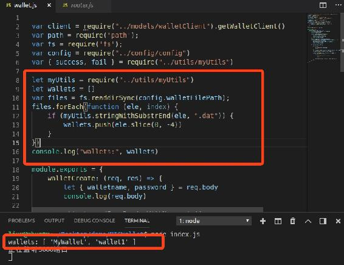
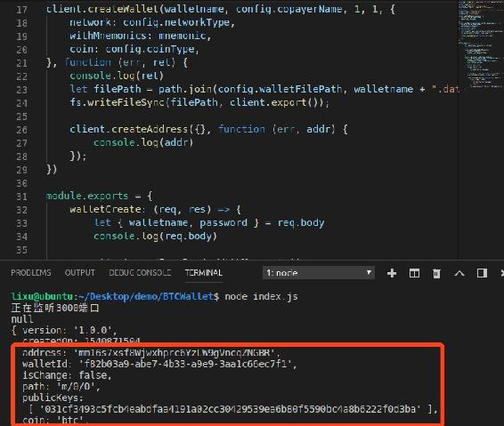
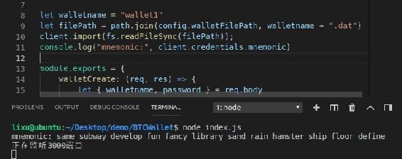
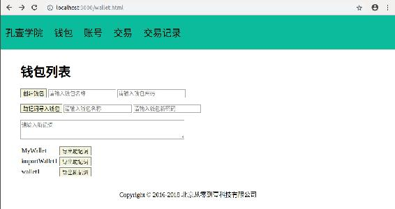

# 第六章 【比特币钱包开发 六】通过助记词导入钱包与导出钱包助记词

## 课程目标

1.  获取钱包列表
2.  通过助记词导入钱包
3.  导出钱包助记词

## 前言

在上一章的内容中介绍了创建钱包，这一章会介绍通过助记词创建钱包，也叫做通过助记词恢复钱包或通过助记词导入钱包。首先我们来介绍的内容是，如何将我的钱包显示出来。

## 一、获取钱包列表

我们将创建的钱包文件储存到了 static/wallet_file 文件夹中，那么遍历该文件夹并判断子文件的名称是否以钱包文件的“.dat”结尾即可获取到我的钱包，然后再截掉后缀就是钱包名称，实现如下。

```go
let myUtils = require("../utils/myUtils")

let wallets = []
var files = fs.readdirSync(config.walletFilePath);
files.forEach(function (ele, index) {
    if (myUtils.stringWithSubstrEnd(ele, ".dat")) {
        wallets.push(ele.slice(0, -4))
    }
})
console.log(wallets) 
```

输出如下



stringWithSubstrEnd()方法在 myUtils 包中实现了判断字符串是否以某个字符串结尾的功能。

## 二、通过助记词导入钱包

创建新钱包的时候我们采用的是调用 seedFromRandomWithMnemonic()方法通过随机助记词生成种子去创建的，那么我们在创建钱包的时候指定助记词即可实现通过助记词导入钱包，这就需要使用到另外一个方法 seedFromMnemonic()，它的 API 定义如下：

```go
API.seedFromMnemonic(BIP39, opts, opts.network, opts.passphrase, opts.account, opts.derivationStrategy)
Seed from Mnemonics (language autodetected) Can throw an error if mnemonic is invalid

Parameters

BIP39: String, words

opts: Object, Seed from Mnemonics (language autodetected) Can throw an error if mnemonic is invalid

opts.network: String, default 'livenet'

opts.passphrase: String, Seed from Mnemonics (language autodetected) Can throw an error if mnemonic is invalid

opts.account: Number, default 0

opts.derivationStrategy: String, default 'BIP44' 
```

根据 API 的定义可知，必传参数有如下两个，注意它没有回调。

*   BIP39: String, 助记词。

*   opts: 可选参数，它是一个对象，包含的字断如下：

    opts.network: string, 钱包连接的网络类型，支持正式网络和测试网络，分别表示为：livenet、testnet。

    opts.passphrase: 助记词的密码，通过助记词+密码共同生成种子，所以密码不一样种子就不一样，导致无法找回账号。

    opts.account: Number, 账号序号，默认为 0。

    opts.derivationStrategy: String, 使用的 BIP 协议，默认为 BIP44。

因此通过助记词导入钱包的代码实现如下：

```go
let mnemonic = "eternal list thank chaos trick paper sniff ridge make govern invest abandon"
let walletname = "importWallet1"
let password = "lixu1234qwer"

client.seedFromMnemonic(mnemonic, {
    network: config.networkType,
    passphrase: password,
    coin: config.coinType,
});
client.createWallet(walletname, config.copayerName, 1, 1, {
    network: config.networkType,
    withMnemonics: mnemonic,
    coin: config.coinType,
}, function (err, ret) {
    console.log(err, ret)
    let filePath = path.join(config.walletFilePath, walletname + ".dat")
    fs.writeFileSync(filePath, client.export());

    client.createAddress({}, function (err, addr) {
        console.log(err, addr)
    });
}) 
```

输出如下：



使用的助记词是“eternal list thank chaos trick paper sniff ridge make govern invest abandon"密码是"lixu1234qwer”，生成的地址为“mm16s7xsf8Wjwxhprc6YzLW9gVncqZNGBR”，路径是“m/0/0”，公钥是“031cf3493c5fcb4eabdfaa4191a02cc30429539ea6b80f5590bc4a8b6222f0d3ba”，这些数据与第二章中我们验证的数据一致。

## 三、导出钱包助记词

既然能通过导入助记词恢复钱包，那也能导出钱包助记词，这个数据在上一章中我们创建钱包后已经能够获取到助记词字断了，但是它需要解锁后才能获取，即通过 import()方法解锁。

```go
let walletname = "wallet1"
let filePath = path.join(config.walletFilePath, walletname + ".dat")
client.import(fs.readFileSync(filePath));
console.log("mnemonic:", client.credentials.mnemonic) 
```

输出如下：



可获取到“wallet1”钱包的助记词是“same subway develop fun fancy library sand rain hamster ship floor define”。

## 四、完整源码

### 1\. controllers/wallet.js

编辑 controllers 文件夹下的 wallet.js 文件，实现获取钱包列表、通过助记词导入钱包、导出钱包助记词功能。

```go
......

module.exports = {
    walletCreate: (req, res) => {
        ......
    },

    walletList: (req, res) => {

        let wallets = []
        var files = fs.readdirSync(config.walletFilePath);
        files.forEach(function (ele, index) {
            if (myUtils.stringWithSubstrEnd(ele, ".dat")) {
                wallets.push(ele.slice(0, -4))
            }
        })

        res.send(success(wallets))
    },

    walletImportWithMnemonic: (req, res) => {
        let { mnemonic, walletname, password } = req.body
        console.log(req.body)
        client.seedFromMnemonic(mnemonic, {
            network: config.networkType,
            passphrase: password,
            coin: config.coinType,
        });
        client.createWallet(walletname, config.copayerName, 1, 1, {
            network: config.networkType,
            withMnemonics: mnemonic,
            coin: config.coinType,
        }, function (err, ret) {
            console.log(err, ret)
            if (err) {
                res.send(fail(err.message))
                return
            }
            let filePath = path.join(config.walletFilePath, walletname + ".dat")
            fs.writeFileSync(filePath, client.export());

            client.createAddress({}, function (err, addr) {
                console.log(err, addr)
                if (err) {
                    res.send(fail(err.message))
                    return
                }
                res.send(success("导入成功"))
            });
        })
    },

    walletExportMnemonic: (req, res) => {
        let { walletname, password } = req.body
        let filePath = path.join(config.walletFilePath, walletname + ".dat")
        client.import(fs.readFileSync(filePath));
        res.send(success(client.credentials.mnemonic))
    },
} 
```

### 2\. controllers/web.js

在 controllers 文件夹下新建 web.js 文件，后端实现返回每个前端页面。

```go
module.exports = {

    getWalletHtml: (req, res) => {
        res.render("wallet.html");
    },
} 
```

### 3\. router/router.js

将获取钱包列表、通过助记词导入钱包、导出钱包助记词功能的接口绑定到路由。

```go
let router = require('express').Router();

let walletController = require("../controllers/wallet")
let walletController = require("../controllers/wallet")

//钱包
router.post("/wallet/create", walletController.walletCreate)
router.get("/wallet/list", walletController.walletList)

router.post("/import/mnemonic", walletController.walletImportWithMnemonic)
router.post("/export/mnemonic", walletController.walletExportMnemonic)

//页面
router.get("/wallet.html", webController.getWalletHtml)

module.exports = router 
```

### 4\. static/js/wallet.js

在文档加载完成后处理获取钱包列表、通过助记词导入钱包、导出钱包助记词等的网络请求。

```go
//导出助记词
function exportMnemonic(walletName) {
    console.log(walletName)
    let password = prompt("请输入该钱包的密码")
    if (password) {
        let params = { "walletname": walletName, "password": password }
        $.post("/export/mnemonic", params, function (res, status) {
            console.log(status, JSON.stringify(res))

            if (res.code == 0) {
                alert(res.data)
            }
        })
    }
}

$(document).ready(function () {

    //创建钱包
    $("#wallet-create-form").validate({
        ......
    })

    //获取钱包列表
    $.get("/wallet/list", function (res, status) {
        console.log(status, JSON.stringify(res))

        if (res.code == 0) {
            let walletTable = $("#wallet-list-table")
            localStorage.setItem("walletlist", JSON.stringify(res.data))
            res.data.forEach(wallet => {
                console.log(wallet)

                let walletTr = `<tr>
                    <td class="wallet-ele" id="${wallet}">${wallet}</td>
                    <td><button onclick="exportMnemonic('${wallet}')">导出助记词</button></td>
                </tr>`
                walletTable.append(walletTr)

                $(".wallet-ele").click(function () {
                    console.log($(this).attr("id"))
                    localStorage.setItem("currentwallet", $(this).attr("id"))
                    window.location.href = "/walletinfo.html"
                })
            });
        }
    })

    //助记词导入钱包
    $("#wallet-mnemonic-import-form").validate({
        rules: {
            walletname: {
                required: true,
            },
            password: {
                required: true,
            },
            mnemonic: {
                required: true,
            },
        },
        messages: {
            walletname: {
                required: "请输入要设置的钱包名称",
            },
            password: {
                required: "请输入钱包新密码",
            },
            mnemonic: {
                required: "请输入要导入的助记词",
            },
        },
        submitHandler: function (form) {
            $(form).ajaxSubmit({
                url: "/import/mnemonic",
                type: "post",
                dataType: "json",
                success: function (res, status) {
                    console.log(status + JSON.stringify(res))
                    alert(JSON.stringify(res.data))
                    if (res.code == 0) {
                        window.location.reload()
                    }
                },
                error: function (res, status) {
                    console.log(status + JSON.stringify(res))
                }
            });
        }
    })

}) 
```

### 5\. views/wallet.html

前端显示的钱包列表页面。

```go
<html>

<head>
    <title>钱包</title>
    <script src="/js/lib/jquery-3.3.1.min.js"></script>
    <script src="/js/lib/jquery.url.js"></script>
    <script src="/js/wallet.js"></script>
    <link rel="stylesheet" href="/css/btcwallet.css">
</head>

<body>
    <%include block/nav.html%>

    <div id="main">
        <h1>钱包列表</h1>
        <form id="wallet-create-form">
            <button type="submit">创建钱包</button>
            <input type="text" name="walletname" placeholder="请输入钱包名称">
            <input type="text" name="password" placeholder="请输入钱包密码">
        </form>

        <form id="wallet-mnemonic-import-form">
            <button type="submit">助记词导入钱包</button>
            <input type="text" name="walletname" placeholder="请输入钱包名称">
            <input type="text" name="password" placeholder="请输入钱包新密码">
            <br><br>
            <textarea rows="3" cols="50" name="mnemonic" placeholder="请输入助记词"></textarea>
        </form>

        <table>
            <tbody id="wallet-list-table"></tbody>
        </table>

        <div style="position: absolute;left: 30%;bottom:30px;">Copyright © 2016-2018 北京从零到壹科技有限公司</div>
    </div>
</body>

</html> 
```

## 五、项目运行效果



**[项目源码 Github 地址](https://github.com/lixuCode/BTCWallet)**

**版权声明：博客中的文章版权归博主所有，未经授权禁止转载，转载请联系作者（微信：lixu1770105）取得同意并注明出处。**