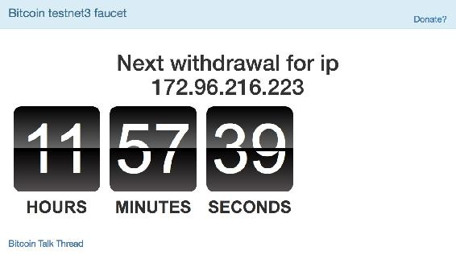

# 第七章 【比特币钱包开发 七】新建子账号与导出子账号私钥

## 课程目标

1.  获取钱包子账号地址
2.  获取钱包余额
3.  索取 BTC 测试币
4.  新建钱包子账号地址
5.  导出子账号私钥

## 前言

在前面的内容我们已经获取了我的所有钱包，本章的内容就是对我的钱包进行操作，比如：获取钱包子账号地址、获取钱包余额获、新建钱包子账号地址、导出子账号私钥等功能。

## 一、获取钱包子账号地址

在每次交易时都会将余额转到一个新的子地址，通过新的子地址产生交易，这样做的目的就是为了提高账号的安全性。同样，在接受别人转账时，也最好提供新的子账号地址接受。那么我们先来获取钱包所拥有的子账号地址。

在 bitcore-wallet-client 库中获取子账号地址提供的 API 是 getMainAddresses()方法，具体参数可以查看文档详情，这里我们可以不传参数，示例如下

```go
let walletname = "wallet1"

let filePath = path.join(config.walletFilePath, walletname + ".dat")
client.import(fs.readFileSync(filePath));
client.getMainAddresses({}, function (err, addresses) {
    console.log(err, addresses)
}); 
```

输出如下


注意：在对钱包操作钱一定要用 import()方法解锁钱包。

返回的数据 addresses 是一个数组，元素是账号地址对象，wallet1 钱包当前只有一个字账号地址，路径“m/0/0”，地址是“moveF5KCAs5ZLwu9Cgwtw3Gh25CiC51KQz”。

## 二、获取钱包余额

在 bitcore-wallet-client 库中获取钱包余额提供的 API 是 getBalance()方法，具体参数可以查看文档详情，这里我们可以不传参数，示例如下

```go
let walletname = "wallet1"

let filePath = path.join(config.walletFilePath, walletname + ".dat")
client.import(fs.readFileSync(filePath));
client.getBalance({}, (err, balanceData) => {
    console.log(err, balanceData)
}) 
```

输出如下


返回的数据是一个对象，包含如下字断

*   totalAmount: 总的余额。
*   lockedAmount: 锁定余额。
*   totalConfirmedAmount: 所有的确认的余额。
*   lockedConfirmedAmount: 锁定的余额。
*   availableAmount: 可用余额。
*   availableConfirmedAmount: 可用的确认的余额。
*   byAddress：金额来源于哪个子地址，它是一个数组，元素是对象，包含的字断有
    *   address：该地址拥有余额。
    *   path：该地址的路径。
    *   amount：该地址拥有余额的数量。

从输出可以看到余额为 0，如何获取 BTC 余额呢？

在主网中可以通过如下方式获取 BTC：

*   提供自己的任意一个子账号地址，通过别人转账获取。
*   在钱包应用程序中通过币币交易获取。
*   在交易所中通过 BTC 体现获取。

在测试网络中可以通过如下方式获取 BTC：

*   提供自己的任意一个子账号地址，通过别人转账获取。
*   到 coinfaucet 网站索取 BTC 测试币。

下面介绍测试网中的第二种方式“到 coinfaucet 网站索取 BTC 测试币”，在下一章内容中介绍第一种方式。

## 三、索取 BTC 测试币

在开发过程中，必须拥有 BTC 余额才便于开发测试，在正式网络中进行测试，转账需要消费 gas，另外速度慢，所以我们将在测试网络中进行开发和测试，调试成功后将网络类型字断替换为“livenet”即可切换到比特币正式网络中。

第一步：打开[coinfaucet 网站](https://coinfaucet.eu/en/btc-testnet/)，如下图


第二步：讲上面解锁的“wallet1”钱包的地址“moveF5KCAs5ZLwu9Cgwtw3Gh25CiC51KQz”粘贴到上图的输入框中。


第三步：通过验证码后会提示币已经转到了指定账号地址，然后提示本 IP 地址还需 12 小时才能再次索取 BTC 测试币。



第四步：我们再次运行代码获取钱包余额，输出如下。


可看到该账号“moveF5KCAs5ZLwu9Cgwtw3Gh25CiC51KQz”拥有可用余额 12121737。

注意：代码中的比特币余额都是以 Satoshi 为单位进行计算和传递，所以我们前端在显示的时候需要将它转换为 BTC 单位，进位是 10⁸。因此该账号当前拥有的余额是 0.12121737BTC。

## 四、新建钱包子账号地址

到此为止我们的钱包只有一个子账号地址，要获取更多的子账号地址，就是获取路径“m/0/1”、“m/0/2”......"m/0/2³¹"的子地址，可以通过 API 调用 createAddress()实现，它会根据路径按照 0～2³¹ 的顺序创建，它的用法很简单，在创建钱包的时候也都调用过。下面再看下它的完整实现。

```go
let walletname = "wallet1"

let filePath = path.join(config.walletFilePath, walletname + ".dat")
client.import(fs.readFileSync(filePath));

client.createAddress({}, function (err, addr) {
    console.log(err, addr)
}); 
```

输出如下


再次为“wallet1”钱包创建了子账号地址，因为该钱包只有路径“m/0/0”的地址被创建，所以现在创建的地址路径是“m/0/1”，地址是“mwtTPpQWGkQabUqgAwSN62SfhNYVV76BHZ”。

下面我们再来查看一下该钱包的子账号地址与余额。

### 验证一：使用代码

```go
let walletname = "wallet1"

let filePath = path.join(config.walletFilePath, walletname + ".dat")
client.import(fs.readFileSync(filePath));
client.getMainAddresses({}, function (err, addresses) {
    console.log(err, addresses)
});
client.getBalance({}, (err, balanceData) => {
    console.log(err, balanceData)
}) 
```

输出如下：

```go
null { totalAmount: 12121737,
  lockedAmount: 0,
  totalConfirmedAmount: 12121737,
  lockedConfirmedAmount: 0,
  availableAmount: 12121737,
  availableConfirmedAmount: 12121737,
  byAddress:
   [ { address: 'moveF5KCAs5ZLwu9Cgwtw3Gh25CiC51KQz',
       path: 'm/0/0',
       amount: 12121737 } ] }

null [ { version: '1.0.0',
    createdOn: 1540869940,
    address: 'moveF5KCAs5ZLwu9Cgwtw3Gh25CiC51KQz',
    walletId: '5032ecad-ee55-4a59-8ba6-7cea6693f044',
    coin: 'btc',
    network: 'testnet',
    isChange: false,
    path: 'm/0/0',
    publicKeys:
     [ '02283af27060189410393b0cfaa2788183282954d2a1cb71e1fe0c1b1c2eb5794c' ],
    type: 'P2PKH',
    hasActivity: null },
  { version: '1.0.0',
    createdOn: 1540884393,
    address: 'mwtTPpQWGkQabUqgAwSN62SfhNYVV76BHZ',
    walletId: '5032ecad-ee55-4a59-8ba6-7cea6693f044',
    coin: 'btc',
    network: 'testnet',
    isChange: false,
    path: 'm/0/1',
    publicKeys:
     [ '02c1c3bdbc715a3dd0a051480c77559593203d7b969ac4a0b54582c9ba7af27c99' ],
    type: 'P2PKH',
    hasActivity: null } ] 
```

可见该钱包的余额 0.12121737BTC 还是由第一个账号拥有，它的子账号地址则有了两个，分别是“m/0/0”与“m/0/1”。

### 验证二：使用助记词转换网站

再打开[助记词转换网站](https://iancoleman.io/bip39/#english)验证 wallet1 钱包，它的助记词是“same subway develop fun fancy library sand rain hamster ship floor define”， 密码是“1234qwer”。


可见与代码中的结果一致。

## 五、导出子账号私钥

现在我们来导出“wallet1”钱包中“m/0/1”路径的私钥。需要通过 credentials 认证对象调用 getDerivedXPrivKey()方法获取到 derivedXPrivKey，derivedXPrivKey 再通过路径获取到指定账号的 keyPair，那么 keyPair 里面就有私钥了。

```go
let walletname = "wallet1"
let childpath = "m/0/1"

let filePath = path.join(config.walletFilePath, walletname + ".dat")
client.import(fs.readFileSync(filePath));
let derivedXPrivKey = client.credentials.getDerivedXPrivKey(null);
let keyPair = derivedXPrivKey.deriveChild(childpath).privateKey
console.log(keyPair.toWIF()) 
```

输出如下


根据输出可以看到成功获取到了“m/0/1”路径的私钥、公钥、地址数据，与助记词转换网站的数据也一致。

## 六、完整源码

### 1\. controllers/wallet.js

编辑 controllers 文件夹下的 wallet.js 文件，实现获取钱包子账号地址、获取钱包余额获、新建钱包子账号地址、导出子账号私钥功能。

```go
......

module.exports = {
    ......

    walletAddress: (req, res) => {

        let { walletname } = req.body

        let filePath = path.join(config.walletFilePath, walletname + ".dat")
        client.import(fs.readFileSync(filePath));

        client.getMainAddresses({}, function (err, addressData) {
            console.log(err, addressData)
            if (err) {
                res.send(fail(err.message))
                return
            }
            res.send(success(addressData))
        });
    },

    walletBalance: (req, res) => {
        let { walletname } = req.body
        console.log("walletname:", walletname)

        let filePath = path.join(config.walletFilePath, walletname + ".dat")
        client.import(fs.readFileSync(filePath));

        client.getBalance({}, (err, balanceData) => {
            console.log(err, balanceData)
            if (err) {
                res.send(fail(err.message))
                return
            }
            res.send(success(balanceData))
        })
    },

    walletNewSubAddress: (req, res) => {

        let { walletname } = req.body

        let filePath = path.join(config.walletFilePath, walletname + ".dat")
        client.import(fs.readFileSync(filePath));

        client.createAddress({}, function (err, addr) {
            console.log(err, addr)
            if (err) {
                res.send(fail(err.message))
                return
            }
            res.send(success(addr))
        });
    },

    walletExportPrivateKey: (req, res) => {
        let { walletname, childpath, password } = req.body
        let filePath = path.join(config.walletFilePath, walletname + ".dat")
        client.import(fs.readFileSync(filePath));

        let derivedXPrivKey = client.credentials.getDerivedXPrivKey(null);
        let privateKey = derivedXPrivKey.deriveChild(childpath).privateKey
        res.send(success(privateKey.toWIF()))
    },
} 
```

### 2\. controllers/web.js

编辑 controllers 文件夹下的 web.js 文件，后端实现返回钱包账号详细页面。

```go
......

getWalletInfoHtml: (req, res) => {
    res.render("walletInfo.html")
}, 
```

### 3\. router/router.js

将获取钱包子账号地址、获取钱包余额获、新建钱包子账号地址、导出子账号私钥的接口绑定到路由。

```go
......

//钱包
router.post("/wallet/address", walletController.walletAddress)
router.post("/wallet/balance", walletController.walletBalance)
router.post("/wallet/newsubaddress", walletController.walletNewSubAddress)

router.post("/export/privatekey", walletController.walletExportPrivateKey)

//页面
router.get("/walletinfo.html", webController.getWalletInfoHtml) 
```

### 4\. static/js/walletInfo.js

新建 walletInfo.js 文件，处理获取钱包子账号地址、获取钱包余额获、新建钱包子账号地址、导出子账号私钥等的网络请求与界面渲染。

```go
//获取子地址
function createSubAddress() {
    //地址
    let params = {"walletname":currentwallet}
    $.post("/wallet/newsubaddress", params, function (res, status) {
        console.log(status + JSON.stringify(res))
        if (res.code == 0) {
            updateWalletAddressList()
        }
    })
}

//导出私钥
function exportPrivatekey(walletName,path) {
    console.log(walletName)
    let password = prompt("请输入该钱包的密码")
    if (password) {
        let params = { 
            "walletname": walletName,
            "password": password, 
            "childpath":path
        }
        $.post("/export/privatekey", params, function (res, status) {
            console.log(status, JSON.stringify(res))

            if (res.code == 0) {
                alert(res.data)
            }
        })
    }
}

//获取钱包子账号地址
function updateWalletAddressList() {
    let params = {"walletname":currentwallet}
    $.post("/wallet/address", params, function (res, status) {
        console.log(status + JSON.stringify(res))
        if (res.code == 0) {
            if (res.data.length > 0) {
                let mainAddress = res.data[0].address
                $("#main-address").text(mainAddress)
            } else {
                $("#main-address").text("Error：未建账号地址")
            }

            let addressTable = $("#address-list-table")
            addressTable.empty()
            for (let i = 0; i < res.data.length; i++) {
                let account = res.data[i]
                let accountTr = `<tr>
                    <td>${account.path.slice(2)}</td>
                    <td>${account.address}</td>
                    <td><button onclick="exportPrivatekey('${currentwallet}','${account.path}')">导出私钥</button></td>
                </tr>`
                addressTable.append(accountTr)
            }
        }
    })
}

let currentwallet = localStorage.getItem("currentwallet")

$(document).ready(function () {
    if (!currentwallet) {
        return
    }
    $("h1").text(currentwallet.slice(currentwallet+" 钱包"))

    let params = {"walletname":currentwallet}
    //余额
    $.post("/wallet/balance", params, function (res, status) {
        console.log(status + JSON.stringify(res))
        if (res.code == 0) {
            $("#balance").text(res.data.availableAmount/100000000)
            $("#unc_balance").text(res.data.lockedAmount/100000000)
        }
    })

    //地址
    updateWalletAddressList()
}) 
```

### 5\. views/walletInfo.html

新建 walletInfo.html 文件，前端显示钱包账号详情的页面。

```go
<html>

<head>
    <title>账号</title>
    <script src="/js/lib/jquery-3.3.1.min.js"></script>
    <script src="/js/lib/jquery.url.js"></script>
    <script src="/js/walletInfo.js"></script>
    <link rel="stylesheet" href="/css/btcwallet.css">
</head>

<body>
    <%include block/nav.html%>

    <div id="main">
        <h1></h1>
        <h3>余额：<span id="balance"></span> BTC</h3>
        <h3>未被确认的余额：<span id="unc_balance"></span> BTC</h3>
        <h3>主地址：<span id="main-address"></span></h3>

        <button onclick="createSubAddress()">新建子账号地址</button>
        <br><br>

        <table>
            <tr>
                <td>路径</td>
                <td>子账号地址</td>
            </tr>
            <tbody id="address-list-table">

            </tbody>
        </table>

        <div style="position: absolute;left: 30%;bottom:30px;">Copyright © 2016-2018 北京从零到壹科技有限公司</div>
    </div>
</body>

</html> 
```

## 七、项目运行效果


**[项目源码 Github 地址](https://github.com/lixuCode/BTCWallet)**

**版权声明：博客中的文章版权归博主所有，未经授权禁止转载，转载请联系作者（微信：lixu1770105）取得同意并注明出处。**