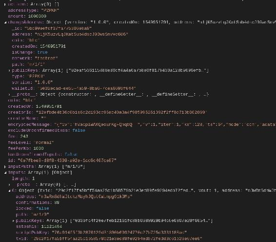
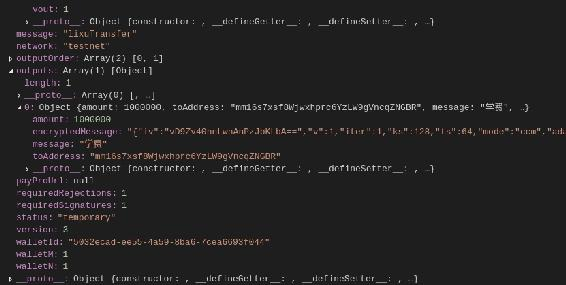
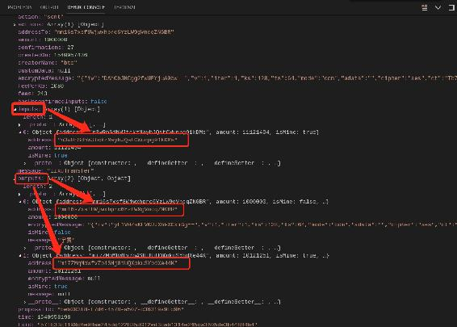
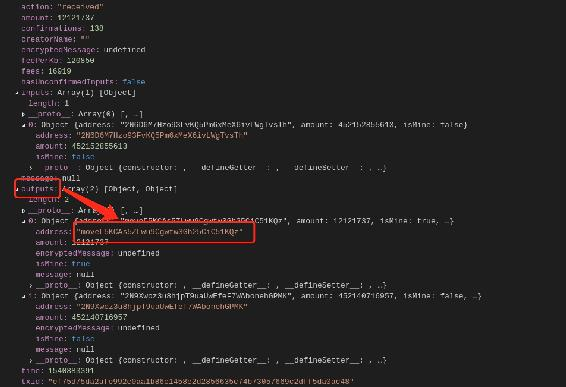
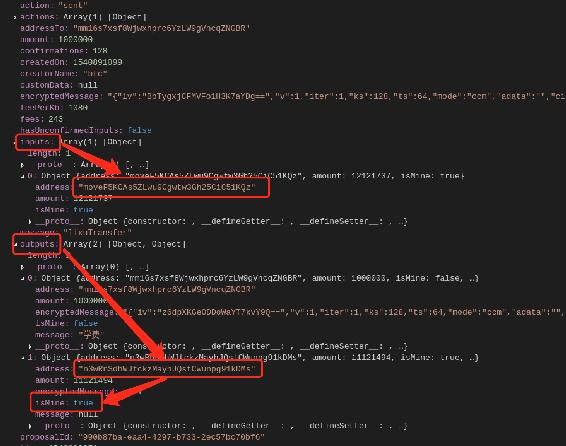
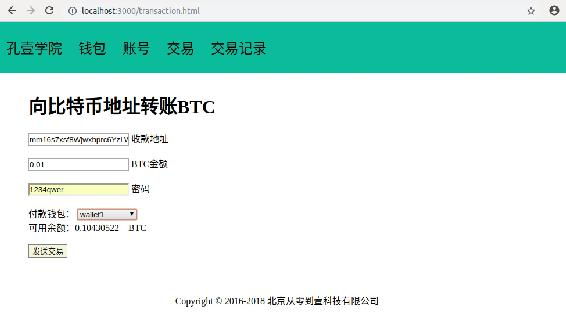
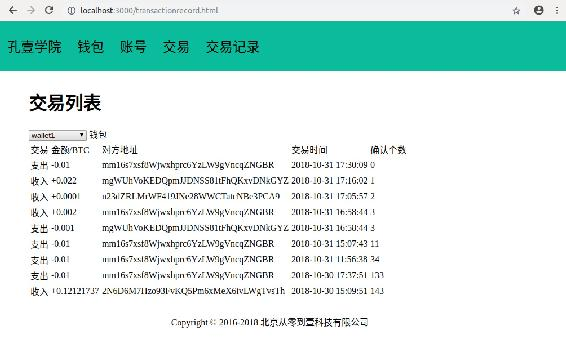

# 第八章 【比特币钱包开发 八】比特币转账交易与交易记录

## 课程目标

1.  理解交易的输入、输出、UTXO
2.  实现比特币转账交易
3.  查询交易记录

## 前言

现在我们的钱包应用程序还差最后一个关键的功能：转账交易，这就是本章的内容。

根据 API 文档可见，完整的发送交易过程需要经过如下四个步骤：

*   createTxProposal()：创建交易。
*   publishTxProposal()：发布交易。
*   signTxProposal()：签名交易。
*   broadcastTxProposal()：广播交易。

## 一、创建交易的 API 文档说明

首先我们需要创建一个交易，API 文档说明如下：

```go
API.createTxProposal(opts, opts.outputs, opts.outputs[].toAddress, opts.outputs[].amount, opts.outputs[].message, opts.message, opts.fee, opts.feePerKb, opts.changeAddress, opts.payProUrl, opts.excludeUnconfirmedUtxos, opts.customData, opts.inputs, opts.outputs, opts.utxosToExclude)
Create a transaction proposal

Parameters

opts: Object, Create a transaction proposal

opts.outputs: Array, List of outputs.

opts.outputs[].toAddress: String, / opts.outputs[].script

opts.outputs[].amount: Number, Create a transaction proposal

opts.outputs[].message: String, Create a transaction proposal

opts.message: string, A message to attach to this transaction.

opts.fee: string, Optional: Use an alternative fee for this TX (mutually exclusive with feePerKb)

opts.feePerKb: string, Optional: Use an alternative fee per KB for this TX (mutually exclusive with fee)

opts.changeAddress: string, Optional. Use this address as the change address for the tx. The address should belong to the wallet.

opts.payProUrl: String, Optional: Tx is from a payment protocol URL

opts.excludeUnconfirmedUtxos: string, Optional: Do not use UTXOs of unconfirmed transactions as inputs

opts.customData: Object, Optional: Arbitrary data to store along with proposal

opts.inputs: Array, Optional: Inputs to be used in proposal.

opts.outputs: Array, Optional: Outputs to be used in proposal.

opts.utxosToExclude: Array, Optional: List of UTXOS (in form of txid:vout string) to exclude from coin selection for this proposal

Returns: Callback, cb - Return error or the transaction proposal 
```

第一个参数是 opts 有很多可选参数，第二个参数是 Callback 回调。下面解释下 opts 的重要参数。

*   **opts.outputs**: `Array`，必填：交易的输出，即收款方。数据类型是数组，可见一次交易支持多个转账，数组的元素包含如下：
    *   **opts.outputs[].toAddress**: `String`，必填：收款方地址。
    *   **opts.outputs[].amount**: `Number`，必填：转账数额。
    *   **opts.outputs[].message**: `String`，必填：备注消息。

**opts.message**: `string`，必填：本次交易的备注消息，与 opts.outputs[].message 不同，它是指定的单个转账的备注信息。

**opts.fee**: `string`，可选：本次交易的费用，与 feePerKb 互斥。

**opts.feePerKb**: `string`，可选：本次交易每 KB 的费用，与 fee 互斥。

**opts.changeAddress**: `string`，可选：使用这个地址作为本次交易的地址，该地址必须属于该钱包。

**opts.payProUrl**: `String`，可选：忽略。

**opts.excludeUnconfirmedUtxos**: `string`，可选：不使用未确认事务的 UTXOS 作为输入。

**opts.customData**: `Object`，可选： 忽略。

**opts.inputs**: `Array，`可选：本次交易中使用的输入。

**opts.utxosToExclude**: `Array`，可选：忽略。

## 二、编码实现创建交易

我们先传递必填参数实现创建交易，代码如下：

```go
let client = require("../models/walletClient").getWalletClient()
var path = require('path');
var fs = require('fs');
var config = require("../config/config")

let walletname = "wallet1"
let to = "mm16s7xsf8Wjwxhprc6YzLW9gVncqZNGBR"
let amount = "0.01"

let filePath = path.join(config.walletFilePath, walletname + ".dat")
client.import(fs.readFileSync(filePath));

let opts = {
    'outputs': [
        {
            'toAddress': to,
            'amount': parseFloat(amount) * 100000000,
            'message': '学费'
        }
    ],
    message: "lixuTransfer"
}
client.createTxProposal(opts, function (err, txp) {
    if (err) {
        console.log(err);
    }

    console.log(txp)
}) 
```

输出如下：



输出信息有几个关键点：

*   status:"temporary"，临时状态。
*   fee:243，手续费为 243Satoshi。
*   feeLevel:"normal"，费用等级是正常。

重点数据如下：

*   changeAddress:{address:"n1jK5uzvLqJKatSub4dscJ93wsSnvVc6U6",path:"m/1/1"}
*   inputs:{address: "n3wRnSdhWJtckzMayhJQstCWunpg91kDMs",path:"m/1/0"}
*   outputs:{toAddress: "mm16s7xsf8Wjwxhprc6YzLW9gVncqZNGBR"}

现在这个交易并没有发送出去，要完成这个交易还需进行三个步骤。

## 三、发送交易的完整过程

前面已经说到了发送交易需要四个过程，createTxProposal --> publishTxProposal --> signTxProposal --> broadcastTxProposal。重点是在第一步创建交易 createTxProposal，这里指定本次交易的详细数据，后面的三部只需执行即可。

```go
let client = require("../models/walletClient").getWalletClient()
var path = require('path');
var fs = require('fs');
var config = require("../config/config")

let walletname = "wallet1"
let to = "mm16s7xsf8Wjwxhprc6YzLW9gVncqZNGBR"
let amount = "0.01"

let filePath = path.join(config.walletFilePath, walletname + ".dat")
client.import(fs.readFileSync(filePath));

let opts = {
    'outputs': [
        {
            'toAddress': to,
            'amount': parseFloat(amount) * 100000000,
            'message': '学费'
        }
    ],
    message: "lixuTransfer"
}
client.createTxProposal(opts, function (err, txp) {
    if (err) {
        console.log(err);
        return
    }
    console.log("\n createTxProposal:\n", txp)

    client.publishTxProposal({ txp: txp }, function (err, txp) {
        if (err) {
            console.log(err);
            return
        }
        console.log("\n publishTxProposal:\n", txp)

        client.signTxProposal(txp, function (err, txp) {
            if (err) {
                console.log(err);
                return
            }
            console.log("\n signTxProposal:\n", txp)

            client.broadcastTxProposal(txp, function (err, txp, memo) {
                if (err) {
                    console.log(err);
                    return
                }
                if (memo) {
                    console.log(memo);
                }
                console.log("\n broadcastTxProposal:\n", txp)
            })
        })
    })
}) 
```

输出内容太多，下面说下重点数据。

1.  每次交易都会改变地址，现在的输出是

    *   changeAddress:{address:"mi7ZMqMbWfv7p4SHj8iUQXpkuSYbdXe44K",path:"m/1/2"}，

        上次是"m/1/1"。

    *   inputs:{address: "n3wRnSdhWJtckzMayhJQstCWunpg91kDMs",path:"m/1/0"}，

        与上次没有发送变化，还是"m/1/0"，因为上次交易只是创建了并没有广播。

    *   outputs:{toAddress: "mm16s7xsf8Wjwxhprc6YzLW9gVncqZNGBR"}

2.  执行完每个步骤对交易都会改变它的状态

    *   createTxProposal()：status:"broadcasted"。
    *   publishTxProposal()：status:"pending"。
    *   signTxProposal()：status:"accepted"。
    *   broadcastTxProposal()：status:"broadcasted"。
3.  成功执行签名交易后会生成交易 id，txid:"57fb33c1199d6e98ae245dc422835d012ed3cab1314e245ca3605de3b44884b4"。

    id:"beb003f8-f7d6-4578-a507-c36319a9fc96"。

4.  若几个步骤没有发送错误，则交易成功完成。两个钱包的余额变化情况是

    *   “wallet1”：0.11121494 BTC-->0.10121251 BTC，差值是 0.01000243。

    *   收款方“mm16s7xsf8Wjwxhprc6YzLW9gVncqZNGBR”所在钱包是“importWallet1”。

        “importWallet1”：0.011 BTC-->0.021 BTC，差值是 0.01。

    多扣掉的 0.01000243-0.01=0.00000243BTC 正是本次交易的手续费，为 243Satoshi。

## 四、查询交易记录

现在我们对刚才进行的转账看下是否能成功查询。需要使用 getTxHistory()方法，注意，一定要加上参数 includeExtendedInfo 设置为 true，会显示额外的交易详情，如：输入、输出等。

```go
let walletname = "wallet1"

let filePath = path.join(config.walletFilePath, walletname + ".dat")
client.import(fs.readFileSync(filePath));

client.getTxHistory({includeExtendedInfo:true}, (err, data) => {
    console.log(err, data)
}); 
```

### 1\. 最近一次转账的交易记录

现在该钱包有三次交易记录，我将上面进行转账的交易记录详细截图如下：



我们先来分析上面出现的三个地址。

*   inputs:{address: "n3wRnSdhWJtckzMayhJQstCWunpg91kDMs"}，

    这是本次交易的输入，通过 getBalance()方法的 byAddress 字段可以查看钱包的余额由哪些子地址拥有。

*   outputs[0]:{toAddress: "mm16s7xsf8Wjwxhprc6YzLW9gVncqZNGBR"}

    这是输出，是收款方地址。

*   outputs[1]:{address:"mi7ZMqMbWfv7p4SHj8iUQXpkuSYbdXe44K",path:"m/1/2"}

    我们给一个地址转账为什么会出现两个输出呢？因为会将输入里的余额取出来一部分进行转账，剩余的钱就转移到了这个地址，这个地址是该钱包的另外一个新的子账号地址。所以转账之前在"m/1/0"路径的“n3wR......kDMs”地址中，在本次转账完成后就转移到了"m/1/2"路径的“mi7Z……e44K”地址。

### 2\. 最初接收的交易记录

现在再来看看接收转账的输出，在最初索取 BTC 测试币的交易就是接收。



可见自己路径“m/0/0”的地址“move......1KQz”作为了输出，用于接收交易。同时可以看到有个状态的字段

*   action:"send"，代表发送。
*   action:"received"，代表接收。

### 3\. 第二次交易记录

在这次交易记录中将关联第一次与第三次交易的交易地址。



*   第一次接收交易的输出：“move......1KQz”。输出即拥有余额的地址。

*   第二次转出交易的输入：“move......1KQz”，输出（即改变后的地址）：“n3wR......kDMs”。

*   第三次转出交易的输入：“n3wR......kDMs”。

其它类型的转账自己在测试看一下结果。

### 4\. 结论

比特币采用的是 UTXO 模型，并非账户模型，并不直接存在“余额”这个概念，获取余额需要通过遍历整个交易历史获取。

UTXO：是 unspend transaction output 的简写，指未被花费的交易输出。

场景：假设你过去分别向 A、B、C 这三个比特币用户购买了 BTC，从 A 手中购买了 3.5 个 BTC，从 B 手中购买了 4.5 个 BTC，从 C 手中购买了 2 个 BTC，现在你的比特币钱包里面恰好剩余 10 个 BTC。

问题：这个 10 个 BTC 是真正的 10 个 BTC 吗？其实不是，这句话可能听起来有点怪。（什么！我钱包里面的 BTC 不是真正的 BTC，你不要吓我……）

解释：前面提到过在比特币的交易系统当中，并不存在账户、余额这些概念，所以，你的钱包里面的 10 个 BTC，并不是说钱包余额为 10 个 BTC。而是说，这 10 个 BTC 其实是由你的比特币地址（钱包地址|公钥）锁定了的散落在各个区块和各个交易里面的 UTXO 的总和。

UTXO 是比特币交易的基本单位，每笔交易都会产生 UTXO，一个 UTXO 可以是一“聪”的任意倍。给某人发送比特币实际上是创造新的 UTXO，绑定到那个人的钱包地址，并且能被他用于新的支付。

一般的比特币交易由 `交易输入` 和 `交易输出` 两部分组成。A 向你支付 3.5 个 BTC 这笔交易，实际上产生了一个新的 UTXO，这个新的 UTXO 等于 3.5 个 BTC（3.5 亿聪），并且锁定到了你的比特币钱包地址上。

假如你要给你女（男）朋友转 1.5 BTC，那么你的钱包会从可用的 UTXO 中选取一个或多个可用的个体来拼凑出一个大于或等于一笔交易所需的比特币量。比如在这个假设场景里面，你的钱包会选取你和 C 的交易中的 UTXO 作为 交易输入，input = 2BTC，这里会生成两个新的交易输出，一个输出（UTXO = 1.5 BTC）会被绑定到你女（男）朋友的钱包地址上，另一个输出（UTXO = 0.5 BTC）会作为找零，重新绑定到你的钱包地址上。

我们需要找到所有未花费的交易输出（UTXO）。*Unspent(未花费)* 意味着这些交易输出从未被交易输入所指向。

## 五、完整源码

### 1\. controllers/transaction.js

controllers 文件夹下新建 transaction.js 文件，实现比特币转账交易和查询交易记录功能。

```go
let { success, fail } = require("../utils/myUtils")
let client = require("../models/walletClient").getWalletClient()
var path = require('path');
var fs = require('fs');
var config = require("../config/config")

module.exports = {
    transactionSend: (req, res) => {
        let { walletname, password, to, amount } = req.body
        console.log(req.body)

        let filePath = path.join(config.walletFilePath, walletname + ".dat")
        client.import(fs.readFileSync(filePath));

        let opts = {
            'outputs': [
                {
                    'toAddress': to,
                    'amount': parseFloat(amount) * 100000000,
                    'message': 'lixu'
                }
            ],
            message: "lixuTransfer"
        }
        client.createTxProposal(opts, function (err, txp) {
            if (err) {
                console.log(err);
                res.send(fail(err.message))
                return
            }
            // console.log("\n createTxProposal:\n", txp)

            client.publishTxProposal({ txp: txp }, function (err, txp) {
                if (err) {
                    console.log(err);
                    res.send(fail(err.message))
                    return
                }
                // console.log("\n publishTxProposal:\n", txp)

                client.signTxProposal(txp, function (err, txp) {
                    if (err) {
                        console.log(err);
                        res.send(fail(err.message))
                        return
                    }
                    // console.log("\n signTxProposal:\n", txp)

                    client.broadcastTxProposal(txp, function (err, txp, memo) {
                        if (err) {
                            console.log(err);
                            res.send(fail(err.message))
                            return
                        }
                        if (memo) {
                            console.log(memo);
                        }
                        console.log("\n broadcastTxProposal:\n", txp)
                        res.send(success("转账成功"))
                    })
                })
            })
        })
    },

    transactionRecord: (req, res) => {
        let { walletname } = req.body
        console.log(req.body)
        let filePath = path.join(config.walletFilePath, walletname + ".dat")
        client.import(fs.readFileSync(filePath));

        client.getTxHistory({includeExtendedInfo:true}, (err, data) => {
            console.log(err, data);
            if (err) {
                res.send(fail(err.message))
                return
            }
            res.send(success(data))
        });
    },
} 
```

### 2\. controllers/web.js

编辑 controllers 文件夹下的 web.js 文件，后端实现返回比特币转账交易和查询交易记录页面。

```go
......

getTransactionHtml: (req, res) => 　{
    res.render("transaction.html")
},

getTransactionRecordHtml: (req, res) => 　{
    res.render("transactionRecord.html")
}, 
```

### 3\. router/router.js

将比特币转账交易和查询交易记录的接口绑定到路由。

```go
......

//转账交易
router.post("/transaction/send", transactionController.transactionSend)
router.post("/transaction/record", transactionController.transactionRecord)

//页面
router.get("/transaction.html", webController.getTransactionHtml)
router.get("/transactionrecord.html", webController.getTransactionRecordHtml) 
```

### 4\. static/js/transaction.js

新建 transaction.js 文件，处理比特币转账交易的网络请求与界面渲染。

```go
//账号金额
function updateWalletBalance(wallet) {
    $("#balance").text("加载中...")

    let params = {"walletname":wallet}
    //余额
    $.post("/wallet/balance", params, function (res, status) {
        console.log(status + JSON.stringify(res))
        if (res.code == 0) {
            $("#balance").text(res.data.availableAmount/100000000)
        }
    })
}

$(document).ready(function () {
    let currentwallet = localStorage.getItem("currentwallet")

    //选择付款地址列表
    let walletList = localStorage.getItem("walletlist")
    walletList = JSON.parse(walletList)
    console.log("accountList",walletList)

    let addressSelectList = $("#transaction-send-address-select")
    for(let i = 0; walletList && i < walletList.length; i++) {
        let walletname = walletList[i]
        let showWalletname = walletname.slice(walletname.indexOf("-")+1)
        let walletOption
        if (walletname == currentwallet) {
            walletOption = `<option selected="selected" value="${walletname}">${showWalletname}</option>`
        } else {
            walletOption = `<option value="${walletname}">${showWalletname}</option>`
        }
        addressSelectList.append(walletOption)
    }

    //钱包金额和地址
    updateWalletBalance(currentwallet)

    //选择不同的钱包
    addressSelectList.change(function() {
        console.log(this.value)
        localStorage.setItem("currentwallet", this.value)
        updateWalletBalance(this.value)
    })

    //发送交易
    $("#transaction-send-form").validate({
        rules: {
            from: {required: true,},
            to: {required: true,},
            amount: {required: true,},
            password: {required: true,},
        },
        messages: {
            from: {required: "请选择转出的账号",},
            to: {required: "请输入对方账号名称",},
            amount: {required: "请输入转账的数量",},
            password: {required: "请输入该钱包的密码",},
        },
        submitHandler: function (form) {
            $(form).ajaxSubmit({
                url: "/transaction/send",
                type: "post",
                dataType: "json",
                success: function (res, status) {
                    console.log(status + JSON.stringify(res))
                    alert(JSON.stringify(res.data))
                    if (res.code == 0) {
                    }
                },
                error: function (res, status) {
                    console.log(status + JSON.stringify(res))
                    alert(res.data)
                }
            });
        }
    })
}) 
```

### 5\. views/transaction.html

新建 transaction.html 文件，前端显示比特币转账交易的页面。

```go
<html>

<head>
    <title>转账</title>
    <script src="/js/lib/jquery-3.3.1.min.js"></script>
    <script src="/js/lib/jquery.url.js"></script>
    <script src="/js/transaction.js"></script>
    <link rel="stylesheet" href="/css/btcwallet.css">
</head>

<body>
    <%include block/nav.html%>

    <div id="main">
        <h1>向比特币地址转账 BTC</h1>
        <form id="transaction-send-form" 　>
            <input type="text" name="to" placeholder="请输入对方收款地址">
            <label>收款地址</label>
            <br><br>

            <input type="text" name="amount" placeholder="请输入转账数量">
            <label>BTC 金额</label>
            <br><br>

            <input type="text" name="password" placeholder="请输入钱包密码">
            <label>密码</label>
            <br><br>

            <label>付款钱包：</label>
            <select name="walletname" id="transaction-send-address-select">
            </select>
            <br>

            <label>可用余额：</label><span id="balance"></span>　BTC
            <br><br>

            <button type="submit">发送交易</button>
        </form>

        <div style="position: absolute;left: 30%;bottom:30px;">Copyright © 2016-2018 北京从零到壹科技有限公司</div>
    </div>
</body>

</html> 
```

### 6\. static/js/transactionRecord.js

新建 transactionRecord.js 文件，处理查询交易记录的网络请求与界面渲染。

```go
function formatDateTime(inputTime) {  
    var date = new Date(inputTime);
    var y = date.getFullYear();  
    var m = date.getMonth() + 1;  
    m = m < 10 ? ('0' + m) : m;  
    var d = date.getDate();  
    d = d < 10 ? ('0' + d) : d;  
    var h = date.getHours();
    h = h < 10 ? ('0' + h) : h;
    var minute = date.getMinutes();
    var second = date.getSeconds();
    minute = minute < 10 ? ('0' + minute) : minute;  
    second = second < 10 ? ('0' + second) : second; 
    return y + '-' + m + '-' + d+' '+h+':'+minute+':'+second;  
}

function updateTransactionList(wallet) {

    let params = { "walletname": wallet }
    //地址
    $.post("/transaction/record", params, function (res, status) {
        console.log("/transaction/record:\n", status + JSON.stringify(res),"\n")
        if (res.code == 0) {

            let transactionListTable　= $("#transaction-list-table")
            if (res.data.length > 0) {
                transactionListTable.empty()
                for (let i = 0; i < res.data.length; i++) {
                    let transaction = res.data[i]
                    let isReceived = transaction.action == "received" ? true : false
                    let transactionTr = `<tr>
                        <td>${isReceived ? "收入" : "支出"}</td>
                        <td>${isReceived ? "+" : "-"}${transaction.amount/100000000}</td>                        
                        <td>${isReceived ? transaction.inputs[0].address : transaction.addressTo}</td>
                        <td>${formatDateTime(transaction.time*1000)}</td>
                        <td>${transaction.confirmations}</td>
                    </tr>`
                    transactionListTable.append(transactionTr)
                }
            } else {
                transactionListTable.text("暂无交易记录")
            }
        }
    })
}

$(document).ready(function () {
    let currentwallet = localStorage.getItem("currentwallet")

    //钱包列表
    let walletList = localStorage.getItem("walletlist")
    walletList = JSON.parse(walletList)
    console.log("accountList", walletList,currentwallet)

    let addressSelectList = $("#transaction-record-wallet-select")
    for (let i = 0; walletList && i < walletList.length; i++) {
        let walletname = walletList[i]
        let showWalletname = walletname.slice(walletname.indexOf("-")+1)
        let walletOption
        if (walletname == currentwallet) {
            walletOption = `<option selected="selected" value="${walletname}">${showWalletname}</option>`
        } else {
            walletOption = `<option value="${walletname}">${showWalletname}</option>`
        }
        addressSelectList.append(walletOption)
    }

    //更新交易记录
    updateTransactionList(currentwallet)

    //选择不同的钱包
    addressSelectList.change(function () {
        console.log(this.value)
        localStorage.setItem("currentwallet", this.value)
        updateTransactionList(this.value)
    })
}) 
```

### 7\. views/transactionRecord.html

新建 transactionRecord.html 文件，前端显示查询交易记录的页面。

```go
<html>

<head>
    <title>钱包</title>
    <script src="/js/lib/jquery-3.3.1.min.js"></script>
    <script src="/js/lib/jquery.url.js"></script>
    <script src="/js/transactionRecord.js"></script>
    <link rel="stylesheet" href="/css/btcwallet.css">
</head>

<body>
    <%include block/nav.html%>

    <div id="main">
        <h1>交易列表</h1>
        <select name="walletname" id="transaction-record-wallet-select">
        </select><span> 钱包</span>
        <br>
        <table>
            <tr>
                <td>交易</td>
                <td>金额/BTC</td>
                <td>对方地址</td>
                <td>交易时间</td>
                <td>确认个数</td>
            </tr>
            <tbody id="transaction-list-table"></tbody>
        </table>

        <div style="position: absolute;left: 30%;bottom:30px;">Copyright © 2016-2018 北京从零到壹科技有限公司</div>
    </div>
</body>

</html> 
```

## 六、项目运行效果

1.  转账的页面如下



1.  交易记录的页面如下



**[项目源码 Github 地址](https://github.com/lixuCode/BTCWallet)**

**版权声明：博客中的文章版权归博主所有，未经授权禁止转载，转载请联系作者（微信：lixu1770105）取得同意并注明出处。**