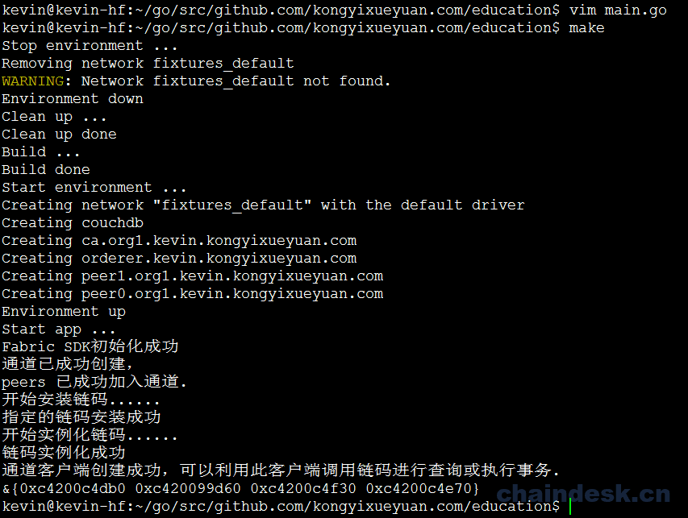

# 第二章 SDK 与链码实现

# 2 SDK 与链码实现

## 2.1 创建 config.yaml 文件

确认 Hyperledger Fabric 基础网络环境运行没有问题后，现在我们通过创建一个新的 config.yaml 配置文件给应用程序所使用的 Fabric-SDK-Go 配置相关参数及 Fabric 组件的通信地址

进入项目的根目录中创建一个 `config.yaml` 文件并编辑

```go
$ cd $GOPATH/src/github.com/kongyixueyuan.com/education
$ vim config.yaml 
```

config.yaml 配置文件完整内容如下:

```go
name: "kongyixueyuan-network"
#
# Schema version of the content. Used by the SDK to apply the corresponding parsing rules.
#
version: 1.0.0

#
# The client section used by GO SDK.
#
client:

  # Which organization does this application instance belong to? The value must be the name of an org
  # defined under "organizations"
  organization: Org1

  logging:
    level: info

  # Global configuration for peer, event service and orderer timeouts
  # if this this section is omitted, then default values will be used (same values as below)
#  peer:
#    timeout:
#      connection: 10s
#      response: 180s
#      discovery:
#        # Expiry period for discovery service greylist filter
#        # The channel client will greylist peers that are found to be offline
#        # to prevent re-selecting them in subsequent retries.
#        # This interval will define how long a peer is greylisted
#        greylistExpiry: 10s
#  eventService:
#    # Event service type (optional). If not specified then the type is automatically
#    # determined from channel capabilities.
#    type: (deliver|eventhub)
    # the below timeouts are commented out to use the default values that are found in
    # "pkg/fab/endpointconfig.go"
    # the client is free to override the default values by uncommenting and resetting
    # the values as they see fit in their config file
#    timeout:
#      connection: 15s
#      registrationResponse: 15s
#  orderer:
#    timeout:
#      connection: 15s
#      response: 15s
#  global:
#    timeout:
#      query: 180s
#      execute: 180s
#      resmgmt: 180s
#    cache:
#      connectionIdle: 30s
#      eventServiceIdle: 2m
#      channelConfig: 30m
#      channelMembership: 30s
#      discovery: 10s
#      selection: 10m

  # Root of the MSP directories with keys and certs.
  cryptoconfig:
    path: ${GOPATH}/src/github.com/kongyixueyuan.com/education/fixtures/crypto-config

  # Some SDKs support pluggable KV stores, the properties under "credentialStore"
  # are implementation specific
  credentialStore:
    path: /tmp/kongyixueyuan-store

    # [Optional]. Specific to the CryptoSuite implementation used by GO SDK. Software-based implementations
    # requiring a key store. PKCS#11 based implementations does not.
    cryptoStore:
      path: /tmp/kongyixueyuan-msp

   # BCCSP config for the client. Used by GO SDK.
  BCCSP:
    security:
     enabled: true
     default:
      provider: "SW"
     hashAlgorithm: "SHA2"
     softVerify: true
     level: 256

  tlsCerts:
    # [Optional]. Use system certificate pool when connecting to peers, orderers (for negotiating TLS) Default: false
    systemCertPool: false

    # [Optional]. Client key and cert for TLS handshake with peers and orderers
    client:
      key:
        path:
      cert:
        path:

#
# [Optional]. But most apps would have this section so that channel objects can be constructed
# based on the content below. If an app is creating channels, then it likely will not need this
# section.
#
channels:
  # name of the channel
  kevinkongyixueyuan:
    # Required. list of orderers designated by the application to use for transactions on this
    # channel. This list can be a result of access control ("org1" can only access "ordererA"), or
    # operational decisions to share loads from applications among the orderers.  The values must
    # be "names" of orgs defined under "organizations/peers"
    # deprecated: not recommended, to override any orderer configuration items, entity matchers should be used.
    # orderers:
    #  - orderer.kevin.kongyixueyuan.com

    # Required. list of peers from participating orgs
    peers:
      peer0.org1.kevin.kongyixueyuan.com:
        # [Optional]. will this peer be sent transaction proposals for endorsement? The peer must
        # have the chaincode installed. The app can also use this property to decide which peers
        # to send the chaincode install request. Default: true
        endorsingPeer: true

        # [Optional]. will this peer be sent query proposals? The peer must have the chaincode
        # installed. The app can also use this property to decide which peers to send the
        # chaincode install request. Default: true
        chaincodeQuery: true

        # [Optional]. will this peer be sent query proposals that do not require chaincodes, like
        # queryBlock(), queryTransaction(), etc. Default: true
        ledgerQuery: true

        # [Optional]. will this peer be the target of the SDK's listener registration? All peers can
        # produce events but the app typically only needs to connect to one to listen to events.
        # Default: true
        eventSource: true

      peer1.org1.kevin.kongyixueyuan.com:
        endorsingPeer: true
        chaincodeQuery: true
        ledgerQuery: true
        eventSource: true

    policies:
      #[Optional] options for retrieving channel configuration blocks
      queryChannelConfig:
        #[Optional] min number of success responses (from targets/peers)
        minResponses: 1
        #[Optional] channel config will be retrieved for these number of random targets
        maxTargets: 1
        #[Optional] retry options for query config block
        retryOpts:
          #[Optional] number of retry attempts
          attempts: 5
          #[Optional] the back off interval for the first retry attempt
          initialBackoff: 500ms
          #[Optional] the maximum back off interval for any retry attempt
          maxBackoff: 5s
          #[Optional] he factor by which the initial back off period is exponentially incremented
          backoffFactor: 2.0
      #[Optional] options for retrieving discovery info
      discovery:
        #[Optional] discovery info will be retrieved for these number of random targets
        maxTargets: 2
        #[Optional] retry options for retrieving discovery info
        retryOpts:
          #[Optional] number of retry attempts
          attempts: 4
          #[Optional] the back off interval for the first retry attempt
          initialBackoff: 500ms
          #[Optional] the maximum back off interval for any retry attempt
          maxBackoff: 5s
          #[Optional] he factor by which the initial back off period is exponentially incremented
          backoffFactor: 2.0
      #[Optional] options for the event service
      eventService:
        # [Optional] resolverStrategy specifies the peer resolver strategy to use when connecting to a peer
        # Possible values: [PreferOrg (default), MinBlockHeight, Balanced]
        #
        # PreferOrg:
        #   Determines which peers are suitable based on block height lag threshold, although will prefer the peers in the
        #   current org (as long as their block height is above a configured threshold). If none of the peers from the current org
        #   are suitable then a peer from another org is chosen.
        # MinBlockHeight:
        #   Chooses the best peer according to a block height lag threshold. The maximum block height of all peers is
        #   determined and the peers whose block heights are under the maximum height but above a provided "lag" threshold are load
        #   balanced. The other peers are not considered.
        # Balanced:
        #   Chooses peers using the configured balancer.
        resolverStrategy: PreferOrg
        # [Optional] balancer is the balancer to use when choosing a peer to connect to
        # Possible values: [Random (default), RoundRobin]
        balancer: Random
        # [Optional] blockHeightLagThreshold sets the block height lag threshold. This value is used for choosing a peer
        # to connect to. If a peer is lagging behind the most up-to-date peer by more than the given number of
        # blocks then it will be excluded from selection.
        # If set to 0 then only the most up-to-date peers are considered.
        # If set to -1 then all peers (regardless of block height) are considered for selection.
        # Default: 5
        blockHeightLagThreshold: 5
        # [Optional] reconnectBlockHeightLagThreshold - if >0 then the event client will disconnect from the peer if the peer's
        # block height falls behind the specified number of blocks and will reconnect to a better performing peer.
        # If set to 0 then this feature is disabled.
        # Default: 10
        # NOTES:
        #   - peerMonitorPeriod must be >0 to enable this feature
        #   - Setting this value too low may cause the event client to disconnect/reconnect too frequently, thereby
        #     affecting performance.
        reconnectBlockHeightLagThreshold: 10
        # [Optional] peerMonitorPeriod is the period in which the connected peer is monitored to see if
        # the event client should disconnect from it and reconnect to another peer.
        # Default: 0 (disabled)
        peerMonitorPeriod: 5s

#
# list of participating organizations in this network
#
organizations:
  Org1:
    mspid: org1.kevin.kongyixueyuan.com
    cryptoPath: peerOrganizations/org1.kevin.kongyixueyuan.com/users/{userName}@org1.kevin.kongyixueyuan.com/msp
    peers:
      - peer0.org1.kevin.kongyixueyuan.com
      - peer1.org1.kevin.kongyixueyuan.com

    # [Optional]. Certificate Authorities issue certificates for identification purposes in a Fabric based
    # network. Typically certificates provisioning is done in a separate process outside of the
    # runtime network. Fabric-CA is a special certificate authority that provides a REST APIs for
    # dynamic certificate management (enroll, revoke, re-enroll). The following section is only for
    # Fabric-CA servers.
    certificateAuthorities:
      - ca.org1.kevin.kongyixueyuan.com

#
# List of orderers to send transaction and channel create/update requests to. For the time
# being only one orderer is needed. If more than one is defined, which one get used by the
# SDK is implementation specific. Consult each SDK's documentation for its handling of orderers.
#
orderers:
  orderer.kevin.kongyixueyuan.com:
    url: localhost:7050

    # these are standard properties defined by the gRPC library
    # they will be passed in as-is to gRPC client constructor
    grpcOptions:
      ssl-target-name-override: orderer.kevin.kongyixueyuan.com
      # These parameters should be set in coordination with the keepalive policy on the server,
      # as incompatible settings can result in closing of connection.
      # When duration of the 'keep-alive-time' is set to 0 or less the keep alive client parameters are disabled
      keep-alive-time: 0s
      keep-alive-timeout: 20s
      keep-alive-permit: false
      fail-fast: false
      # allow-insecure will be taken into consideration if address has no protocol defined, if true then grpc or else grpcs
      allow-insecure: false

    tlsCACerts:
      # Certificate location absolute path
      path: ${GOPATH}/src/github.com/kongyixueyuan.com/education/fixtures/crypto-config/ordererOrganizations/kevin.kongyixueyuan.com/tlsca/tlsca.kevin.kongyixueyuan.com-cert.pem

#
# List of peers to send various requests to, including endorsement, query
# and event listener registration.
#
peers:
  peer0.org1.kevin.kongyixueyuan.com:
    # this URL is used to send endorsement and query requests
    url: localhost:7051
    # eventUrl is only needed when using eventhub (default is delivery service)
    eventUrl: localhost:7053

    grpcOptions:
      ssl-target-name-override: peer0.org1.kevin.kongyixueyuan.com
      # These parameters should be set in coordination with the keepalive policy on the server,
      # as incompatible settings can result in closing of connection.
      # When duration of the 'keep-alive-time' is set to 0 or less the keep alive client parameters are disabled
      keep-alive-time: 0s
      keep-alive-timeout: 20s
      keep-alive-permit: false
      fail-fast: false
      # allow-insecure will be taken into consideration if address has no protocol defined, if true then grpc or else grpcs
      allow-insecure: false

    tlsCACerts:
      # Certificate location absolute path
      path: ${GOPATH}/src/github.com/kongyixueyuan.com/education/fixtures/crypto-config/peerOrganizations/org1.kevin.kongyixueyuan.com/tlsca/tlsca.org1.kevin.kongyixueyuan.com-cert.pem

  peer1.org1.kevin.kongyixueyuan.com:
    # this URL is used to send endorsement and query requests
    url: localhost:7151
    # eventUrl is only needed when using eventhub (default is delivery service)
    eventUrl: localhost:7153

    grpcOptions:
      ssl-target-name-override: peer1.org1.kevin.kongyixueyuan.com
      # These parameters should be set in coordination with the keepalive policy on the server,
      # as incompatible settings can result in closing of connection.
      # When duration of the 'keep-alive-time' is set to 0 or less the keep alive client parameters are disabled
      keep-alive-time: 0s
      keep-alive-timeout: 20s
      keep-alive-permit: false
      fail-fast: false
      # allow-insecure will be taken into consideration if address has no protocol defined, if true then grpc or else grpcs
      allow-insecure: false

    tlsCACerts:
      # Certificate location absolute path
      path: ${GOPATH}/src/github.com/kongyixueyuan.com/education/fixtures/crypto-config/peerOrganizations/org1.kevin.kongyixueyuan.com/tlsca/tlsca.org1.kevin.kongyixueyuan.com-cert.pem

#
# Fabric-CA is a special kind of Certificate Authority provided by Hyperledger Fabric which allows
# certificate management to be done via REST APIs. Application may choose to use a standard
# Certificate Authority instead of Fabric-CA, in which case this section would not be specified.
#
certificateAuthorities:
  ca.org1.kevin.kongyixueyuan.com:
    url: http://localhost:7054
    tlsCACerts:
      # Certificate location absolute path
      path: ${GOPATH}/src/github.com/kongyixueyuan.com/education/fixtures/crypto-config/peerOrganizations/org1.kevin.kongyixueyuan.com/ca/ca.org1.kevin.kongyixueyuan.com-cert.pem

    # Fabric-CA supports dynamic user enrollment via REST APIs. A "root" user, a.k.a registrar, is
    # needed to enroll and invoke new users.
    registrar:
      enrollId: admin
      enrollSecret: adminpw
    # [Optional] The optional name of the CA.
    caName: ca.org1.kevin.kongyixueyuan.com

entityMatchers:
  peer:
    - pattern: (\w*)peer0.org1.kevin.kongyixueyuan.com(\w*)
      urlSubstitutionExp: localhost:7051
      eventUrlSubstitutionExp: localhost:7053
      sslTargetOverrideUrlSubstitutionExp: peer0.org1.kevin.kongyixueyuan.com
      mappedHost: peer0.org1.kevin.kongyixueyuan.com

    - pattern: (\w*)peer1.org1.kevin.kongyixueyuan.com(\w*)
      urlSubstitutionExp: localhost:7151
      eventUrlSubstitutionExp: localhost:7153
      sslTargetOverrideUrlSubstitutionExp: peer1.org1.kevin.kongyixueyuan.com
      mappedHost: peer1.org1.kevin.kongyixueyuan.com

  orderer:
    - pattern: (\w*)orderer.kevin.kongyixueyuan.com(\w*)
      urlSubstitutionExp: localhost:7050
      sslTargetOverrideUrlSubstitutionExp: orderer.kevin.kongyixueyuan.com
      mappedHost: orderer.kevin.kongyixueyuan.com

  certificateAuthorities:
    - pattern: (\w*)ca.org1.kevin.kongyixueyuan.com(\w*)
      urlSubstitutionExp: http://localhost:7054
      mappedHost: ca.org1.kevin.kongyixueyuan.com 
```

## 2.2 声明结构体

在当前项目根目录中创建一个存放链码文件的 `chaincode` 目录，然后在该目录下创建一个 `eduStruct.go` 的文件并对其进行编辑

```go
$ mkdir chaincode
$ vim chaincode/eduStruct.go 
```

`eduStruct.go` 文件主要声明一个结构体，用于将多个数据包装成为一个对象，然后进行进一步的处理。该文件完整代码如下：

```go
/**
  @Author : hanxiaodong
*/
package main

type Education struct {
    ObjectType    string    `json:"docType"`
    Name    string    `json:"Name"`        // 姓名
    Gender    string    `json:"Gender"`        // 性别
    Nation    string    `json:"Nation"`        // 民族
    EntityID    string    `json:"EntityID"`        // 身份证号
    Place    string    `json:"Place"`        // 籍贯
    BirthDay    string    `json:"BirthDay"`        // 出生日期

    EnrollDate    string    `json:"EnrollDate"`        // 入学日期
    GraduationDate    string    `json:"GraduationDate"`    // 毕（结）业日期
    SchoolName    string    `json:"SchoolName"`    // 学校名称
    Major    string    `json:"Major"`    // 专业
    QuaType    string    `json:"QuaType"`    // 学历类别
    Length    string    `json:"Length"`    // 学制
    Mode    string    `json:"Mode"`    // 学习形式
    Level    string    `json:"Level"`    // 层次
    Graduation    string    `json:"Graduation"`    // 毕（结）业
    CertNo    string    `json:"CertNo"`    // 证书编号

    Photo    string    `json:"Photo"`    // 照片

    Historys    []HistoryItem    // 当前 edu 的历史记录
}

type HistoryItem struct {
    TxId    string
    Education    Education
} 
```

## 2.3 编写链码

在 `chaincode` 目录下创建一个 `main.go` 的文件并对其进行编辑

```go
$ vim chaincode/main.go 
```

`main.go` 文件作为链码的主文件，主要声明 `Init(stub shim.ChaincodeStubInterface)、Invoke(stub shim.ChaincodeStubInterface)` 函数，完成对链码初始化及调用的相关实现，完整代码如下：

```go
/**
  @Author : hanxiaodong
*/
package main

import (
    "github.com/hyperledger/fabric/core/chaincode/shim"
    "fmt"
    "github.com/hyperledger/fabric/protos/peer"
)

type EducationChaincode struct {

}

func (t *EducationChaincode) Init(stub shim.ChaincodeStubInterface) peer.Response{

    return shim.Success(nil)
}

func (t *EducationChaincode) Invoke(stub shim.ChaincodeStubInterface) peer.Response{
    // 获取用户意图
    fun, args := stub.GetFunctionAndParameters()

    if fun == "addEdu"{
        return t.addEdu(stub, args)        // 添加信息
    }else if fun == "queryEduByCertNoAndName" {
        return t.queryEduByCertNoAndName(stub, args)        // 根据证书编号及姓名查询信息
    }else if fun == "queryEduInfoByEntityID" {
        return t.queryEduInfoByEntityID(stub, args)    // 根据身份证号码及姓名查询详情
    }else if fun == "updateEdu" {
        return t.updateEdu(stub, args)        // 根据证书编号更新信息
    }else if fun == "delEdu"{
        return t.delEdu(stub, args)    // 根据证书编号删除信息
    }

    return shim.Error("指定的函数名称错误")

}

func main(){
    err := shim.Start(new(EducationChaincode))
    if err != nil{
        fmt.Printf("启动 EducationChaincode 时发生错误: %s", err)
    }
} 
```

创建 `eduCC.go` 文件，该文件实现了使用链码相关的 API 对分类账本状态进行具体操作的各个函数：

*   **PutEdu：**实现将指定的对象序列化后保存至分类账本中
*   **GetEduInfo：**根据指定的 Key（身份证号码）查询对应的状态，反序列后将对象返回
*   **getEduByQueryString：**根据指定的查询字符串从 `CouchDB` 中查询状态
*   **addEdu：**接收对象并调用 `PutEdu` 函数实现保存状态的功能
*   **queryEduByCertNoAndName：**根据指定的证书编号与姓名查询状态
*   **queryEduInfoByEntityID：**根据指定的身份证号码（Key）查询状态
*   **updateEdu：**实现对状态进行编辑功能
*   **delEdu：**从分类账本中删除状态，此功能暂不提供

`eduCC.go` 文件完整内容如下：

```go
/**
  @Author : hanxiaodong
*/

package main

import (
    "github.com/hyperledger/fabric/core/chaincode/shim"
    "github.com/hyperledger/fabric/protos/peer"
    "encoding/json"
    "fmt"
    "bytes"
)

const DOC_TYPE = "eduObj"

// 保存 edu
// args: education
func PutEdu(stub shim.ChaincodeStubInterface, edu Education) ([]byte, bool) {

    edu.ObjectType = DOC_TYPE

    b, err := json.Marshal(edu)
    if err != nil {
        return nil, false
    }

    // 保存 edu 状态
    err = stub.PutState(edu.EntityID, b)
    if err != nil {
        return nil, false
    }

    return b, true
}

// 根据身份证号码查询信息状态
// args: entityID
func GetEduInfo(stub shim.ChaincodeStubInterface, entityID string) (Education, bool)  {
    var edu Education
    // 根据身份证号码查询信息状态
    b, err := stub.GetState(entityID)
    if err != nil {
        return edu, false
    }

    if b == nil {
        return edu, false
    }

    // 对查询到的状态进行反序列化
    err = json.Unmarshal(b, &edu)
    if err != nil {
        return edu, false
    }

    // 返回结果
    return edu, true
}

// 根据指定的查询字符串实现富查询
func getEduByQueryString(stub shim.ChaincodeStubInterface, queryString string) ([]byte, error) {

    resultsIterator, err := stub.GetQueryResult(queryString)
    if err != nil {
        return nil, err
    }
    defer  resultsIterator.Close()

    // buffer is a JSON array containing QueryRecords
    var buffer bytes.Buffer

    bArrayMemberAlreadyWritten := false
    for resultsIterator.HasNext() {
        queryResponse, err := resultsIterator.Next()
        if err != nil {
            return nil, err
        }
        // Add a comma before array members, suppress it for the first array member
        if bArrayMemberAlreadyWritten == true {
            buffer.WriteString(",")
        }

        // Record is a JSON object, so we write as-is
        buffer.WriteString(string(queryResponse.Value))
        bArrayMemberAlreadyWritten = true
    }

    fmt.Printf("- getQueryResultForQueryString queryResult:\n%s\n", buffer.String())

    return buffer.Bytes(), nil

}

// 添加信息
// args: educationObject
// 身份证号为 key, Education 为 value
func (t *EducationChaincode) addEdu(stub shim.ChaincodeStubInterface, args []string) peer.Response {

    if len(args) != 2{
        return shim.Error("给定的参数个数不符合要求")
    }

    var edu Education
    err := json.Unmarshal([]byte(args[0]), &edu)
    if err != nil {
        return shim.Error("反序列化信息时发生错误")
    }

    // 查重: 身份证号码必须唯一
    _, exist := GetEduInfo(stub, edu.EntityID)
    if exist {
        return shim.Error("要添加的身份证号码已存在")
    }

    _, bl := PutEdu(stub, edu)
    if !bl {
        return shim.Error("保存信息时发生错误")
    }

    err = stub.SetEvent(args[1], []byte{})
    if err != nil {
        return shim.Error(err.Error())
    }

    return shim.Success([]byte("信息添加成功"))
}

// 根据证书编号及姓名查询信息
// args: CertNo, name
func (t *EducationChaincode) queryEduByCertNoAndName(stub shim.ChaincodeStubInterface, args []string) peer.Response {

    if len(args) != 2 {
        return shim.Error("给定的参数个数不符合要求")
    }
    CertNo := args[0]
    name := args[1]

    // 拼装 CouchDB 所需要的查询字符串(是标准的一个 JSON 串)
    // queryString := fmt.Sprintf("{\"selector\":{\"docType\":\"eduObj\", \"CertNo\":\"%s\"}}", CertNo)
    queryString := fmt.Sprintf("{\"selector\":{\"docType\":\"%s\", \"CertNo\":\"%s\", \"Name\":\"%s\"}}", DOC_TYPE, CertNo, name)

    // 查询数据
    result, err := getEduByQueryString(stub, queryString)
    if err != nil {
        return shim.Error("根据证书编号及姓名查询信息时发生错误")
    }
    if result == nil {
        return shim.Error("根据指定的证书编号及姓名没有查询到相关的信息")
    }
    return shim.Success(result)
}

// 根据身份证号码查询详情（溯源）
// args: entityID
func (t *EducationChaincode) queryEduInfoByEntityID(stub shim.ChaincodeStubInterface, args []string) peer.Response {
    if len(args) != 1 {
        return shim.Error("给定的参数个数不符合要求")
    }

    // 根据身份证号码查询 edu 状态
    b, err := stub.GetState(args[0])
    if err != nil {
        return shim.Error("根据身份证号码查询信息失败")
    }

    if b == nil {
        return shim.Error("根据身份证号码没有查询到相关的信息")
    }

    // 对查询到的状态进行反序列化
    var edu Education
    err = json.Unmarshal(b, &edu)
    if err != nil {
        return  shim.Error("反序列化 edu 信息失败")
    }

    // 获取历史变更数据
    iterator, err := stub.GetHistoryForKey(edu.EntityID)
    if err != nil {
        return shim.Error("根据指定的身份证号码查询对应的历史变更数据失败")
    }
    defer iterator.Close()

    // 迭代处理
    var historys []HistoryItem
    var hisEdu Education
    for iterator.HasNext() {
        hisData, err := iterator.Next()
        if err != nil {
            return shim.Error("获取 edu 的历史变更数据失败")
        }

        var historyItem HistoryItem
        historyItem.TxId = hisData.TxId
        json.Unmarshal(hisData.Value, &hisEdu)

        if hisData.Value == nil {
            var empty Education
            historyItem.Education = empty
        }else {
            historyItem.Education = hisEdu
        }

        historys = append(historys, historyItem)

    }

    edu.Historys = historys

    // 返回
    result, err := json.Marshal(edu)
    if err != nil {
        return shim.Error("序列化 edu 信息时发生错误")
    }
    return shim.Success(result)
}

// 根据身份证号更新信息
// args: educationObject
func (t *EducationChaincode) updateEdu(stub shim.ChaincodeStubInterface, args []string) peer.Response {
    if len(args) != 2{
        return shim.Error("给定的参数个数不符合要求")
    }

    var info Education
    err := json.Unmarshal([]byte(args[0]), &info)
    if err != nil {
        return  shim.Error("反序列化 edu 信息失败")
    }

    // 根据身份证号码查询信息
    result, bl := GetEduInfo(stub, info.EntityID)
    if !bl{
        return shim.Error("根据身份证号码查询信息时发生错误")
    }

    result.EnrollDate = info.EnrollDate
    result.GraduationDate = info.GraduationDate
    result.SchoolName = info.SchoolName
    result.Major = info.Major
    result.QuaType = info.QuaType
    result.Length = info.Length
    result.Mode = info.Mode
    result.Level = info.Level
    result.Graduation = info.Graduation
    result.CertNo = info.CertNo;

    _, bl = PutEdu(stub, result)
    if !bl {
        return shim.Error("保存信息信息时发生错误")
    }

    err = stub.SetEvent(args[1], []byte{})
    if err != nil {
        return shim.Error(err.Error())
    }

    return shim.Success([]byte("信息更新成功"))
}

// 根据身份证号删除信息（暂不对外提供）
// args: entityID
func (t *EducationChaincode) delEdu(stub shim.ChaincodeStubInterface, args []string) peer.Response {
    if len(args) != 2{
        return shim.Error("给定的参数个数不符合要求")
    }

    /*var edu Education
    result, bl := GetEduInfo(stub, info.EntityID)
    err := json.Unmarshal(result, &edu)
    if err != nil {
        return shim.Error("反序列化信息时发生错误")
    }*/

    err := stub.DelState(args[0])
    if err != nil {
        return shim.Error("删除信息时发生错误")
    }

    err = stub.SetEvent(args[1], []byte{})
    if err != nil {
        return shim.Error(err.Error())
    }

    return shim.Success([]byte("信息删除成功"))
} 
```

## 2.4 SDK 实现

链码编写好以后，我们需要使用 Fabric-SDK-Go 提供的相关 API 来实现对链码的安装及实例化操作，而无需在命令提示符中输入烦锁的相关操作命令。接下来依次完成如下步骤：

### 2.4.1 创建 SDK

在 `sdkInit` 目录下新创建一个名为 `start.go` 的 go 文件利用 vim 编辑器进行编辑：

```go
$ cd $GOPATH/src/github.com/kongyixueyuan.com/education
$ vim sdkInit/start.go 
```

```go
/**
  author: hanxiaodong
 */
package sdkInit

import (
    "github.com/hyperledger/fabric-sdk-go/pkg/fabsdk"
    "github.com/hyperledger/fabric-sdk-go/pkg/core/config"
    "fmt"
    "github.com/hyperledger/fabric-sdk-go/pkg/client/resmgmt"
    mspclient "github.com/hyperledger/fabric-sdk-go/pkg/client/msp"
    "github.com/hyperledger/fabric-sdk-go/pkg/common/providers/msp"
    "github.com/hyperledger/fabric-sdk-go/pkg/common/errors/retry"

)

const ChaincodeVersion  = "1.0"

func SetupSDK(ConfigFile string, initialized bool) (*fabsdk.FabricSDK, error) {

    if initialized {
        return nil, fmt.Errorf("Fabric SDK 已被实例化")
    }

    sdk, err := fabsdk.New(config.FromFile(ConfigFile))
    if err != nil {
        return nil, fmt.Errorf("实例化 Fabric SDK 失败: %v", err)
    }

    fmt.Println("Fabric SDK 初始化成功")
    return sdk, nil
}

func CreateChannel(sdk *fabsdk.FabricSDK, info *InitInfo) error {

    clientContext := sdk.Context(fabsdk.WithUser(info.OrgAdmin), fabsdk.WithOrg(info.OrgName))
    if clientContext == nil {
        return fmt.Errorf("根据指定的组织名称与管理员创建资源管理客户端 Context 失败")
    }

    // New returns a resource management client instance.
    resMgmtClient, err := resmgmt.New(clientContext)
    if err != nil {
        return fmt.Errorf("根据指定的资源管理客户端 Context 创建通道管理客户端失败: %v", err)
    }

    // New creates a new Client instance
    mspClient, err := mspclient.New(sdk.Context(), mspclient.WithOrg(info.OrgName))
    if err != nil {
        return fmt.Errorf("根据指定的 OrgName 创建 Org MSP 客户端实例失败: %v", err)
    }

    //  Returns: signing identity
    adminIdentity, err := mspClient.GetSigningIdentity(info.OrgAdmin)
    if err != nil {
        return fmt.Errorf("获取指定 id 的签名标识失败: %v", err)
    }

    // SaveChannelRequest holds parameters for save channel request
    channelReq := resmgmt.SaveChannelRequest{ChannelID:info.ChannelID, ChannelConfigPath:info.ChannelConfig, SigningIdentities:[]msp.SigningIdentity{adminIdentity}}
    // save channel response with transaction ID
     _, err = resMgmtClient.SaveChannel(channelReq, resmgmt.WithRetry(retry.DefaultResMgmtOpts), resmgmt.WithOrdererEndpoint(info.OrdererOrgName))
    if err != nil {
        return fmt.Errorf("创建应用通道失败: %v", err)
    }

    fmt.Println("通道已成功创建，")

    info.OrgResMgmt = resMgmtClient

    // allows for peers to join existing channel with optional custom options (specific peers, filtered peers). If peer(s) are not specified in options it will default to all peers that belong to client's MSP.
    err = info.OrgResMgmt.JoinChannel(info.ChannelID, resmgmt.WithRetry(retry.DefaultResMgmtOpts), resmgmt.WithOrdererEndpoint(info.OrdererOrgName))
    if err != nil {
        return fmt.Errorf("Peers 加入通道失败: %v", err)
    }

    fmt.Println("peers 已成功加入通道.")
    return nil
} 
```

在这个阶段，我们只初始化一个客户端，它将与 peer，CA 和 orderer 进行通信。 还创建了一个指定的应用通道, 并将 Peer 节点加入到此通道中

### 2.4.2 编写测试代码

为了确保客户端能够初始化所有组件，将在启动网络的情况下进行简单的测试。 为了做到这一点，我们需要编写 Go 代码，在项目根目录下新创建一个 `main.go` 的主文件并编辑内容

```go
$ cd $GOPATH/src/github.com/kongyixueyuan.com/education
$ vim main.go 
```

`main.go` 文件完整源代码如下：

```go
/**
  author: hanxiaodong
 */
package main

import (
    "os"
    "fmt"
    "github.com/kongyixueyuan.com/education/sdkInit"
)

const (
    configFile = "config.yaml"
    initialized = false
    SimpleCC = "educc"
)

func main() {

    initInfo := &sdkInit.InitInfo{

        ChannelID: "kevinkongyixueyuan",
        ChannelConfig: os.Getenv("GOPATH") + "/src/github.com/kongyixueyuan.com/education/fixtures/artifacts/channel.tx",

        OrgAdmin:"Admin",
        OrgName:"Org1",
        OrdererOrgName: "orderer.kevin.kongyixueyuan.com",

    }

    sdk, err := sdkInit.SetupSDK(configFile, initialized)
    if err != nil {
        fmt.Printf(err.Error())
        return
    }

    defer sdk.Close()

    err = sdkInit.CreateChannel(sdk, initInfo)
    if err != nil {
        fmt.Println(err.Error())
        return
    }

} 
```

### 2.5 安装 dep 工具

在运行应用程序之前，需要将 Go 源代码时行编译，但在开始编译之前，我们需要使用一个 `vendor` 目录来包含应用中所需的所有的依赖关系。 在我们的 GOPATH 中，我们有 Fabric SDK Go 和其他项目。 在尝试编译应用程序时，Golang 会在 GOPATH 中搜索依赖项，但首先会检查项目中是否存在`vendor` 文件夹。 如果依赖性得到满足，那么 Golang 就不会去检查 GOPATH 或 GOROOT。 这在使用几个不同版本的依赖关系时非常有用（可能会发生一些冲突，比如在例子中有多个 BCCSP 定义，通过使用像[`dep`](https://translate.googleusercontent.com/translate_c?depth=1&hl=zh-CN&rurl=translate.google.com&sl=en&sp=nmt4&tl=zh-CN&u=https://github.com/golang/dep&xid=25657,15700002,15700019,15700124,15700149,15700168,15700186,15700201&usg=ALkJrhgelyRl7D3pIJRpuA8cynagkWYHXg)这样的工具在`vendor`目录中来处理这些依赖关系。

将如下环境变量设置到用户的环境文件中(.bashrc)中

```go
$ vim ~/.bashrc

export PATH=$PATH:$GOPATH/bin 
```

执行 `source` 命令

```go
$ source ~/.bashrc 
```

安装 dep 工具

```go
$ go get -u github.com/golang/dep/cmd/dep 
```

### 2.5.1 下载所需依赖

`dep` 工具安装好之后我们来安装应用所需要的依赖

使用 `dep` 命令需要一个名为 `Gopkg.toml` 的配置文件指定依赖信息

创建一个名为`Gopkg.toml`的文件并将其复制到里面：

```go
$ vim Gopkg.toml 
```

```go
ignored = ["github.com/kongyixueyuan.com/education/chaincode"]

[[constraint]]
  name = "github.com/hyperledger/fabric-sdk-go"
  revision = "a906355f73d060d7bf95874a9e90dc17589edbb3" 
```

使用`dep`限制在 vendor 中指定希望 SDK 的特定版本。

> 因为在使用 SDK 执行安装与实例化链码部分时，使用 dep ensure 命令会报依赖错误，所以必须添加 ignored 选项

保存该文件，然后执行 `dep ensure` 命令，该命令会自动将项目所需的依赖下载至当前的 `vendor` 目录中（下载依赖可能需要一段时间）：

```go
$ dep ensure 
```

提醒：`dep ensure` 命令执行由于时间比较长，所以执行一次后即可，在后面的 Makefile 中可注释`@dep ensure`命令。

### 2.5.2 测试 Fabric-SDK

所在依赖下载安装完成后，我们就可以进行测试

首先启动网络：

```go
$ cd fixtures
$ docker-compose up -d 
```

然后编译并运行：

```go
$ cd ..
$ go build
$ ./education 
```

2.5.3 关闭网络并清理环境

测试成功之后即可以关闭 Hypledger Fabric 网络，但是我们在 Fabric-SDK 的配置文件 config.yaml 中指定了生成的密钥、证书的存储路径，关闭网络之后需要将其进行清理。

1）首先关闭处于启动状态的网络环境：

```go
$ cd $GOPATH/src/github.com/kongyixueyuan.com/kongyixueyuan/fixtures 
$ docker-compose down 
```

2）然后删除证书存储（由 config.yaml 配置文件中的 client.credentialStore 定义）：

```go
$ rm -rf /tmp/kongyixueyuan-* 
```

3）最后删除一些不是由 docker-compose 命令生成的 docker 容器和 docker 镜像：

```go
$ docker rm -f -v `docker ps -a --no-trunc | grep "kongyixueyuan" | cut -d ' ' -f 1` 2>/dev/null
$ docker rmi `docker images --no-trunc | grep "kongyixueyuan" | cut -d ' ' -f 1` 2>/dev/null 
```

2.5.4 利用 Makefile 简化步骤

由上面的步骤大家可以看出，启动网络及关闭并清理环境需要执行很多的命令（如进入目录、启动网络、构建、关闭网络、清理环境等等），为了方便测试，用一种方式来简化每次操作时的步骤，我们可以使用一个名为 make 的工具来实现，该工具的命令可以在一个步骤中自动完成所有的操作执行任务。具体实现方式如下：

创建一个 Makefile 文件。 首先，确保你的系统中已经安装了 make 工具。使用如下命令检测是否已安装 make 工具：

```go
$ make --version 
```

如果没有 make 工具（Ubuntu），则需要先安装 make ：

```go
$ sudo apt install make 
```

然后进入到项目的根目录下并创建一个名为 Makefile 的文件进行编辑：

```go
$ cd $GOPATH/src/github.com/kongyixueyuan.com/kongyixueyuan
$ vim Makefile 
```

在创建的 Makefile 文件中添加如下内容：

```go
.PHONY: all dev clean build env-up env-down run

all: clean build env-up run

dev: build run

##### BUILD
build:
    @echo "Build ..."
    @dep ensure
    @go build
    @echo "Build done"

##### ENV
env-up:
    @echo "Start environment ..."
    @cd fixtures && docker-compose up --force-recreate -d
    @echo "Environment up"

env-down:
    @echo "Stop environment ..."
    @cd fixtures && docker-compose down
    @echo "Environment down"

##### RUN
run:
    @echo "Start app ..."
    @./kongyixueyuan

##### CLEAN
clean: env-down
    @echo "Clean up ..."
    @rm -rf /tmp/kongyixueyuan-* kongyixueyuan
    @docker rm -f -v `docker ps -a --no-trunc | grep "kongyixueyuan" | cut -d ' ' -f 1` 2>/dev/null || true
    @docker rmi `docker images --no-trunc | grep "kongyixueyuan" | cut -d ' ' -f 1` 2>/dev/null || true
    @echo "Clean up done" 
```

定义的 Makefile 文件可以执行完成如下步骤的任务：

1）使用 make clean 命令将关闭并清理 Hyperledger Fabric 整个网络环境；

2）使用 make build 命令将编译 Golang 应用程序；

3）使用 make env-up 命令将启动 Hyperledger Fabric 网络环境；

4）使用 make clean 命令将启动应用程序并运行。

如果想直接启动项目，则可以使用 make 命令。该 make 命令执行顺序如上面的步骤所示。

如果出现上图的输出结果，则说明执行成功，否则需要根据出现的错误提示进行相应的处理。

## 2.6 链码安装及实例化

### 2.6.1 使用 Fabric-SDK 安装及实例化链码

编辑 `sdkInit/start.go` 文件，利用 Fabric-SDK 提供的接口，对链码进行安装及实例化

```go
$ vim sdkInit/start.go 
```

在 `start.go` 文件中添加如下内容

```go
import (
    [......]

    "github.com/hyperledger/fabric-sdk-go/pkg/fab/ccpackager/gopackager"
    "github.com/hyperledger/fabric-sdk-go/third_party/github.com/hyperledger/fabric/common/cauthdsl"
    "github.com/hyperledger/fabric-sdk-go/pkg/client/channel"
)

// hanxiaodong
// QQ 群（专业 Fabric 交流群）：862733552
func InstallAndInstantiateCC(sdk *fabsdk.FabricSDK, info *InitInfo) (*channel.Client, error) {
    fmt.Println("开始安装链码......")
    // creates new go lang chaincode package
    ccPkg, err := gopackager.NewCCPackage(info.ChaincodePath, info.ChaincodeGoPath)
    if err != nil {
        return nil, fmt.Errorf("创建链码包失败: %v", err)
    }

    // contains install chaincode request parameters
    installCCReq := resmgmt.InstallCCRequest{Name: info.ChaincodeID, Path: info.ChaincodePath, Version: ChaincodeVersion, Package: ccPkg}
    // allows administrators to install chaincode onto the filesystem of a peer
    _, err = info.OrgResMgmt.InstallCC(installCCReq, resmgmt.WithRetry(retry.DefaultResMgmtOpts))
    if err != nil {
        return nil, fmt.Errorf("安装链码失败: %v", err)
    }

    fmt.Println("指定的链码安装成功")
    fmt.Println("开始实例化链码......")

    //  returns a policy that requires one valid
    ccPolicy := cauthdsl.SignedByAnyMember([]string{"org1.kevin.kongyixueyuan.com"})

    instantiateCCReq := resmgmt.InstantiateCCRequest{Name: info.ChaincodeID, Path: info.ChaincodePath, Version: ChaincodeVersion, Args: [][]byte{[]byte("init")}, Policy: ccPolicy}
    // instantiates chaincode with optional custom options (specific peers, filtered peers, timeout). If peer(s) are not specified
    _, err = info.OrgResMgmt.InstantiateCC(info.ChannelID, instantiateCCReq, resmgmt.WithRetry(retry.DefaultResMgmtOpts))
    if err != nil {
        return nil, fmt.Errorf("实例化链码失败: %v", err)
    }

    fmt.Println("链码实例化成功")

    clientChannelContext := sdk.ChannelContext(info.ChannelID, fabsdk.WithUser(info.UserName), fabsdk.WithOrg(info.OrgName))
    // returns a Client instance. Channel client can query chaincode, execute chaincode and register/unregister for chaincode events on specific channel.
    channelClient, err := channel.New(clientChannelContext)
    if err != nil {
        return nil, fmt.Errorf("创建应用通道客户端失败: %v", err)
    }

    fmt.Println("通道客户端创建成功，可以利用此客户端调用链码进行查询或执行事务.")

    return channelClient, nil
} 
```

### 2.6.2 在 main 中调用

编辑 `main.go` 文件

```go
$ vim main.go 
```

`main.go` 完整内容如下：

```go
/**
  author: hanxiaodong
 */
package main

import (
    "os"
    "fmt"
    "github.com/kongyixueyuan.com/education/sdkInit"
)

const (
    configFile = "config.yaml"
    initialized = false
    SimpleCC = "educc"
)

func main() {

    initInfo := &sdkInit.InitInfo{

        ChannelID: "kevinkongyixueyuan",
        ChannelConfig: os.Getenv("GOPATH") + "/src/github.com/kongyixueyuan.com/education/fixtures/artifacts/channel.tx",

        OrgAdmin:"Admin",
        OrgName:"Org1",
        OrdererOrgName: "orderer.kevin.kongyixueyuan.com",

        ChaincodeID: SimpleCC,
        ChaincodeGoPath: os.Getenv("GOPATH"),
        ChaincodePath: "github.com/kongyixueyuan.com/education/chaincode/",
        UserName:"User1",
    }

    sdk, err := sdkInit.SetupSDK(configFile, initialized)
    if err != nil {
        fmt.Printf(err.Error())
        return
    }

    defer sdk.Close()

    err = sdkInit.CreateChannel(sdk, initInfo)
    if err != nil {
        fmt.Println(err.Error())
        return
    }

    channelClient, err := sdkInit.InstallAndInstantiateCC(sdk, initInfo)
    if err != nil {
        fmt.Println(err.Error())
        return
    }
    fmt.Println(channelClient)

} 
```

### 2.6.3 测试

执行 `make` 命令

```go
$ make 
```

输出如下：

