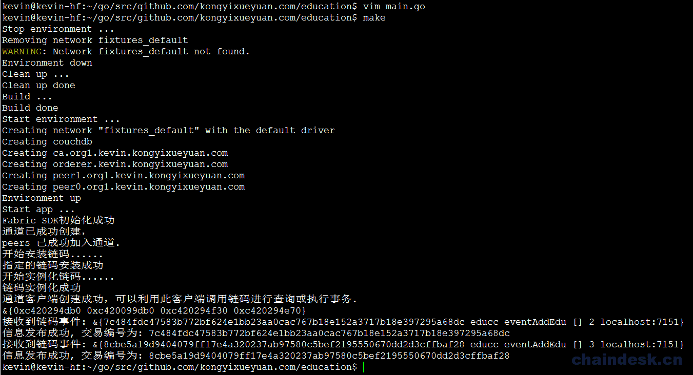
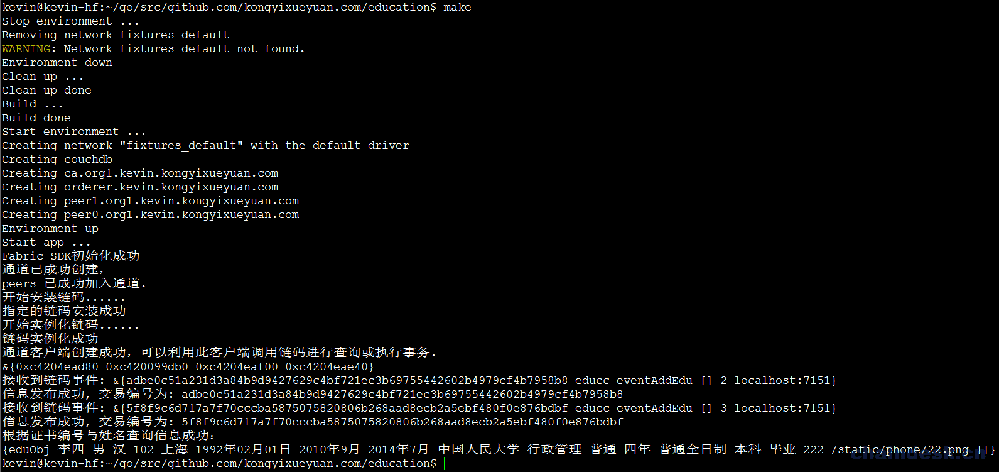
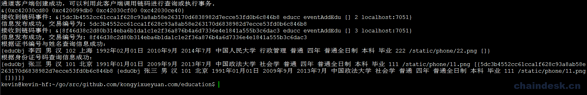
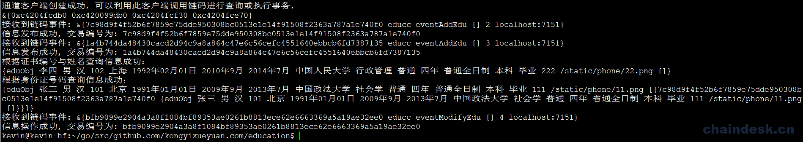
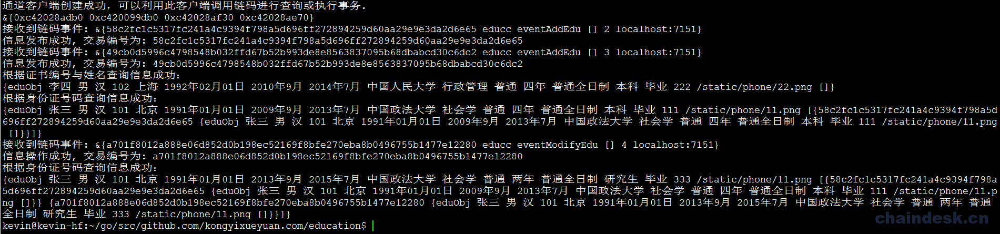
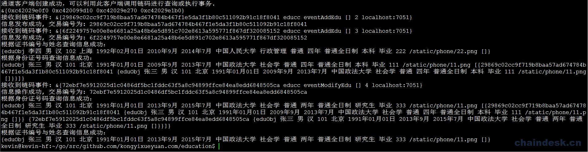

# 第三章 业务层实现

# 3 业务层实现

## 3.1 事件处理

在项目根目录下创建一个 `service` 目录作为业务层，在业务层中，我们使用 `Fabric-SDK-Go` 提供的接口对象调用相应的 API 以实现对链码的访问，最终实现对分类账本中的状态进行操作。

```go
$ cd $GOPATH/src/github.com/kongyixueyuan.com/education
$ mkdir service 
```

在 `service` 目录下创建 `domain.go` 文件并进行编辑， 声明一个结构体及对事件相关而封装的源代码

```go
$ vim service/domain.go 
```

`domain.go` 文件完整内容如下：

```go
/**
  @Author : hanxiaodong
*/
package service

import (
    "github.com/hyperledger/fabric-sdk-go/pkg/client/channel"
    "fmt"
    "time"
    "github.com/hyperledger/fabric-sdk-go/pkg/common/providers/fab"
)

type Education struct {
    ObjectType    string    `json:"docType"`
    Name    string    `json:"Name"`        // 姓名
    Gender    string    `json:"Gender"`        // 性别
    Nation    string    `json:"Nation"`        // 民族
    EntityID    string    `json:"EntityID"`        // 身份证号
    Place    string    `json:"Place"`        // 籍贯
    BirthDay    string    `json:"BirthDay"`        // 出生日期
    EnrollDate    string    `json:"EnrollDate"`        // 入学日期
    GraduationDate    string    `json:"GraduationDate"`    // 毕（结）业日期
    SchoolName    string    `json:"SchoolName"`    // 学校名称
    Major    string    `json:"Major"`    // 专业
    QuaType    string    `json:"QuaType"`    // 学历类别
    Length    string    `json:"Length"`    // 学制
    Mode    string    `json:"Mode"`    // 学习形式
    Level    string    `json:"Level"`    // 层次
    Graduation    string    `json:"Graduation"`    // 毕（结）业
    CertNo    string    `json:"CertNo"`    // 证书编号

    Photo    string    `json:"Photo"`    // 照片

    Historys    []HistoryItem    // 当前 edu 的历史记录
}

type HistoryItem struct {
    TxId    string
    Education    Education
}

type ServiceSetup struct {
    ChaincodeID    string
    Client    *channel.Client
}

func regitserEvent(client *channel.Client, chaincodeID, eventID string) (fab.Registration, <-chan *fab.CCEvent) {

    reg, notifier, err := client.RegisterChaincodeEvent(chaincodeID, eventID)
    if err != nil {
        fmt.Println("注册链码事件失败: %s", err)
    }
    return reg, notifier
}

func eventResult(notifier <-chan *fab.CCEvent, eventID string) error {
    select {
    case ccEvent := <-notifier:
        fmt.Printf("接收到链码事件: %v\n", ccEvent)
    case <-time.After(time.Second * 20):
        return fmt.Errorf("不能根据指定的事件 ID 接收到相应的链码事件(%s)", eventID)
    }
    return nil
} 
```

## 3.2 业务层调用链码实现添加状态

在 `service` 目录下创建 `eduService.go` 文件

```go
$ vim service/eduService.go 
```

在 `eduService.go` 文件中编写内容如下，通过一个 `SaveEdu` 函数实现链码的调用，向分类账本中添加状态的功能：

```go
/**
  author: hanxiaodong
  QQ 群（专业 Fabric 交流群）：862733552
 */
package service

import (
    "github.com/hyperledger/fabric-sdk-go/pkg/client/channel"
    "encoding/json"
)

func (t *ServiceSetup) SaveEdu(edu Education) (string, error) {

    eventID := "eventAddEdu"
    reg, notifier := regitserEvent(t.Client, t.ChaincodeID, eventID)
    defer t.Client.UnregisterChaincodeEvent(reg)

    // 将 edu 对象序列化成为字节数组
    b, err := json.Marshal(edu)
    if err != nil {
        return "", fmt.Errorf("指定的 edu 对象序列化时发生错误")
    }

    req := channel.Request{ChaincodeID: t.ChaincodeID, Fcn: "addEdu", Args: [][]byte{b, []byte(eventID)}}
    respone, err := t.Client.Execute(req)
    if err != nil {
        return "", err
    }

    err = eventResult(notifier, eventID)
    if err != nil {
        return "", err
    }

    return string(respone.TransactionID), nil
} 
```

**测试添加状态**

编辑 `main.go` 文件

```go
$ vim main.go 
```

`main.go` 中创建两个 `edu` 个对象，并调用 `SaveEdu` 函数，内容如下：

```go
/**
  author: hanxiaodong
 */

package main

import (
    [......]
    "github.com/kongyixueyuan.com/education/service"
)

[......]
    //===========================================//

    serviceSetup := service.ServiceSetup{
        ChaincodeID:EduCC,
        Client:channelClient,
    }

    edu := service.Education{
        Name: "张三",
        Gender: "男",
        Nation: "汉",
        EntityID: "101",
        Place: "北京",
        BirthDay: "1991 年 01 月 01 日",
        EnrollDate: "2009 年 9 月",
        GraduationDate: "2013 年 7 月",
        SchoolName: "中国政法大学",
        Major: "社会学",
        QuaType: "普通",
        Length: "四年",
        Mode: "普通全日制",
        Level: "本科",
        Graduation: "毕业",
        CertNo: "111",
        Photo: "/static/phone/11.png",
    }

    edu2 := service.Education{
        Name: "李四",
        Gender: "男",
        Nation: "汉",
        EntityID: "102",
        Place: "上海",
        BirthDay: "1992 年 02 月 01 日",
        EnrollDate: "2010 年 9 月",
        GraduationDate: "2014 年 7 月",
        SchoolName: "中国人民大学",
        Major: "行政管理",
        QuaType: "普通",
        Length: "四年",
        Mode: "普通全日制",
        Level: "本科",
        Graduation: "毕业",
        CertNo: "222",
        Photo: "/static/phone/22.png",
    }

    msg, err := serviceSetup.SaveEdu(edu)
    if err != nil {
        fmt.Println(err.Error())
    }else {
        fmt.Println("信息发布成功, 交易编号为: " + msg)
    }

    msg, err = serviceSetup.SaveEdu(edu2)
    if err != nil {
        fmt.Println(err.Error())
    }else {
        fmt.Println("信息发布成功, 交易编号为: " + msg)
    }    

    //===========================================//

} 
```

执行 `make` 命令运行应用程序

```go
$ make 
```

执行后如下图所示：



## 3.3 调用链码实现根据证书编号与名称查询状态

通过上面的 `SaveEdu(edu Education)` 函数，实现了向分类账本中添加状态，那么我们还需要实现从该分类账本中根据指定的条件查询出相应的状态，编辑 `service/eduService.go` 文件，向该文件中添加实现根据证书编号与姓名查询状态的相应代码。

```go
$ vim service/eduService.go 
```

定义一个 `FindEduByCertNoAndName` 函数，接收两个字符串类型的参数，分别代表证书编号与姓名，该函数实现通过调用链码而实现查询状态的功能，该函数完整代码如下：

```go
[......]

func (t *ServiceSetup) FindEduByCertNoAndName(certNo, name string) ([]byte, error){

    req := channel.Request{ChaincodeID: t.ChaincodeID, Fcn: "queryEduByCertNoAndName", Args: [][]byte{[]byte(certNo), []byte(name)}}
    respone, err := t.Client.Query(req)
    if err != nil {
        return []byte{0x00}, err
    }

    return respone.Payload, nil
} 
```

**测试根据证书编号与名称查询状态**

编辑 `main.go` 文件

```go
$ vim main.go 
```

在 `main.go` 文件中添加调用代码如下内容：

```go
[......]

    // 根据证书编号与名称查询信息
    result, err := serviceSetup.FindEduByCertNoAndName("222","李四")
    if err != nil {
        fmt.Println(err.Error())
    } else {
        var edu service.Education
        json.Unmarshal(result, &edu)
        fmt.Println("根据证书编号与姓名查询信息成功：")
        fmt.Println(edu)
    }

    //===========================================//

} 
```

执行 `make` 命令运行应用程序

```go
$ make 
```

执行后如下图所示：



## 3.4 调用链码实现根据身份证号码查询状态

通过上面的 `FindEduByCertNoAndName(certNo, name string)` 函数，实现从该分类账本中根据指定的证书编号与姓名查询出相应的状态，下面我们来实现根据身份证号码查询状态的功能，编辑 `service/eduService.go` 文件，向该文件中添加实现根据 key 查询状态的相应代码。

```go
$ vim service/eduService.go 
```

定义一个 `FindEduInfoByEntityID` 函数，接收一个字符串类型的参数，代表身份证号码（key），该函数实现通过调用链码而实现查询状态的功能，该函数完整代码如下：

```go
[......]

func (t *ServiceSetup) FindEduInfoByEntityID(entityID string) ([]byte, error){

    req := channel.Request{ChaincodeID: t.ChaincodeID, Fcn: "queryEduInfoByEntityID", Args: [][]byte{[]byte(entityID)}}
    respone, err := t.Client.Query(req)
    if err != nil {
        return []byte{0x00}, err
    }

    return respone.Payload, nil
} 
```

**测试根据身份证号码查询状态**

编辑 `main.go` 文件

```go
$ vim main.go 
```

在 `main.go` 文件中添加调用代码如下内容：

```go
[......]

    // 根据身份证号码查询信息
    result, err = serviceSetup.FindEduInfoByEntityID("101")
    if err != nil {
        fmt.Println(err.Error())
    } else {
        var edu service.Education
        json.Unmarshal(result, &edu)
        fmt.Println("根据身份证号码查询信息成功：")
        fmt.Println(edu)
    }

    //===========================================//

} 
```

执行 `make` 命令运行应用程序

```go
$ make 
```

执行后如下图所示：



## 3.5 调用链码实现修改/添加信息状态

在一些情况下，有些人才会利用工作的业余时间进修，从而提升学历层次，我们必须要考虑到这种情况，所以需要应用程序实现对已有人员的信息进行编辑的功能；但是编辑并不能将之前的学历信息删除，而是在保留之前状态的基础之上添加新的状态，区块链技术很好的帮我们解决了这个问题。编辑 `service/eduService.go` 文件，向该文件中添加修改已有状态的相关代码。

```go
$ vim service/eduService.go 
```

定义一个 `ModifyEdu` 函数，接收一个 `Education` 类型的对象，该函数实现通过调用链码而实现对已存在的状态进行修改（添加新信息）的功能，该函数完整代码如下：

```go
[......]

func (t *ServiceSetup) ModifyEdu(edu Education) (string, error) {

    eventID := "eventModifyEdu"
    reg, notifier := regitserEvent(t.Client, t.ChaincodeID, eventID)
    defer t.Client.UnregisterChaincodeEvent(reg)

    // 将 edu 对象序列化成为字节数组
    b, err := json.Marshal(edu)
    if err != nil {
        return "", fmt.Errorf("指定的 edu 对象序列化时发生错误")
    }

    req := channel.Request{ChaincodeID: t.ChaincodeID, Fcn: "updateEdu", Args: [][]byte{b, []byte(eventID)}}
    respone, err := t.Client.Execute(req)
    if err != nil {
        return "", err
    }

    err = eventResult(notifier, eventID)
    if err != nil {
        return "", err
    }

    return string(respone.TransactionID), nil
} 
```

**测试修改状态**

编辑 `main.go` 文件

```go
$ vim main.go 
```

在 `main.go` 文件中添加调用代码如下内容：

```go
[......]

    // 修改/添加信息
    info := service.Education{
        Name: "张三",
        Gender: "男",
        Nation: "汉",
        EntityID: "101",
        Place: "北京",
        BirthDay: "1991 年 01 月 01 日",
        EnrollDate: "2013 年 9 月",
        GraduationDate: "2015 年 7 月",
        SchoolName: "中国政法大学",
        Major: "社会学",
        QuaType: "普通",
        Length: "两年",
        Mode: "普通全日制",
        Level: "研究生",
        Graduation: "毕业",
        CertNo: "333",
        Photo: "/static/phone/11.png",
    }
    msg, err = serviceSetup.ModifyEdu(info)
    if err != nil {
        fmt.Println(err.Error())
    }else {
        fmt.Println("信息操作成功, 交易编号为: " + msg)
    }

    //===========================================//

} 
```

执行 `make` 命令运行应用程序

```go
$ make 
```

执行后如下图所示：



**查看修改之后的状态（根据身份证号码）**

状态被修改之后，我们为了确认是否真正修改成功，所以需要调用已经编写好的 `FindEduInfoByEntityID(entityID string)` 函数实现查询详情的功能。

编辑 `main.go` 文件

```go
$ vim main.go 
```

在 `main.go` 文件中添加调用代码如下内容：

```go
[......]

    // 根据身份证号码查询信息
    result, err = serviceSetup.FindEduInfoByEntityID("101")
    if err != nil {
        fmt.Println(err.Error())
    } else {
        var edu service.Education
        json.Unmarshal(result, &edu)
        fmt.Println("根据身份证号码查询信息成功：")
        fmt.Println(edu)
    }

    //===========================================//

} 
```

执行 `make` 命令运行应用程序

```go
$ make 
```

执行后如下图所示：



从终端的输出结果中可以看到详情信息已从分类账本中被成功查询，接下来我们使用根据证书编号与姓名查询修改之后的信息，看看是否正确

**查看修改之后的最新状态（根据证书编号与姓名）**

状态被修改之后，我们为了确认是否真正修改成功，所以需要调用已经编写好的 `FindEduInfoByEntityID(entityID string)` 函数实现查询详情的功能。

编辑 `main.go` 文件

```go
$ vim main.go 
```

在 `main.go` 文件中添加调用代码如下内容：

```go
[......]

    // 根据证书编号与名称查询信息
    result, err = serviceSetup.FindEduByCertNoAndName("333","张三")
    if err != nil {
        fmt.Println(err.Error())
    } else {
        var edu service.Education
        json.Unmarshal(result, &edu)
        fmt.Println("根据证书编号与姓名查询信息成功：")
        fmt.Println(edu)
    }

    //===========================================//

} 
```

执行 `make` 命令运行应用程序

```go
$ make 
```

执行后如下图所示：

