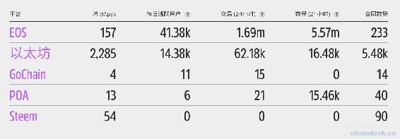
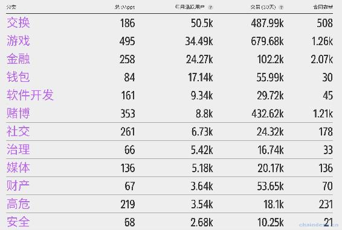
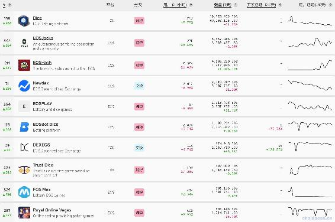

# 一、.1 EOS DApp 发展现状与前景

> 很多人认为，DApp 开启了区块链 3.0 时代。近期网上流行着一种关于区块链进化史的说法，区块链 1.0 是比特币，2.0 是以太坊，3.0 是 DApp 时代。那 DApp 到底是什么？它将会是区块链的未来趋势吗？
> 
> 本章我们主要来探讨以下三个内容：
> 
> *   什么是 DApp
> *   DApp 的发展现状
> *   DApp 的未来前景

## 一、什么是 DApp

DApp 全称 Decentralized Application，翻译过来就是去中心化应用，也称分布式应用。

DApp=D+App，简单说，就和我们的手机 APP 一样，两者的原理类似，DApp 之于区块链，类似手机 App 之于 IOS 和 Android。App 是基于 IOS 系统/Android 系统的应用，而 DApp 是基于区块链底层公有链（如以太坊、EOS）建立的应用。可以理解为是升级版的 App。

**那么 DApp 与传统的 App 有哪些优点呢？**

*   App 运行在中心化的服务器上，一旦服务器出现故障，用户在 App 的数据很容易丢失、被盗、篡改，经常会出现类似 FaceBook、Google、京东、携程的用户数据泄露事件。

*   而 DApp 运行在去中心化的网络上，网络中不存在中心化的节点可以完整的控制 DApp，基本不会出现数据丢失、被盗、篡改的情况出现。

*   DApp 上所有的数据进行加密后存储在去中心化的区块链应用平台上，数据的安全性能更高，能够有效防止信息篡改和伪造，同时很大程度上提高了项目的稳定性，降低了宕机风险和运营成本。

## 二、DApp 的发展现状

当前是 2019 年 1 月份，据 StateOfTheDApps 数据分析，随着高频结算的竞猜类 DApp 在 EOS 上大火，EOS 上线至今 DApp 交易额达 140 亿流水，以太坊、EOS 等平台的 Dapp 的总数量达到 2432 个。

EOS 主网上线不久，DApp 交易额迅速超过 ETH，而 ETH 的 DApp 交易额自 Fomo3d 后一直处于相对低迷状态，EOS 单日交易额达到 5.57 百万，而以太坊是 16.48 千，相差三十多倍。

以太坊仍然拥有所有此类平台中最活跃的开发人员社区。与此同时，尽管 EOS 网络承载的项目数量不如以太坊，但是用户量却远超以太坊三倍，显然 EOS 是目前为止最受实际用户欢迎的。

DApp 涉及到了众多领域，其中交易额最高的前三种类型是游戏、交易所、赌博等，人家常将赌博叫做博彩、竞猜或者资金盘。

EOS DApp 中最近七天的交易额前三名都属于博彩类型，前十名中博彩类型占据了八个，大多数 EOS 通过博彩 DApp 进行流通交易，其中排名第一的 Dice 交易额高达 4905 万美元。

考虑到 EOS 网络比以太坊每秒能够处理更多的交易，这种技术优势导致了更好的用户体验，这可能是基于 EOS 的 Dapp 拥有更多用户的原因。

## 三、DApp 的未来前景

手机将人们带进了移动互联网时代，App 丰富了我们的移动互联网生活。从点外卖、看电影、打车、单车、网购、社交、办公、资讯、视频......在过去几年，App 经济的兴起改变人们众多的生活习惯，但 App 对我们的影响也仅止于“改造”，谈不上“重塑”或者颠覆。

虽说 DApp 还没有达到绝大多数人手机都有安装的程度，但 DApp 的发展已经在路上。如果关注链圈的爱好者，相信都用过数字货币钱包如 Tokenpacket、imToken 等，其实钱包就是一款 DApp。

DApp 被大多数人看好的方向在于和物联网、人工智能、共享经济的结合。

比如无人驾驶汽车应用，传统上，一辆无人驾驶汽车得到路况信息需要先传输到中心化服务器，然后服务器再传输给另一辆无人驾驶汽车，若出现服务器故障或者传输网络延迟等情况，汽车之间没有及时通信，路况又是随时变化的，所以就很容易出现事故。如果汽车与汽车能直接通信，一辆无人驾驶汽车实时将路况信息写入区块链，其他无人驾驶汽车则可及时获取路况信息并及时调整，这样要好于中心化管理。

区块链带给了我们巨大的想象空间，显然，世界各地的开发人员都对去中心化编程架构所创造的新机会感到兴奋。然而，这些应用本身的用户数量与更成熟的应用的用户数量相差甚远。当然，这是可以理解的，因为即使是在 EOS 和以太坊等网络上运行时间最长的 dapp 项目也只有几年的历史。

尽管如此，还有其他一些因素阻碍了 Dapp 的大规模采用。首先，目前在 EOS、以太坊或其他支持智能合约的平台上托管的应用程序存在很大的进入障碍。用户必须首先拥有相关的数字货币才能运行任何 Dapps。它不像访问谷歌 Play 或苹果商店然后点击“下载”那么简单。期望一个普通的手机或计算机用户首先注册一个他们可能从未听说过的加密货币交易所，然后购买一些 ETH、EOS，在目前显然是不现实的。

当前 DApp 的实际使用数量与预期还存在一定差距，大家普遍猜测 DApp 的使用率下降是由于加密货币熊市导致的。虽然 DApps 目前看起来很惨淡，但市场还是对 DApp 充满期待。

目前 DApp 离真正的大规模使用还有很长一段距离，现阶段行业需要潜心研究技术的人才,竭尽全力做好产品及用户体验，设法使 DApp 变得像手机 APP 那样易于使用

伴随着区块链技术进一步发展、公链基础设施的不断完善、市场行情的回暖，DApp 迎来爆发式发展将会是水到渠成的事情。

**版权声明：博客中的文章版权归博主所有，转载请联系作者（微信：lixu1770105）。**