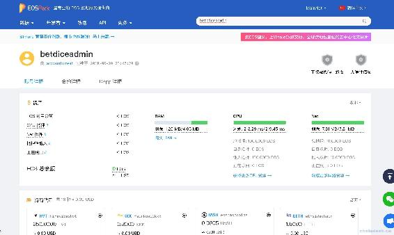
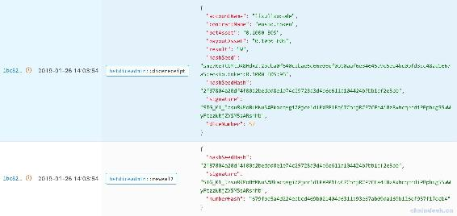

# 一、.2 分析目前最火爆的 DICE 游戏的合约运行原理

> 我们主要来研究火爆的 BetDice 社区中的 Dice 游戏的运行原理，也是站在了它的通证经济和安全基础之上进行学习。
> 
> 本章我们主要来探讨以下四个内容：
> 
> *   最火的 BetDice 是什么
> *   使用 TokenPocket 钱包下注
> *   查看 betdiceadmin 合约账号数据
> *   分析 betdiceadmin 合约运行原理

## 一、最火的 BetDice 是什么

DICE，翻译为中文就是掷骰子，传统的掷骰子游戏是比大小或是赌单双的玩法。我们这里学习的 DICE 游戏玩法是押注 2～99 的某一个数 n，立即开奖，当随机结果小于 n 则为赢，可能出现的结果范围是 1～100。

所以该 DICE 游戏合约并非是 EOS 官方系统所提供的 dice 合约。官方 dice 它是一个双人掷骰子游戏的玩法，感兴趣的可以到[github](https://github.com/EOSIO/eos/tree/v1.3.0/contracts/dice)上查看官方 dice 实现。相比之下，游戏商家升级 dice 的玩法就是为了实时的为玩家开奖，提高效率。

根据上一章的内容我们可以看到近一周交易量排名第一的就是博彩类的 Dice 游戏，它由 BetDice Team 开发，为了便于区分下文我将称作为 BetDice。该社区并非只有 DICE 一款游戏，上线初期另外还有 Baccarat（百家乐）、Lottery（奖池）、Luck Draw（幸运抽奖）、Exchange（交易所）等游戏。如今已经上线众多游戏，下图则是 BetDcie 中使用 Scatter 钱包登录后的 Dice 游戏页面。


由于 BetDice 的合约账号资金量较大，经过黑客多次攻击获取大量资金后，BetDice Team 逐步进行安全升级，防止了当前所有的黑客攻击方式。再不久的未来，也可能避免不了再被攻击，这就需要开发者不断的完善合约逻辑，来防范黑客攻击，降低资金损失。对于黑客攻击方式全面的介绍在后面的章节中我们会再来更详细的学习。

## 二、使用 TokenPocket 钱包下注

大家可以到[TokenPocket 官网](https://www.mytokenpocket.vip)下载 App，没有账号的同学也可以根据 App 的提示完成账号的创建。本教程的重点是 DApp 合约开发，对于不了解 EOS 钱包和 EOS 账户体系的同学可以先熟悉下相关知识[《EOS 钱包实战开发》](https://www.chaindesk.cn/witbook/2)。

### 第一步：使用钱包下注

鉴于浏览器插件 Scatter 钱包对于大多数新人来说比较陌生，这里我将使用常见的 TokenPocket 钱包手机 App 演示下注这一步骤。


点击下注后需要玩家对转账给 betdiceadmin 的 action 进行签名，注意转账时传递的几个参数，有必要解释下这各个参数的含义

*   quantity：转账数额，这里就是下注金额“0.1000 EOS”

*   memo：转账备注，这里是下注的一些关键数据：“action:bet,seed:smz7KeTt1MtUX8HdxZ,rollUnder:96,ref:gu2denbzgmgs”，其中包含的信息有

    *   action：表示 BetDice 的哪一个游戏
    *   seed：种子，通过它作为生成随机数的种子，这将是我们合约开发的重点，也是被黑客利用的关键数据
    *   rollUnder：押注的数，结果小于它则玩家就赢了
    *   ref：推荐人，对于我每次下注无论输赢都会给该推荐人提成
*   to：收款人，可知 betdiceadmin 就是 Dice 游戏的合约账号，接下来我们就需要对它的交易进行详细的分析

*   from：转账人，玩家自己

### 第二步：等待开奖

确认后需要输入该账号的密码，然后就等待开奖结果了。大概两秒左右的时间接收到了如下的结果，为 57，小于我押注的 96，因此我赢了，可见我的余额从 31.1085 EOS 增加到了 31.1121 EOS，即赢了 0.0036 EOS。这其中的具体算法在开发中我们再详细说明。


### 思考

前面我们演示了如何下注，可见该游戏流程非常简单，但是实现整套流程却非容易。这里先抛出几个问题，下面我们一步步分析 Dice 合约作了什么操作，并做出解答

1.  给合约账号 betdiceadmin 转账如何实现了玩家的下注？
2.  玩家给 betdiceadmin 转账，它是如何知道的？
3.  隔了两秒才收到开奖结果，难道与合约交互这么耗时吗？
4.  前端收到的结果是通过什么方式获取到的，是转账合约返回的结果、前端查询链上数据、后端查询链上数据推送给的前端？

## 三、查看 betdiceadmin 合约账号数据

我们通过 EOS 查看器查询 betdiceadmin 合约账号对押注作了哪些操作。这里博主使用的是[EOSPark 官网](https://eospark.com)。



细心的你可能看到了 betdiceadmin 账号余额为 0，开什么玩笑，没钱怎么玩？难道刚被黑客洗完了吗？

betdiceadmin 收到转账后第一时间转给了 betdicehouse，玩家赢了，就会从 betdicehouse 账号转出。


可见资金还是不少了，可用余额 37 万美元。

再查看 betdiceadmin 合约详情如下


在此可以查询该合约在链上的所有数据，同时可以调用操作接口，但是一般玩家没有权限调用接口。

## 四、分析 betdiceadmin 合约运行原理

### 1\. 查看玩家转账交易

再回到下注转账的时候，可以在 EOSPark 查看器上查询到玩家的转账记录。


再次点击该交易左侧的交易 Hash 值“5d567...”，如下图


可见该交易中只有一个 aciton，并且没有内联交易。该数据与 TokenPocket 钱包下注时所传递的参数一致。

那么问题来了，是什么触发了下注和开奖呢？

### 2\. 查看后端开奖交易

在查看器上继续查看上面转账交易的最近几条交易中，发现了如下两个 action，可以发现时间间隔了 2 秒。



这两条交易是干嘛的呢？我们先根据 action 猜猜，reveal 即揭示，receipt 即收据，因此推断就是根据这两个 action 为玩家“lixulixucode”账号进行开奖。

根据左侧的交易 Hash 可知它们属于同一个交易，点击后显示如下


可见 dicereceipt action 属于 reveal2 action 的内联交易，也就是说在 reveal2 方法的内部调用了 dicereceipt 方法，这就叫做内联交易，在后面我们详细介绍内联交易的作用和用法。另外，reveal2 action 还有另外三个内联交易。其中 onbet action 又有 5 个内联交易，是对玩家押注的资金进行抽成分配的调用，可忽略。

根据上面的追踪发现商家只是触发了 reveal2 的执行，在调用方法中也传递了种子，即 hashSeedHash，另外还传递了 nmberHash，和 signature 签名。reveal2 方法中根据种子，使用内部的特定算法计算出了结果为 57，然后将相关数据传递给 dicereceipt 方法，预测在该方法内部将数据存入数据库。

### 3\. 抓包 TokenPocket 钱包中的 Dice 游戏数据

抓取最新的所有押注数据


可见后端通过 webscoket 返回最新数据，数据结构如下

```js
["betReceipt", {
    "type": "betReceipt",
    "payload": {
        "receipt": {
            "accountName": "xwdw52255215",
            "betAsset": "0.2000 EOS",
            "now": 1542332951,
            "payoutAsset": "0.2814 EOS",
            "diceNumber": 25,
            "seed": "29TKbBbWT4gxPiPjVS",
            "rollUnder": 71
        }
    }
}]
```

其它无关接口数据就不作介绍了。

### 4\. 结论

前后端与合约交互的整个流程的步骤大致如下：

*   前端通过钱包发送转账交易到区块链
*   合约监听转账，并记录转账的相关数据，即玩家押注参数
*   后端调用合约的 reveal2 action 并传递种子，与前端传递的种子共同生成随机数，即开奖结果
*   后端查询到有新的押注数据，则通过 webscoket 推送给前端

其中还有很多细节，咱们在代码中再来细细分析。

**版权声明：博客中的文章版权归博主所有，转载请联系作者（微信：lixu1770105）。**