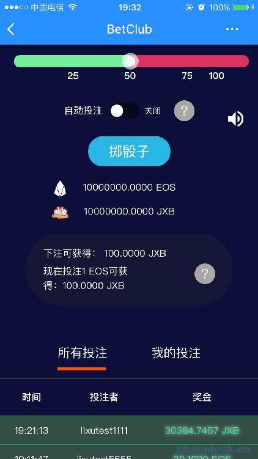

# 2.1 DICE 游戏项目——UI 设计图

> 下面是项目运行后的效果图，也可当作是 UI 设计图，后端和前端开发的接口需按照 UI 设计图的需求进行设计。
> 
> 下面包含两部分：
> 
> *   UI 设计图——PC 端
> *   UI 设计图——移动端(TokenPocket 钱包 App)

## UI 设计图——PC 端

PC 端是基于 Google 浏览器，且须安装 Scatter 钱包插件，在后续我们学习如何使用 Scatter 钱包插件，并基于它开发调试 DApp。

### 首页

### 所有投注

### 奖金——分红池

### 奖金——质押

### 奖金——分红记录

### 奖金——我的余额

### VIP

### 邀请好友

### 玩法介绍

### 调用合约触发的弹框

#### 掷骰子投注 EOS

#### 赎回代币

#### 分红余额提现

## UI 设计图——移动端(TokenPocket 钱包 App)

移动端的设计图下面以 TokenPocket 钱包 App 为例截的效果图，在后续我们会学习如何在 TokenPocket 钱包上开发调试 DApp。

### 首页

 

### 掷骰子投注 EOS

### 首页功能栏

### 排行榜

### 奖金——分红池

**版权声明：博客中的文章版权归博主所有，转载请联系作者（微信：lixu1770105）。**