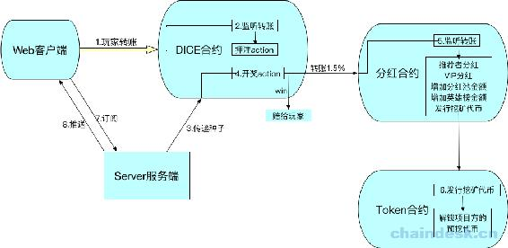

# 2.3 DICE 游戏项目——架构设计

本次项目的前端已经开发完成，我们只需要开发合约、后端即可。所以我们开发的前端 demo 只要能和后端、合约正常交互即可。

合约与后端开发测试完成后，使用完整的 React 前端与之交互。

### 合约

合约将会有三个，它们相互独立，且独立部署运行：

*   dice：掷骰子游戏
*   dicetoken：自己发行的代币 JXB，可用于玩家押注、质押(获取分红)、通证经济模型设计
*   pool：奖池，奖励玩家，用于社区通证经济模型激励

另外，在开发的时候，我们使用的 EOS 本地节点，须我们自己发行 eos，所以还会用到 eosio.token 合约。

### NodeJS 后端

NodeJS 后端也会有三个项目，它们相互独立：

*   diceContract：所有的合约都在该项目中开发，另外包含部署脚本、测试脚本等。
*   webServer：专门与前端交互，支持 RESTful API、socket.io，用于前端查询数据、后端主动推送合约新数据。
*   diceServer：专门与合约交互，主要是调用合约开奖方法。

独立 webServer、diceServer 这两个项目的目的是因为 diceServer 中需要合约账号的私钥签名开奖 action，为了私钥安全，使它不与前端交互，因此与前端交互的功能独立到 webServer 项目中。

### 架构设计

下面介绍合约内部的调用关系，以及它们如何与前端、后端交互。

1.  Web 前端：使用 Scatter API 与调用 Token 合约转账，转给 DICE 合约账号，并在 memo 中说明玩家押注的数、推荐者等。
2.  DICE 合约：监听转账通知，若是玩家押注转的账，则记录数据到链上数据库。
3.  NodeJS 后端：使用 openssl 随机生成种子，使用 EOSJS 调用 DICE 合约开奖 action。
4.  DICE 合约：开奖 action 中根据种子生成随机数，作为玩家的开奖号码，并记录到链上数据库公开。另外，将押注额的 1.5%作为利润转给分红池子合约账号。
5.  分红合约：监听到转账通知时，给玩家的推荐者、VIP 分红，增加分红池、英雄榜分红金额。另外调用 Token 合约挖矿发行代币的 action。
6.  Token 合约：挖矿发行代币的 action，根据发行量计算挖矿所得金额，会逐渐减半。另外当挖矿的代币达到一定数量后，逐步解锁项目方的预挖代币。
7.  Web 前端：使用 Socket.IO 订阅服务。
8.  NodeJS 后端：查询链上最新的玩家押注数据，使用 Socket.IO 推送给前端显示。

**版权声明：博客中的文章版权归博主所有，转载请联系作者（微信：lixu1770105）。**