# 三、.1 EOS 开发环境搭建

> EOS DApp 合约开发，可以选择以下三种网络进行开发：
> 
> *   主网
> *   Jungle 测试网络
> *   本地网络
> 
> 咱们在开发阶段一般选择测试网络和本地网络皆可，测试完成后在部署到主网。这里我们先选择在本地网络上进行开发，因为在 Jungle 测试网络中不支持 wallet 的 RPC 接口，因为它作为一个公共的服务节点，是不可能帮助大家管理私钥的，那样会非常不安全，大家都会共用相同的钱包和私钥。最后我们将使用本地搭建的 keosd 服务管理钱包，并连接到 Jungle 测试网络和 EOS 主网中。

**本教程的开发环境选择为：Ubuntu 16.04、eos V1.2.6。**接下来开始搭建 EOS 本地环境将它部署在单个主机。

EOS 环境安装可以使用以下两种方式：

*   docker 配置：熟悉 Docker 的同学使用 Docker 配置就比较快捷了，可以快速安装并启动节点。
*   自动编译和安装的脚本：适用于大多数开发人员，脚本已经编写好，直接运行即可安装。

**方式一：docker 安装 eos 节点环境**

*   docker 安装的教程大家直接查看[docker 配置官方教程](https://developers.eos.io/eosio-home/v1.7.0/docs/getting-the-software)。
*   需要另外安装 eosio.cdt 编译工具。
*   装好环境后再去执行第五、六步骤，创建钱包、部署 eosio.token 合约。

**方式二：脚本安装 eos 节点环境**

*   参考下文即可。

## 一、下载和编译 EOS

获取 EOS 指定版本源码及其所有子模块，若不加入--recursive 参数，则不能下载 EOS 关联的子项目。指定版本源码使用`-b`指定版本号。

```js
git clone https://github.com/EOSIO/eos -b v1.2.6 --recursive 
```

编译源码生成可执行文件

```js
cd eos
./eosio_build.sh 
```

编译时间比较长，需一两个小时不等，若编译顺利成功后，则会看到如下显示


在编译的过程中很有可能会出现各种错误，由于系统、EOS 版本的差异出现的错误也会不一样，下面列出了常见的多种错误的解决办法。

> ## 编译时报错的解决办法

### 1\. 物理内存 RAM 不足

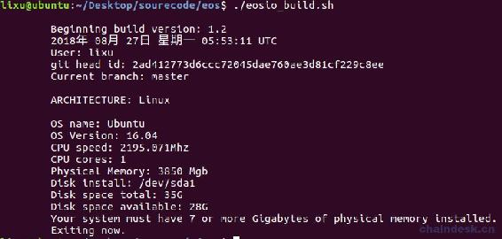

**解决办法：**

修改文件源码`eos/scripts/eosio_build_ubuntu.sh`中的`if [ "${MEM_MEG}" -lt 7000 ]; then`，将 7000 改为自己系统的内存大小，如 4000，如还报错，那么继续减小。

### 2\. 可用内存不足

```js
You must have at least 20GB of available storage to install EOSIO.
Exiting now. 
```

**解决办法：**

在文件源码`eos/scripts/eosio_build_ubuntu.sh`中增加如下一行代码代码前面。

```js
DISK_MIN=1 
```

### 3\. 无法下载（MongoDB 等）

无法下载 MongoDB 等是由于翻墙配置的问题。

**解决办法：**

Mac 的 Shadowsocks 使用“PAC 自动模式”，另外偏好设置配置如下

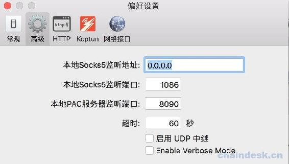

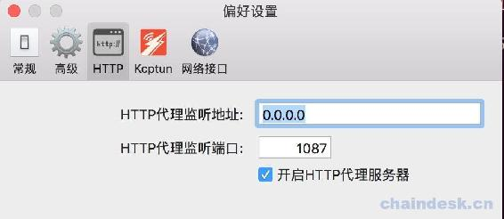

Ubuntu 的配置如下，其中的 192.168.1.116 是 Mac 的局域网地址。

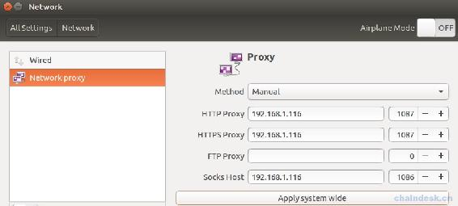

### 4\. 不能创建/tmp/llvm-compiler 文件夹

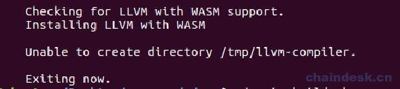

**解决办法：**

进入`/tmp`目录，删除`llvm-compiler`文件夹即可。

## 二、安装 EOSIO

安装所有依赖库并构建 EOSIO，使用如下命令

```js
sudo ./eosio_install.sh 
```

> 若出现如下错误`file INSTALL cannot make directory "/usr/local/eosio/etc/eosio"`，加上 sudo 即可。
> 
> 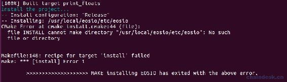

安装成功后的效果如下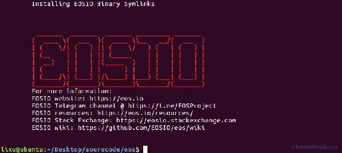

安装完在根目录新增了 build 文件夹，最后 EOS 的目录结构如下。

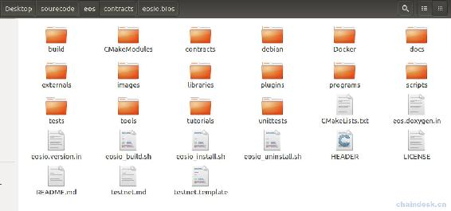

## 三、配置 Nodeos 与 Keosd

### 1\. 配置 Nodeos

`Nodeos`是用来运行节点的 EOSIO 程序。执行一下步骤进行配置：

*   找到如下 config.ini 文件的位置，然后打开 config.ini 文件

    *   Mac OS: `~/Library/Application\ Support/eosio/nodeos/config/config.ini`
    *   Linux: `~/.local/share/eosio/nodeos/config/config.ini`
*   将文中`enable-stale-production`所在行用`#`注释，`producer-name`所在行也用`#`注释

*   再最后面添加如下内容

```js
# Enable production on a stale chain, since a single-node test chain is pretty much always stale
enable-stale-production = true
# Enable block production with the testnet producers
producer-name = eosio
# Load the block producer plugin, so you can produce blocks
plugin = eosio::producer_plugin
# As well as API and HTTP plugins
plugin = eosio::chain_api_plugin
plugin = eosio::http_plugin
# This will be used by the validation step below, to view history
plugin = eosio::history_api_plugin 
```

### 2\. 配置 Keosd

`keosd` 是一个轻客户端钱包，负责管理钱包，以便在广播到网络之前保护密钥和签署交易，在本地计算机上运行并在本地存储您的私钥。

*   找到路径`~/eosio-wallet/config.ini`，然后打开 config.ini 文件
*   将第一行的服务地址设置为：`http-server-address = 127.0.0.1:8889`

## 四、启动节点

### 1\. 启动 nodeos

使用以下命令启动自己的单节点区块链：

```js
nodeos 
```

启动后应该每 0.5 秒生成一个块并有日志输出到终端，如下


如果报如下错误，则添加参数`--delete-all-blocks`

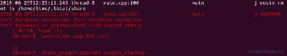

### 2\. 启动 keosd

可以直接输入命令`keosd`即可启动 keosd。

```js
$ keosd 
```

停止 keosd，因为`cleos`可以自动启动`keosd`，最终可能会有多个`keosd`正在运行。

```js
$ pkill keosd 
```

**注意：**当使用 RPC 接口时，需要另起 keosd，且端口与 nodeos 的不能一样。在使用 cleos 连接 wallet 时不用另外单独启动 keosd，它连接的是 nodeos 的 keosd 服务。若使用 cleos 时报如下错误，则须停止 keosd。

```js
lixu@ubuntu:~$ cleos wallet create
"/usr/local/eosio/bin/keosd" launched
Unable to connect to keosd, if keosd is running please kill the process and try again. 
```

## 五、使用 Cleos 创建钱包

下面我们使用命令行进行操作，需要使用到 Cleos，它是一个命令行工具，可以与 nodeos 公开的 REST API 进行交互，前提是 nodeos 需要配置`eosio :: chain_api_plugin`插件。

### 1\. 创建钱包

钱包是授权私钥的存储库，与区块链交互所必需的。通过如下命令创建钱包，可以通过`-n`参数指定创建的钱包名称。如果不指定钱包名称，则会创建一个名为`default`的默认钱包。

```js
cleos wallet create 
```

若是 1.2 以上版本，则需添加参数`--to-console`，输出如下

```js
lixu@ubuntu:~$ cleos wallet create --to-console
Creating wallet: default
Save password to use in the future to unlock this wallet.
Without password imported keys will not be retrievable.
"PW5J5SSUrU3sGBonpxjxbn9QXGPdpAsCkWowmjCcLyBPUu5Y5uvvv" 
```

成功后将会生成钱包的解锁密码，钱包 15 分钟不用将会自动锁定，注意一定要保存最后一行的密码，需要使用它解锁这个钱包。

### 2\. 解锁钱包

可以通过两种方式解锁钱包，推荐使用第二种方式解锁。

*   直接在命令行上添加密码参数，可以通过`-n`参数指定钱包名称

```js
cleos wallet unlock --password PW5JCEkVgzoBHUVCzbEwT9es6agM6NRPv6n21wgbzVaem6rWE4akS 
```

*   在交互模式下解锁

```js
cleos wallet unlock 
```

接着提示`password:`，然后输入密码即可

```js
lixu@ubuntu:~$ cleos wallet unlock

password: 
```

两种方式解锁成功后都会输出`Unlocked: default`。

**注意：**

> 直接在命令行上使用您的密码并将其记录到您的 bash 历史记录中通常是不安全的，因此最好在交互模式下解锁。
> 
> 出于安全考虑，最好在不使用钱包时使用命令`cleos wallet lock`将钱包锁定。

### 3\. 查看钱包列表

使用命令`cleos wallet lock`查看钱包列表，在列表中解锁后的钱包将在钱包名后面有`*`标记。

```js
lixu@ubuntu:~/Desktop/sourcecode/eos$ cleos wallet list
Wallets:
[
  "default *",
] 
```

### 4\. 导入密钥到钱包

上述步骤中启动的私有区块链是使用默认初始密钥创建的，必须将其加载到钱包中。

使用命令`cleos wallet import --private-key ******`。可以通过`-n`参数指定钱包名称

```js
lixu@ubuntu:~$ cleos wallet import --private-key 5KQwrPbwdL6PhXujxW37FSSQZ1JiwsST4cqQzDeyXtP79zkvFD3

imported private key for: EOS6MRyAjQq8ud7hVNYcfnVPJqcVpscN5So8BhtHuGYqET5GDW5CV 
```

注意：此时导入的私钥并不是创建钱包时生成的密码。

这个密钥`5KQwrPbwdL6PhXujxW37FSSQZ1JiwsST4cqQzDeyXtP79zkvFD3`在以下配置文件中可以查看

*   Mac OS: `~/Library/Application\ Support/eosio/nodeos/config/config.ini`
*   Linux: `~/.local/share/eosio/nodeos/config/config.ini`

打开文件后滑动到最下面即可查看到私钥。

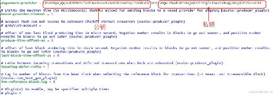

注意该秘钥对正是超级账户 eosio 的秘钥对。接下来就会用到 eosio 账户。

## 六、部署系统 eosio.token 代币合约

现在我们有一个拥有帐户 eosio 密钥的钱包`defualt`，确保钱包`defualt`处于解锁状态。eosio 账户是默认就有的，在系统启动的时候就自动被创建的超级用户。

### 1\. 创建 eosio.token 账号

那么接下来用 eosio 账户创建 eosio.token 系统账号。

```js
cleos create account eosio eosio.token EOS6MRyAjQq8ud7hVNYcfnVPJqcVpscN5So8BhtHuGYqET5GDW5CV 
```

### 2\. 部署 eosio.token 合约

使用 eosio.token 账号部署 eosio.token 合约。

```js
cleos set contract eosio.token build/contracts/eosio.token 
```

### 3\. 创建 EOS 代币

大家查找 eos 源码中在`contracts/eosio.token/eosio.token.hpp`文件中可以查看到 token 合约接口，如下

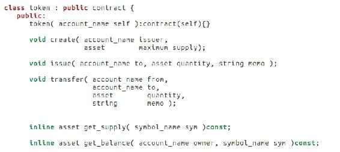

需要调用`create()`方法去创建 Token 合约。发行人可以对该 Token 合约执行一些特有的操作，例如质押、赎回、账号冻结、资金冻结、游戏挖矿、空投、召回和列入所有者白名单等功能。使用如下命令创建 Token 代币

```js
cleos push action eosio.token create '[ "eosio", "1000000000.0000 EOS"]' -p eosio.token@active 
```

此命令是通过`eosio.token`账户创建了一个 Token，发布者是`eosio`，Token 名为`EOS`，其精度为 4 位小数，发布的总量是 1000000000.0000 EOS。

### 4\. 查询代币信息

根据命令`cleos get currency stats`可以查看查询代币命令的参数

```js
$ cleos get currency stats

ERROR: RequiredError: contract
Retrieve the stats of for a given currency
Usage: cleos get currency stats contract [symbol]

Positionals:
  contract TEXT               代币合约名称 ，此项必填
  symbol TEXT                 代币符号，例如 EOS ，此项必填 
```

因此，可知查询账户余额的命令为 `cleos get currency stats 合约名称 代币符号`

```js
lixu@ubuntu:~$ cleos get currency stats eosio.token EOS
{
  "EOS": {
    "supply": "0 EOS",
    "max_supply": "1000000000.0000 EOS",
    "issuer": "eosio"
  }
} 
```

大家可根据此方式去输入 cleos 命令，后面将不再详细介绍。

发行代币的步骤将在后续创建了玩家账号后再发行 EOS。

**版权声明：博客中的文章版权归博主所有，转载请联系作者（微信：lixu1770105）。**