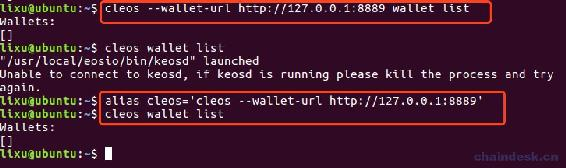
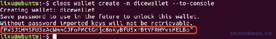
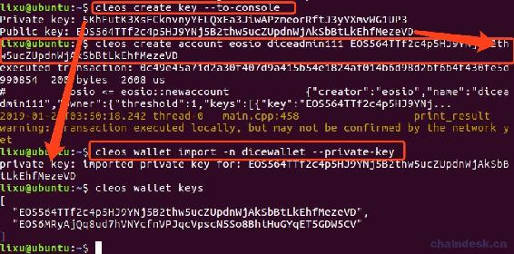
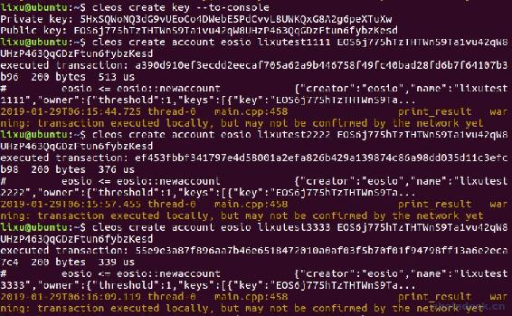
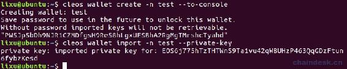
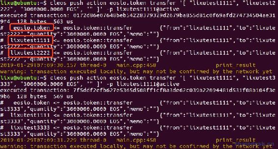

# 三、.2 EOS 账号配置、发行通证

> 经过前面两章的分析，我们对 EOS DApp 有了一个大致的认识，了解了博彩类合约的运行原理，现在我们正式进入项目开发的主题，我们要学习的 DApp 合约开发的项目就是与 BetDice 中的 Dice 游戏几乎一样的功能，教程内容包含合约、后端、前端，围绕合约作为重点进行介绍。
> 
> 本章我们主要来学习以下两个内容：
> 
> *   配置合约所需的账号
> *   发行通证
> *   EOS 中的账户体系

## 一、配置合约所需的账号

下面的操作需要使用 cleos 命令行工具，在[EOS 钱包开发](https://www.chaindesk.cn/witbook/2)系列教程中有详细的说明，这里不再介绍。另外，需要熟悉钱包管理账号，下面钱包相关的步骤只作操作，就不赘述了。

### 1\. 设置 cleos 别名

查询钱包列表的命令如下

```js
cleos --wallet-url http://127.0.0.1:8889 wallet list 
```

设置 cleos 别名绑定 keosd 服务，为了简化命令。

```js
alias cleos='cleos --wallet-url http://127.0.0.1:8889' 
```

绑定后的命令为

```js
cleos wallet list 
```

整个过程如下图



### 2\. 创建管理合约账号的钱包

下面创建一个名为 dicewallet 的钱包

```js
cleos wallet create -n dicewallet --to-console 
```



成功后将会生成钱包的解锁密码，钱包 15 分钟不用将会自动锁定，注意一定要保存最后一行的密码，需要使用它解锁这个钱包。为了方便大家可以延长自动锁定钱包配置的时间，找到路径`~/eosio-wallet/config.ini`，然后打开 config.ini 文件，修改`unlock-timeout = 900000000`。

### 3\. 创建合约账号

*   创建一对公私钥控制合约账号

```js
cleos create key --to-console 
```

公私钥对输出如下

```js
Private key: 5KhFutK3XsFCknvnyYELQxEa3JiwAPzmeorRftJ3yYXmvWG1UP3
Public key: EOS564TTf2c4p5HJ9YNj5B2thw5ucZUpdnWjAkSbBtLkEhfMezeVD 
```

*   创建合约账号

dice 游戏合约账号为 diceadmin111，使用刚才创建的公私钥对`EOS564TT...`作为合约账号的 active 与 owner 权限的主体

```js
cleos create account eosio diceadmin111 EOS564TTf2c4p5HJ9YNj5B2thw5ucZUpdnWjAkSbBtLkEhfMezeVD 
```

*   导入合约账号的私钥到钱包

```js
cleos wallet import -n dicewallet --private-key 
```

会有提示输入密钥，输入你创建的密钥即可，我这里是`5KhFu...`。

最后两个钱包中各管理着一对公私钥。

整个过程如下图



### 4\. 创建分红池账号

开发中为了便于管理，这里先使用同一对公私钥`EOS564TT...`控制账号，部署到主网的时候，各位同志务必使用不一样的公私钥控制不同的账号。否则一旦泄露一个账号的私钥，相当与全军覆没。

分红池账号为 dicepool1111。

```js
cleos create account eosio dicepool1111 EOS564TTf2c4p5HJ9YNj5B2thw5ucZUpdnWjAkSbBtLkEhfMezeVD 
```

在 BetDice 中该账号运作于整个社区游戏的 Token 经济模型中，BetDice 社区游戏能够成为最火爆的 DApp 脱离不开它优秀的 Token 经济模型设计，这部分内容博主将在后面的章节中详细介绍，在 DApp 中如何建立用户高粘性的 Token 经济模型。

### 5\. 创建代币合约账号

开发中为了便于管理，这里先使用同一对公私钥`EOS564TT...`控制账号，部署到主网的时候，各位同志务必使用不一样的公私钥控制不同的账号。否则一旦泄露一个账号的私钥，相当与全军覆没。

代币合约账号为 dicetoken111。

```js
cleos create account eosio dicetoken111 EOS564TTf2c4p5HJ9YNj5B2thw5ucZUpdnWjAkSbBtLkEhfMezeVD 
```

另外再创建一个发行代币的账号 diceissue111

```js
cleos create account eosio diceissue111 EOS564TTf2c4p5HJ9YNj5B2thw5ucZUpdnWjAkSbBtLkEhfMezeVD 
```

大家在研究 BetDice 中的过程中，可以发现游戏中既支持 EOS 的押注，也支持其它合作方的代币，最主要的一个代币是 BetDice 官方发行的 DICE 代币。该币种支持质押、赎回、账号冻结、资金冻结、游戏挖矿、空投、召回和列入所有者白名单等功能，这部分内容博主将在后续的章节中详细介绍，如何开发功能全面的代币，并且适用于社区的 Token 经济模型中。

### 6\. 创建玩家账号

前面我们所创建的账号是商家所需账号，全在 dicewallet 钱包中，现在我们作为玩家，需另外使用一个钱包和公私钥对来管理玩家账号或者测试账号。

为了简化操作，创建了玩家测试账号 lixutest1111、lixutest2222、lixutest3333，使用了同一对公私钥`EOS6j77...`作为唯一的主体。



然后创建钱包 test，导入刚才新生成的私钥，即测试账号的私钥。



### 7\. 总结

目前，咱们一共有三个钱包，分别是

*   default：管理的只有一对公私钥，并且是 eosio、eosio.token 账号的主体。
*   dicewallet：管理的只有一对公私钥，并且控制着商家所有的账号，包含：diceadmin111、dicepool1111、dicetoken111、diceissue111。
*   test：管理的只有一对公私钥，并且控制着测试账号。

## 二、发行通证

发行 Token 的目的是为了能游戏合约账号有金额坐庄，俗话说的是“想当庄，得有足够的资本”。另外，也会发行给测试账号，充当玩家的身份去押注。

我们开发的这个 DICE 游戏支持 EOS、JXB 代币的押注，因此我们需要发行这两种代币。EOS 作为 EOS 生态通用的代币，JXB 作为 DICE 游戏所发行的代币，为了在后面建立起自己的 Token 经济模型所必要的。

### 1\. 发行者发行代币

前面我们已经创建了 EOS Token，发行者可以调用`issue`方法向商家账号和测试帐号发放 Token。

*   给 dice 游戏合约账号发行 EOS

```js
cleos push action eosio.token issue '[ "diceadmin111", "10000000.0000 EOS", "首发" ]' -p eosio@active 
```

*   给测试账号 lixutest1111 发行 EOS

```js
cleos push action eosio.token issue '[ "lixutest1111", "10000000.0000 EOS", "首发" ]' -p eosio@active 
```

### 2\. 测试账号相互转账

将一千万 EOS 转一部分给 lixutest2222、lixutest3333。

```js
cleos push action eosio.token transfer '[ "lixutest1111", "lixutest2222", "3000000.0000 EOS", "" ]' -p lixutest1111@active
cleos push action eosio.token transfer '[ "lixutest1111", "lixutest3333", "3000000.0000 EOS", "" ]' -p lixutest1111@active 
```

输出如下



上面的输出有个关键的地方在后续开发中我们使用到，可以看到转账会通知资金的发送方和接收方，以便它们可以自动处理存款和取款。

### 3\. 查询账号余额

使用命令`cleos get currency balance eosio.token diceadmin111`查询 diceadmin111 账号的 eosio.token 合约的 token。

```js
lixu@ubuntu:~$ cleos get currency balance eosio.token diceadmin111
10000000.0000 EOS
lixu@ubuntu:~$ cleos get currency balance eosio.token lixutest1111
4000000.0000 EOS
lixu@ubuntu:~$ cleos get currency balance eosio.token lixutest2222
3000000.0000 EOS
lixu@ubuntu:~$ cleos get currency balance eosio.token lixutest3333
3000000.0000 EOS
lixu@ubuntu:~$ cleos get currency stats eosio.token EOS
{
  "EOS": {
    "supply": "20000000.0000 EOS",
    "max_supply": "1000000000.0000 EOS",
    "issuer": "eosio"
  }
} 
```

### 4\. 发行 JXB 代币

重复上面的套路去发行 JXB 代币，具体命令如下。

```js
cd /home/lixu/Desktop/sourceeos/eos
cleos set contract dicetoken111 build/contracts/eosio.token -p dicetoken111@active
cleos push action dicetoken111 create '[ "diceissue111", "1000000000.0000 JXB"]' -p dicetoken111@active
cleos push action dicetoken111 issue '[ "diceadmin111", "10000000.0000 JXB", "首发" ]' -p diceissue111@active
cleos push action dicetoken111 issue '[ "lixutest1111", "4000000.0000 JXB", "首发" ]' -p diceissue111@active
cleos push action dicetoken111 issue '[ "lixutest2222", "3000000.0000 JXB", "首发" ]' -p diceissue111@active
cleos push action dicetoken111 issue '[ "lixutest3333", "3000000.0000 JXB", "首发" ]' -p diceissue111@active 
```

此处使用 dicetoken111 账号部署的 token 合约还是使用的官方的 eosio.token 合约，支持主要的创建、发行、转账、查询等操作已能满足 DICE 游戏合约开发的功能。

若需支持质押、赎回、账号冻结、资金冻结、游戏挖矿、空投、召回和列入所有者白名单等功能，这部分内容博主将在后续的章节中详细介绍，如何开发功能全面的代币，并且适用于社区的 Token 经济模型中。

**注意：**

现在查询 JXB 的发行量和流通量的命令应该是多少呢？大家不妨先试试再往下看

前面已经重点提示过完整命令是 `cleos get currency stats 合约名称 代币符号`，因此查询 JXB 的命令是

`cleos get currency stats dicetoken111 LXB cleos get currency stats dicetoken111 JXB`

因为 JXB 由 dicetoken111 合约所发行，而前面的 EOS 是由 eosio.token 所发行。

那么聪明的你，现在应该知道如何查询账号的 JXB 余额了，先来试一下吧！

**思考：**

既然 eosio.token 账号已经创建好了，并且可以创建任意代币

*   为什么此处还需要再创建 dicetoken111 账号？
*   为什么不就用 eosio.token 账号去发行 JXB 代币？

## 三、EOS 中的账户体系

刚才创建公钥私钥的时候，大家可能都有疑问，与之前学习的以太坊钱包账户不一样。为什么都生成公私钥了，但还需创建账户。以及在创建账户的过程中，导入的 owner key 和 active key 有什么用。

之前我们在接触比特币和以太坊时，生成地址很简单，只要生成公私钥对即可。币就放在公钥里，知道私钥就可以把币转走。即一个钱包只有一个控制人，谁掌握着私钥谁就有实际控制权。而在 EOS 中，秘钥对=权限。一个秘钥对对应了某种权限，即用这个账户做某些特定的事情的权利。举个例子，你生成了一个秘钥对并赋予了它可以通过你的账户创建新账户，但并不能转账。那么如果你把其中的私钥给了你的朋友，那么他只能为你的账户创建新账户，而不能操作你账户中的币。

你可以给你的钱包自定义一些权限用来约束任意事件，在后续我们使用 eosio.code 权限、新建 server 权限并配置一些 action。但是每个账户都有两个标准权限，即`owner`和`active`。可以把`owner`权限理解成账户的“根权限”，其他人只要拿到你的`owner key`，基本上就可以用你的账户做任何事情。而`active key`的权限则要小一点，支持除了修改`owner`之外的其他操作。

*   owner 权限

owner 即代表账户所有权，该权限可进行所有操作，包括更改 owner 权限，可由一对或多对 EOS 公私钥或另一账户的某权限实现权限控制。因此，代表着 owner 权限的 EOS 公私钥是最重要的，必须安全保管。

*   active 权限

active 即活跃权限，能进行除更改 owner 权限以外的所有操作，也是通过一对或多对 EOS 公私钥或另一账户的某权限实现权限控制。

**版权声明：博客中的文章版权归博主所有，转载请联系作者（微信：lixu1770105）。**