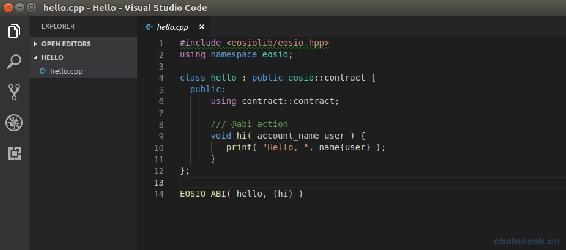
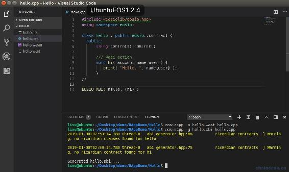
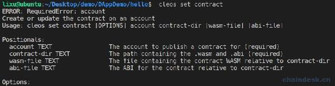
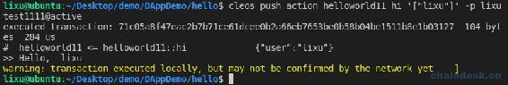
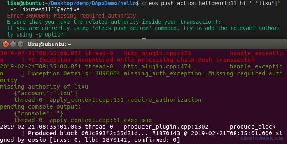
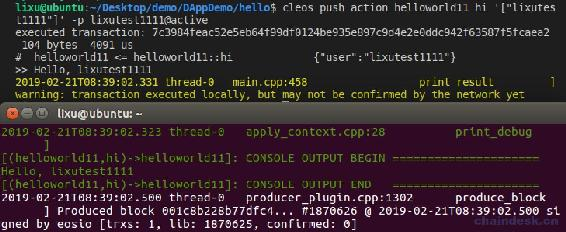
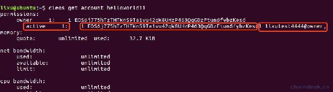

# 4.1 添加合约认证权限

> 本章我们主要来学习以下三个内容：
> 
> *   学会编写 helloworld 合约
> *   合约编译、部署、调用
> *   合约添加认证权限的多种方式

## 一、HelloWorld 合约

在学任意一门新语言的时候咱们都是以 HelloWorld 入门，同样咱们进入 EOS 合约开发世界时，先来学习一下如何实现 HelloWorld 合约。

### 1\. 编写 hello 合约

正好，EOS 官方已经为我们提供了入门的 hello 合约，先去看看[hello 合约源码](https://github.com/EOSIO/eos/blob/v1.2.6/contracts/hello/hello.cpp)吧。在学习 EOS 合约开发之前需要熟悉 C++基本语法，这里不作介绍，同时需准备好自己熟悉的支持 C++语法的编译器，博主这里使用的是 VSCode。

```js
#include <eosiolib/eosio.hpp>
using namespace eosio;

class hello : public eosio::contract {
  public:
      using contract::contract;

      /// @abi action 
      void hi( account_name user ) {
         print( "Hello, ", name{user} );
      }
};

EOSIO_ABI( hello, (hi) )
```

将 hello.cpp 的源码复制到自己的 Hello 项目中如下所示



### 2\. 编译 hello 合约

**第一步：**生成.wast 和.wasm 文件

需要使用的 EOS 系统提供的 eosiocpp 工具编译合约源码，将生成为.wast 和.wasm 文件，命令如下

```js
eosiocpp -o hello.wast hello.cpp
```

现在会在 Hello 项目跟目录中生成两个文件`hello.wast`与`hello.wasm`。

**第二步：**生成 ABI 文件

还需使用 eosiocpp 工具生成合约的 ABI 文件，命令如下

```js
eosiocpp -g hello.abi hello.cpp
```

现在会在 Hello 项目跟目录中生成 hello.abi 文件。项目效果如下



### 3\. 创建合约帐户并部署合约

创建帐户 helloworld11，还是由上一章的 test 钱包中的公钥`EOS6j77...`作为主体（owner 与 active 权限的公私钥对）。

```js
cleos create account lixutest1111 helloworld11 EOS6j775hTzTHTWnS9Ta1vu42qW8UHzP463QqGDzFtun6fybzKesd EOS6j775hTzTHTWnS9Ta1vu42qW8UHzP463QqGDzFtun6fybzKesd
```

部署 hello 合约，项目名称若与.cpp 文件名称一致都为 hello，则命令如下

```js
cleos set contract helloworld11 ../hello -p helloworld11@active
```

> 其中“../hello”是 hello.cpp 所在的相对目录，若项目名称与 cpp 文件名称不一致，则会报错
> 
> ```js
> Error 3160009: No wast file found
> ```
> 
> 那么部署合约的时候需要分别指出.wasm 与.abi 文件相对项目跟目录的位置
> 
> ```js
> cleos set contract helloworld11 ./ hello.wasm hello.abi -p helloworld11@active
> ```
> 
> 不了解`cleos set contract`命令用法的可以看一下它的文档，如下
> 
> 

### 4\. 调用合约方法

现在我们通过命令`push action`可以调用合约的方法了，具体命令为

```js
cleos push action helloworld11 hi '["lixu"]' -p lixutest1111@active
```

执行后效果如下



### 5\. 合约解读

*   第一行：引入 eosiolib 库。
*   第二行：使用 eosio 命名空间。
*   第四行：声明 hello 继承 eosio 的 contract。
*   第八行：声明下面这个 action 生成 abi 接口。
*   第九行：实现 hi action，参数的类型 account_name 是 eosiolib 库定义的数据类型，是 uint64_t 的别名。
*   第十行：输出参数 user 的字符串数据。
*   第十四行：调用 EOSIO_ABI 宏定义，将 hello 合约的 hi action 生成 abi。

## 二、合约添加认证权限

在上面的示例，任何用户都以调用 hi 方法。若需要给该方法添加权限，那么需使用 require_auth 方法验证调用者的签名，它的声明是`void require_auth( account_name name );`。

下面介绍开发中需要使用到的三种场景。

### 1\. 认证账号参数的签名

重新实现 hi action 如下

```js
void hi(account_name user)
{
    require_auth(user);
    print("Hello, ", name{user});
}
```

编译并部署合约

```js
eosiocpp -o hello.wast hello.cpp
eosiocpp -g hello.abi hello.cpp
cleos set contract helloworld11 ../hello -p helloworld11@active
```

这时候 lixutest1111 调用 hi 传递“lixu”则会报错，没有账号“lixu”的签名，如下



账号 lixutest1111 调用 hi 传递“lixutest1111”则才能正确执行。



### 2\. 认证合约账号的签名

上面的认证是任意一个账号，对 action 签名后都能成功调用，若该 action 只允许合约账号本身有权限调用，则如何实现呢？

重新实现 hi action 如下

```js
void hi(account_name user)
{
    require_auth(_self);
    print("Hello, ", name{user});
}
```

`_self`：指的是当前合约的账号。

编译并部署合约，然后只有 hello 合约的合约账号 helloworld11 才能成功调用 hi aciton，那么现在对参数 user 没有任何限制。

```js
cleos push action helloworld11 hi '["lixu"]' -p helloworld11@active
```

### 3\. 认证指定账号的签名

#### 3.1 使用 N(account)语法

若我们要求指定了某一个账号才有权限调用该 aciton，那么该如何实现呢？这就需要使用到`N()`语法了，它是一个宏定义，`#define N(X) ::eosio::string_to_name(#X)`，可知是将字符串转化成 name。注意`X`前面有个`#`,不需要对账号字符串加“”。

这里设置只能让 lixutest2222 账号调用，重新实现 hi action 如下

```js
void hi(account_name user)
{
    require_auth(N(lixutest2222));
    print("Hello, ", name{user});
}
```

#### 3.2 新增合约账号权限的操作账号

上面的方法`require_auth(N());`是可行的，但是这个需求还可以用更好的方案，即新增账号 lixutest4444 作为合约账号 acitve 权限的操作账号。

则需要对合约账号作如下权限配置

```js
cleos set account permission helloworld11 active '{"threshold": 1, "keys": [{"key":"EOS6j775hTzTHTWnS9Ta1vu42qW8UHzP463QqGDzFtun6fybzKesd","weight": 1}], "accounts": [{"permission":{"actor":"lixutest4444", "permission":"owner"}, "weight":1}], "waits": []}'
```

如此，使用 lixutest4444@owner 的签名和"EOS6j77……."的签名都是合法的，因为它们的权重 1 都不小于 helloworld11 账号 active 权限的阈值 1。



还原 hi action 的实现为`require_auth(_self);`，编译后重新部署。

现在只需要 lixutest4444@owner 的私钥所在钱包是解锁的状态，就能使用 helloworld11@active 签名成功调用 hi action。

```js
cleos push action helloworld11 hi '["lixu"]' -p helloworld11@active
```

具体步骤如下：

*   需要您新建一个钱包 test11，再新建公私钥对并导入该钱包，并用该公私钥对创建账号 lixutest4444。
*   修改合约账号 active 权限配置，命令在前面。
*   锁定合约账号公私钥对所在的钱包 test。
*   使用权限 helloworld11@active 调用 hi action。

后面我们还会学习到权限映射。

**版权声明：博客中的文章版权归博主所有，转载请联系作者（微信：lixu1770105）。**