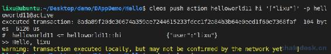
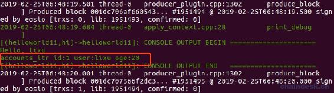
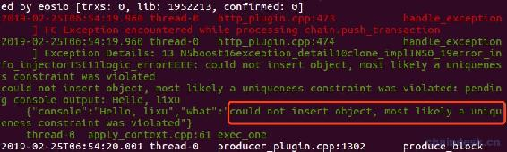
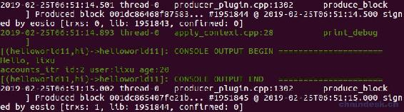
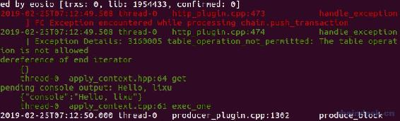
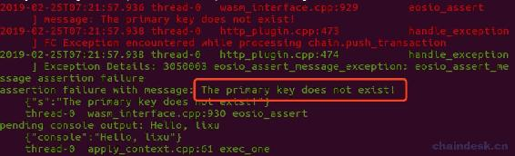
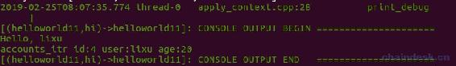
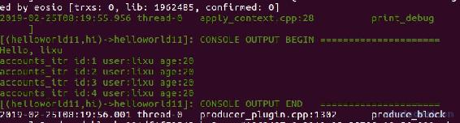

# 四、.2 多索引数据库 Multi-Index——新增与查询

> 在任何一个后端服务器中，几乎都会使用的数据库持久化存储数据，如：mysql、sqlite、mongodb、redis 等，那么 EOS 合约中是如何持久化储存数据的呢？
> 
> 本章我们来学习 EOS 的多索引数据库 Multi-Index，用于在 EOS 合约中持久化储存数据。主要有以下几个内容：
> 
> *   multi_index 概述
> *   定义多索引表
> *   新增多索引表数据
> *   查询多索引表数据

## 一、multi_index 概述

multi_index 指的是多索引容器，multi_index 容器的内部结构可以类比成传统数据库里的一张表，只不过这张表只有一列，每一行都是一个 struct 结构体。

*   multi_index 是 eosio 上的数据库管理接口，通过 eosio::multi_index 智能合约能够写入、读取和修改 eosio 数据库的数据。
*   [multi_index](https://github.com/EOSIO/eos/blob/v1.2.6/contracts/eosiolib/action.h)在 eosio 源码中的位置在`eos/contracts/eosiolib/multi_index.hpp`。
*   multi_index 的[官方文档](https://developers.eos.io/eosio-cpp/v1.2.0/docs/multi-index-table-tutorial)。

eosiolib 中的 Multi-Index 的增查改删的 API 分别如下：

*   增：emplace，官方定义为：`const_iterator emplace( uint64_t payer, Lambda&& constructor )`。
*   查：find，官方定义为：`const_iterator find( uint64_t primary )const`。
*   改：emplace，官方定义为：`void modify( const_iterator itr, uint64_t payer, Lambda&& updater )`
*   删：erase，官方定义为：`const_iterator erase( const_iterator itr )`

## 二、定义多索引表

下面创建一个简单的多索引表需要储存的数据结构

```js
/// @abi table accounts
struct account
{
    uint64_t id;
    account_name user;
    uint8_t age;

    uint64_t primary_key() const { return id; }

    EOSLIB_SERIALIZE(account, (id)(user)(age))
};
typedef eosio::multi_index<N(accounts), account> accounts;
```

代码说明如下：

*   第一行用于生成 ABI，供外界访问。若禁止外访问该表数据，则删掉该行即可。
*   每个表都必须实现 primary_key()方法，用于指定主索引的字段，和后端数据库的主键类似，主索引必须唯一，且类型必须是 uint64_t。
*   “EOSLIB_SERIALIZE”用于序列化该数据结构。
*   重点是“multi_index”，定义该结构体为多索引表，注意它的语法。第一个参数是表名，第二个参数是表对象的数据结构类型。

## 三、新增多索引表数据

### 1\. 使用 emplace 接口

新增多索引表数据需要使用到 emplace 接口，`const_iterator emplace( uint64_t payer, Lambda&& constructor )`。

*   第一个参数 payer：表示使用他支付存入表的该数据所需消耗的内存(RAM)。下面为了让大家便于理解，我将使用 _self 作为支付内存的账号，即该合约账号。同时也是为了用户可以最大限度的使用产品。
*   第二个参数 constructor：是 Lambda 类型，用法是`&{}`。
*   返回值：将新增的该数据返回，叫做迭代器，通过遍历迭代器可以获取表中的每一条数据。

重新实现 hi action，如下

```js
void hi(account_name user)
  {
    require_auth(_self);
    print("Hello, ", name{user});

    accounts accounts_table(_self, _self);
    auto accounts_itr = accounts_table.emplace(_self, & {
        g.id = 1;
        g.user = user;
        g.age = 20;
    });

    print("\naccounts_itr id:", accounts_itr->id, " user:", name{accounts_itr->user}, " age:", (uint64_t)accounts_itr->age);
  }
```

编译部署后，重新调用 hi，如下

```js
cleos push action helloworld11 hi '["lixu"]' -p helloworld11@active
```



对于 accounts_itr 的输出并没有在控制台打印出来，那如何完整的测试呢？

需要配置 EOS 节点的 config.ini 文件，搜索 contracts-console 并设置为`contracts-console = true`。意思是将合约的输出打印到控制台。

然后再看节点服务器的控制台输出，如下



`accounts accounts_table(_self, _self)`这行代码后续会详细介绍。

### 2\. 使用 available_primary_key

在上一步中，若我们继续调用 hi action，会报错`"could not insert object, most likely a uniqueness constraint was violated"`，详情如下：



因为主键 id 不能重复为 1，需要手动更改 id 为 2，这样会比较麻烦，程序也不容易实现，博主看到包括线上的很多合约都是另外再建立一个表专门用于记录自增 id 来实现的。下面我们来学习最简单的一个办法，即使用 available_primary_key()，使用它会自动增加主键的值。

现修改代码如下

```js
auto accounts_itr = accounts_table.emplace(_self, & {
    g.id = accounts_table.available_primary_key();
    g.user = user;
    g.age = 20;
});
```

输出如下



可看到成功将主键自动增加了，再次调用 hi，主键也会自动增加到 3、4、…….

## 四、查询多索引表数据

### 1\. 使用 find 接口

查询多索引表数据会使用到 find 接口，`const_iterator find( uint64_t primary )const`。该方法比较简单，另外还有 get 方法，与 find 方法功能类似，大家可自行练习使用 get。

*   参数 primary：注意必须是主键，或者二级索引(二级索引接下来会讲到)。
*   返回值：与新增 API 返回的结果一样，将查询的该迭代器数据返回。

增加一行代码`auto accounts_itr = accounts_table.find(2);`，详情如下

```js
accounts accounts_table(_self, _self);
//新增
// auto accounts_itr = accounts_table.emplace(_self, & {
//     g.id = accounts_table.available_primary_key();
//     g.user = user;
//     g.age = 20;
// });

//查询
auto accounts_itr = accounts_table.find(2);

print("\naccounts_itr id:", accounts_itr->id, " user:", name{accounts_itr->user}, " age:", (uint64_t)accounts_itr->age);
```

将会输出主键为 2 的一行数据。

### 2\. 使用 end 方法

大家修改查找的主键为 100，即`auto accounts_itr = accounts_table.find(100);`，调用合约将会报错`The table operation is not allowed`。因为该表中不存在主键为 100 的数据。



为了防止合约报错，我们在使用迭代器前必须对迭代器进行判断，如下

```js
//查询
auto accounts_itr = accounts_table.find(100);
eosio_assert(accounts_itr != accounts_table.end(), "The primary key does not exist!");
```

使用到了`eosio_assert()`，这是 EOS 里的断言语法。

再次调用 hi，将会出现如下错误



### 3\. begin 方法

在使用迭代器遍历表数据时，通常我们会使用到 begin 方法用于获取表的最小值的主键的迭代器数据。

修改如下代码

```js
//查询
// auto accounts_itr = accounts_table.find(100);

//查询第一个数据
auto accounts_itr = accounts_table.begin();

eosio_assert(accounts_itr != accounts_table.end(), "The primary key does not exist!");
```

accounts_itr 就是主键为 1 的迭代器。

### 4\. crbegin 方法

为了获取到最大主键值的反向迭代器数据，我们会使用到 crbegin 方法，与 begin 方法刚好对应。

修改如下代码

```js
//查询
// auto accounts_itr = accounts_table.find(100);

//查询主键最小的数据
// auto accounts_itr = accounts_table.begin();

// eosio_assert(accounts_itr != accounts_table.end(), "The primary key does not exist!");

//查询主键最大的数据
auto accounts_itr = accounts_table.crbegin();
eosio_assert(accounts_itr != accounts_table.crend(), "The primary key does not exist!");

print("\naccounts_itr id:", accounts_itr->id, " user:", name{accounts_itr->user}, " age:", (uint64_t)accounts_itr->age);
```

目前 accounts 表中的主键的最大值是 4，所以输出如下



注意 crbegin 返回的是 const_reverse_iterator 对象，而 end 返回的是 const_iterator 对象。为了保证比较的数据类型一直，因此 eosio_assert 断言中是 crbegin 获取到的迭代器数据与 crend 比较。

### 5\. 迭代器遍历表数据

使用任何一个迭代器都可以遍历表的所有数据，下面我使用 begin 方法获取的迭代器进行遍历。

```js
//查询主键最大的数据
// auto accounts_itr = accounts_table.crbegin();
// eosio_assert(accounts_itr != accounts_table.crend(), "The primary key does not exist!");

// print("\naccounts_itr id:", accounts_itr->id, " user:", name{accounts_itr->user}, " age:", (uint64_t)accounts_itr->age);

//遍历表数据
auto accounts_itr = accounts_table.begin();
while (accounts_itr != accounts_table.end())
{
  print("\naccounts_itr id:", accounts_itr->id, " user:", name{accounts_itr->user}, " age:", (uint64_t)accounts_itr->age);
  accounts_itr++;
}
```

accounts 表中的所有数据都将输出，如下



## 五、完整代码

```js
#include <eosiolib/eosio.hpp>
using namespace eosio;

class hello : public eosio::contract
{
public:
  using contract::contract;

  /// @abi table accounts
  struct account
  {
    uint64_t id;
    account_name user;
    uint8_t age;

    uint64_t primary_key() const { return id; }

    EOSLIB_SERIALIZE(account, (id)(user)(age))
  };
  typedef eosio::multi_index<N(accounts), account> accounts;

  //@abi action
  void hi(account_name user)
  {
    require_auth(_self);
    print("Hello, ", name{user});

    accounts accounts_table(_self, _self);
    //新增
    // auto accounts_itr = accounts_table.emplace(_self, & {
    //     g.id = accounts_table.available_primary_key();
    //     g.user = user;
    //     g.age = 20;
    // });

    //查询
    // auto accounts_itr = accounts_table.find(100);

    //查询主键最小的数据
    // auto accounts_itr = accounts_table.begin();

    // eosio_assert(accounts_itr != accounts_table.end(), "The primary key does not exist!");

    //查询主键最大的数据
    // auto accounts_itr = accounts_table.crbegin();
    // eosio_assert(accounts_itr != accounts_table.crend(), "The primary key does not exist!");

    // print("\naccounts_itr id:", accounts_itr->id, " user:", name{accounts_itr->user}, " age:", (uint64_t)accounts_itr->age);

    //遍历表数据
    // auto accounts_itr = accounts_table.begin();
    // while (accounts_itr != accounts_table.end())
    // {
    //   print("\naccounts_itr id:", accounts_itr->id, " user:", name{accounts_itr->user}, " age:", (uint64_t)accounts_itr->age);
    //   accounts_itr++;
    // }
  }
};

EOSIO_ABI(hello, (hi))
```

**总结**

通过本篇文章的学习，我们掌握了如何在 EOS 中使用智能合约调用 multi_index 实现数据的持久化储存以及查询功能。

**版权声明：博客中的文章版权归博主所有，转载请联系作者（微信：lixu1770105）。**