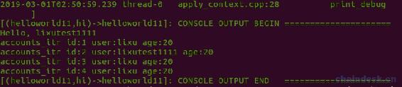
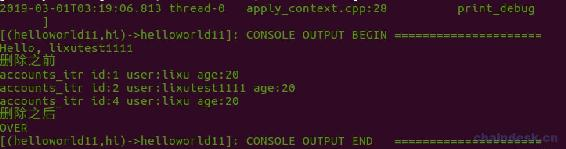

# 4.3 多索引数据库 Multi-Index——更新与删除

> 紧接着上一章的内容，本章继续学习多索引数据库的内容。
> 
> 主要有以下三个内容：
> 
> *   更新多索引表数据
> *   删除多索引表数据
> *   删除表

## 一、更新多索引表数据

更新多索引表数据会使用到 modify 接口，`void modify( const_iterator itr, uint64_t payer, Lambda&& updater )`。

*   第一个参数 itr：是需要更新的表数据，即迭代器。
*   第二个参数 payer：该 API 的 payer 参数我们一般使用的值是 0。
*   第三个参数 updater：是 Lambda 类型，用法是`&{}`。

有这样一个需求：更新主键为 2 的表数据，将 user 字段改为 hi action 的参数 user。

实现如下：

```js
//更新
auto accounts_itr = accounts_table.find(2);
accounts_table.modify(accounts_itr, 0, & {
    g.user = user;
});
```

调用合约（**更新合约后需编译、部署，再调用**）

```js
cleos push action helloworld11 hi '["lixutest1111"]' -p helloworld11@active
```

执行完成后，查询 accounts 表的所有数据，输出如下



## 二、删除多索引表数据

删除多索引表数据会使用到 erase 接口，`const_iterator erase( const_iterator itr )`。

*   第一个参数 itr：是需要删除的表数据，即迭代器。
*   返回值：类型 const_iterator，即也将返回迭代器。

### 1\. 删除一条数据

下面删除主键为 3 的表数据，实现如下：

```js
//删除
auto accounts_itr = accounts_table.find(3);
auto next_itr = accounts_table.erase(accounts_itr);
print("\nnext_itr id:", next_itr->id, " user:", name{next_itr->user}, " age:", (uint64_t)next_itr->age, "\n");
```

输出如下


可见删除迭代器后，返回的是它的下一个迭代器。

### 2\. 删除表

无法直接删除表，但是，在删除所有行后，表将自动删除。

由上可见，需删除表中所有数据非常简单，只须循环的不断删除 next_itr 即可。

为了便于核实，下面加上输出日志，实现如下：

```js
//遍历表数据
print("\n 删除之前");
auto accounts_itr = accounts_table.begin();
while (accounts_itr != accounts_table.end())
{
  print("\naccounts_itr id:", accounts_itr->id, " user:", name{accounts_itr->user}, " age:", (uint64_t)accounts_itr->age);
  accounts_itr++;
}

//删除所有数据
accounts_itr = accounts_table.begin();
while (accounts_itr != accounts_table.end())
{
  accounts_itr = accounts_table.erase(accounts_itr);
}

//遍历表数据
print("\n 删除之后");
accounts_itr = accounts_table.begin();
while (accounts_itr != accounts_table.end())
{
  print("\naccounts_itr id:", accounts_itr->id, " user:", name{accounts_itr->user}, " age:", (uint64_t)accounts_itr->age);
  accounts_itr++;
}
print("\nOVER");
```

输出如下：



## 完整代码

```js
#include <eosiolib/eosio.hpp>
using namespace eosio;

class hello : public eosio::contract
{
public:
  using contract::contract;

  /// @abi table accounts
  struct account
  {
    uint64_t id;
    account_name user;
    uint8_t age;

    uint64_t primary_key() const { return id; }

    EOSLIB_SERIALIZE(account, (id)(user)(age))
  };
  typedef eosio::multi_index<N(accounts), account> accounts;

  //@abi action
  void hi(account_name user)
  {
    require_auth(_self);
    print("Hello, ", name{user});

    accounts accounts_table(_self, _self);

    //更新
    // auto accounts_itr = accounts_table.find(2);
    // accounts_table.modify(accounts_itr, 0, & {
    //   g.user = user;
    // });

    //删除一条数据
    // auto accounts_itr = accounts_table.find(3);
    // auto next_itr = accounts_table.erase(accounts_itr);
    // print("\nnext_itr id:", next_itr->id, " user:", name{next_itr->user}, " age:", (uint64_t)next_itr->age, "\n");

    //遍历表数据
    print("\n 删除之前");
    auto accounts_itr = accounts_table.begin();
    while (accounts_itr != accounts_table.end())
    {
      print("\naccounts_itr id:", accounts_itr->id, " user:", name{accounts_itr->user}, " age:", (uint64_t)accounts_itr->age);
      accounts_itr++;
    }

    //删除所有数据
    accounts_itr = accounts_table.begin();
    while (accounts_itr != accounts_table.end())
    {
      accounts_itr = accounts_table.erase(accounts_itr);
    }

    //遍历表数据
    print("\n 删除之后");
    accounts_itr = accounts_table.begin();
    while (accounts_itr != accounts_table.end())
    {
      print("\naccounts_itr id:", accounts_itr->id, " user:", name{accounts_itr->user}, " age:", (uint64_t)accounts_itr->age);
      accounts_itr++;
    }
    print("\nOVER");
  }
};

EOSIO_ABI(hello, (hi))
```

## 总结

通过本篇文章的学习，我们掌握了如何在 EOS 中使用智能合约调用 multi_index 实现持久化数据的更新以及删除功能。

通过这两章的内容学习了 Multi-Index 的部分 API 用法，主要是包含：

*   emplace
*   find
*   emplace
*   erase

其次是：

*   available_primary_key
*   end
*   begin
*   crbegin
*   crend
*   eosio_assert

这里大家可能会有一个误区，记住**多索引表支持新增、读取、更新和删除操作，区块不支持更新和删除（它只支持新增和读取）**。

*   区块具有区块链的不可篡改的特性，用于记录区块链事务。
*   多索引表如同后端所使用的数据库，用于合约记录应用程序的数据，支持更新。

**版权声明：博客中的文章版权归博主所有，转载请联系作者（微信：lixu1770105）。**