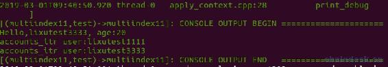
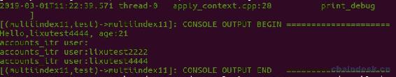
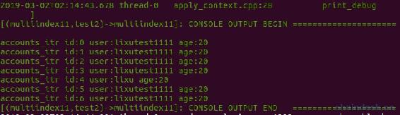

# 四、.4 多索引数据库 Multi-Index——code 实现跨合约查询表与 scope 实现表分离储存

> 紧接着上一章的内容，本章继续学习多索引数据库的进阶内容。
> 
> 主要有以下几个内容：
> 
> *   理解 code 与 scope
> *   分离接口与实现
> *   scope：表分离储存
> *   code：跨合约查询表

## 一、理解 code 与 scope

前面的代码中写了一行代码未作说明

```js
accounts accounts_table(_self, _self);
```

而 accounts 的定义是`typedef eosio::multi_index<N(accounts), account> accounts;`

那么`(_self, _self)`，纠结是何含义，往下看。

multi_index 构造函数的定义如下

```js
multi_index( uint64_t code, uint64_t scope )
```

其中：

*   code：指部署合约的账号，即合约账号。
*   scope：可以在 code 下定义多个 scope，它们相互独立，相当于一张表由多个 scope 组成。

所以 accounts_table 定义的是当前合约的同一个 scope 的表 accounts。

若 code 设置不是 _self，而指定为了另外的一个合约账号，则指向了该合约内的表查询。注意，跨合约的表只支持查询，不能作修改操作。

scope 也可以设置为其它的 uint64_t 字段，比如 token 合约中，为了记录账号的拥有多种币的余额，因此可以将账号作为 scope，每个人的余额存在自己的一个 scope 中。

## 二、分离接口与实现

开发时一般都需将接口与实现分离开，合约也是如此，便于维护与开发。

可以使用 eosiocpp 工具新建合约，也可自行创建，模版如下

**multiindex.hpp 文件**

```js
#include <eosiolib/eosio.hpp>
using namespace eosio;

class multiindex : public eosio::contract
{
  public:
    multiindex(account_name self) : contract(self)
    {
    }

    void test(account_name user, uint64_t age);
};
```

**multiindex.cpp 文件**

```js
#include "multiindex.hpp"

void multiindex::test(account_name user, uint64_t age)
{
    require_auth(user);
    print("Hello, ", name{user});
}

EOSIO_ABI(multiindex, (test))
```

新建一个账号 multiindex11 作为 multiindex 合约的合约账号。

编译部署后运行

```js
cleos push action multiindex11 test '["lixutest1111", 20]' -p lixutest1111@active
```

## 三、scope：表分离储存

将如下 accounts2 表的数据结构的声明放到 multiindex.hpp 中的 test 方法相同的位置。

```js
/// @abi table accounts2
struct account2
{
    account_name user;

    uint64_t primary_key() const { return user; }

    EOSLIB_SERIALIZE(account2, (user))
};
typedef eosio::multi_index<N(accounts2), account2> accounts2;
```

将 age 作为 scope 字段，把 accounts2 表以 age 进行分离。那么每个 scope 中记录的是相同年龄的用户。

因此多索引的定义为`accounts2 accounts_table(_self, age);`

现在对该表作新增与查询操作，重新实现 test action。

```js
void multiindex::test(account_name user, uint64_t age)
{
    require_auth(user);
    print("Hello,", name{user}, ", age:", age);

    accounts2 accounts_table(_self, age);

    //新增
    accounts_table.emplace(_self, & {
        g.user = user;
    });

    //遍历表数据
    auto accounts_itr = accounts_table.begin();
    while (accounts_itr != accounts_table.end())
    {
      print("\naccounts_itr user:", name{accounts_itr->user});
      accounts_itr++;
    }
}
```

依次执行如下操作

```js
cleos push action multiindex11 test '["lixutest1111", 20]' -p lixutest1111@active
cleos push action multiindex11 test '["lixutest2222", 21]' -p lixutest2222@active
```

```js
cleos push action multiindex11 test '["lixutest3333", 20]' -p lixutest3333@active
```



```js
cleos push action multiindex11 test '["lixutest4444", 21]' -p lixutest4444@active
```



可见 accounts2 表中的数据由 age 分离，当前 scope 有两份，age 分别为 20、21。

更新和删除操作大家自行练习。

## 四、code：跨合约查询表

> 现在我们有两个合约账号 helloworld11、multiindex11，下面我们在 multiindex11 合约中去查询 helloworld11 合约中的 accounts 表数据。

B 合约查询 A 合约的 table1 表数据，需要如下步骤

*   在 B 合约中定义 table1 表数据结构，与 A 合约中的 table1 一致。
*   多索引定义为：`table1 table1_table(A 合约账号, scope);`。

### 1\. 编码 multiindex.hpp

所以把 helloworld11 合约中的 accounts 表的数据结构 account 拷贝到 multiindex11 中，另外在新加一个 action test2，用于获取 accounts 表的数据。

multiindex.hpp 中的代码如下

```js
void test2();

//helloworld11 合约的表数据结构
/// @abi table accounts
struct account
{
    uint64_t id;
    account_name user;
    uint8_t age;

    uint64_t primary_key() const { return id; }

    EOSLIB_SERIALIZE(account, (id)(user)(age))
};
typedef eosio::multi_index<N(accounts), account> accounts;
```

### 2\. 编码 multiindex.cpp

multiindex.cpp 中来实现 test2，并且将它生成 ABI 接口。

**注意：**

*   `accounts accounts_table(N(helloworld11), N(helloworld11))`：此时 scope 应是 N(helloworld11)，而不是`_self`。因为在 helloworld11 合约内部是`_self`，而现在在 multiindex11 合约中，因此需要指定为 N(helloworld11)。
*   跨表操作只支持查询，不能新增、更新、删除。

代码如下

```js
void multiindex::test2()
{
    require_auth(_self);

    accounts accounts_table(N(helloworld11), N(helloworld11));

    //遍历表数据
    auto accounts_itr = accounts_table.begin();
    while (accounts_itr != accounts_table.end())
    {
      print("\naccounts_itr id:", accounts_itr->id, " user:", name{accounts_itr->user}, " age:", (uint64_t)accounts_itr->age);
      accounts_itr++;
    }
}

EOSIO_ABI(multiindex, (test)(test2))
```

### 3\. 运行

在运行合约之前，需保证 helloworld11 合约中的 accounts 表中有数据。

```js
cleos push action multiindex11 test2  '[]' -p multiindex11@active
```

输出如下：



可见，在 multiindex11 合约中成功查询到了 helloworld11 合约中的 accounts 表中的所有数据。

## 五、合约源码

**multiindex.hpp 文件**

```js
#include <eosiolib/eosio.hpp>
using namespace eosio;

class multiindex : public eosio::contract
{
public:
  multiindex(account_name self) : contract(self)
  {
  }

  void test(account_name user, uint64_t age);
  void test2();

  /// @abi table accounts2
  struct account2
  {
    account_name user;

    uint64_t primary_key() const { return user; }

    EOSLIB_SERIALIZE(account2, (user))
  };
  typedef eosio::multi_index<N(accounts2), account2> accounts2;

  //hellocode11 合约的表数据结构
  /// @abi table accounts
  struct account
  {
    uint64_t id;
    account_name user;
    uint8_t age;

    uint64_t primary_key() const { return id; }

    EOSLIB_SERIALIZE(account, (id)(user)(age))
  };
  typedef eosio::multi_index<N(accounts), account> accounts;

};
```

**multiindex.cpp 文件**

```js
#include "multiindex.hpp"

void multiindex::test(account_name user, uint64_t age)
{
    require_auth(user);
    print("Hello,", name{user}, ", age:", age);

    accounts2 accounts_table(_self, age);

    //新增
    accounts_table.emplace(_self, & {
        g.user = user;
    });

    //遍历表数据
    auto accounts_itr = accounts_table.begin();
    while (accounts_itr != accounts_table.end())
    {
      print("\naccounts_itr user:", name{accounts_itr->user});
      accounts_itr++;
    }
}

void multiindex::test2()
{
    require_auth(_self);

    accounts accounts_table(N(helloworld11), N(helloworld11));

    //遍历表数据
    auto accounts_itr = accounts_table.begin();
    while (accounts_itr != accounts_table.end())
    {
      print("\naccounts_itr id:", accounts_itr->id, " user:", name{accounts_itr->user}, " age:", (uint64_t)accounts_itr->age);
      accounts_itr++;
    }
}

EOSIO_ABI(multiindex, (test)(test2))
```

## 总结

本章通过 code 实现了跨合约查询表与 scope 实现表分离储存。核心就是合理运用`multi_index( uint64_t code, uint64_t scope )`。

**版权声明：博客中的文章版权归博主所有，转载请联系作者（微信：lixu1770105）。**