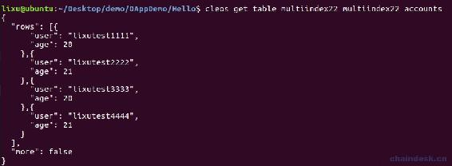
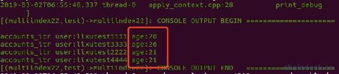
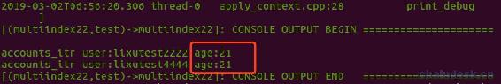

# 4.5 多索引数据库 Multi-Index——多索引与修改表结构

> 本章继续学习多索引数据库的最后的进阶内容，学习完本章内容即已熟练掌握了 EOS 多索引数据库 Multi-Index 的操作。
> 
> 主要有以下几个内容：
> 
> *   定义二级索引表
> *   二级索引表储存数据
> *   按照二级索引排序
> *   修改表结构

## 一、定义二级索引表

multi_index 的主键必须是唯一的，且类型是 uint64_t，且须实现 primary_key()方法返回主键字段。那么二级索引又有什么要求呢

*   Multi-Index 表最多可以使用 16 个二级索引，可以通过多索引进行排序；

*   二级索引不局限于 uint64_t，它支持更多类型：

    idx64：64 位无符号整型键

    idx128：128 位无符号整型键

    idx256：256 位固定大小字典键

    idx_double：双精度浮点键

*   为每个二级索引定义一个函数，用于从 Multi-Index 表的函数中获取键，这个函数会被 indexed_by()使用。

multi_index 类的定义使用了类模板：

```js
template<uint64_t TableName, typename T, typename... Indices>
```

第一个参数是表名，第二个参数是表对象的类型，其余为可变参数 Indices（二级索引），二级索引的数量不能超过 16 个。

在前面我们我们未使用二级索引，所以只传递前面两个参数。

下面我们来定义有一个二级索引的 Multi-Index 表。

```js
/// @abi table accounts
struct account
{
    account_name user;
    uint64_t age;

    uint64_t primary_key() const { return user; }
    uint64_t get_age() const { return age; }

    EOSLIB_SERIALIZE(account, (user)(age))
};
typedef eosio::multi_index<N(accounts), account,
   indexed_by<N(byage), const_mem_fun<account, uint64_t, &account::get_age>>>
   accounts;
```

注意我们定义了一个函数 get_age()用于获取 age 字段，并作为了多索引定义的 indexed_by()中的一个参数。这里将 N(byage)与 get_age()方法进行了关联。在下文将会使用到 byage。

## 二、二级索引表储存数据

这一步骤与前面的单索引表的储存方式没有区别。

新建合约 multiindex2，并创建账号 multiindex22，将上面二级索引的 Multi-Index 表放到 multiindex2.hpp 中，并声明 action `void test(account_name user, uint64_t age);`。

下面在 multiindex2.cpp 中实现如下：

```js
#include "multiindex2.hpp"

void multiindex2::test(account_name user, uint64_t age)
{
    require_auth(user);

    accounts accounts_table(_self, _self);

    //新增
    accounts_table.emplace(_self, & {
        g.user = user;
        g.age = age;
    });
}

EOSIO_ABI(multiindex2, (test))
```

执行如下命令

```js
cleos push action multiindex22 test '["lixutest1111", 20]' -p lixutest1111@active
cleos push action multiindex22 test '["lixutest2222", 21]' -p lixutest2222@active
cleos push action multiindex22 test '["lixutest3333", 20]' -p lixutest3333@active
cleos push action multiindex22 test '["lixutest4444", 21]' -p lixutest4444@active
```

然后查询 accounts 表数据如下



## 三、按照二级索引排序

前面我们出现的迭代器都是按照主索引进行排序遍历了所有数据，下面我们按照二级索引——age 进行排序。

那么需要将 accounts_table 调用 get_index 方式，使其由传入的参数 bgage 进行排序，然后得到实例化的对象 accounts_byage_table。

```js
accounts accounts_table(_self, _self);
auto accounts_byage_table = accounts_table.get_index<N(byage)>();
```

重新实现 test actino 如下：

```js
void multiindex2::test(account_name user, uint64_t age)
{
    require_auth(user);

    accounts accounts_table(_self, _self);

    //新增
    // accounts_table.emplace(_self, & {
    //     g.user = user;
    //     g.age = age;
    // });

    auto accounts_byage_table = accounts_table.get_index<N(byage)>();

    //遍历表数据
    auto accounts_itr = accounts_byage_table.find(age);
    while (accounts_itr != accounts_byage_table.end())
    {
      print("\naccounts_itr user:", name{accounts_itr->user});
      accounts_itr++;
    }
}
```

执行命令

```js
cleos push action multiindex22 test '["lixutest1111",20]' -p lixutest1111@active
```



执行命令

```js
cleos push action multiindex22 test '["lixutest2222",21]' -p lixutest2222@active
```



二级索引 age 目前只有两个值：20、21。通过查询 20 得到的迭代器，迭代器++会获取到 21 的迭代器，而通过查询 21 得到的迭代器，是不会获取到 20 的迭代器。

**结论**

证明了使用二级索引查询到的数据会根据二级索引字段进行排序。若查询中间的一个索引值，那么获取得到的是从指定的中间位置向后进行排序的数据。

## 四、合约源码

**multiindex2.hpp 文件**

```js
#include <eosiolib/eosio.hpp>
using namespace eosio;

class multiindex2 : public eosio::contract
{
public:
  multiindex2(account_name self) : contract(self)
  {
  }

  void test(account_name user, uint64_t age);

  /// @abi table accounts
  struct account
  {
    account_name user;
    uint64_t age;

    uint64_t primary_key() const { return user; }
    uint64_t get_age() const { return age; }

    EOSLIB_SERIALIZE(account, (user)(age))
  };
  typedef eosio::multi_index<N(accounts), account,
                             indexed_by<N(byage), const_mem_fun<account, uint64_t, &account::get_age>>>
      accounts;
};
```

**multiindex.cpp 文件**

```js
#include "multiindex2.hpp"

void multiindex2::test(account_name user, uint64_t age)
{
    require_auth(user);

    accounts accounts_table(_self, _self);

    //新增
    // accounts_table.emplace(_self, & {
    //     g.user = user;
    //     g.age = age;
    // });

    auto accounts_byage_table = accounts_table.get_index<N(byage)>();

    //遍历表数据
    auto accounts_itr = accounts_byage_table.find(age);
    while (accounts_itr != accounts_byage_table.end())
    {
      print("\naccounts_itr user:", name{accounts_itr->user});
      accounts_itr++;
    }
}

EOSIO_ABI(multiindex2, (test))
```

## 五、修改表结构

如果开发中有如下需求，该如何正确有效的处理

*   需要减少表数据结构中的字段，将该字段直接删除即可。

*   需要给表数据结构添加字段，则不能直接在表数据结构中添加字段，否则获取数据时会报错。正确的做法是将原表中的数据进行遍历，一条条的迁移到新表中才行，然后原表即可删除。

下面使用官方文档给出了表迁移解决办法：

1.  原表是 limit_order，创建新表 limit_order2。

```js
 struct limit_order { // Old table
        uint64_t     id;
        uint128_t    price;
        uint64_t     expiration;
        account_name owner;

        auto primary_key() const { return id; }
    };
    typedef eosio::multi_index< N( orders ), limit_order> _limit_order;

    struct limit_order2 { // New table
        uint64_t     id;
        uint128_t    price;
        uint64_t     expiration;
        account_name owner;
        asset        byeos; // added column

        auto primary_key() const { return id; }       
    };
    typedef eosio::multi_index< N( orders2 ), limit_order2> _limit_order2;
```

2.  完成迁移操作

```js
void sth::migrate(){
    require_auth(_self);

    _limit_order old_table(_self, _self);
    _limit_order2 new_table(_self, _self);
    auto itr = old_table.begin();
    while ( itr != old_table.end() ){
      new_table.emplace( _self, & {
        o.id = itr.id;
        o.price = itr.price;
        o.expiration = itr.expiration;
        o.owner = itr.owner;
        o.byeos = itr.price / 3; // implement yourself
      });

      itr++;
    }
}
```

**版权声明：博客中的文章版权归博主所有，转载请联系作者（微信：lixu1770105）。**