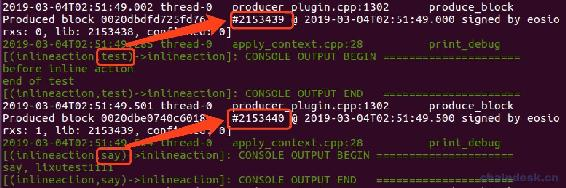

# 四、.6 inline action 与 deferred action

> 本章主要内容包含：
> 
> *   inline action 的使用
> *   deferred action 的使用
> *   调用 inline action 与 deferred action 失败的区别
> *   取消延迟交易

EOSIO 智能合约可以相互通信，例如，让另一个合约执行与当前交易完成相关的某些操作，或触发当前交易范围之外的未来交易。

EOSIO 支持两种基本通信模型，*内联*和*延迟*。在当前事务中执行的操作是内联操作的示例，而触发的将来事务是延迟操作的示例。合约之间的交互应视为异步发生。

inline action 即内联 action，deferred action 即延迟 action。这两种 action 消息都是异步的，那它们有什么区别呢？

## 一、inline action

看看官方对 inline action 的说明：

> Inline 通信的形式是请求作为调用操作的一部分而执行。Inline 通信使用原始交易相同的 scope 和权限作为执行上下文，并保证与当前 action 一起执行。可以被认为是 transaction 中的嵌套 transaction。如果 transaction 的任何部分失败，Inline 动作将和其他 transaction 一起回滚。无论成功或失败，Inline 都不会在 transaction 范围外生成任何通知。

其实就是 inline action 与调用它的 action 在同一个事务中，只要有一个 action 失败，那么整个事务都失败，并一起回滚。

下面我们来应用一下 inline action。

### 1\. 官方 action 的定义

先看下 action 的定义如下：

```js
action( const permission_level& auth, account_name a, action_name n, T&& value )
```

*   第一个参数 auth：是 permission_level 类型的数据，指定调用 action 的账号和权限。
*   第二个参数 a：合约账号，指定调用的 action 所在的合约。
*   第三个参数 n：合约 action，指定需调用的 action。
*   第四个参数 value：调用 action 所传递的参数。

若有如下 action：

```js
void inlineaction::say(account_name user)
{
    require_auth(user);
    print("\nsay, ", name{user});
}
```

则使用内联方式调用 say action 的语法应该是：

```js
action(
    permission_level{user, N(active)},
    N(inlineaction), 
    N(say),
    user)
    .send();
```

注意，action 后面调用.send()以发送该 action。

### 2\. 调用 inline action

新建合约 inlineaction，并创建账号 inlineaction。

**inlineaction.hpp**代码如下：

```js
#include <eosiolib/eosio.hpp>
using namespace eosio;

class inlineaction : public eosio::contract
{
  public:
    inlineaction(account_name self) : contract(self)
    {
    }

    void test(account_name user);
    void say(account_name user);
};
```

**inlineaction.cpp**代码如下：

```js
#include "inlineaction.hpp"

void inlineaction::test(account_name user)
{
    require_auth(user);

    print("before inline action");

    action(
        permission_level{user, N(active)},
        N(inlineaction), 
        N(say),
        user)
        .send();

    print("\nend of test");
}

void inlineaction::say(account_name user)
{
    require_auth(user);
    print("\nsay, ", name{user});
}

EOSIO_ABI(inlineaction, (test)(say))
```

运行如下命令调用合约 action

```js
cleos push action inlineaction test  '["lixutest1111"]' -p lixutest1111@active
```


可见 inline action 执行的顺序是：先执行完了 test action，再执行的 say action。并且它们都打包在了同一个区块中。

若是在 test action 中直接调用 say action，那么它们的执行顺序又是如何的呢？大家不妨试试。

### 3\. inline action 执行失败

下面我们来测试一下 inline action 执行失败，那么调用它的 action 是否真的也会回滚。

在 say action 的最后行加上如下代码：

```js
eosio_assert(false, "inline action fail!");
```

运行后输出如下：


依然执行了原 test action，在 say action 中发生报错。那么 test action 是否被回滚了呢？根据上面的代码如何得到结论，那么如何有效的测试呢？试想一下，在数据库操作中我们是否已经学习过事务操作，所以，这里我们同样用数据库操作来验证即可知道是否回滚了。

在**inlineaction.hpp**中增加如下多索引表定义：

```js
/// @abi table accounts
struct account
{
    account_name user;
    uint64_t age;

    uint64_t primary_key() const { return user; }

    EOSLIB_SERIALIZE(account, (user)(age))
};
typedef eosio::multi_index<N(accounts), account> accounts;
```

在 test action 内加上如下代码：

```js
//新增
accounts_table.emplace(_self, & {
    g.user = user;
    g.age = 20;
});
```

运行后输出与上一次一样，那么新增的多索引表数据是否已经写入了呢，我们查询一下表数据


可见证明了 inline action 与调用它的 action 在同一个事务中，只要有一个 action 失败，那么整个事务都失败，并一起回滚。

### 4\. inline action 合约外调用

上面演示了在合约中进行 inline action 调用，那么夸合约之间调用是否也一样呢？在下一张中我们再来看看有什么蹊跷。大家不妨先尝试着合约间调用，在错误日志中查看到了"eosio.code"这个关键词即可。

## 二、deferred action

官方对 deferred action 的说明：

> deferred 通信在概念上采用发送到对等事务的动作通知的形式。根据生产者的判断，延迟的操作最多可以安排在稍后的时间运行。无法保证将执行延迟操作。
> 
> 如前所述，延迟通信将由生产者自行决定。从原始事务的角度来看，即创建延迟事务的事务，它只能确定创建请求是否已成功提交或是否失败（如果失败，则会立即失败）。延迟交易具有发送它们的合同的权限。交易可以取消延迟交易。

总结就是：deferred action 属于单独的一个事务，与调用它的 action 不属于同一个事务中，所以 deferred action 执行成功与失败与原来的 action 无关。

下面我们来深入学习 deferred action 的奥妙。

### 1\. 官方 transaction 的定义

deferred action 需要使用到 transaction 对象，先看看官方的定义：


我们需要使用到它的字段和 action 在上图中已作了标记：

*   actions：事务中需要调用的 action 交易，可以包含多个 action。
*   delay_sec：延迟多少时间去执行 actions 交易。默认为 0。

send action 用于发送 deferred action，与 inline action 的 send 不一样，这里需要传递参数，如下：

*   sender_id：值由自己设定的，根据唯一的 sender_id 可以取消还没有发生的延迟交易。
*   payer：与多索引操作中的额 payer 一样，指定用于支付网络资源的账号。
*   replace_existing：是否替换之前同一 sender_id 对应的延迟 action；如果为 true，是替换；否则，不替换，然后就会新增一个当前参数指定的延迟 action。

### 2\. 调用 deferred action

在 test action 中注释掉之前的 inline action 调用的代码，新增如下代码

```js
//延迟调用内部 say action
uint128_t sender_id = user;
transaction txn{};
txn.actions.emplace_back(
    action(eosio::permission_level(user, N(active)),
           N(inlineaction),
           N(say),
           user));
txn.delay_sec = 0;
txn.send(sender_id, user, true);
```

另外再注释掉 test action 中的数据库新增操作代码，注释掉 say action 中的`eosio_assert()`。

注意：

*   需引入头文件`#include <eosiolib/transaction.hpp>`。

*   `sender_id = user`：由于 user 是账号，本就是 uint128_t 类型，所以根据自己的需求可以这样设置，是同一个账号调用延迟交易的 sender_id 一致。

*   delay_sec：设置为延迟 0，单位为秒。

运行后输出如下：



可见原 aciton test 与调用的延迟 action say 被打包在了不同了区块中，因为它们不属于同一个事务，所以不会被同时打包，导致有可能不处在同一个区块中。

### 3\. 延迟一定时间执行 action

熟悉 EOS 网络资源与代币抵押相关功能的同学应该了解，赎回需要有一定的赎回期，一般是三天。该业务功能就是需要用到延迟交易中将 delay_sec 设置为三天。

下面我们来演示一下延时 3s 的示例(哈哈，没法演示三天)。

将上面代码中`txn.delay_sec = 0;`改为：

```js
txn.delay_sec = 3;
```

然后运行后输出如下：


可见 say action 延迟了三秒后成功被执行。

### 4\. 取消延迟交易

需要使用到`cancel_deferred()` 方法，它的定义如下：

```js
int cancel_deferred(const uint128_t& sender_id);
```

传入指定的 sender_id 即可取消还没有发生的延迟交易。

新增公开的 cancle action 用于取消 test action 中发生的延迟交易：

```js
void inlineaction::cancle(uint128_t sender_id)
{
    print("cancle:", sender_id);
    cancel_deferred(sender_id);
}
```

并设置生成 cancle 的 ABI。

编译部署后在三秒内依次执行如下命令：

```js
cleos push action inlineaction test '["lixutest1111"]' -p lixutest1111@active
cleos push action inlineaction cancle '[100]' -p lixutest1111@active
```

输出如下：


从输出可知，延迟三秒执行的 say action，被取消执行了。

### 5\. deferred action 执行失败

取消注释 test action 中的数据库新增操作代码，取消注释 say action 中的`eosio_assert()`。


查询一下原 action test 中有没有把数据成功写入到多索引数据库中


## 三、源码

**multiindex2.hpp 文件**

```js
#include <eosiolib/eosio.hpp>
using namespace eosio;

class inlineaction : public eosio::contract
{
  public:
    inlineaction(account_name self) : contract(self)
    {
    }

    void test(account_name user);
    void say(account_name user);
    void cancle(uint128_t sender_id);

    /// @abi table accounts
  struct account
  {
    account_name user;
    uint64_t age;

    uint64_t primary_key() const { return user; }

    EOSLIB_SERIALIZE(account, (user)(age))
  };
  typedef eosio::multi_index<N(accounts), account> accounts;
};
```

**multiindex2.cpp 文件**

```js
#include "inlineaction.hpp"
#include <eosiolib/transaction.hpp>

void inlineaction::test(account_name user)
{
    require_auth(user);

    print("before inline action");

    accounts accounts_table(_self, _self);
    //新增
    // accounts_table.emplace(_self, & {
    //     g.user = user;
    //     g.age = 20;
    // });

    //内联调用内部 say action
    // action(
    //     permission_level{user, N(active)},
    //     N(inlineaction),
    //     N(say),
    //     user)
    //     .send();

    //延迟调用内部 say action
    uint128_t sender_id = 100;
    transaction txn{};
    txn.actions.emplace_back(
        action(eosio::permission_level(user, N(active)),
               N(inlineaction),
               N(say),
               user));
    txn.delay_sec = 3;
    txn.send(sender_id, user, true);

    print("\nend of test,sender_id:", sender_id);
}

void inlineaction::cancle(uint128_t sender_id)
{
    print("cancle:", sender_id);
    cancel_deferred(sender_id);
}

void inlineaction::say(account_name user)
{
    require_auth(user);
    print("say, ", name{user});
    // eosio_assert(false, "inline action fail!");
}

EOSIO_ABI(inlineaction, (test)(say)(cancle))
```

## 四、总结

inline action 与 deferred action 的区别：

*   `inline action`与原来的 action 是同一个事务。如果`inline action`失败了，整个事务会回滚；`deferred action`与原来的 action 不属于同一个事务，并且不保证`deferred action`能够成功执行，如果失败了，也不会引起原有 action 的事务回滚。

*   因为`inline action`与原来的 action 是同一个事务，所以他们肯定会被打包在同一个块中；而`deferred action`不保证这一点，实际上，一般情况都不会在同一个区块中。

*   `deferred action`可以设置延迟多少时间后执行；而`inline action`，超级节点要保证他们在同一个事务中，因而会尽可能快的执行它，所以不能设置延迟时间。

若一个事务中需要处理的逻辑比较多，尽可能将其中一部分 action 设置为延迟执行。因此，一般转账操作，都会使用 deferred 调用`transfer()`。

每个事务必须在 30ms 或更短的时间内执行。如果事务包含多个操作，并且这些操作的总和大于 30 毫秒，则整个事务将失败。在没有对其操作进行并发性要求的情况下，请采用 deferred action。

下一章我们学习如何夸合约调用 action。

**版权声明：博客中的文章版权归博主所有，转载请联系作者（微信：lixu1770105）。**