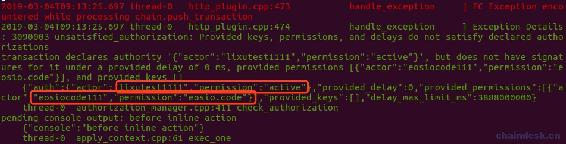

# 四、.7 eosio.code 权限使合约间交互

> 上一章我们学习了`deferred action`和`inline action`，这两种方式调用合约 action，然而例子中我们都是调用的合约内部的 action。那么调用外部合约 action 可以吗？会有什么坑呢？这就是本章的内容：`eosio.code`权限，需要正确使用它才能使合约间进行交互。
> 
> 本章主要内容包含：
> 
> *   理解 eosio.code 权限的关键作用
> *   配置账号的 eosio.code 权限
> *   授权 eosio.code 权限的危害
> *   使用 inline 与 deferred 实现跨合约调用

## 一、跨合约调用

新建合约 eosiocode，并创建账号 eosiocode111.

下面在 eosiocode 合约的 test action 中使用内联调用 multiindex22 合约的 test action。

**inlineaction.hpp**代码如下：

```js
#include <eosiolib/eosio.hpp>
using namespace eosio;

class eosiocode : public eosio::contract
{
  public:
    eosiocode(account_name self) : contract(self)
    {
    }

    void test(account_name user);
};
```

**inlineaction.cpp**代码如下：

```js
#include "eosiocode.hpp"
#include <eosiolib/transaction.hpp>

void eosiocode::test(account_name user)
{
    require_auth(user);

    print("before inline action");

    //内联调用外部 multiindex22 合约 test action
    action(
        permission_level{user, N(active)},
        N(multiindex22),
        N(test),
        std::make_tuple(user, 20))
        .send();

    print("\nend of test ");
}

EOSIO_ABI(eosiocode, (test))
```

注意：若内联 action 的参数不止一个，则需要使用`std::make_tuple(param1,param2,[...])`方式传递多个参数。

运行如下命令调用合约 action

```js
cleos push action eosiocode111 test '["lixutest1111"]' -p lixutest1111@active
```

会报错`3090003 unsatisfied_authorization: Provided keys, permissions, and delays do not satisfy declared authorizations`，详细信息输出如下



在错误日志中我们看到已经成功打印了`"before inline action"`，说明在调用 inline action 时发生的错误。

输出中指出使用的是`lixutest1111@active`签名了该交易，但是没有使用`eosiocode111@eosio.code`签名，所以导致报错。

在老版本中，以前的跨合约交互的方式：

*   用户对交易(或者事务)签名授权后，发送给合约，合约收到 action 之后，以当前合约被授权的权限执行新的`inline action`。用户通常使用`active`权限签名的，并且此权限可以做很多事情，比如把资产转移等等，这是非常不安全的行为。
*   升级后的方式是，用户把交易(或者事务)签名授权后，发送给合约，合约收到 action 之后，以当前合约账号的`eosio.code`许可，执行`inline action`。这样的方式规避了暴露用户 action 权限的强大功能的风险。

## 二、eosio.code 权限的关键作用

可知`eosio.code`是一种权限，若需跨合约交互，可以有如下解决办法：

1.  配置调用者`active`权限授权给合约账号的`eosio.code`权限。
2.  配置调用者新增权限`A`，将`A`权限授权给合约账号的`eosio.code`权限。并且还需配置调用者的权限映射关系，将`A`权限授权给合约账号的需调用的 action。
3.  尽可能使合约账号本身去进行跨合约交互，这样避免了让用户配置自己的权限给合约授权，只需配置合约账号本身的`eosio.code`权限即可。

上面三种解决办法中，最差的解决办法是第一种，最优解决办法是第三种。

下面来分析下它们存在的问题：

*   第一种：若用户将自己的`active`权限授权给合约账号的`eosio.code`权限，那么合约账号可以任意的进行跨合约调用，这将会给用户带来非常大的危害。合约账号可以调用 token 合约的`transfer action`将用户的金额转走。
*   第二种：让用户将新增的权限授权给合约账号的相关 action，这样可以有效保护用户的 active 权限不被滥用，但是用户非常难以管理自己的权限，并且用户的学习成本也很高。
*   第三种：通过配置合约账号自身的 active 权限授权给`eosio.code`权限，这样不会给用户带来任何不必要的风险，且用户不需要做任何操作。

所以在此，呼吁大家不要让用户给合约授权，更重要的是您不要将自己的 active 权限给任何合约授权。

## 三、用户授权给合约 eosio.code 权限

大家应该都熟悉 cleos 了，具体命令我就不作解释了，使用如下命令设置合约账号 eosiocode111 的 eosio.code 权限。

```js
cleos set account permission eosiocode111 eosio.code EOS6j775hTzTHTWnS9Ta1vu42qW8UHzP463QqGDzFtun6fybzKesd
```

会发生如下报错，因为 eosio.code 是系统为账号已经生成了，不需要我们在设置。


### 1\. 配置用户的 eosio.code 权限

根据上面的错误提示`lixutest1111@active`签名了该交易，但是没有使用`eosiocode111@eosio.code`签名，所以，首先我们将用户的 active 授权给合约账号，看看所带来的危害。下面将用户 lixutest1111 的 active 授权给合约账号 eosiocode111 的 eosio.code 权限。

将 eosiocode111 的 eosio.code 权限作为 lixutest1111 的 active 权限的一个主体，命令行如下：

```js
cleos set account permission lixutest1111 active '{"threshold": 1, "keys": [{"key":"EOS6j775hTzTHTWnS9Ta1vu42qW8UHzP463QqGDzFtun6fybzKesd","weight": 1}], "accounts": [{"permission":{"actor":"eosiocode111", "permission":"eosio.code"}, "weight":1}], "waits": []}' 
```

现在 lixutest1111 的权限配置如下：


### 2\. 跨合约调用

再次使用 lixutest1111 调用 eosiocode111 合约的 test action：


发现并未报错，再查看 nodeos 服务的日志：


发现成功执行了 multiindex22 合约中的 test active。使用的是`lixutest1111@active`签名了该交易，但同时也拥有`eosiocode111@eosio.code`权限的签名，所以能成功进行跨合约调用。

### 3\. 用户潜在的危害

现在我们重新实现 eosiocode111 合约的 test active，将用户的钱转走。

```js
void eosiocode::test(account_name user)
{
    require_auth(user);

    print("before inline action");

    //内联调用外部 eosio.token 合约的 transfer　action
    asset value = asset(20000, symbol_type(symbol_name(string_to_symbol(4, "EOS"))));
    action(permission_level{user, N(active)},
           N(eosio.token),
           N(transfer),
           std::make_tuple(user, _self, value, std::string("memo")))
        .send();

    print("\nend of test ");
}
```

先查询 lixutest1111 的余额，再使用 lixutest1111 调用 eosiocode111 合约的 test action 前，最后再次查询 lixutest1111 的余额：


发现并未报错，再查看 nodeos 服务的日志：


可见，用户调用 eosiocode111 合约的 test action，用户的钱也能不被察觉的转走。所以授权自己的 active 权限给别人是非常危险的做法。

### 4\. 收回授权的 eosio.code 权限

大家不妨自己试试，不会的在评论区留言。

## 四、跨合约调用的正确姿势

### 1\. 配置合约账号的 eosio.code 权限

将合约账号自己的 active 授权给 eosio.code 权限，也就是把`eosiocode111@eosio.code`作为 eosiocode111 合约账号的 active 权限的一个主体。命令行如下：

```js
cleos set account permission eosiocode111 active '{"threshold": 1, "keys": [{"key":"EOS6j775hTzTHTWnS9Ta1vu42qW8UHzP463QqGDzFtun6fybzKesd","weight": 1}], "accounts": [{"permission":{"actor":"eosiocode111", "permission":"eosio.code"}, "weight":1}], "waits": []}' 
```

现在 eosiocode111 的权限配置如下：


### 2\. 跨合约内联调用

现在再重新实现 eosiocode111 合约的 test active，使用合约账号 _self 的权限去进行内联调用。

```js
 void eosiocode::test(account_name user)
{
    require_auth(user);

    print("before inline action");

    //内联调用外部 multiindex22 合约 test action
    action(
        permission_level{_self, N(active)},
        N(multiindex22),
        N(test),
        std::make_tuple(_self, uint64_t(20)))
        .send();

    print("\nend of test");
}
```

调用合约运行后成功被执行


### 3\. 跨合约延迟调用

再重新实现 eosiocode111 合约的 test active，使用 deferred action 延迟调用。

```js
 void eosiocode::test(account_name user)
{
    require_auth(user);

    print("before inline action");

    //延迟调用外部 multiindex22 合约 test action
    uint128_t sender_id = 100;
    transaction txn{};
    txn.actions.emplace_back(
        action(eosio::permission_level(user, N(active)),
               N(multiindex22),
               N(test),
               std::make_tuple(_self, uint64_t(20))));
    txn.delay_sec = 1;
    txn.send(sender_id, user, true);

    print("\nend of test");
}
```

调用合约运行后成功被执行，但是延迟交易的 action 并为输出，因为它们不属于同一个事物中。


再看下 nodeos 节点的输出：


## 五、源码

**eosiocode.hpp 文件**

```js
#include <eosiolib/eosio.hpp>
using namespace eosio;

class eosiocode : public eosio::contract
{
  public:
    eosiocode(account_name self) : contract(self)
    {
    }

    void test(account_name user);
};
```

**eosiocode.cpp 文件**

```js
#include "eosiocode.hpp"
#include <eosiolib/transaction.hpp>
#include <eosiolib/asset.hpp>

void eosiocode::test(account_name user)
{
    require_auth(user);

    print("before inline action");

    //内联调用外部 multiindex22 合约 test action
    action(
        permission_level{_self, N(active)},
        N(multiindex22),
        N(test),
        std::make_tuple(_self, uint64_t(20)))
        .send();

    //延迟调用外部 multiindex22 合约 test action
    // uint128_t sender_id = 100;
    // transaction txn{};
    // txn.actions.emplace_back(
    //     action(eosio::permission_level(user, N(active)),
    //            N(multiindex22),
    //            N(test),
    //            std::make_tuple(_self, uint64_t(20))));
    // txn.delay_sec = 1;
    // txn.send(sender_id, user, true);

    //内联调用外部 eosio.token 合约的 transfer　action
    // asset value = asset(20000, symbol_type(symbol_name(string_to_symbol(4, "EOS"))));
    // action(permission_level{user, N(active)},
    //        N(eosio.token),
    //        N(transfer),
    //        std::make_tuple(user, _self, value, std::string("memo")))
    //     .send();

    print("\nend of test");
}

EOSIO_ABI(eosiocode, (test))
```

## 六、总结

通过本章的学习我们能实现合约间交互，可以通过 inline action 与 deferred actino 两种方式，理解了 eosio.code 权限在跨合约间交互的关键性作用。另外，通过案例演示告诫大家千万别把自己的权限授权给别人。

在项目中，再学习如何新建权限，并授权它给合约的指定 action。

开发者若需要跨合约调用，则把调用者的权限授权给合约账号的 eosio.code 即可。在一个项目中，一般不止一个合约，所以在做权限配置的时候，应充分考虑这一点，使其它合约账号也能在该合约中进行内联交易。

**版权声明：博客中的文章版权归博主所有，转载请联系作者（微信：lixu1770105）。**