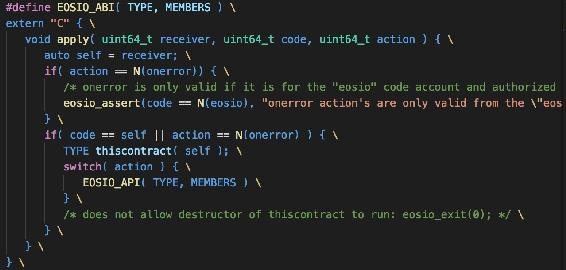
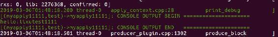
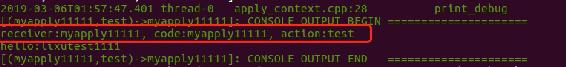
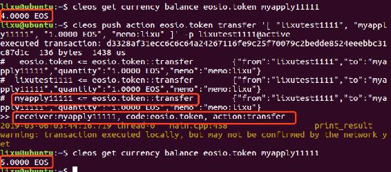
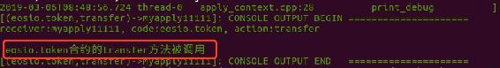
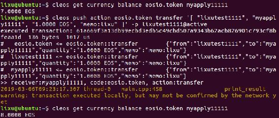
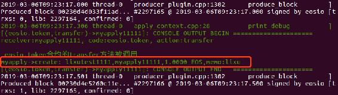

# 4.8 合约监听转账通知

> 前面介绍到 BetDice 社区中的 Dice 游戏，投注的方法是向合约账号 betdiceadmin 转账。那么 betdiceadmin 它是如何知道别人给它转账了呢？这就是本章的重点——合约监听转账通知。
> 
> 本章主要内容包含：
> 
> *   理解 EOSIO_ABI 宏与 apply 方法的作用
> *   重定义 EOSIO_ABI 与 apply
> *   receiver、code 与 action，这三者之间的关系
> *   如何对转账通知作出响应
> *   合约安全防御

## 一、EOSIO_ABI 宏与 apply 方法

对于每一个智能合约而言，都必须要提供一个 apply 的接口。

**apply**

apply 是动作处理器，它监听所有传入的动作并根据函数内的逻辑作出反应。该 apply 函数需要三个输入参数，receiver、code 和 action。

```js
void apply( uint64_t receiver, uint64_t code, uint64_t action )
```

**execute_action**

execute_action 是执行 action 的函数模板，使用远程 API 调用 action 时，会执行这个函数。

```js
bool execute_action( T* obj, void (Q::*func)(Args...)  ) 
```

**EOSIO_API_CALL**

EOSIO_API_CALL 是宏，内部调用了 execute_action 函数，执行一个 Action。

```js
#define EOSIO_API_CALL( r, OP, elem ) \
   case ::eosio::string_to_name( BOOST_PP_STRINGIZE(elem) ): \
      eosio::execute_action( &thiscontract, &OP::elem ); \
      break;
```

**EOSIO_API**

EOSIO_API 是宏，使用 BOOST_PP_SEQ_FOR_EACH 循环调用 EOSIO_API_CALL，即调用多个 Action。

```js
#define EOSIO_API( TYPE,  MEMBERS ) \
   BOOST_PP_SEQ_FOR_EACH( EOSIO_API_CALL, TYPE, MEMBERS )
```

**EOSIO_ABI**

EOSIO_ABI 也是一个宏，里面实现了 apply 函数，后面还调用 EOSIO_API 这个宏，即它也是用来调用 execute_action 来执行 action 的。



## 二、合约中重定义 EOSIO_ABI 与 apply

在我们自行编写智能合约的时候在类内部最后会加上这个宏。所以当我们加载自己编写的智能合约时，会把编写好的指定的函数功能放到 action 上面去执行。

创建 myapply 合约，然后创建 myapply11111 合约账号。

**myapply.hpp**

```js
#include <eosiolib/eosio.hpp>

using namespace eosio;
using namespace std;

class myapply : public eosio::contract
{
public:
    myapply(account_name self) : contract(self)
    {
    }

    void test(account_name user);
}; 
```

**myapply.cpp**

```js
#include "myapply.hpp"

using namespace std;

void myapply::test(account_name user)
{
    require_auth(user);

    print("hello:", name{user});
}

#define EOSIO_ABI( TYPE, MEMBERS ) \
extern "C" { \
    void apply( uint64_t receiver, uint64_t code, uint64_t action ) { \
        auto self = receiver; \
        if( action == N(onerror)) { \
            /* onerror is only valid if it is for the "eosio" code account and authorized by "eosio"'s "active permission */ \
            eosio_assert(code == N(eosio), "onerror action's are only valid from the \"eosio\" system account"); \
        } \
        if( code == self || action == N(onerror) ) { \
            TYPE thiscontract( self ); \
            switch( action ) { \
                EOSIO_API( TYPE, MEMBERS ) \
            } \
            /* does not allow destructor of thiscontract to run: eosio_exit(0); */ \
        } \
    } \
} \

EOSIO_ABI(myapply, (test))
```

运行如下命令调用合约：

```js
cleos push action myapply11111 test '["lixutest1111"]' -p lixutest1111@active
```

在节点服务中正常的输出了日志：



## 三、receiver、code 与 action

### 1\. 获取调用合约自身 action 的通知

在 apply 方法中的第一行加上如下 print 代码：

```js
print("receiver:", name{receiver}, ", code:", name{code}, ", action:", name{action}, "\n"); \
```

现在调用 myapply11111 合约后的输出日志如下：



可见在调用 test actoin 之前先获取到了 receiver、code 与 action，然后在 execute_action 内部再去分发 action。

*   receiver：接收方 myapply11111。
*   code：合约账号 myapply11111。
*   action：调用的 test action。

大家再好好体会一下 receiver、code 这两个参数，下文会充分使用 receiver 与 code 的关系进行学习。

### 2\. 获取转账通知

在 apply 方法中已经帮我们监听了接收方是该合约账号的任何通知与 action。我们只需实现相应 action，或者对相关通知作出响应即可。

从上面的输出我们可以看到，当合约账号的 action 被触发时，就会先经过 apply 方法去处理。那么我们向 eosio.token 合约转账，它还能收到响应吗？下面我们来拭目以待。

使用账号 lixutest1111 向该合约账号 myapply11111 转账 EOS：

```js
cleos push action eosio.token transfer '[ "lixutest1111", "myapply11111", "1.0000 EOS", "memo:lixu" ]' -p lixutest1111@active
```

输出如下：



从输出可见：

*   合约账号 myapply11111 的余额从 4 EOS 增加到了 5 EOS，正是 push action 中转的 1 EOS。

*   “#”的可以理解为触发了该合约的 apply 方法，可以看到有三个“#”，分别代表：

    *   首先触发了 eosio.token 合约，需要调用它的 transfer action 进行转账。在 transfer action 内部通知转账方和接收方。
    *   然后通知给了转账放 lixutest1111.
    *   最后通知了转账接受方，即合约账号 myapply11111。
*   `“>>”`后面的就是刚才加在合约中的 apply 的输出。

    *   receiver：接收方，myapply11111。
    *   code：合约账号，eosio.token。
    *   action：调用的 action 方法，transfer。

**总结：**

通过调用其它合约，然后对合约账号发出通知后，相应的合约的 apply 方法会收到响应，然后去处理相关业务功能。

若 receiver 与 code 一致，说明是调用自身的 action，若不一致，则是收到了通知。

## 四、对转账通知作出响应

apply 默认的实现是只处理了 receiver 与 code 一致的情况，对于接收到的通知并未做任何处理，这就需要我们在此添加自己的业务代码了。

为了对转账通知作出响应，我们需要做两个步骤：

1.  处理通知消息：实现`if( code == self)`这个代码的`else`语句，以处理通知。
2.  处理业务功能：根据 code 与 action，通过`execute_action()`去调用相应 action 处理业务功能。

### 1\. 安全处理转账通知消息

在`else`中我们需要实现如下代码

```js
if (code == N(eosio.token)) { \
    if (action == N(transfer)) { \
        print("\n eosio.token 合约的 transfer 方法被调用"); \
    }\
}
```

*   `if (code == N(eosio.token))`：为了确保是 eosio.token 这个合约发出的通知，否则容易被收到假消息误处理相关业务。在前期很多博彩类 DApp 就因为为做此判断导致收到了假转账通知和假 EOS，损失惨重。
*   `if (action == N(transfer))`：为了确保是相应的合约中的指定 action 被触发了，才做相应的业务处理。

我们重写实现 apply 方法如下：

```js
#define EOSIO_ABI( TYPE, MEMBERS ) \
extern "C" { \
    void apply( uint64_t receiver, uint64_t code, uint64_t action ) { \
        print("receiver:", name{receiver}, ", code:", name{code}, ", action:", name{action}, "\n"); \
        auto self = receiver; \
        if( action == N(onerror)) { \
            /* onerror is only valid if it is for the "eosio" code account and authorized by "eosio"'s "active permission */ \
            eosio_assert(code == N(eosio), "onerror action's are only valid from the \"eosio\" system account"); \
        } \
        if( code == self || action == N(onerror) ) { \
            TYPE thiscontract( self ); \
            switch( action ) { \
                EOSIO_API( TYPE, MEMBERS ) \
            } \
            /* does not allow destructor of thiscontract to run: eosio_exit(0); */ \
        } else { \
            if (code == N(eosio.token)) { \
                if (action == N(transfer)) { \
                    print("\n eosio.token 合约的 transfer 方法被调用"); \
                }\
            }\
        } \
    } \
} \
```

然后继续向 myapply11111 转账：

```js
cleos push action eosio.token transfer '[ "lixutest1111", "myapply11111", "1.0000 EOS", "memo:lixu" ]' -p lixutest1111@active
```



发现已经执行到了到了我们指定的 code 与 action 中，接下来就是调用指定的 action 去处理业务了。

### 2\. 在 apply 中调用指定 action

在 apply 中调用指定 action 就需要使用我们上面提到的 action 分发的一个方法`execute_action()`，合约中的 action 调用，都必须通过它来触发的，因此现在我们需要自定义的触发调用相应 action，就不得不使用到它了。

那么如何使用该方法呢？根据上面`execute_action()`的定义，新入门的大伙可能不太会用，我们不如先看看`EOSIO_API_CALL`内部对`execute_action()`的调用吧。

```js
eosio::execute_action( &thiscontract, &OP::elem );
```

现在，我们可以照葫芦画瓢去实现转发 action 了吧。

**注意：**被触发的 action 的参数必须与发起通知的 action 的参数保持一致。

我们让 create action 作为转账通知转发的 action，那么它的参数就必须与 transfer action 的参数一致。实现如下：

```js
void myapply::create(account_name from, account_name to, asset quantity, string memo)
{
    require_auth(from);
    print("\nmyapply->create: ", name{from}, ",", name{to}, ",", quantity, ",", memo);
}
```

因此，apply 方法中`execute_action()`调用的 action 代码如下：

```js
TYPE thiscontract(self);                                                                                                                 eosio::execute_action(&thiscontract, &myapply::create);
```

现在，再向 myapply11111 转账：



nodeos 节点服务将会输出如下日志：



OK，到此我们已经完成了转发转账通知。

接下来，就需要你在 create action 中去实现具体的业务逻辑了。

## 五、源码

**myapply.hpp 文件**

```js
#include <eosiolib/eosio.hpp>
#include <eosiolib/asset.hpp>

using namespace eosio;
using namespace std;

class myapply : public eosio::contract
{
public:
  myapply(account_name self) : contract(self)
  {
  }

  void test(account_name user);
  void create(account_name from, account_name to, asset quantity, string memo);
};
```

**myapply.cpp 文件**

```js
#include "myapply.hpp"

using namespace std;

void myapply::test(account_name user)
{
    require_auth(user);

    print("hello:", name{user});
}

void myapply::create(account_name from, account_name to, asset quantity, string memo)
{
    require_auth(from);
    print("\nmyapply->create: ", name{from}, ",", name{to}, ",", quantity, ",", memo);
}

#define EOSIO_ABI( TYPE, MEMBERS ) \
extern "C" { \
    void apply( uint64_t receiver, uint64_t code, uint64_t action ) { \
        print("receiver:", name{receiver}, ", code:", name{code}, ", action:", name{action}, "\n"); \
        auto self = receiver; \
        if( action == N(onerror)) { \
            /* onerror is only valid if it is for the "eosio" code account and authorized by "eosio"'s "active permission */ \
            eosio_assert(code == N(eosio), "onerror action's are only valid from the \"eosio\" system account"); \
        } \
        if( code == self || action == N(onerror) ) { \
            TYPE thiscontract( self ); \
            switch( action ) { \
                EOSIO_API( TYPE, MEMBERS ) \
            } \
            /* does not allow destructor of thiscontract to run: eosio_exit(0); */ \
        } else { \
            if (code == N(eosio.token)) { \
                if (action == N(transfer)) { \
                    print("\n eosio.token 合约的 transfer 方法被调用"); \
                    TYPE thiscontract(self); \
                    eosio::execute_action(&thiscontract, &myapply::create); \
                }\
            }\
        } \
    } \
} \

EOSIO_ABI(myapply, (test)(create))
```

## 六、总结

在转发转账通知时，切记！必须对合约账号与 action 进行判断，另外还必须判断转账的代币是否是我们需要的代币。否则，将会带来安全隐患，很容易被黑客攻击造成资金损失。另外，项目开发完成后我们将会用一章的内容详细介绍当前最新最全的`合约安全——漏洞攻击与防范`。

**思考：**

*   若使用前面 dicetoken111 合约发行的 JXB 进行转账，会有什么结果？
*   若不支持处理其它代币转账，那么如何支持其它的代币，使转账后处理的业务与转账 EOS 一样。

**版权声明：博客中的文章版权归博主所有，转载请联系作者（微信：lixu1770105）。**