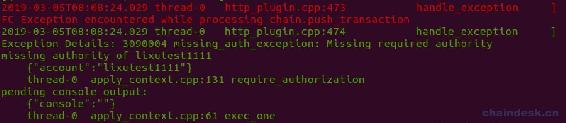
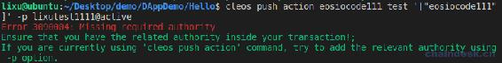
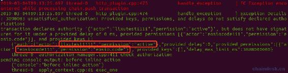
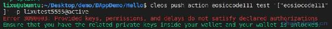
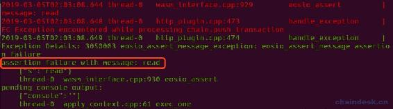

# 四、.9 EOS 合约开发错误总结

> 下面记录了在 EOS 合约开发中常见的错误。

### 1\. 合约权限验证失败

**报错：**

合约中的执行错误

```js
3090004 missing_auth_exception: Missing required authority
```

或者调用合约时出的错误

```js
Error 3090004: Missing required authority
```

**详细错误：**



或者



**错误分析：**

由于合约中对账号的签名进行了验证，而发生的交易并未使用相应的账号签名。

eg：`require_auth(user);`

**解决办法：**

调用合约时添加上相应账号的签名。

### 2\. 未找到签名的私钥

**报错：**

合约中的执行错误

```js
3090003 unsatisfied_authorization: Provided keys, permissions, and delays do not satisfy declared authorizations
```

或者调用合约时出的错误

```js
Error 3090003: Provided keys, permissions, and delays do not satisfy declared authorizations
```

**详细错误：**



或者



**错误分析：**

*   未给授权给合约的 eosio.code 权限。
*   签名时未找到签名账号的相应权限的私钥。

**解决办法：**

eg：`-p lixutest5555@active`

将 lixutest5555 账号的 active 权限的私钥导入到已解锁的钱包，若已导入钱包，可能是钱包未解锁。

### 3\. 参数类型不匹配

**报错：**

```js
assertion failure with message: read
```

**详细错误：**



**错误分析：**

由于合约间调用参数类型不匹配导致，包含 inline action、deferred action 方式。

eg：

*   uint64_t 类型的参数：传递的是一个 uint32_t 类型的数字`100`。
*   string 类型的参数：传递的是字符串`"lixu"`。

**解决办法：**

将传递的参数进行强制类型转换。

eg：

*   uint64_t 类型的参数：`uint64_t(100)`。
*   string 类型的参数：`std::string("lixu")`。

**版权声明：博客中的文章版权归博主所有，转载请联系作者（微信：lixu1770105）。**