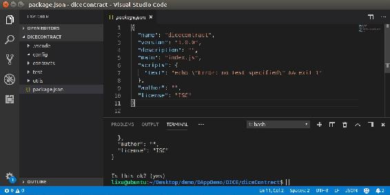
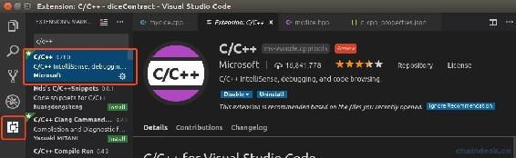
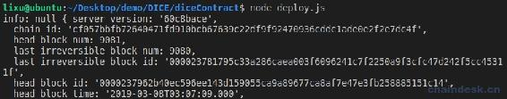
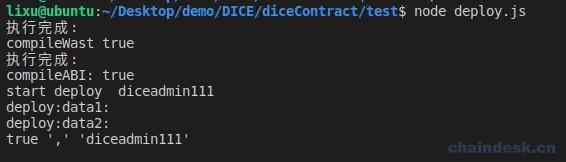
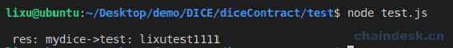

# 5.1 创建后端项目 diceContract 开发合约与部署脚本

> diceContract 项目用于开发合约，另外也需要开发脚本去部署合约，所以得支持 C++、nodejs 语言的编译器，这里我推荐使用 VSCode。
> 
> 本章主要内容：
> 
> *   创建 diceContract 项目
> *   集成 EOSJS 连接到 EOS 区块链
> *   编写 deploy.js 部署合约
> *   编写 test.js 与合约交互

## 一、创建 diceContract 项目

在本教程中博主使用的是 VSCode 开发工具，选择它的原因也是因为它功能非常强大，不但可以写 Nodejs、react、html，还支持 php、solidity、C++，相比 eclipse、sublime text、Atom，个人还是最偏好使用 VSCode，当然，大家也可以使用自己喜欢的 IDE。点击[VSCode 下载地址](https://code.visualstudio.com/Download)进行安装。

按照如下步骤执行：

1.  在适当位置创建 DICE/diceContract 文件夹，然后 cd 进入。

2.  运行`npm init`初始化项目，然后不断按`回车键`即可。

3.  使用 VSCode 打开 diceContract 项目。

4.  然后新建如下文件夹：

    config：项目配置文件。

    contracts：合约文件夹。

    test：测试脚本，也包含部署脚本。

    utils：项目公共 API。

最后项目界面如下：



最后安装下 c/c++插件，按照如下操作下载安装 c/c++插件。安装成功之后，重启一下 VSCode 插件即可生效。



## 二、 集成 EOSJS 连接到 EOS 区块链

部署合约的时候是部署到链上，所以我们需要连接到 EOS 区块链环境，nodejs 中提供了 eosjs 库，用于与 EOS 区块链进行交互。

### 1\. EOSJS 简单用法

安装 EOSJS，需要进入到 diceContract 项目。

```js
npm install eosjs binaryen
```

获取当前区块链的信息和查询指定区块的信息。在项目根目录中新建 deploy.js，代码如下：

```js
Eos = require('eosjs')

eos = Eos()

eos.getInfo((error, result) => {
     console.log("info:", error, result)
})

eos.getBlock(10, (error, result) => {
    console.log("block:", error, result)
})
```

输出如下：



若报错，则是 nodeos 默认连接的是 8888 端口，直接使用下一步的代码，去指定端口。

### 2\. EOSJS 配置

以下的教程在不特别说明的情况下，都是在本地网络上进行的开发。

在前面介绍了简单的配置 eos，在开发中我们一般需要如下完整的配置。

注意：httpEndpoint 中的 ip 和端口需要指定自己配置的 eos 节点服务。

```js
let Eos = require('eosjs')
let binaryen = require('binaryen')

config = {
    chainId: "cf057bbfb72640471fd910bcb67639c22df9f92470936cddc1ade0e2f2e7dc4f",
    keyProvider: ["5KYU9Xsv3SXY674eXfDiGD5SrQXU6JZeULZsXAtcY1x3huAzrHt"], 
    httpEndpoint: 'http://127.0.0.1:8888',
    binaryen: binaryen,
    expireInSeconds: 60,
    broadcast: true,
    verbose: false, 
    sign: true
}

eos = Eos(config)
```

*   **chainId**：16 进制数据。要连接的**区块**链的唯一 ID，这是有效交易签名所必需的字段。chainId 通过 `get_info`API 调用提供。签署的所有交易仅对具有此 chainId 的区块链有效。出于安全原因验证 chainId。

*   **keyProvider**：array|string 数据。提供用于签名事务的私钥。如果提供了多个私钥，不能确定使用哪个私钥，可以使用调用`get_required_keys`API 获取要使用签名的密钥。

*   **keyPrefix**：string 数据。更改公钥前缀。

*   **httpEndpoint**：string 数据。提供 nodeos 服务的地址，如本地节点地址：[`127.0.0.1:8888`](http://127.0.0.1:8888)。

*   **expireInSeconds**：number 数据。事务到期前的秒数，时间基于 nodeosd 的时间。

*   **broadcast**：boolean 值，默认是 true。使用 true 将交易发布到区块链，使用 false 将获取签名的事务。

*   **verbose**：boolean 值，默认是 false。详细日志记录。

*   **debug**：boolean 值，默认是 false。低级调试日志记录。

*   **sign**：boolean 值，默认是 true。使用私钥签名交易。保留未签名的交易避免了提供私钥的需要。

*   **authorization**：array<auth>|auth 数据。替换默认的 eosjs 的授权，通常在 multisig 配置中标识签名帐户和权限。授权可以是格式化为`account@permission`的字符串，如下</auth>

    ```js
    {authorization: 'user@active'}
    ```

    注意：`authorization`适用于个人操作，不属于`Eos(config)`。

**可选项**：

可以在 EOSJS 方法的参数之后提供可选项，如下操作。

```js
options = {
    authorization: 'lixutest1111@active',
    broadcast: true,
    sign: true
}
eos.transfer('lixutest1111', 'lixutest3333', '1.0000 EOS', '', options)
```

至此，我们成功集成好了 eosjs，可以查看[eosjs 开发文档](https://github.com/EOSIO/eosjs/tree/v16.0.0)。

## 三、编写 deploy.js 部署合约

在上一章我们学习 C++编写合约的过程中，需要编译、部署后，才能去调用合约 action，该过程很繁琐。因此我们写一个 js 脚本去自动编译，成功后在自动部署的功能。

当然，也可以写 shell 脚本自动编译合约，但是无法部署合约。所以，我们直接在 js 脚本中实现编译、部署功能，为后续的项目开发提供效率。

下面我们就先新建 mydice 合约，然后通过 js 脚本去编译，然后部署、调用。

### 1\. 构建项目的 mydice 合约

在 contracts 合约文件夹下创建 mydice 文件，再新建 mydice.cpp、mydice.hpp 文件，代码实现如下：

**mydice.hpp 文件**

```js
#include <eosiolib/eosio.hpp>

using namespace eosio;

class mydice : public eosio::contract
{
public:
  mydice(account_name self) : contract(self)
  {
  }

  void test(const account_name &user);
};
```

**mydice.cpp 文件**

```js
#include "mydice.hpp"

void mydice::test(const account_name &user)
{
    print("mydice->test:", name{user});
}

EOSIO_ABI(mydice, (test))
```

### 2\. 使用 js 脚本编译合约

之前是执行如下命令编译生成 wast、abi 文件：

```js
eosiocpp -o hello.wast hello.cpp
eosiocpp -g hello.abi hello.cpp
```

现在我们在 test 文件夹下编写 deploy.js 文件去执行上面的命令。在 nodejs 中使用系统提供的 exec 库即可执行命令，用法如下：

```js
let exec = require("child_process").exec

exec(cmdStr, function (err, stdout, stderr) {});
```

具体代码实现看下文的源码 deploy.js。

### 3\. 使用 EOSJS 部署合约

使用 eosjs 连接上 EOS 区块链后，部署合约就简单了，需要使用`setcode()`与`setadi()`两个方法，代码如下：

```js
let data1 = await eos.setcode(contractAccount, 0, 0, wasm) 
console.log("deploy:data1:")
let data2 = await eos.setabi(contractAccount, JSON.parse(abi)) 
console.log("deploy:data2:")
```

具体的源码看下文 deploy.js。

运行脚本`node deploy.js`：



## 四、编写 test.js 与合约交互

js 与合约交互，大致是以下三个步骤：

1.  配置 EOS 节点数据获取 eos 对象；
2.  实例化合约对象；
3.  调用合约的 ABI 方法。

在 test 文件夹下新建 test.js 文件，核心代码如下，完整源码看下文：

```js
async function callDiceAPI() {
    let eos = getEOSJS(testPrivate)

    let myContract = await eos.contract(adminAccount)

    await myContract.test(testAccount, signAction(testAccount))
    .then((data) => {
        if (data && data.processed && data.processed.action_traces && data.processed.action_traces.length > 0 && data.processed.action_traces[0].console) {
            let res = data.processed.action_traces[0].console
            console.log("\n res:", res)
        }
    })
    .catch((err) => {
        console.log(err)
    })
}
```

运行脚本`node test.js`：



## 五、源码

使用 EOS 环境搭建章节中创建的账号 diceadmin111 部署该合约，accountPrivate 变量中的私钥就是该合约账号的私钥。

为了让大家避免错误，下面的代码没有封装，先让脚本正常的运行起来。源码比较简单，就不作解释了。大家不妨按照自己的思路封装代码，在后续提供的将是封装后的源码。

### 1\. deploy.js 源码

```js
let exec = require("child_process").exec
let path = require("path")
let fs = require("fs")
let binaryen = require('binaryen')
let EOS = require('eosjs')

let contractRootPath = "../contracts"
let accountPrivate = "5HqCj7sg4K2xZ1KD5sSH38kuJkKGqfE1wSGiLL3M599ajacVmTs"

eosconfig = {
    chainId: "cf057bbfb72640471fd910bcb67639c22df9f92470936cddc1ade0e2f2e7dc4f", 
    httpEndpoint: "http://127.0.0.1:7777",

    // httpEndpoint: "http://jungle2.cryptolions.io:80",
    // chainId: "e70aaab8997e1dfce58fbfac80cbbb8fecec7b99cf982a9444273cbc64c41473", 

    //正式网络
    // httpEndpoint: 'https://node1.zbeos.com',
    // chainId: 'aca376f206b8fc25a6ed44dbdc66547c36c6c33e3a119ffbeaef943642f0e906',

    binaryen: binaryen,
    expireInSeconds: 60,
    broadcast: true,
    verbose: false, // API activity
    sign: true
}

function getEOSJS(keyProvider) {
    eosconfig.keyProvider = keyProvider
    return EOS(eosconfig)
}

async function executeCMD(cmdStr) {
    let promise = new Promise((resolve, reject) => {
        exec(cmdStr, function (err, stdout, stderr) {
            if (err) {
                reject(false)
                console.log("执行错误:", cmdStr, "\n", err, stderr);
            } else {
                resolve(true)
                console.log("执行完成:");
            }
        });
    })

    let result;
    await promise.then(function (data) {
        result = data
    }, function (error) {
        result = error
    })
    return result
}

async function compileWast(contractName) {

    let contractPath = path.join(__dirname, contractRootPath, contractName, contractName + ".cpp")
    let compilePath = path.join(__dirname, contractRootPath, contractName, contractName + ".wast")
    let cmdStr = `eosiocpp -o ${compilePath} ${contractPath}`
    let res = await executeCMD(cmdStr)
    console.log("compileWast", res)
    return res
}

async function compileABI(contractName) {

    let contractPath = path.join(__dirname, contractRootPath, contractName, contractName + ".cpp")
    let compilePath = path.join(__dirname, contractRootPath, contractName, contractName + ".abi")
    let cmdStr = `eosiocpp -g ${compilePath} ${contractPath}`
    let res = await executeCMD(cmdStr)
    console.log("compileABI:", res)
    return res
}

async function deploy(contractName, contractAccount) {
    let eos = getEOSJS(accountPrivate)//
    wasm = fs.readFileSync(path.join(__dirname, contractRootPath, contractName, contractName + ".wasm"))
    abi = fs.readFileSync(path.join(__dirname, contractRootPath, contractName, contractName + ".abi"))
    try {
        console.log("start deploy ", contractAccount)
        let data1 = await eos.setcode(contractAccount, 0, 0, wasm) 
        console.log("deploy:data1:")
        let data2 = await eos.setabi(contractAccount, JSON.parse(abi)) 
        console.log("deploy:data2:")
        return true
    } catch (error) {
        console.log(error)
        return false
    }
}

async function main(contractName, contractAccount) {
    let success = await compileWast(contractName)
    if (success) {
        success = await compileABI(contractName)
        if (success) {
            success = await deploy(contractName, contractAccount)
            console.log(success, ",", contractAccount)
            console.log()
        }
    }
}

async function start() {
    contractNames = []
    contractAccounts = []

    // contractNames.push("eosio.token")
    // contractAccounts.push("dicetoken111")
    contractNames.push("mydice")
    contractAccounts.push("diceadmin111")

    for (const i in contractNames) {
        contractName = contractNames[i]
        contractAccount = contractAccounts[i]
        await main(contractName, contractAccount)
    }
}
start()
```

### 2\. test.js 源码

```js
let binaryen = require('binaryen')
let EOS = require('eosjs')

let testAccount = "lixutest1111"
let testPrivate = "5HqCj7sg4K2xZ1KD5sSH38kuJkKGqfE1wSGiLL3M599ajacVmTs"
let adminAccount = "diceadmin111"

eosconfig = {
    chainId: "cf057bbfb72640471fd910bcb67639c22df9f92470936cddc1ade0e2f2e7dc4f", 
    httpEndpoint: "http://127.0.0.1:7777",

    // httpEndpoint: "http://jungle2.cryptolions.io:80",
    // chainId: "e70aaab8997e1dfce58fbfac80cbbb8fecec7b99cf982a9444273cbc64c41473", 

    //正式网络
    // httpEndpoint: 'https://node1.zbeos.com',
    // chainId: 'aca376f206b8fc25a6ed44dbdc66547c36c6c33e3a119ffbeaef943642f0e906',

    binaryen: binaryen,
    expireInSeconds: 60,
    broadcast: true,
    verbose: false, // API activity
    sign: true
}

function signAction(account) {
    options = {
        authorization: `${account}@active`,
        broadcast: true,
        sign: true
    }
    return options
}

function getEOSJS(keyProvider) {
    eosconfig.keyProvider = keyProvider
    return EOS(eosconfig)
}

async function callDiceAPI() {
    let eos = getEOSJS(testPrivate)

    let myContract = await eos.contract(adminAccount)

    await myContract.test(testAccount, signAction(testAccount))
    .then((data) => {
        if (data && data.processed && data.processed.action_traces && data.processed.action_traces.length > 0 && data.processed.action_traces[0].console) {
            let res = data.processed.action_traces[0].console
            console.log("\n res:", res)
        }
    })
    .catch((err) => {
        console.log(err)
    })
}

callDiceAPI()
```

## 六、总结

现在我们搭建好了后端项目 diceContract，在 contracts 中开发合约，在 test 中开发脚本。目前我们实现使用 deploy.js 脚本一键编译部署合约，使用 test.js 脚本与合约交互，避免了使用繁琐的 cleos 命令行。

**版权声明：博客中的文章版权归博主所有，转载请联系作者（微信：lixu1770105）。**