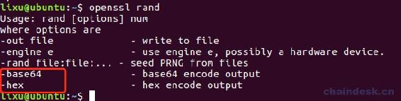
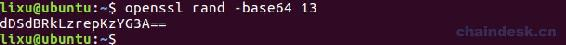
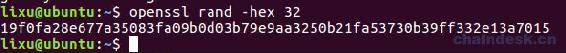
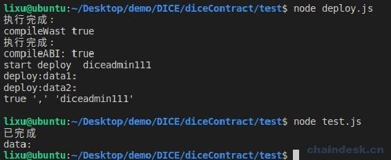
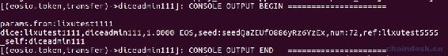
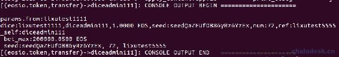
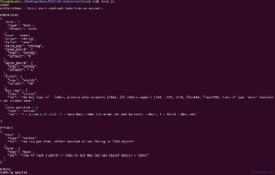
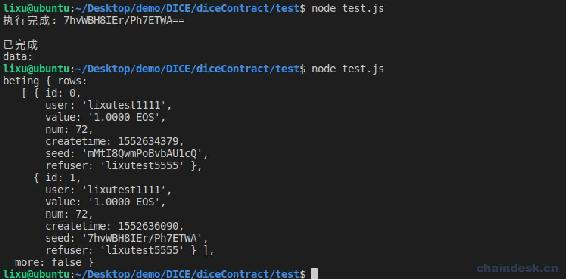

# 5.2 Dice 合约处理转账通知实现投注

> 经过前面章节对 DICE 游戏、EOS 合约开发都有了一定了解，从本章开始，我们正式进入合约需求开发，一步步实现 DICE 游戏各个功能。
> 
> 本章主要内容是：
> 
> *   apply 妥善处理通知消息
> *   转账触发合约 create action
> *   限制投注金额的最大值与最小值
> *   获取 memo 中的玩家投注的数据
> *   记录玩家投注数据到多索引数据库中

## 一、apply 妥善处理通知消息

### 1\. 投注条件

通过玩家转账来实现玩家投注，因此，我们需要对转账消息进行过滤，然后触发相应的 action 进行投注业务处理。

若不熟悉 apply 方法的同学，请先学习“【EOS DAPP 合约开发之 DICE 游戏 4.8】合约监听转账通知”。现在我们处理转账通知，需要满足如下条件进行投注：

*   `action`必须是 transfer。
*   转账的接受者必须是合约账号本身。
*   目前只支持 EOS、JXB 投注，因此`code == N(eosio.token)`且转账的代币是`EOS`。
*   或者`code == N(dicetoken111)`且转账的代币是`JXB`。

若遗漏某一个条件，将被黑客利用导致攻击。

### 2\. 编码实现 apply

下面先展示 mydice.cpp 的 apply 方法的核心代码，再做解释。

```js
if (action == N(transfer))                           \
{                                                    \
    mydice::mytransfer params = eosio::unpack_action_data<mydice::mytransfer>();  \
    print("\nparams:", params.from);                 \
    if (params.to == self)                           \
    {                                                \
        auto sym = params.quantity.symbol;           \
        if ((code == N(eosio.token) && sym == string_to_symbol(4, "EOS")) || (code == myTokenContractAccount && sym == string_to_symbol(4, "JXB"))) \
        {                                            \
            TYPE thiscontract(self);                 \
            eosio::execute_action(&thiscontract, &mydice::create); \
        }                                            \
    }                                                \
}                                                    \
```

再在 mydice.cpp 中实现 create aciton，先打印参数

```js
/**
 * 玩家投注
*/
void mydice::create(account_name user, account_name to, asset value, string memo)
{
    require_auth(user);

    print("\ndice:", name{user}, ",", name{to}, ",", value, ",", memo);
    print("\n_self：", name{_self});
}
```

mydice.hpp 的代码如下

```js
void test(const account_name &user);
void create(account_name user, account_name to, asset value, string memo);

/**
* 转账参数
*/
struct mytransfer
{
    name from;
    name to;
    asset quantity;
    string memo;

    EOSLIB_SERIALIZE(mytransfer, (from)(to)(quantity)(memo))
};
```

### 3\. 代码解析

重点是如何获取通知的参数。为了确定转账的接受者是合约账号本身，就需要获取 transfer action 的 to 参数；为了判断转账时的代币名称，就需要获取 transfer action 的 quantity 参数。因此需要使用`unpack_action_data`方法解析 action 的参数。

*   `unpack_action_data()`的参数是一个结构体类型，必须与解析的 action 的参数一一对应，这里为了获取 transfer action 的参数，所以结构体必须包含它的四个参数：`from、to、quantity、memo`。
*   `unpack_action_data()`的返回值是一个结构体对象，这个对象就包含了每个参数数据，通过它的字段值获取每个参数。

因此，我们在头文件定义了 mytransfer 结构体，包含了相应的四个字段。

## 二、转账触发合约 create action

因为通过转账实现投注，那么玩家的投注数据需要通过转账的 memo 字段进行传递，具体需要包含如下数据：

*   seed：玩家种子，用于生成随机数。
*   num：玩家押注的数字，若随机数小于它则玩家赢。
*   ref：玩家的推荐者，用于给推荐者分红。

约定以 json 字符串的形式记录玩家的以上投注数据。

### 1\. 生成随机数种子

给玩家开奖的随机数，需要通过外界传入种子到合约中通过特定算法生成随机数。为了避免黑客控制随机数，玩家投注时需传递一个种子；另外，后端系统开奖时，也需要传入一个种子。使生成的随机数由两个种子共同决定，从而避免随机数攻击。后续，合约中还需对传入的种子进行过滤，若在多索引数据库中已经存在的种子则不能再使用。

通过使用`openssl`、`sha256`和`checksum256`，可以产生一个值，该值是确定的，有效地随机。在终端上使用如下命令可生成随机数:

```js
openssl rand
```



前端我们使用 base64 的种子，后端使用 hex 的种子，当然你也可以使用其它方式。

**生成 base64 随机数**

```js
openssl rand -base64 13
```



**生成 16 进制随机数**

```js
openssl rand -hex 32
```



### 2\. 编写 node.js 脚本进行转账

在该步骤之前需要您自己封装好 myUtils.js 文件，提供相关功能，主要是需要包含下面所需的方法；另外还需提取配置数据到 config.js 文件。

在 test.js 中使用脚本去调用合约转账，代码如下：

```js
async function callTokenAPI() {
    let seed = await myUtils.executeCMD("openssl rand 13 -base64")
    seed = seed.slice(0, 18)

    let eos = myUtils.getEOSJS(config.signAccountPrivate)

    await eos.transaction(tr => {
        tr.transfer(user, gameContractAccount, "1.0000 EOS", `seed:${seed},num:72,ref:${refUser}`, myUtils.signAction(user))
    })
        .then((data) => {
            console.log("已完成")
            console.log("data:", data.processed.action_traces[0].console)
        })
        .catch((err) => {
            console.log(err)
        })
}
```

运行脚本如下：



nodeos 服务日志如下：



现在我们成功分发了通知消息，对于转账 JXB 和其它代币的情况，大家自行练习查看是否与预期的一致。

## 三、限制投注金额的最大值与最小值

为了保证中心账号(这里就是合约账号)的余额足够坐庄，也为了防止玩家刷单，需要对押注金额的最大值与最小值进行限制，且押注 EOS 与 JXB 的限制值不一样。

在 create aciton 中添加如下代码：

```js
/**
* 押注单注限制
*/
if (amount_limit(value, memo))
{
    return;
}
```

在 amount_limit 中实现具体逻辑，amount_limit action 的实现如下：

```js
//押注额限制
bool mydice::amount_limit(asset value, string memo)
{
    if (value.symbol == eos_symbol)
    {
        eosio_assert(value.amount >= limit_every_min_eos, "limit_every_min_eos");

        if (memo == "" || memo.size() == 0)
        {
            return true;
        }

        asset bet_max = (query_eos_balance(_self) - value) / 100;
        print("\n bet_max:", bet_max);
        eosio_assert(value <= bet_max, "最多只能押注奖池的１％");
    }
    else if (value.symbol == jxb_symbol)
    {
        eosio_assert(value.amount >= limit_every_min_jxb, "limit_every_min_jxb");

        if (memo == "" || memo.size() == 0)
        {
            return true;
        }

        eosio_assert(value.amount <= limit_every_max_jxb, "limit_every_max_jxb");
    }

    return false;
}
```

在执行该方法时会有三种结果：

*   return true：不是押注，纯粹是转账，因此直接 return。
*   return false：是押注，继续执行 create action 后面的逻辑。
*   eosio_assert：转账的金额不合规，则会终止转账。

## 四、获取 memo 中的玩家投注的数据

经过上一步确定了玩家转账是合规的投注，那么现在我们再获取玩家押注的数据，包含玩家种子、玩家押注的数字、玩家的推荐者。

```js
/**
 * 获取 memo 字段数据
*/
vector<string> v;
splitstring(memo, v, ",");
string seed = "";
string numStr = "";
string ref = "";
for (vector<string>::size_type i = 0; i != v.size(); i++)
{
    string key = v[i].substr(0, v[i].find(":"));
    string valuestr = v[i].substr(v[i].find(":") + 1);
    if (key == "seed")
    {
        seed = valuestr;
    }
    else if (key == "num")
    {
        numStr = valuestr;
    }
    else if (key == "ref")
    {
        ref = valuestr;
    }
}
if (!seed.empty() && !numStr.empty())
{
    print("\n seed:", seed, ", ", numStr, ", ", ref);
}
else
{
    print("\n 此次转账 memo 未满足游戏转账的数据结构.");
    return;
}

uint8_t num = atoi(numStr.c_str());
eosio_assert(num >= 2, "num too small!");
eosio_assert(num <= 96, "num too big!");
```

*   在 splitstring 方法中实现以`","`分割 memo，将数据储存到 vector 中。
*   for 循环处理各个字段的数据，大家可对该部分逻辑进行封装。
*   最后对 seed、num 的数据进行验证。

部署好合约后，再次运行 test.js 脚本向合约账号转账，nodeos 服务的日志如下：



## 五、记录玩家投注数据到多索引数据库中

为了区分投注是否已经开奖，设计了两张表，分别是 betings、beted。

*   betings：记录未开奖的投注数据。
*   beted 记录已开奖的额投注数据。

当然，你也可以设计为共用同一张表，这种方式大家可作练习，各有优缺点。

### 1\. 定义 betings 多索引数据表

betings 多索引数据表中需包含如下字段：

*   id: 主键游戏 id
*   user：玩家账号
*   value：押注额
*   num: 玩家的押注数字
*   createtime: 押注时间
*   seed：前端种子
*   refuser：玩家的推荐者

betings 多索引数据表的定义如下：

```js
/**
* 未开奖的押注
*/
//@abi table betings i64
struct beting
{
    beting() {}
    uint64_t id;
    account_name user;
    asset value;
    uint8_t num;
    time createtime;
    string seed;
    string refuser;
    auto primary_key() const { return id; }

    EOSLIB_SERIALIZE(beting, (id)(user)(value)(num)(createtime)(seed)(refuser))
};

typedef eosio::multi_index<N(betings), beting> betings;
```

该多索引表只有主键，没有设计二级索引，在投注已经开奖的表 beteds 中将会涉及到二级索引。

### 2\. 定义 betingid 多索引数据表

该表用于记录 beting 表的主键 ID。

```js
struct betingid
  {
    betingid() {}
    uint64_t id = 0;
    uint64_t nextid = 0;
    uint64_t primary_key() const { return id; }

    EOSLIB_SERIALIZE(betingid, (id)(nextid))
  };
  typedef eosio::multi_index<N(betingid), betingid> betingid_index;
  betingid_index betingids;
```

定义了之后我们在声明 mydice 时需在后面添加 betingids 的声明，如下：

```js
mydice(account_name self) : contract(self),
                          betingids(_self, _self)
{
}
```

### 3\. 储存押注数据到数据库 betings 中

在 create action 中添加如下代码，新增数据到表中：

```js
/**
 * 业务处理
*/
// 记录押注 ID
auto betingids_itr = betingids.begin();
if (betingids_itr == betingids.end())
{
    betingids_itr = betingids.emplace(_self, & {
        gitr.nextid = 0;
    });
}
betingids.modify(betingids_itr, 0, & {
    gitr.nextid++;
});
uint64_t beting_id = betingids_itr->nextid;

//新增游戏
betings betings_table(_self, _self);
auto new_game_itr = betings_table.emplace(_self, & {
    g.id = beting_id;
    g.user = user;
    g.value = value;
    g.num = num;
    g.seed = seed;
    g.refuser = ref;
    g.createtime = now();
});
```

### 4\. 查询 betings 表数据

在合约外部查询表数据使用 getTableRows 方法，大家需要熟练掌握，后续会时常使用到。我们先看看它的开发文档，在 diceContract 中使用 js 代码如下：

```js
console.log(eos.getTableRows())
```

运行后输出如下：



上面这些参数和返回结果与 `cleos get table` 命令一一对应，大家可通过 cleos 查看它的帮助文档。

参数说明如下：

| eos.getTableRows | cleos get table | 类型 | 默认值 | 说明 |
| --- | --- | --- | --- | --- |
| json | - | bool | false | 设置返回格式是否为 json,如果为 false 则显示原始数据 |
| code | account | text | 必填 | 合约所在的账号 |
| scope | scope | text | 必填 | 数据的拥有者，一般和 code/account 一样 |
| table | table | text | 必填 | 表名 |
| table_key | -k,--key | text | - | 要查找的索引名称，已废弃 |
| lower_bound | -L,--lower | text | "0" | 要查找的索引的最小值，默认为第一条数据,包含这个最小值 |
| upper_bound | -U,--upper | text | "-1" | 要查找的索引的最大值，默认为最后一条数据之后，不包含这个最大值 |
| limit | -l,--limit | uint | 10 | 返回的数据量，默认为 10 |
| key_type | --key-type | string | "i64" | 索引的数据类型，主键默认为 "i64"，支持的其它类型有：i64, i128, i256, float64, float128,name |
| index_position | --index | TEXT | "1" | 索引的位置，主索引为 1， 第二索引为 2 ，以此类推 |

简单用法如下：

```js
data = await eos.getTableRows(true, gameContractAccount, gameContractAccount, "betings")
console.log("beting", data)
```

玩家转账两次后，我们查询 betings 数据如下：



## 六、总结

本章运用 unpack_action_data 方法获取通知的参数，完成了对转账通知的处理，过滤掉不是投注的转账信息。另外熟悉 openssl 工具生成随机数，最后解析 memo 字段中玩家押注的各项数据，储存到多索引数据库中。下一章就来实现给玩家开奖的功能。

**版权声明：博客中的文章版权归博主所有，转载请联系作者（微信：lixu1770105）。**