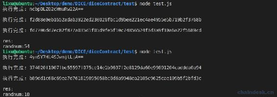
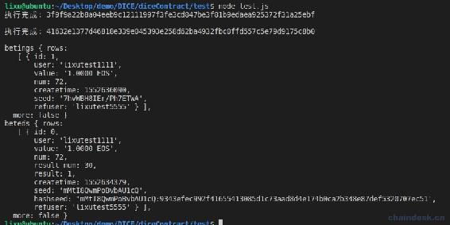
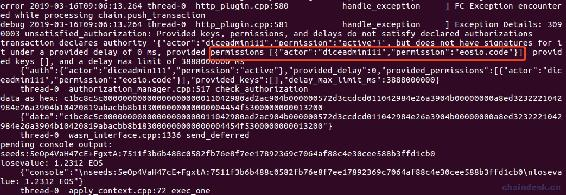
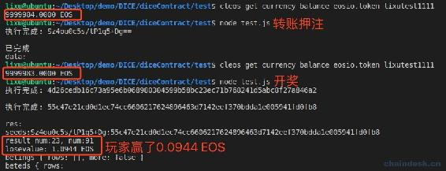
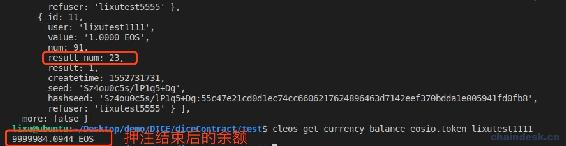

# 五、.3 Dice 合约实现开奖

> 上一章已经将玩家押注数据存储到了多索引数据库中，本章的内容就是由后端查询到未开奖的押注数据，就传递种子调用合约开奖。
> 
> 本章主要内容是：
> 
> *   实现随机函数
> *   记录已经开奖后的押注数据
> *   根据两个种子获取开奖结果
> *   新增开奖数据到 beteds 表中
> *   若玩家赢了则赔钱给玩家
> *   提取投注额的 1.5%到奖池分红

## 一、实现随机函数

该随机函数根据种子计算出开奖结果，需要使用到 sha256 函数，它的定义是：

```js
void sha256( const char* data, uint32_t length, checksum256* hash );
```

参数：

*   data：数据源，即种子
*   length：种子长度
*   hash：种子生成的 checksum256 类型的 hash 值

实现如下：

```js
//获取随机数
uint32_t mydice::getrandnum(const std::string &src_str)
{
    checksum256 result;
    sha256((char *)&src_str, src_str.length(), &result);
    uint32_t rand_num = result.hash[1] % 100;
    return rand_num;
}
```

使用第一个字节的十进制的 100 的余数作为随机数，即开奖结果。

注意：使用 sha256 需要导入头文件`#include <eosiolib/crypto.h>`。

重新实现 test action：

```js
void mydice::test(const account_name &user, string seed)
{
    uint8_t rand = getrandnum(seed);
    print("\nrandnum:", (uint64_t)rand);
}
```

在 test.js 中调用 test action 如下：

```js
let seed = await getBase64RandNum()
let hashseed = await getHexRandNum()

await myContract.test(user, `${seed}:${hashseed}`,          myUtils.signAction(signAccount))
    .then((data) => {
        if (data && data.processed && data.processed.action_traces && data.processed.action_traces.length > 0 && data.processed.action_traces[0].console) {
            let res = data.processed.action_traces[0].console
            console.log("res:", res)
        }
    })
    .catch((err) => {
        console.log(err)
    })
```

运行`node test.js`输出：



## 二、记录已经开奖后的押注数据

将已经开奖后的押注数据记录到多索引数据库 beteds 表中。

beteds 多索引数据表中需包含如下字段：

*   id: 主键游戏 id
*   user：玩家账号
*   value：押注额
*   num: 玩家的押注数字
*   createtime: 押注时间
*   seed：前端种子
*   refuser：玩家的推荐者
*   result_num：种子生成的随机数
*   result：玩家赢输的结果
*   hashseed：后端种子：

betings 多索引数据表的定义如下：

```js
/**
 * 已开奖的押注
*/
//@abi table beteds i64
struct beted
{
    beted() {}
    uint64_t id;
    account_name user;
    asset value;
    uint8_t num;
    uint8_t result_num;
    bool result;
    time createtime;
    string seed;
    string hashseed;
    string refuser;
    auto primary_key() const { return id; }
    account_name get_account() const { return user; }
    account_name get_seed() const { return string_to_name((char *)seed.data()); }

    EOSLIB_SERIALIZE(beted, (id)(user)(value)(num)(result_num)(result)(createtime)(seed)(hashseed)(refuser))
};
typedef eosio::multi_index<N(beteds), beted,
                         indexed_by<N(byaccount), const_mem_fun<beted, uint64_t, &beted::get_account>>,
                         indexed_by<N(byseed), const_mem_fun<beted, uint64_t, &beted::get_seed>>>
  beteds;
```

将 user、seed 作为了二级索引，因为查询玩家投注记录的时候需要使用到 user，查询种子是否已经存在过需要使用到 seed。

## 三、合约实现开奖方法

开奖的必要条件只能是合约账号的权限才能调用该方法，这样才能保证传递的是随机的种子。所以调用之前需要后端自动的判断是否有了未开奖的押注游戏，若有才生成种子后去调用合约开奖。

开奖的实现步骤：

*   获取最开始未开奖游戏的押注数据，然后在表中删除
*   根据两个种子获取开奖结果
*   新增开奖数据到 beteds 表中
*   若玩家赢了则赔钱给玩家
*   提取押注额的 1.5%到奖池分红

### 1\. 获取最开始未开奖游戏的押注数据

未开奖游戏的押注数据我们已经存放在了 betings 表中，通过主键获取即可，然后将字段值存到变量中，然后删除该条表数据，在 mydice.cpp 中实现如下：

```js
/**
 * 合约账号开奖
*/
void mydice::dicereceipt(string hashseed)
{
    require_auth(_self);

    // 1.获取第一个未开奖游戏的相关押注数据，然后在表中删除
    betings betings_table(_self, _self);
    auto betings_itr = betings_table.begin();
    eosio_assert(betings_itr != betings_table.end(), "no have beting!");
    account_name user = betings_itr->user;
    asset value = betings_itr->value;
    string seed = betings_itr->seed;
    uint8_t num = betings_itr->num;
    string refuser = betings_itr->refuser;
    time createtime = betings_itr->createtime;
    betings_table.erase(betings_itr);
}
```

### 2\. 根据两个种子获取开奖结果

在 dicereceipt action 中继续添加如下代码：

```js
void mydice::dicereceipt(string hashseed)
{
    ......

    //2．根据 hashseed 获取开奖结果
    string seeds = seed + ":" + hashseed;
    print("\nseeds:", seeds);
    bool result = false;
    uint32_t result_num = getrandnum(seeds);
    if (result_num < num)
    {
        result = true;
    }
}
```

*   result：记录玩家输赢；
*   result_num：开奖号码；
*   num：玩家押注的号码。若开奖号码小于该押注号码则玩家赢。

### 3\. 新增开奖数据到 beteds 表中

把玩家的 betings 表中的数据和开奖数据存入 beteds 表中。后端服务即可查询该表的新增数据推送给前端，显示在最新的所有投注列表中。

```js
//3.新增 beted
beteds beteds_table(_self, _self);
auto beteds_itr = beteds_table.emplace(_self, & {
    g.id = beteds_table.available_primary_key();;
    g.user = user;
    g.value = value;
    g.num = num;
    g.seed = seed;
    g.hashseed = seeds;
    g.refuser = refuser;
    g.createtime = createtime;
    g.result_num = result_num;
    g.result = result;
});

uint64_t beted_id = beteds_itr->id;
```

现在完成了数据处理，我们来测试一下合约的逻辑是否正确。

在 test.js 文件中使用合约账号的签名调用 dicereceipt 开奖：

```js
await myContract.dicereceipt(hashseed, myUtils.signAction(gameContractAccount))
    .then((data) => {
        if (data && data.processed && data.processed.action_traces && data.processed.action_traces.length > 0 && data.processed.action_traces[0].console) {
            let res = data.processed.action_traces[0].console
            console.log("res:", res)
        }
    })
    .catch((err) => {
        console.log(err)
    })
```

然后查询 beteds 表数据：

```js
data = await eos.getTableRows(true, gameContractAccount, gameContractAccount, "betings")
console.log("betings", data)
data = await eos.getTableRows(true, gameContractAccount, gameContractAccount, "beteds")
console.log("beteds", data)
```



可见开奖后，betings 表中未开奖的数据由两条减少了一条，同时 beteds 表中新增了一条已开奖的数据。根据 beteds 表中的数据可知玩家 lixutest1111 押注的数字是 72，开奖结果是 30，玩家赢了。

## 四、若玩家赢了则赔钱给玩家

### 1\. 合约实现赔付

玩家押注的钱是直接进入了合约账号，所以若玩家赢了也是从合约账号转出，它相当于庄家。庄家开发了该游戏，另外运营也需资金，因此为了庄家能有收入，DICE 游戏的设计是给庄家优势玩家押注额的 1.5%，这不是手续费，而是降低 1.5%给玩家赔的倍率使庄家有赢的优势。因此，玩家的赔付的公式如下。

```js
value * 985 / (10 * (num - 1));
```

*   value：玩家押注额。
*   num：玩家押注的号码。

大家不理解该公式的可以先想想正常的赔付应该是：`value * 100 / (num - 1)`，比如，玩家押的数字是 2，那么开奖结果只有 1 才赢，所以赢的概率是 1%，因此，庄家赔付比率是 100 倍，赔付的钱就是 `value * 100 / (2 - 1)`。通过该例子，大家应该明白了上面的赔付公式。当然，你也可以通过收取玩家投注额的手续费来获取利润。

所以若玩家赢了则赔钱给玩家的实现如下：

```js
//4.赔钱给玩家
asset losevalue = value * 985 / (10 * (num - 1));
if (result == true)
{
    print("\nlosevalue: ", losevalue);
    mytransaction(_self, user, losevalue, to_string(beted_id), user + beted_id);
}
```

转账的具体实现在 mytransaction action 内部，即调用 eosio.token 合约的 transfer action，传递相应的参数即可。

**注意：**

*   调用外部合约 action，可以使用 inline 与 deferred。
*   为了不被黑客利用回滚机制，因此转账必须使用 deferred 延迟交易，使黑客无法回滚开奖失败的交易。这部分合约安全的具体攻击手法与防御，在后面有一章专门介绍“合约安全——漏洞攻击与防范”。

### 2\. 验证赔付

再来进行验证合约逻辑正确性，在开奖前后分别查询玩家的余额。

若玩家赢了，将会出现如下错误



学习了第四章的同学应该知道该错误如何解决。即跨合约调用，需要使用调用者给合约账号的 eosio.code 授权。此处是我们使用合约账号 diceadmin111 在该合约中调用合约外的 action，所以需使用 diceadmin111 的 active 或自定义权限对 diceadmin111 的 eosio.code 授权。

授权如下：

```js
cleos set account permission diceadmin111 active '{"threshold": 1, "keys": [{"key":"EOS7EoByXW7ddKvE7MnTkY3REB4nzXdsWPN19au9TTTFDyPq9EobR","weight": 1}], "accounts": [{"permission":{"actor":"diceadmin111", "permission":"eosio.code"}, "weight":1}], "waits": []}' 
```

接下来使用 test.js 再转账押注，然后开奖。



看到转账之前玩家 lixutest1111 的余额是 9999984.0000 EOS，押注赢了后的余额是多少呢，我们在查询一下：



发现多了 0.0944 EOS，正是我们押注赢得的金额。

## 五、提取投注额的 1.5%到奖池分红

我们将庄家优势所赚取的 1.5%转入奖池，用于社区激励，即通证经济模型。同时庄家理论上保持不输不赢。

在 dicereceipt action 中继续添加如下代码：

```js
//5.提取 1.5%到奖池
string send_memo = send_pool_memo(user, refuser, beted_id);
asset sendvalue = value * 15 / 1000;
mytransaction(_self, poolContractAccount, sendvalue, send_memo, beted_id);
```

将玩家、玩家的推荐者、押注 id 通过转账的 memo 字段传递到奖池合约，然后对他们进行相应的奖励。比如：英雄榜、VIP、挖矿、推荐者奖励等。

目前我们并未开发奖池合约，但是并不影响我们 Dice 合约正常的向他转账，我们将在后面学习如何通过奖池合约去建立经济模型。

但是到了此步骤，部署合约、押注、开奖操作正常执行后，大家须验证 pool 合约账号的余额是否有增加。

## 六、总结

本章的内容主要是通过合约实现开奖，其中涉及到如何使用种子 hash 生成随机数、记录玩家押注数据、判定玩家输赢、提取 1.5%用于社区运营等。

Dice 合约到这里基本上就开发完成了，下一章我们需开发 NodeJS 服务端的和 React 前端来与合约交互，形成一个完整的可供玩家界面操作的 DICE 游戏。后续会继续开发奖池合约、JXB 的 Token 合约。

**版权声明：博客中的文章版权归博主所有，转载请联系作者（微信：lixu1770105）。**