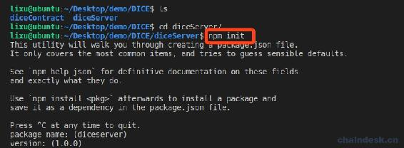
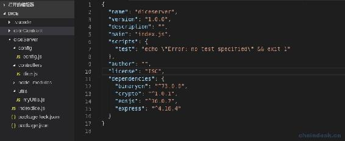
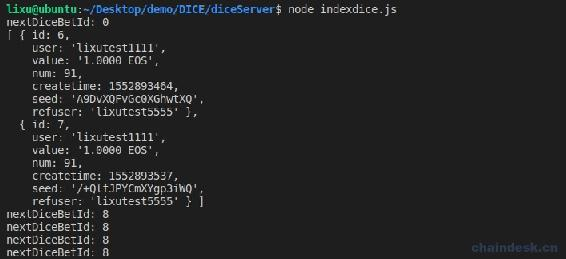
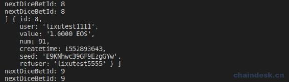
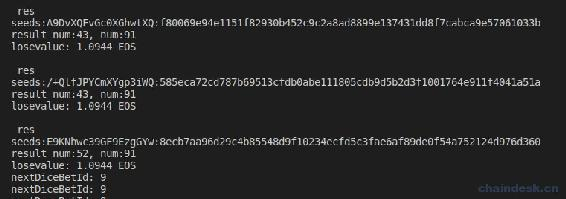
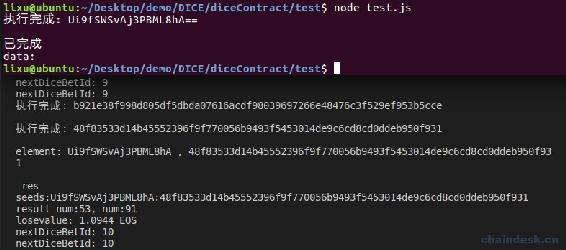
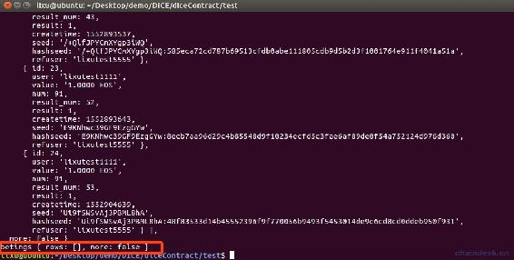

# 6.1 开发后端项目 diceServer 自动调用合约开奖

> NodeJS 后端会有三个项目，它们相互独立：
> 
> *   diceContract：所有的合约都在该项目中开发，另外包含部署脚本、测试脚本等。
> *   webServer：专门与前端交互，支持 RESTful API、socket.io，用于前端查询数据、后端主动推送合约新数据。
> *   diceServer：专门与合约交互，主要是调用合约开奖方法。
> 
> 独立 webServer、diceServer 这两个项目的目的是因为 diceServer 中需要合约账号的私钥签名开奖 action，为了私钥安全，使它不与前端交互，因此与前端交互的功能独立到 webServer 项目中。
> 
> 本章主要内容包含：
> 
> *   创建项目 diceServer
> *   轮训获取未开奖的押注
> *   后端调用合约开奖

## 一、创建项目 diceServer

新建文件夹 diceServer，然后执行如下命令初始化项目 diceServer

```js
npm init
```

然后不断回车即可。效果如下图



会自动生成`package.json`文件，是项目包的配置文件，下面我们引入项目中需要用到的库，拷贝下面 json 到`package.json`文件的最后一个字段。

```js
"license": "ISC",
  "dependencies": {
    "binaryen": "⁷³.0.0",
    "crypto": "¹.0.1",
    "eosjs": "¹⁶.0.7",
    "express": "⁴.16.4"
  }
```

上面使用到的第三方库如下：

*   binaryen：是 WebAssembly 的编译器和工具链基础库。
*   crypto：是为了提供通用的加密和哈希算法。Nodejs 用 C/C++实现这些算法后，通过 cypto 这个模块暴露为 JavaScript 接口，这样用起来方便，运行速度也快。
*   eosjs：访问 EOS 区块链的 NodeJS 库。
*   express：是一个简洁而灵活的 node.js Web 应用框架, 提供了一系列强大特性帮助你创建各种 Web 应用，和丰富的 HTTP 工具。使用 Express 可以快速地搭建一个完整功能的网站。

然后运行以下命令按照上面的依赖库。

```js
npm install
```

下载完成后会将所有的依赖库下载到项目根目录自动新建的`node_modules`文件夹。

项目的界面如下：



其中 indexdice.js 用于启动 dice，代码如下：

```js
require("./controllers/dice")
```

config.js 是项目的配置文件，代码如下：

```js
let binaryen = require('binaryen')

module.exports = {
    eosconfig: {
        chainId: "cf057bbfb72640471fd910bcb67639c22df9f92470936cddc1ade0e2f2e7dc4f", // 32 byte (64 char) hex string
        httpEndpoint: "http://127.0.0.1:7777",

        // httpEndpoint: "http://jungle2.cryptolions.io:80",
        // chainId: "e70aaab8997e1dfce58fbfac80cbbb8fecec7b99cf982a9444273cbc64c41473", // 32 byte (64 char) hex string

        //正式网络
        // httpEndpoint: "http://jungle2.cryptolions.io:80",
        // chainId: "e70aaab8997e1dfce58fbfac80cbbb8fecec7b99cf982a9444273cbc64c41473", // 32 byte (64 char) hex string

        binaryen: binaryen,
        expireInSeconds: 60,
        broadcast: true,
        verbose: false, // API activity
        sign: true
    },

    //本地网络
    myTokenContractAccount: "dicetoken111",
    poolContractAccount: "dicepool1111",
    gameContractAccount: "diceadmin111",

    myTokenSymbol: "JXB",
    dividendDecimals: 10,

    ////合约账号的 server 私钥，用于调用触发合约，开奖等操作
    gameContractAccountPrivate: "5HqCj7sg4K2xZ1KD5sSH38kuJkKGqfE1wSGiLL3M599ajacVmTs",

}
```

myUtils.js 是项目的帮助文件，代码如下：

```js
let EOS = require('eosjs')
let config = require("../config/config")
let exec = require("child_process").exec

module.exports = {
    getEOSJS: (keyProvider) => {
        if (keyProvider) {
            config.eosconfig.keyProvider = keyProvider
        }
        return EOS(config.eosconfig)
    },

    signAction: (account) => {
        options = {
            authorization: `${account}@active`,
            broadcast: true,
            sign: true
        }
        return options
    },

    executeCMD: async (cmdStr) => {
        let promise = new Promise((resolve, reject) => {
            exec(cmdStr, function (err, stdout, stderr) {
                if (err) {
                    reject(-1)
                    console.log("执行错误:", cmdStr, "\n", err, stderr);
                } else {
                    resolve(stdout)
                    console.log("执行完成:", stdout);
                }
            });
        })

        let result;
        await promise.then(function (data) {
            result = data
        }, function (error) {
            result = error
        })
        return result
    }
}
```

辅助代码很简单，这里不作解释。

## 二、轮训获取未开奖的押注

每一秒都可能会有玩家进行押注，所以需要我们每秒甚至更短的周期轮训获取未开奖的押注数据，然后传递种子哈希给合约开奖。

下面我们先来实现每秒轮训获取未开奖的押注数据。

在 controllers 文件夹下新建 dice.js 文件，关键代码实现如下：

```js
let nextDiceBetId = 0

async function startTimerDice() {
    console.log("nextDiceBetId:", nextDiceBetId)
    eos.getTableRows(true, gameContractAccount, gameContractAccount, "betings", "", nextDiceBetId, "-1", 1000)
        .then((data) => {
            if (data.rows.length > 0) {
                nextDiceBetId = data.rows[data.rows.length - 1].id + 1
                console.log(data.rows)
            }
        })
        .catch((err) => {
            // logger.error(err)
        })

}

async function diceInit() {
    eos = myUtils.getEOSJS(config.gameContractAccountPrivate)
    myContract = await eos.contract(gameContractAccount)
}

diceInit()

setInterval(async function () {
    startTimerDice()
}, 1000)
```

`nextDiceBetId`用于记录处理的下一个未开奖押注数据的押注 ID，若查询到数据，就说明有玩家进行了押注，然后对他进行开奖。

运行`node indexdice.js`



可以查询到目前我的 EOS 私链上未开奖的押注有两个，ID 分别是 6、7。

然后我再进行一次押注，效果如下：



我们将新的押注数据已经成功获取到，下一步就是分别对它们及时的开奖。

## 三、后端调用合约开奖

合约开奖的 action 是 dicereceipt，在上一章简单演示了如何调用，下面进行详细介绍。

dicereceipt 的实现中对合约账号 diceadmin111 的签名进行了验证，需要使用他的签名才可成功调用。这样做的目的，对此，有以下两个考虑：

*   只有合约账号才有权限开奖：避免别人去开奖导致一系列安全问题。
*   后端调用的时候需要提供合约账号的私钥：该部分代码必须进行隔离，单独部署到私密服务器，以防黑客通过公开的接口 IP 找到服务器，然后盗取私钥进行违规操作。
*   在 NodeJS 后端服务中对合约账号的私钥必须妥善放置：
    *   不能将 active、owner 的私钥放置到服务器，仍然会有被盗取安全隐患。
    *   新建合约账号的新权限，如 server，然后设置 server 的权限映射，让它可操作 dicereceipt。最后将 server 权限的私钥放置到服务器。
    *   放置的私钥必须加密保存，在需要签名时再作解密。

现在我们先不考虑安全问题，把项目跑通，后续再来对项目做好安全防御。所以在配置文件中我们直接放入合约账号的 active 权限的私钥。

现在使用合约账号的 active 权限的私钥签名调用 dicereceipt 开奖，代码如下：

```js
if (data.rows.length > 0) {
    nextDiceBetId = data.rows[data.rows.length - 1].id + 1
    // console.log(data.rows)
    data.rows.forEach(async element => {
        let hashSeed = await getHexRandNum()
        myContract.dicereceipt(hashSeed, signAction(gameContractAccount))
            .then((data) => {
                if (data && data.processed && data.processed.action_traces && data.processed.action_traces.length > 0 && data.processed.action_traces[0].console) {
                    let res = data.processed.action_traces[0].console
                    console.log("\n res", res)
                }
            })
            .catch((err) => {
                console.log(err)
            })

        console.log("element:", element.seed, ",", hashSeed)
    });
}
```

每秒获取到了新的押注数据列表，都需遍历分别进行开奖。

重新运行`node indexdice.js`，将会查询到之前押注了未开奖的三次数据，然后对他们分别进行开奖。



接着我们在运行 test.js 脚本中的转账进行押注，indexdice 服务中的循环将会马上执行调用开奖，如下：



我们再修改 test.js 脚本中的代码，打印查询到的已开奖和未开奖的押注数据，如下：



可以看到最后三次开奖的结果分别是 43、52、53，与合约开奖中打印的开奖结果相对应。

## 四、总结

本章我们开发完成了 diceServer 后端项目，实现自动调用合约开奖功能，并安全保护了 active 权限的私钥，它所在服务器的 IP 不被公开。下一章我们开始开发 webServer 后端项目，主要用于提供前端接口，包含 RESTful API 和 websocket。然后再开发 React 前端项目，演示整个项目的交互效果。

**版权声明：博客中的文章版权归博主所有，转载请联系作者（微信：lixu1770105）。**