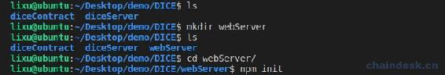
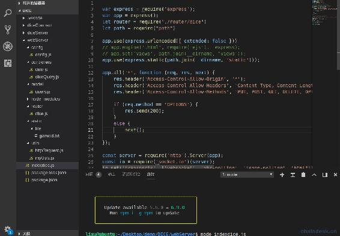
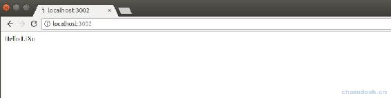

# 六、.2 开发后端项目 webServer 提供前端 API

> 本章节主要内容是：
> 
> *   创建项目 webServer
> *   webServer 项目架构设计
> *   跑通 RESTful API

## 一、创建项目 webServer

新建文件夹 webServer，然后执行如下命令初始化项目 webServer

```js
npm init
```

然后不断回车即可。效果如下图



会自动生成`package.json`文件，是项目包的配置文件，下面我们引入项目中需要用到的库，拷贝下面 json 到`package.json`文件的最后一个字段。

```js
"license": "ISC",
"dependencies": {
    "binaryen": "⁷³.0.0",
    "eosjs": "¹⁶.0.7",
    "express": "⁴.16.4",
    "request": "².88.0",
    "socket.io": "².2.0"
}
```

上面使用到的第三方库如下：

*   binaryen：是 WebAssembly 的编译器和工具链基础库。
*   eosjs：访问 EOS 区块链的 NodeJS 库。
*   express：是一个简洁而灵活的 node.js Web 应用框架, 提供了一系列强大特性帮助你创建各种 Web 应用，和丰富的 HTTP 工具。使用 Express 可以快速地搭建一个完整功能的网站。
*   request：是服务端发起请求的工具包。
*   socket.io：它实现了 websocket 协议，用于替代轮询即时通讯。

然后运行以下命令按照上面的依赖库。

```js
npm install
```

下载完成后会将所有的依赖库下载到项目根目录自动新建的`node_modules`文件夹。

## 二、webServer 项目架构设计

在 webServer 项目中新建如下文件夹：

*   config：项目配置文件。

*   controllers：业务类文件。

*   models：模型帮助类。

*   router：路由。

*   static：静态文件。

*   utils：项目公共 API。

项目文件结构如下：



各文件愿码如下：

**config/config.js**：项目配置文件

```js
let binaryen = require('binaryen')

module.exports = {
    eosconfig: {
        chainId: "cf057bbfb72640471fd910bcb67639c22df9f92470936cddc1ade0e2f2e7dc4f", // 32 byte (64 char) hex string
        httpEndpoint: "http://127.0.0.1:7777",
        binaryen: binaryen,
        expireInSeconds: 60,
        broadcast: true,
        verbose: false, // API activity
        sign: true
    },

    //本地网络
    myTokenContractAccount: "dicetoken111",
    poolContractAccount: "dicepool1111",
    gameContractAccount: "diceadmin111",

    myTokenSymbol: "JXB",
    dividendDecimals: 10,

    signAccount: "lixutestsign", //签名账号仅用于签名
    signAccountPrivate: "5HqCj7sg4K2xZ1KD5sSH38kuJkKGqfE1wSGiLL3M599ajacVmTs",

    //dice 所有投注列表个数
    newGameListCount: 30,

    accountBalance: "/v1/chain/get_currency_balance",
    accountInfo: "/v1/chain/get_account",
}
```

**controllers/dice.js**：dice 轮训获取最新押注数据。待开发，下文详细介绍。

**controllers/diceQuery.js**：查询 dice 数据。待开发，下文详细介绍。

**models/query.js**：查询账户数据，当前只有查询账户余额接口。

```js
let httpRequest = require("../utils/httpRequest")
let config = require("../config/config")
let myUtils = require("../utils/myUtils")

async function accountBalance(account, code) {
    let params = { "code": code, "account": account }
    let res = await httpRequest.postRequest(config.eosconfig.httpEndpoint + config.accountBalance, params)
    return res
}
module.exports = {
    accountAllBalance: async (account) => {
        res = {}
        let eosioToken = await accountBalance(account, "eosio.token")
        if (eosioToken.code == 0) {
            for (const i in eosioToken.data) {
                let tokenBalance = eosioToken.data[i]
                if (tokenBalance.indexOf("EOS") == tokenBalance.length - 3) {
                    let tokenBalanceArr = myUtils.spliteBalance(tokenBalance)
                    res[tokenBalanceArr[1]] = tokenBalanceArr[0]
                    break;
                }
            }
        }

        let myToken = await accountBalance(account, config.myTokenContractAccount)
        if (myToken.code == 0) {
            for (const i in myToken.data) {
                let tokenBalance = myToken.data[i]
                if (tokenBalance.indexOf(config.myTokenSymbol) == tokenBalance.length - config.myTokenSymbol.length) {
                    let tokenBalanceArr = myUtils.spliteBalance(tokenBalance)
                    res[tokenBalanceArr[1]] = tokenBalanceArr[0]
                    break;
                }
            }
        }
        return res
    }

}
```

**router/dice.js**：dice 游戏的路由

```js
let router = require('express').Router();

let diceController = require("../controllers/dice")
let diceQueryController = require("../controllers/diceQuery")

router.get("/", async (req, res) => {
    res.send("Hello LiXu")
})

module.exports = router
```

**static/file/gameid.txt**：用于记录推送的最新的押注数据的 ID，避免重复推送或遗漏推送给前端。

**utiles/httpRequest.js**：封装了 http 请求，包含 get、post 两个接口。

```js
 let request = require("request");
let {success, fail} = require("./myUtils")

async function httpRequest(method, url, params) {
    // console.log("httpRequest:", url, params)
    let promise = new Promise((resolve, reject) => {

        var options = { 
            method: method,
            url: url,
            body: params,
            json: true 
        };
        request(options, function (error, response, body) {

            if (error) {
                reject(error)
            } else {
                resolve(body)
            }
        })
    })

    let result;
    //第一个参数是成功的回调
    //第二个参数是失败的回调
    await promise.then(function (data) {
        if (data.error) {
            result = fail(data.error)
        } else {
            result = success(data)
        }
    }, function(error) {
        result = fail(error)
    })

    // console.log(JSON.stringify(result))
    return result
}

module.exports = {

    postRequest: async(url, params) => {
        return await httpRequest("POST", url, params)
    },

    getRequest: async(url, params) => {
        return await httpRequest("GET", url, params)
    },

}
```

**utils/myUtils.js**：项目帮助类

```js
let EOS = require('eosjs')
let config = require("../config/config")
let exec = require("child_process").exec

module.exports = {
    getEOSJS: (keyProvider) => {
        if (keyProvider) {
            config.eosconfig.keyProvider = keyProvider
        }
        return EOS(config.eosconfig)
    },

    signAction: (account) => {
        options = {
            authorization: `${account}@active`,
            broadcast: true,
            sign: true
        }
        return options
    },

    success: (data) => {
        responseData = {
            code: 0,
            status: "success",
            data: data
        }
        return responseData
    },

    fail: (msg) => {
        responseData = {
            code: 1,
            status: "fail",
            data: msg
        }
        return responseData
    },

    executeCMD: async (cmdStr) => {
        let promise = new Promise((resolve, reject) => {
            exec(cmdStr, function (err, stdout, stderr) {
                if (err) {
                    reject(-1)
                    console.log("执行错误:", cmdStr, "\n", err, stderr);
                } else {
                    resolve(stdout)
                    console.log("执行完成:", stdout);
                }
            });
        })

        let result;
        await promise.then(function (data) {
            result = data
        }, function (error) {
            result = error
        })
        return result
    },

    spliteBalance: (balance) => {
        let balanceArr = balance.split(" ")
        if (balanceArr && balanceArr.length == 2) {
            balanceArr[0] = parseFloat(balanceArr[0]).toFixed(4)
            return balanceArr
        }
        return []
    },
}
```

**indexdice.js**

```js
var express = require('express');
var app = express();
let router = require("./router/dice")
let path = require("path")

app.use(express.urlencoded({ extended: false }))
// app.engine('.html', require('ejs').__express);
// app.set('views', path.join(__dirname, 'views'));
app.use(express.static(path.join(__dirname, "static")));

app.all('*', function (req, res, next) {
    res.header('Access-Control-Allow-Origin', '*');
    res.header('Access-Control-Allow-Headers', 'Content-Type, Content-Length, Authorization, Accept, X-Requested-With , yourHeaderFeild');
    res.header('Access-Control-Allow-Methods', 'PUT, POST, GET, DELETE, OPTIONS');

    if (req.method == 'OPTIONS') {
        res.send(200);
    }
    else {
        next();
    }
});

const server = require('http').Server(app);
const io = require('socket.io')(server);
io.set('transports', ['websocket', 'xhr-polling', 'jsonp-polling', 'htmlfile', 'flashsocket']);
io.set('origins', '*:*');
io.on('connection', function (socket) { });
app.io = io

app.use('/', router);

console.log("正在监听 3002 端口")
server.listen(3002)

module.exports = { app }
```

以上是项目基础类文件，比较简单，也与区块链没有直接联系，所以不做介绍。下一章节我们详细学习与区块链、前端的交互设计。

## 三、项目效果图

启动后端服务


浏览器访问服务



## 四、总结

本章节集成了 socket.io、express 框架的 NodeJS 后端项目 webServer，使前端能访问。下一节我们根据“前端接口”文档去开发相应的接口，供前端调用。

**版权声明：博客中的文章版权归博主所有，转载请联系作者（微信：lixu1770105）。**