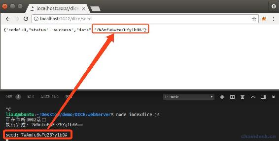
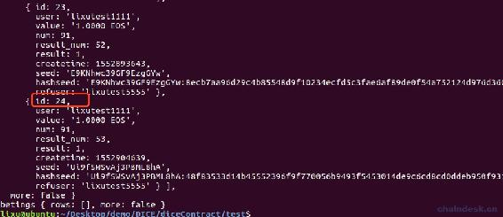
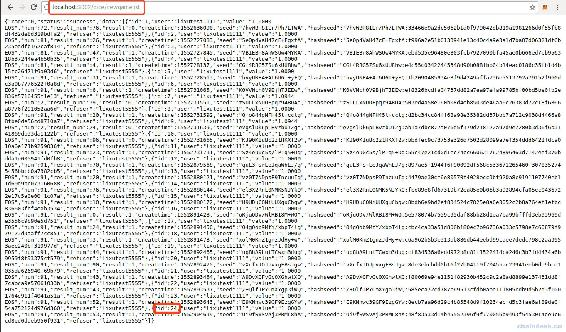
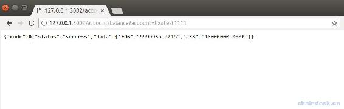

# 6.3 开发 RESTful API 和 webSocket 接口

> 本章节主要内容是：
> 
> *   合约对前端种子进行验证是否使用过
> *   实现 HTTP 接口：前端转账的 seed
> *   实现 websocket 接口：所有投注
> *   实现 HTTP 接口：最新三十条所有投注
> *   实现 HTTP 接口：我的账号余额

## 一、HTTP 接口：前端转账的 seed

> “最新三十条所有投注”这个 HTTP 接口在完成 webSocket 接口后提供。

玩家押注后，会根据随机结果决定输赢，那么这个结果在合约中就由两个种子所决定。其中之一就是前端转账时，所需传递的种子；另外一个种子是后端开奖时所传递的种子。在 diceServer 后端项目中我们已经实现开奖时传递种子了。现在我们需要实现前端转账时，获取所需的种子。

因为后端传递的种子不是人为所能控制的，所以不必判断种子是否已经使用过，那么前端我们有必要在使用种子的时候对它进行判断，若使用过则不能使用，需重新生成种子。

### 1\. 合约新增判断种子是否使用过的 action

合约需实现以下需求

*   种子有没有被使用过需要合约提供查询接口后端才知道该种子是否可用。
*   转账押注时，在合约中需要对传递的种子再次确认没有被使用过。

因此我们在 dice 合约中新增以下两个方法：

```js
/**
 * 种子是否已经存在
*/
void mydice::existseed(const string seed)
{
    if (exist_seed(seed))
    {
        print(1);
    }
    else
    {
        print(0);
    }
}

bool mydice::exist_seed(const string seed)
{
    account_name myseed = string_to_name((char *)seed.data());
    string my_str = to_string(myseed);

    beteds games_table(_self, _self);
    auto seed_table = games_table.get_index<N(byseed)>();
    auto seed_itr = seed_table.find(myseed);
    if (seed_itr == seed_table.end())
    {
        return false;
    }
    else
    {
        return true;
    }
}
```

然后将 existseed action 生成 ABI，供外界调用，通过输出 1、0 判断种子是否已经使用过。

exist_seed action 作为私有方法在 create action 中调用，使用断言判断种子使用过则终止程序，如下：

```js
eosio_assert(exist_seed(seed) == false, "seed has been used!");
```

### 2\. webServer 后端提供获取种子的 API

前端接口说明如下：

> 方式：get
> 
> 接口：/dice/seed
> 
> 参数：无
> 
> eg：
> 
> req：`http://183.111.122.242:3002/dice/seed`
> 
> res：
> 
> ```js
> {"code":0,"status":"success","data":"vS9keFfTZzOSslDEHQ"}
> ```

所以我们在 router/dice.js 中增加如下路由：

```js
router.get("/dice/seed", diceQueryController.getDiceSeed)
```

然后在 controllers/diceQuery.js 中实现 getDiceSeed 方法，使用了 while 循环直到获取到未使用过的种子才跳出循环，如下：

```js
async function exitSeed() {
    let seed = await myUtils.executeCMD("openssl rand 13 -base64")
    seed = seed.slice(0, 18)

    let result = ""
    await myContract.existseed(seed, signAction(signAccount))
        .then((data) => {
            if (data && data.processed && data.processed.action_traces && data.processed.action_traces.length > 0 && data.processed.action_traces[0].console) {
                if (data.processed.action_traces[0].console == 0) {
                    result = seed
                }
            }
        })
        .catch((err) => {
            console.log(err)
        })

    return result
}

module.exports = {
    //获取随机种子
    getDiceSeed: async (req, res) => {
        let seed = ""
        while (true) {
            seed = await exitSeed()
            console.log("seed:", seed)
            if (seed.length > 0) {
                break
            }
        }
        res.send(success(seed))
    },
}
```

### 3\. 运行效果

成功部署好完善后的合约，再启动 webServer 后端服务`node indexdice.js`。

然后使用浏览器访问`/dice/seed`接口，效果如下：



## 二、websocket 接口：所有投注

这个 webSocket 接口用于即时的将玩家投注数据推送到前端，向用户显示。

### 1\. 实现 websocket 的所有投注接口

在 diceServer 后端中已经实现了即时的获取未开奖的押注数据，现在我们需要即时的获取已开奖的押注数据。那么，就非常容易了。

获取表的最新数据，根据最后一个押注数据的 ID+1 去查询，若有数据则有了新押注数据。我们需要将这个 ID+1 持久化存储，下面我使用了文件`gameid.txt`记录，并将文件`gameid.txt`内容初始化为 0。

然后处理最新的游戏数据过程如下：

*   将新数据保存到 newGameList 数组中，且只保留固定元素个数，如：30 个。
*   将最新的押注数据的 ID+1 存储到文件中。
*   将最新的押注列表数据通过`newgames`命令推送出去。在前端也使用相应的`newgames`命令即可接收到推送的消息数据。

前端接口说明如下：

> ### 所有投注
> 
> 接口：newgames
> 
> 方式：监听
> 
> 备注：每一秒更新一次，若无新数据则不会推送消息
> 
> 返回：数组，数组中的元素是游戏对象

在 controllers/dice.js 中添加如下代码：

```js
let path = require("path")
let fs = require("fs")
let gameidPath = path.join(__dirname, '../static/file/gameid.txt')

function getGameList(id, number) {
    eos.getTableRows(true, gameContractAccount, gameContractAccount, "beteds", "", id, "-1", number)
        .then((data) => {
            if (data.rows.length > 0) {
                //处理最新的游戏数据
                newGameList = newGameList.concat(data.rows)
                if (newGameList.length > config.newGameListCount) {
                    newGameList = newGameList.slice(newGameList.length - config.newGameListCount, newGameList.length)
                }

                let lastGame = newGameList[newGameList.length - 1]
                fs.writeFileSync(gameidPath, lastGame.id + 1);

                console.log("socket:length:", data.rows.length)
                let socket = require("../indexdice").app.io
                socket.emit('newgames', data.rows);
            }

        })
        .catch((err) => {
        })
}

//每秒轮训获取最新游戏数据,通过 websocket 发送给客户端
setInterval(async function () {
    let data = await fs.readFileSync(gameidPath, 'utf8')
    let temNextID = parseInt(data)

    console.log("refreshNewGames:nextID:", temNextID)
    getGameList(temNextID, 100)
}, 1000);
```

### 2\. 运行效果

执行脚本 test.js 查询已开奖的数据：



然后再启动 webServer 后端服务`node indexdice.js`：


可用看到已开奖的数据是 24 条，然后推送是从第一条开始，推送了 24 条，继续查询是否有 ID 为 25 的数据。

大家再用 test.js 的脚本只进行转账投注，然后启动 diceServer 服务会自动开奖，然后查看 webServer 服务中是否产生了需要推送的新生成的这条投注数据。

注意：每个服务需要各自开终端运行哟！千万不能停！现在我们开的终端共有四个了，包括：nodeos、test.js、diceServer、webServer。

另外推送的数据，前端是否能通过 webSocket 成功收取到正常的数据，还需在下一章节来学习了搭建 React 项目来验证。

## 三、HTTP 接口：最新三十条所有投注

用于玩家刚进入前端页面时，需要显示的所有投注数据。

### 1\. 实现 HTTP 接口的最新三十条所有投注

前端接口说明如下：

> 方式：get
> 
> 接口：/dice/newgamelist
> 
> 参数：无
> 
> eg：
> 
> req：`http://183.111.122.242:3002/dice/newgamelist`
> 
> res：`{"code":0,"status":"success","data":[游戏对象,游戏对象,游戏对象]}`

在 router.js/dice.js 文件中添加如下代码，新增一条路由。

```js
router.get("/dice/newgamelist", diceController.newGameList)
```

然后在 controllers/dice.js 文件中实现 newGameList 方法，如下：

```js
module.exports = {
    newGameList: async (req, res) => {
        console.log("newGameList:", newGameList);
        res.send(success(newGameList))
    },
}
```

### 2\. 运行效果

先启动 webServer 后端服务`node indexdice.js`，然后使用浏览器访问接口`http://localhost:3002/dice/newgamelist`，效果如下：



## 四、HTTP 接口：我的账号余额

用于玩家在 Dice 游戏中，押注时能够实时的看到自己的账号余额，包含我的 EOS、JXB 余额。

### 1\. webSerer 中实现接口

前端接口说明如下：

> 方式：get
> 
> 接口：/account/balance
> 
> 参数：account，账号名称，eg：lixu、user
> 
> eg：
> 
> req：`http://183.111.122.242:3003/account/balance?account=user`
> 
> res：`{"code":0,"status":"success","data":{"EOS":72.0238,"JXB":1030.8374}}`

在 router.js/dice.js 文件中添加如下代码，新增一条路由。

```js
router.get("/account/balance", diceQueryController.accountAllBalance)
```

然后在 controllers/diceQueryController.js 文件中实现 accountAllBalance 方法，如下：

```js
// 查询账号余额
accountAllBalance: async (req, res) => {
    account = req.query.account
    let data = await query.accountAllBalance(account)
    console.log(account, ":", data)
    res.send(success(data))
},
```

### 2\. 运行效果

先启动 webServer 后端服务`node indexdice.js`，然后使用浏览器访问接口`http://127.0.0.1:3002/account/balance?account=lixutest1111`，效果如下：



## 五、总结

本节开发完成了 Dice 游戏相关的 RESTful API 和 webSocket 接口，目前已经完成了 Dice 游戏的合约、后端开发。在 webServer 项目中，需要公开它的 IP 给前端调用接口，所以项目中我们并未放置合约账号的敏感私钥信息。

接下来下一节介绍如何使用 React 与合约交互、React 使用 HTTP、webSocket 与后端交互。

**版权声明：博客中的文章版权归博主所有，转载请联系作者（微信：lixu1770105）。**