# 六、.4 配置 DApp 运行环境——Scatter 与 TokenPocket

> 接下来我们需要开发 DApp，它必须基于钱包，可以支持 PC 浏览器、移动端 App，所以，在这之前我们需要对 DApp 的钱包环境进行配置。
> 
> 本章节主要内容包含：
> 
> *   使用 Scatter 钱包
> *   配置 Scatter 钱包的 EOS 节点
> *   配置 TokenPocket 钱包 App 的 EOS 节点
> *   使用钱包测试 DApp

## 一、使用 Scatter 钱包

Scatter 钱包是—款安装在 chorme 浏览器上的插件 EOS 钱包，类似于以太坊的 metamask。Scatter 支持多个区块链，如：ETH、EOS、TRX。

我们开发的 DApp 必须基于钱包和它提供的 API 才能正常使用，所以在浏览器中使用 DApp 就不得不用到 Scatter 钱包了，并且它提供了 API 供 DApp 调用。

### 1\. 在 Google 浏览器中安装 Scatter 钱包插件

使用 Google 需要翻墙喔，点击进入[Google 应用程序商店](https://chrome.google.com/webstore/search/scatter?hl=zh-CN)。然后搜索`scatter`，如下图，然后点击`添加至 Chrome`即可安装。 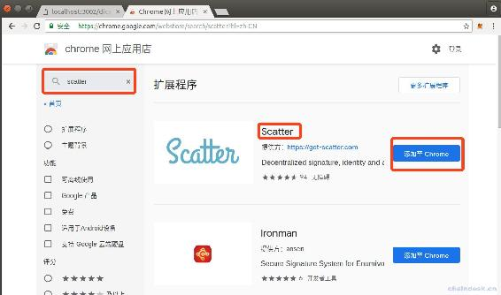

然后会在浏览器右上角显示 Scatter 的 icon，点击它的 icon 初始化钱包。根据提示，保存好助记词、密码。最后，如下图：

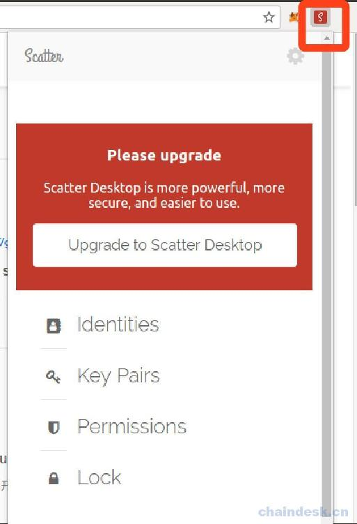

### 2\. 使用 Scatter 钱包

下面只介绍开发中需要操作的步骤

**第一步：**导入私钥

在首页，点击“Key Pairs”，然后再新页面再点击右上角的“New”按钮，会出现如下界面，然后按照如下操作即可，需将账号的私钥导入到下面的相应位置“3”。

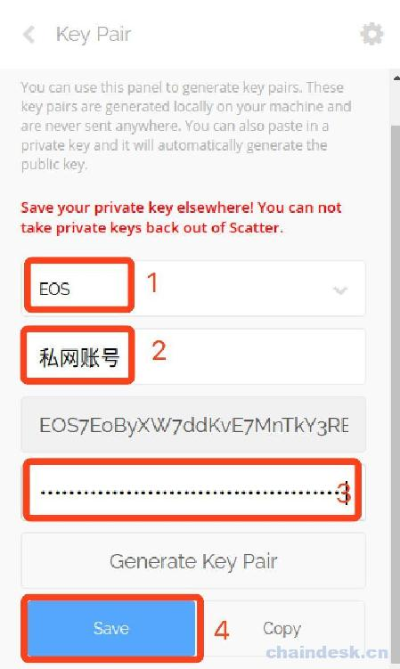

第二步：**导入账号

在首页点击“Identities”，然后再新页面再点击右上角的“New”按钮，会出现如下界面，然后按照如下操作即可。

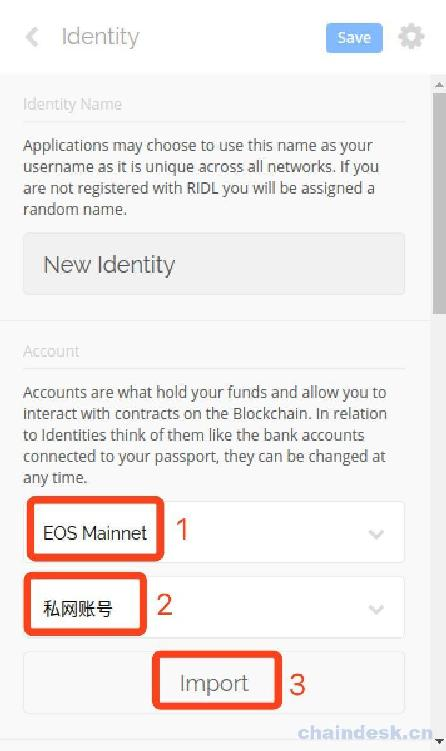

最后将会弹出如下错误提示：

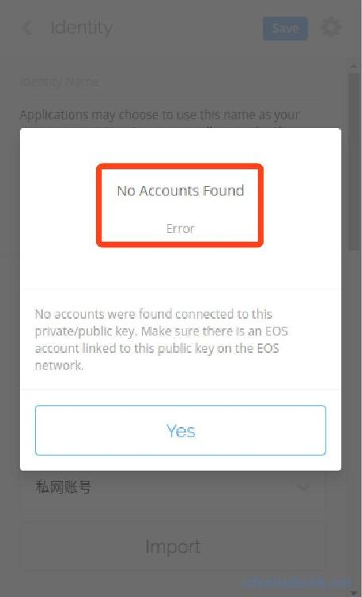

即没有账号，因为现在 Scatter 钱包中只支持导入 EOS 主网中的账号，若前面导入的私钥没有在主网中创建账号，则会有以上错误，那么我们如何使用到私网已经创建好了的账号呢？请看下文。

## 二、配置 Scatter 钱包

### 1\. EOS 节点配置

Scatter 钱包支持自定义节点服务器地址，所以在开发中我们可以使用 Scatter 连接到我们本地的私有网络。请按照如下步骤进行配置：

*   在 Scatter 首页点击右上角的“设置”按钮
*   在 Settings 页面中点击“Networks”
*   在 Networks 页面中点击右上角的“New“按钮
*   然后会出现如下界面
*   填写下面的配置信息
*   最后点击右上角的“Save”按钮即可

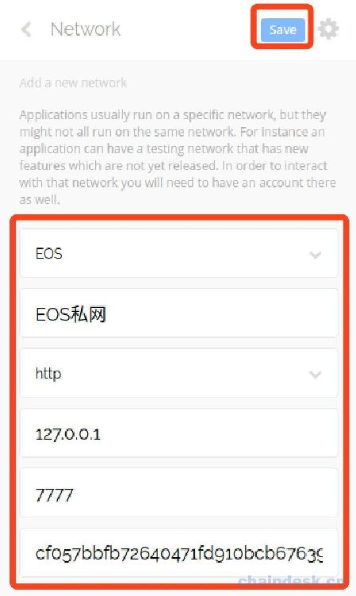

### 2\. 导入 EOS 账号

请重复上面“使用 Scatter 钱包”的导入账号步骤，我们选择“EOS 私网”、“私网账号”，如下所示。

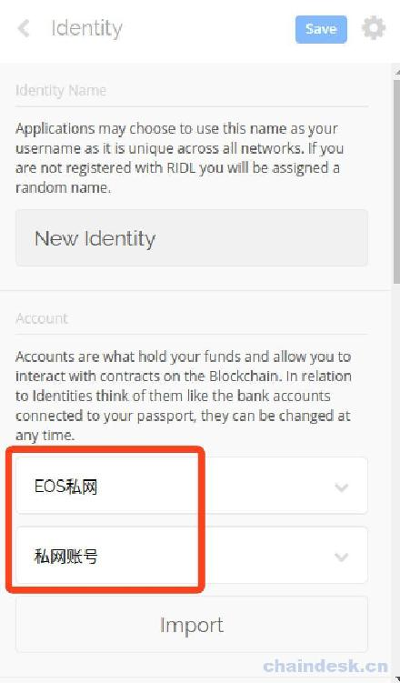

点击“Import”后会出现“私网账号”该私钥所管理的所有账号，如下所示：

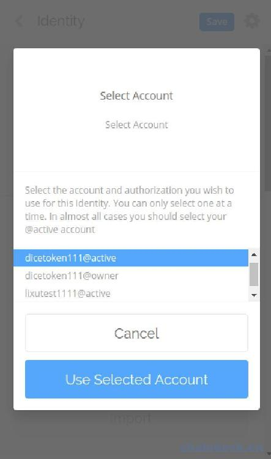

我们选择其中一个即可。然后在“Identities”页面中可以看到多了一个身份，即账号“lixutest1111”。

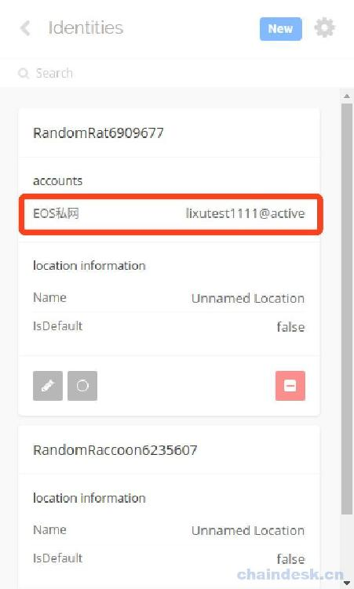

## 三、配置 TokenPocket 钱包 App

目前市场有很多的 EOS 钱包，如：Imtoken2、TokenPocket 钱包、麦子钱包、MORE Wallet、币威钱包、比特派、huobi 钱包等，但是对于 DApp 的支持，我建议使用的还是 TokenPocket 钱包，它和大部分热门钱包一样，是一个挎链钱包，并且已经集成了 Scatter API，让我们的开发更加便捷，即 React 前端只需集成 Scatter API 即可在浏览器、钱包 APP 中使用 DApp。

点击链接[安装 TokenPocket 钱包](https://www.tokenpocket.pro)。安装成功后首页如下：

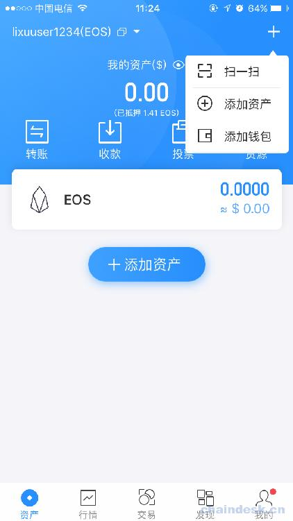

### 1\. 配置 TokenPocket 的开发环境

依次按照如下操作：

*   点击“我的”
*   点击“系统设置”
*   点击“节点设置”
*   点击“EOS”
*   点击“添加自定义节点”
*   然后将出现如下弹框

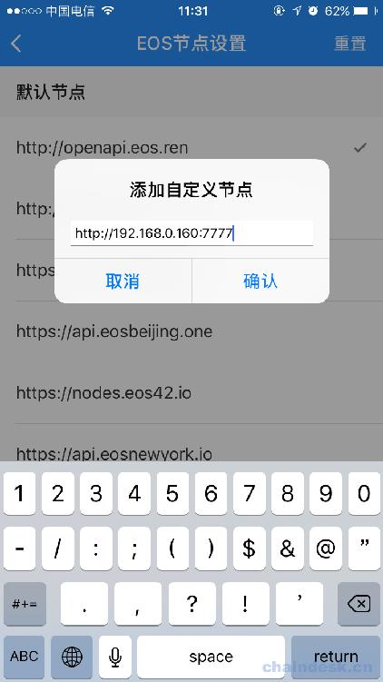

然后使 EOS 节点服务器的主机与手机连接在同一个局域网，即同一个 wifi。然后在主机中通过`ifconfig`打印出自己的 IP，如：我的局域网 IP 地址为：`192.168.0.160`。然后将协议、IP、端口输入上面的弹框中，最后选择使用新添加的节点服务器即可。

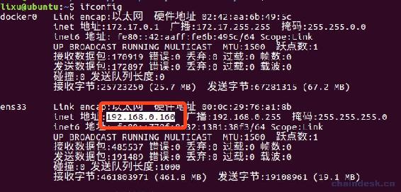

### 2\. 导入 EOS 账号

依次按照如下操作：

*   返回到首页，点击右上角的“+”按钮
*   点击“添加钱包”
*   点击“EOS”
*   点击“导入钱包”
*   然后会出现如下界面，根据提示输入相应数据

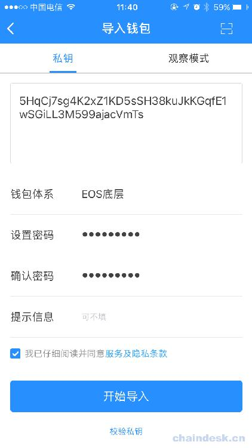

点击“开始导入”会显示与它管理的所有账号，选择需要导入的账号。

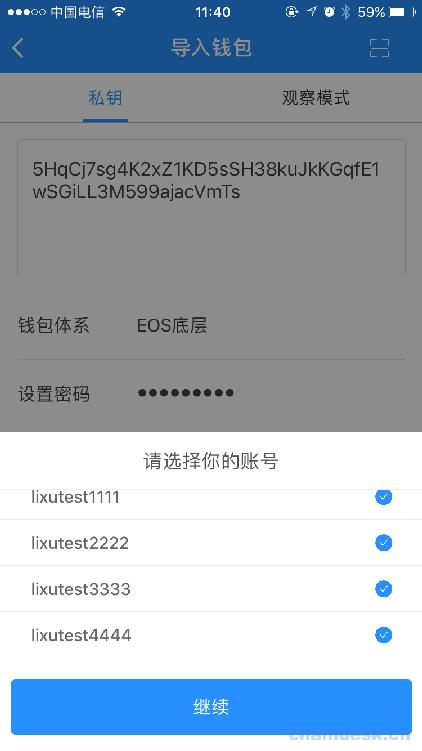

## 四、使用钱包测试 DApp

### 1\. 在 Scatter 中测试 DApp

只需在安装了 Scatter 钱包的浏览器中输入 DApp 的地址即可。在 DApp 中调用 Scatter API 时会自动弹出 Scatter 的授权操作。具体操作后续我们开发的过程中再来学习。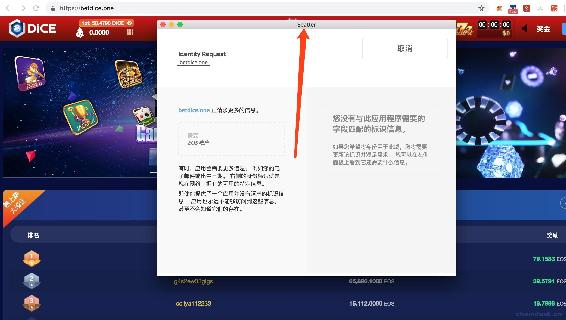

### 2\. 在 TokenPocket 中测试 DApp

TokenPocket 钱包中的 DApp 入口在首页底部的“发现”，推荐热门的已经上线的 DApp，要测试自己的未上线的 DApp，需从以下入口进入，然后输入 DApp 的地址即可使用，DApp 的地址就是 React 前端项目的服务地址。在下一节我们开发了 React 项目后就会在该入口进入来测试 DApp 了。

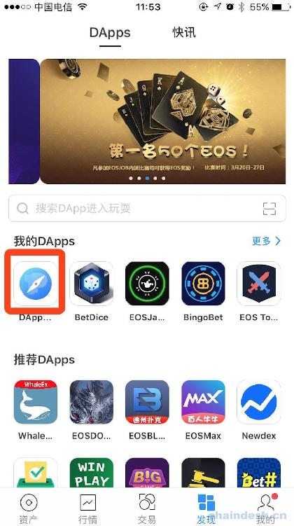

当前，我们可以输入 Betdice 的 DApp 地址“betide.one”进入。

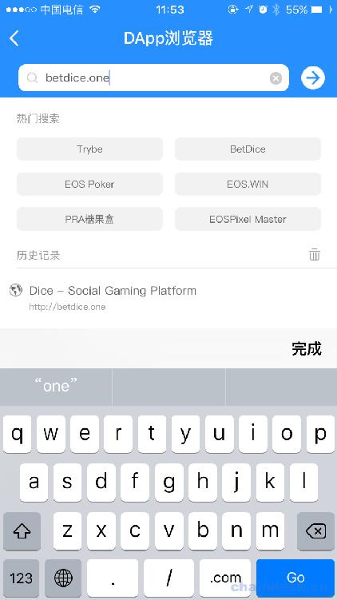

## 五、总结

本节给我们下一节使用 React 开发的 DApp 准备好了运行环境，包括 PC 浏览器、移动端 App。DApp 的操作需要 EOS 账号，然而直接使用钱包的账号，与 App 不同的是 DApp 避免了需要创建账号的步骤，但是给用户也提高了使用门槛，必须有 EOS 钱包并熟悉使用。

**版权声明：博客中的文章版权归博主所有，转载请联系作者（微信：lixu1770105）。**