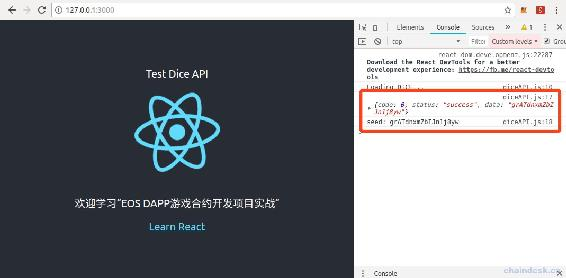

# 6.5 使用 React 开发 DApp 与后端、合约交互

> 我们已经开发完成了后端、合约，还欠缺的是 React 前端即可大功告成，其实博主已经为大家准备好了 React 完整的项目，下面只需要熟悉 React 开发 DApp 如何与后端、合约交互即可。
> 
> 本章主要内容：
> 
> *   创建 React 项目、创建 React 组件
> *   Reac 项目中请求 HTTP 接口
> *   Reac 项目中订阅 Socket 接口
> *   Reac 项目中调用 EOS 合约 action
> *   使用 React 前端进行 Dice 押注

## 一、创建 React 项目

我们开发的 DICE DApp 就是一个 web 应用程序，当前流行的框架中当属 React 受众群里最广泛，所以使用 React 开发该 DApp。

React 开发文档：

*   [`github.com/facebook/create-react-app`](https://github.com/facebook/create-react-app)
*   [`zh-hans.reactjs.org/tutorial/tutorial.html`](https://zh-hans.reactjs.org/tutorial/tutorial.html)

> React 是什么、React 的基本用法等不是本教程的重点，重点是学习合约与后端。
> 
> React 的详细代码我们也不需要去开发，可联系官方微信：kongyixueyuan，或者作者微信：lixu1770105，获取 React 全套代码。
> 
> 我们对 React 只需要熟悉如何与合约、后端交互即可，这样有助于我们梳理整套流程。
> 
> 下面您只需要跟着步骤执行即可。

执行如下命令创建 React 项目 dice-dapp

```js
cd 到 DICE 项目的目录，与 diceServer、webServer 同级别。然后

npx create-react-app dice-dapp
cd dice-dapp
npm start
```

然后使用 VSCode 打开 DICE 可见 dice-dapp 项目已经初始化完成，如下：


npm 启动后会自动开启 Google 浏览器，在浏览器中输入本地服务的地址`http://127.0.0.1:3000/`，效果如下：


## 二、创建组件

在`src`文件夹下新建 components/diceAPI.js 文件，代码如下：

```js
import React, { Component } from 'react';

class Dice extends Component {
    async componentDidMount() {
        console.log("Loading DICE...")
    }

    render() {
        return (<div>Test Dice API</div>);
    }
}

export default Dice;
```

在 App.js 文件中使用该组件，代码如下：

```js
import Dice from './components/diceAPI';

class App extends Component {
  render() {
    return (
      <div className="App">
        <header className="App-header">
          <Dice></Dice>

    ......
```

注意只是增加了两行代码，第一行是引入组件，第二行`<Dice></Dice>`是使用组件。

然后我们刷新页面，打开浏览器控制台，如下：


可以看到 Dice 组件成功加载到了页面中，并且自动回掉了`componentDidMount()`方法。

## 三、请求 HTTP 接口

在 React 中我们可以使用 jQuery 进行 Ajax 请求，去获取网络数据。

安装 jQuery

```js
npm install jquery
```

在`src`文件夹下新建 config/config.js 文件，编写如下代码：

```js
export const eosIP = '127.0.0.1';
export const diceUrl = 'http://127.0.0.1:3002';

//eosio.token 合约账号
export const actionAccountEOS = 'eosio.token';
//dice 合约账号
export const toUser = 'diceadmin111';

export const eosNetwork = {
    blockchain: 'eos',
    protocol: 'http',
    host: eosIP,
    port: 7777,
    chainId: 'cf057bbfb72640471fd910bcb67639c22df9f92470936cddc1ade0e2f2e7dc4f'
}
```

**注意：**

*   请保证已经启动了 webServer 与 diceServer 服务端。
*   下面的接口请根据“前端接口”文档进行调用和传递参数。

### 1\. 转账前获取种子

在 src/components/diceAPI.js 文件的`componentDidMount()`方法中，进行 Ajax 请求获取种子，代码如下：

```js
import $ from 'jquery';
import { diceUrl } from '../config/config';

async componentDidMount() {
    console.log("Loading DICE...")

    /**
     * HTTP
    */
    //转账前获取种子
    $.get(diceUrl + "/dice/seed", function (result) {
        console.log(result)
        console.log("seed:", result.data)
    }.bind(this));
}
```

刷新页面后效果如下，成功获取到了种子数据。



### 2\. 查询账号余额

在 src/components/diceAPI.js 文件的`componentDidMount()`方法中，进行 Ajax 请求查询账号余额，代码如下：

```js
async componentDidMount() {
    console.log("Loading DICE...")

    ......

    //查询账号余额
    $.get(diceUrl + "/account/balance?account=lixutest1111", function (result) {
        console.log(result)
        console.log("balances:", result.data)
    }.bind(this));
}
```

刷新页面后效果如下，成功获取到了账号 lixutest1111 的余额，包含 EOS、JXB。


### 3\. 查询最新三十条所有投注

在 src/components/diceAPI.js 文件的`componentDidMount()`方法中，进行 Ajax 请求 查询最新三十条所有投注，代码如下：

```js
async componentDidMount() {
    console.log("Loading DICE...")

    ......

    //查询最新三十条所有投注  
    $.get(diceUrl + "/dice/newgamelist", function (result) {
        console.log(result)
        console.log("newgamelist:", result.data)
    }.bind(this));
}
```

刷新页面后效果如下，成功获取到了最新二十条所有投注。


## 四、订阅 Socket 接口获取最新投注数据

前端订阅 Socket 与后端推送的 Socket 需对应好关系，与 HTTP 需指定 URL、参数一样。

安装 socket.io-client

```js
npm install socket.io-client
```

在 src/components/diceAPI.js 文件的`componentDidMount()`方法中，进行 Ajax 请求 查询最新三十条所有投注，代码如下：

```js
import socketio from 'socket.io-client';

async componentDidMount() {
    console.log("Loading DICE...")

    ......

    /**
     * Socket
    */
    //Socket 订阅 newgames，获取最新投注数据
    var socket = socketio(diceUrl, { transports: ['websocket', 'xhr-polling', 'jsonp-polling'] });
    socket.on('connect', function () {
        console.log("socket connect!")
        socket.on('newgames', function (data) {
            console.log("socket newgames:", data)
        })
    });
}
```

刷新页面后效果如下，Socket 连接成功了，但是没有任何数据，因为服务端并未推送消息。


为了前端订阅的接口获取到数据，前提是要保证启动了后端服务 webServer、diceServer。然后使用脚本 test.js 中的方法去转账进行投注，才会产生新的投注数据。


**总结：**

对于这个结果，有的同学可能还不是很清晰这个流程，下面来为大家梳理一下：

1.  脚本(前端/DApp)调用合约转账，即押注。
2.  合约记录该未开奖的押注数据到链上的 beting 表中。
3.  diceServer 后端服务轮训查询链上 beting 表中的数据，若有，则传递种子给合约开奖。
4.  合约开奖 action 中将开奖后的结果和押注数据记录到链上的 beted 表中。
5.  webServer 后端服务轮训查询 beted 表中有没有新增加的数据，若有，则通过 socket 的“newgames”接口进行推送。
6.  React 前端订阅了 socket 的“newgames”接口，则会收到推送的数据。

下面再进行一次押注，看一下各个服务执行状态：

 16.30.34.gif)

## 五、调用合约 action

前面已经介绍过，DApp 为了兼容浏览器、钱包 App，需使用 Scatter API。

使用 Scatter API 需安装如下插件：

```js
npm install scatterjs-core scatterjs-plugin-eosjs eosjs
```

### 1\. 运行 Scatter 官方示例代码

**第一步**

点击查看[官方示例代码](https://get-scatter.com/docs/examples-interaction-flow)，拷贝至`src/test/sctterDemo.js`文件中。

需要修改 network 的配置数据，另外修改转账 transfer action 的参数，修改后完整代码如下：

```js
import ScatterJS from 'scatterjs-core';
import ScatterEOS from 'scatterjs-plugin-eosjs';
import Eos from 'eosjs';

ScatterJS.plugins( new ScatterEOS() );

const network = {
    blockchain: 'eos',
    protocol: 'http',
    host: '127.0.0.1',
    port: 7777,
    chainId: 'cf057bbfb72640471fd910bcb67639c22df9f92470936cddc1ade0e2f2e7dc4f'
}

ScatterJS.scatter.connect('My-App').then(connected => {

    if(!connected) return false;
    const scatter = ScatterJS.scatter;
    const requiredFields = { accounts:[network] };
    scatter.getIdentity(requiredFields).then(() => {
        const account = scatter.identity.accounts.find(x => x.blockchain === 'eos');
        const eosOptions = { expireInSeconds:60 };
        const eos = scatter.eos(network, Eos, eosOptions);
        const transactionOptions = { authorization:[`${account.name}@${account.authority}`] };

        eos.transfer(account.name, 'lixutest2222', '1.0000 EOS', 'memo', transactionOptions).then(trx => {
            console.log(`Transaction ID: ${trx.transaction_id}`);
        }).catch(error => {
            console.error(error);
        });

    }).catch(error => {
        console.error(error);
    });
});
```

**第二步**

在`src/components/diceAPI.js`文件中引入该文件，如下：

```js
import sctterDemo from '../test/sctterDemo';
```

**第三步**

然后刷新页面，若 Scatter 未给`127.0.0.1`服务授权，将会出现如下授权提示。然后选择需使用的账号授权，然后点击 Accept 即可。


**第四步**

选择账号授权后，立即将再会弹出签名交易的如下弹框，在 Scatter 弹框中可以看到此次交易的相关参数，如下：


**第五步**

在第三步选择账号授权后，在 Scatter 钱包中，将会记录授权的账号，若后续需更换账号转账，则必须再 Scatter 钱包中删除已授权的账号，再重新授权时再选择新账号。

在 Google 浏览器中打开 Scatter 钱包，点击首页的“Permissions”，将会看到如下界面，则再此处可以看到给相关终端的授权，点击相应的终端地址可解除授权。


### 2\. 封装 Scatter API

我们对以上 demo 进行拆分，首先需要连接 Scatter、再获取当前账号、再根据用户交互调用合约相应 action。

对 Scatter API 封装了如下方法，查看下面详细代码。

```js
import ScatterJS from 'scatterjs-core';
import ScatterEOS from 'scatterjs-plugin-eosjs';
import Eos from 'eosjs';

import {eosNetwork} from '../config/config';

const scatterEos = {

    isConnected: async function () {
        ScatterJS.plugins(new ScatterEOS());
        const connected = await ScatterJS.scatter.connect('My-App')
        return connected
    },

    getEosAccount: async function () {
        const scatter = ScatterJS.scatter;
        var account = null
        const requiredFields = { accounts: [eosNetwork] };
        await scatter.getIdentity(requiredFields).then(() => {
            account = scatter.identity.accounts.find(x => x.blockchain === 'eos');
        }).catch(error => {
            console.error(error);
        });
        return account;
    },

    getEosContract: async function (contractAccount) {
        const scatter = ScatterJS.scatter;
        const options = {};
        const eos = scatter.eos( eosNetwork, Eos, options );
        const requiredFields = { accounts: [eosNetwork] };
        const contract = await eos.contract(contractAccount, { requiredFields });

        return contract;
    },

    signAction: (account) => {
        const options = {
            authorization: [`${account.name}@${account.authority}`],
            broadcast: true,
            sign: true
        }
        return options
    },

}

export default scatterEos;
```

### 3\. 获取当前账号

在 src/components/diceAPI.js 文件的`componentDidMount()`方法中，进行 Ajax 请求 查询最新三十条所有投注，代码如下：

```js
async componentDidMount() {
    console.log("Loading DICE...")

    ......

    /**
     * 合约
    */
    //连接 Scatter
    const connected = await scatterEos.isConnected()
    console.log("connected:", connected)
    if (!connected) return false;

    //获取当前账号
    const account = await scatterEos.getEosAccount()
    console.log("account:",account)
}
```

刷新页面后效果如下，成功获取到了 Scatter 选择的当前账号。


### 4\. 调用合约 test action

在官方的示例代码中，调用的是 eosio.token 合约的 transfer action，所以可以直接使用 eos 调用，而其它合约的 action 则不能直接调用，需先获取合约实例后，通过合约实例调用相关 action。

那么调用 diceadmin111 合约的 test action，该如何处理呢？需要先查看 test action 的声明，然后传递相应参数，它的实现如下：

```js
void mydice::test(const account_name &user, string seed)
{
    print("\nuser:", name{user}, ", ", seed);
}
```

React 调用 diceadmin111 合约的 test action 代码如下：

```js
async componentDidMount() {
    console.log("Loading DICE...")

    ......

    //连接 Scatter
    const connected = await scatterEos.isConnected()
    console.log("connected:", connected)
    if (!connected) return false;

    //获取当前账号
    const account = await scatterEos.getEosAccount()
    console.log("account:",account)

    //调用 diceadmin111 合约的 test action
    const diceContract = await scatterEos.getEosContract("diceadmin111")
    const result = await diceContract.test("lixutest1111", "aaa", scatterEos.signAction(account));
    console.log("result:", result.processed.action_traces[0].console) 
}
```

刷新页面后，Scatter 钱包将会弹框给用户签名该交易，然后在浏览器中将输出 test action 的 print 内容。

## 六、使用 React 前端押注

为了模拟玩家的掷骰子行为，我们在前面的组件中再添加一个按钮，并在它的点击事件中去调用合约转账，即可完成押注。

**第一步**

修改 src/components/diceAPI.js 文件的 Dice 组件，增加一个 button 元素，如下：

```js
render() {
    return (
        <div>Test Dice API
            <div>
                <button onClick={this.betting}>押注</button>
            </div>
        </div>
    );
}
```

**第二步**

在 Dice 组件中实现点击事件 betting，发起转账操作。这里转账数额、押注的数字就在代码中默认写好就行了。

```js
async betting() {
    //获取当前账号
    const account = await scatterEos.getEosAccount()
    console.log("account:", account)

    //转账前获取种子
    $.get(diceUrl + "/dice/seed", async function (result) {
        console.log(result)
        const seed = result.data
        const memo = `seed:${seed},num:68,ref:`

        //调用 eosio.token 合约的 transfer action
        const tokenContract = await scatterEos.getEosContract(actionAccountEOS)
        const result2 = await tokenContract.transfer(account.name, toUser, '3.0000 EOS', memo, scatterEos.signAction(account));
        console.log("result:", result2)
    }.bind(this));
}
```

**第三步**

取消注释 Socket 订阅 newgames，不能注释“连接 Scatter”的代码。

**第四步**

刷新页面后我们点击押注按钮，前端交互流程如下：

 09.47.38.gif)

前端发起了转账后直到收到押注的新推送，这整个流程就是我们该次 EOS DApp 合约开发的核心流程，大家务必掌握。可以再次查看上文“四、订阅 Socket 接口获取最新投注数据”作出的总结。

## 七、源码

下面只显示 React 项目中的 Dice 组件的源码，其它代码在上文可以查看到。

`src/components/diceAPI.js`代码如下：

```js
import React, { Component } from 'react';
import $ from 'jquery';
import socketio from 'socket.io-client';
import { diceUrl, toUser, actionAccountEOS } from '../config/config';
// import sctterDemo from '../test/sctterDemo';
import scatterEos from '../utils/scatterUtils';

class Dice extends Component {
    async betting() {
        //获取当前账号
        const account = await scatterEos.getEosAccount()
        console.log("account:", account)

        //转账前获取种子
        $.get(diceUrl + "/dice/seed", async function (result) {
            console.log(result)
            const seed = result.data
            const memo = `seed:${seed},num:68,ref:`

            //调用 eosio.token 合约的 transfer action
            const tokenContract = await scatterEos.getEosContract(actionAccountEOS)
            const result2 = await tokenContract.transfer(account.name, toUser, '3.0000 EOS', memo, scatterEos.signAction(account));
            console.log("result:", result2)
        }.bind(this));
    }

    async componentDidMount() {
        console.log("Loading DICE...")

        /**
         * HTTP
        */
        //转账前获取种子
        // $.get(diceUrl + "/dice/seed", function (result) {
        //     console.log(result)
        //     console.log("seed:", result.data)
        // }.bind(this));

        //查询账号余额
        // $.get(diceUrl + "/account/balance?account=lixutest1111", function (result) {
        //     console.log(result)
        //     console.log("balances:", result.data)
        // }.bind(this));

        //查询最新三十条所有投注  
        // $.get(diceUrl + "/dice/newgamelist", function (result) {
        //     console.log(result)
        //     console.log("newgamelist:", result.data)
        // }.bind(this));

        /**
         * Socket
        */
        // Socket 订阅 newgames，获取最新投注数据
        var socket = socketio(diceUrl, { transports: ['websocket', 'xhr-polling', 'jsonp-polling'] });
        socket.on('connect', function () {
            console.log("socket connect!")
            socket.on('newgames', function (data) {
                console.log("socket newgames:", data)
            })
        });

        /**
         * 合约
        */
        // 连接 Scatter
        const connected = await scatterEos.isConnected()
        console.log("connected:", connected)
        if (!connected) return false;

        // 获取当前账号
        // const account = await scatterEos.getEosAccount()
        // console.log("account:",account)

        //调用 diceadmin111 合约的 test action
        // const diceContract = await scatterEos.getEosContract("diceadmin111")
        // const result = await diceContract.test(account.name, "aaa", scatterEos.signAction(account));
        // console.log("result:", result.processed.action_traces[0].console) 
    }

    render() {
        return (
            <div>Test Dice API
                <div>
                    <button onClick={this.betting}>押注</button>
                </div>
            </div>
        );
    }
}

export default Dice;
```

## 八、总结

本节是整个 Dice 项目非常关键的环节，学习完本节将掌握了使用 React 开发的 DApp 如何与后端通过 HTTP、Socket 交互，如何使用 Scatter API 与合约交互。

下一节将介绍如何使用博主提供的 React 完整的前端项目修改配置数据后，与我们自己前面开发的后端、合约进行交互，这样我们就开发完成了 Dice 的整套项目。

**注意：**

目前可以在局域网中通过 TokenPocket 钱包访问该 DApp 页面，但是不能押注。由于 EOS 节点服务是在本地局域网搭建的，所以 TP 钱包的 Scatter 接口无法连接到本地节点服务。后续再来为大家演示在 TokenPocket 钱包访问该 DApp 进行押注。

若您现在需在 TokenPocket 中支持 DApp 连接区块链，那么 TokenPocket 中的节点设置必须是外网，如：EOS 主网、Jungle 测试网络、服务器搭建的本地网络，下面列出了他们的 chainID：

| 网络类型 | chainID | 节点地址 |
| --- | --- | --- |
| EOS 主网 | aca376f206b8fc25a6ed44dbdc66547 c36c6c33e3a119ffbeaef943642f0e906 | `http://api-mainnet.starteos.io` |
| Jungle 测试网络 | e70aaab8997e1dfce58fbfac80cbbb8f ecec7b99cf982a9444273cbc64c41473 | `http://jungle2.cryptolions.io:80` |
| 服务器搭建的本地网络 | cf057bbfb72640471fd910bcb67639c2 2df9f92470936cddc1ade0e2f2e7dc4f | 可联系博主提供测试服务器地址 |

**练习：**

1.  先后使用两个账号进行押注，如：lixutest1111、lixutest2222.
2.  换一台电脑使用 Google 浏览器访问该 React 开发的 DApp，然后进行押注。

**版权声明：博客中的文章版权归博主所有，转载请联系作者（微信：lixu1770105）。**