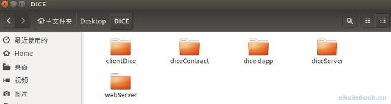
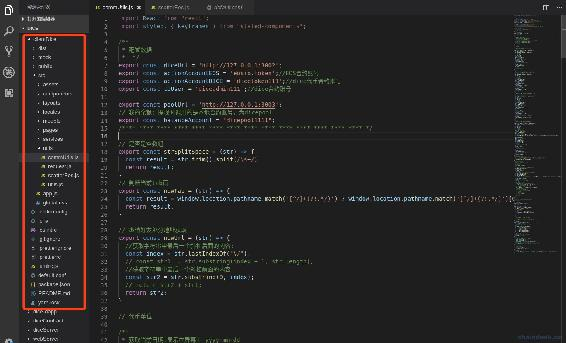
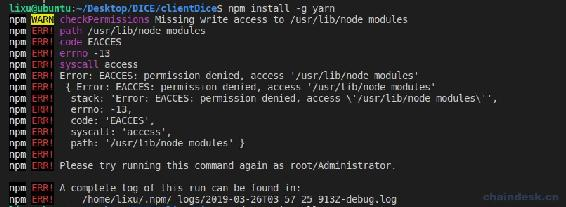
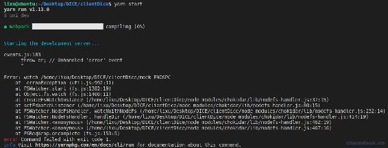
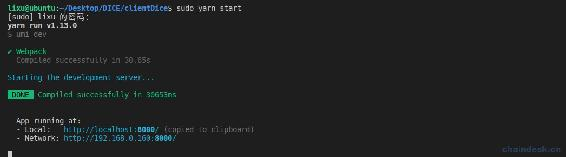
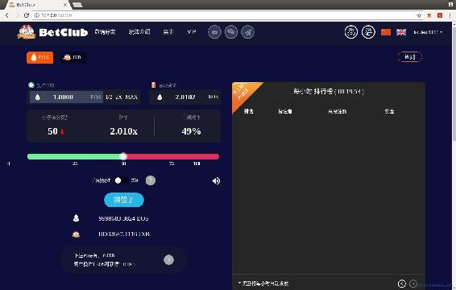
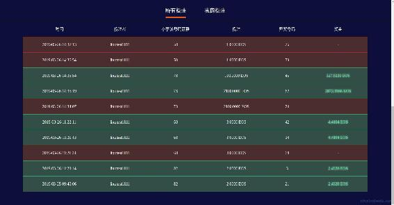
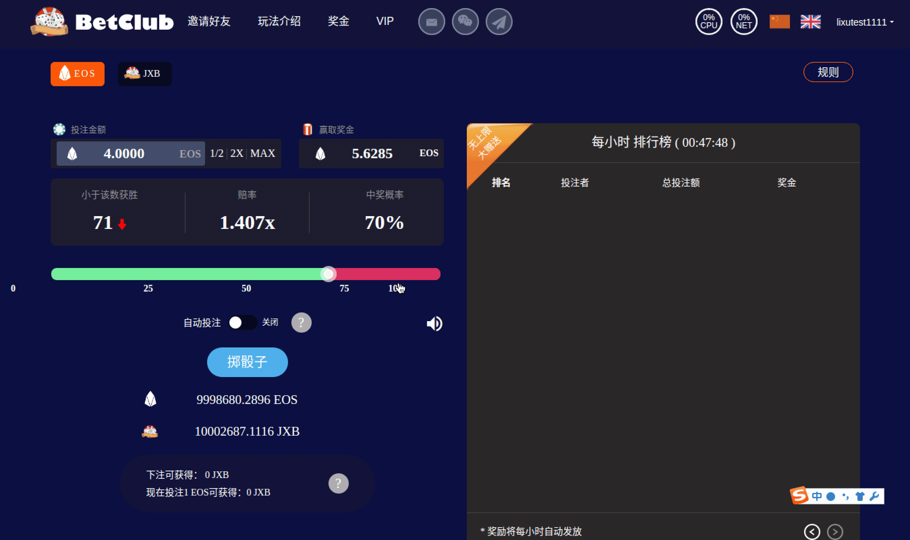

# 六、.6 Google 浏览器访问 DICE DApp

> 本节是重点是对整个项目进行测试，验证前面开发完成的合约、后端的正确性。对于完整 DApp 项目源码，可联系官方微信：kongyixueyuan，或者作者微信：lixu1770105，获取 React 全套代码。
> 
> 本章重点内容如下：
> 
> *   配置完整的 React 项目
> *   运行 React 项目 clinetDice
> *   访问 DICE DApp

## 一、配置完整的 React 项目

将获取到的完整 DApp 项目 clinetDice 拷贝至 DICE 文件夹中，现在 DICE 中将有如下五个项目：



以上项目分别是：

*   clinetDice：React 开发的完整的 DICE DApp 客户端。
*   diceContract：使用 C++开发的 EOS 合约，另外包含部署脚本、测试脚本。
*   dice-app：React 开发的 DApp demo，用于调通 DApp 与 webServer 后端、合约交互。
*   diceServer：与合约交互的 NodeJS 后端，包含合约账号的私钥，主要是开奖等操作。
*   webServer：对 EOS 链上数据进行处理，提供 RESTful API 和 webSocket 接口给 DApp 调用的 NodeJS 后端。

使用 VSCode 打开 DICE，clinetDice 项目的文件结构如下：



有两处地方需要修改。

1.  打开`src/utils/commUtils.js`文件，根据自己服务的数据修改如下配置：

    ```js
    /**
     * 配置数据
     *  */
    export const diceUrl = 'http://127.0.0.1:3002';
    export const actionAccountEOS = 'eosio.token';//EOS 合约账号
    export const actionAccountDICE = 'dicetoken111';//dice 代币合约账号
    export const toUser = 'diceadmin111';//dice 合约账号 
    ```

2.  打开`src/utils/scatterEos.js`文件，根据自己服务的数据修改如下配置：

    ```js
    /**
     * EOS 节点配置数据
     *  */
    const network = {
        blockchain: 'eos',
        protocol: 'http',
        host: '127.0.0.1',
        port: 7777,
        chainId: 'cf057bbfb72640471fd910bcb67639c22df9f92470936cddc1ade0e2f2e7dc4f'
    } 
    ```

    上面是连接的局域网的 EOS 本地节点。

## 二、运行 React 项目 clinetDice

**第一步：**使用 npm 安装 yarn，如果已经安装过可跳过该步骤。

```js
npm install -g yarn 
```

Yarn 是 Facebook 最近发布的一款依赖包安装工具。Yarn 是一个新的快速安全可信赖的可以替代 NPM 的依赖管理工具。

> 若出现下面的错误，请在命令前加上 sudo 权限：
> 
> ```js
> npm ERR! Please try running this command again as root/Administrator. 
> ```
> 
> 

**第二步：**使用 yarn 安装项目依赖包。

```js
yarn install 
```

**第三步：**最后启动项目。

```js
yarn start 
```

> 若出现下面的错误，请在命令前加上 sudo 权限：
> 
> ```js
> events.js:183
>       throw er; // Unhandled 'error' event
>       ^
> Error: watch /home/lixu/Desktop/DICE/clientDice/mock ENOSPC 
> ```
> 
> 

成功启动后如下图：



## 三、访问 DICE DApp

React 项目启动后即可访问，在 Google 浏览器中输入"127.0.0.1:8000"或者上图中输出的局域网地址，效果如下：



当前后端和合约只开发完成了掷骰子相关接口，所以 DICE DApp 中无法访问排行榜、奖池、投注奖励等数据。我们在后续的内容中开发完成了相关功能后，该 DApp 即可正常访问到所有数据。

试玩一把掷骰子，测试相关接口数据正常。



**版权声明：博客中的文章版权归博主所有，转载请联系作者（微信：lixu1770105）。**