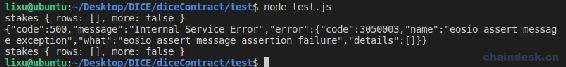
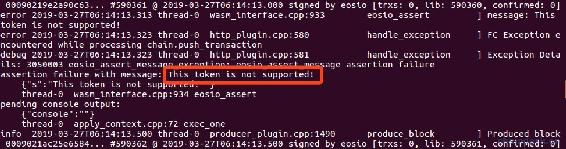
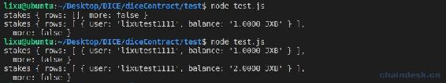
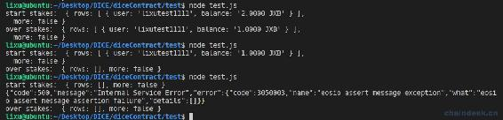
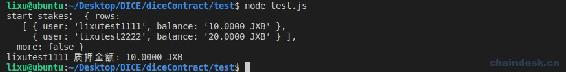
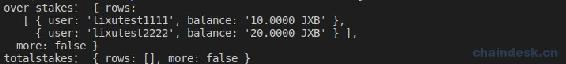
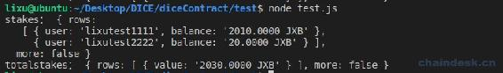

# 七、.1 Token 合约实现质押与赎回

> 我们的平台币 JXB，之前部署的合约使用的是 eoiso.token，现在需要基于该合约升级功能，实现质押、赎回、解锁、挖矿等。
> 
> 本节主要内容包含：
> 
> *   定义 staketokens 多索引数据表
> *   合约实现质押功能
> *   合约实现赎回功能
> *   编写 NodeJS 测试脚本
> *   代币质押部分禁止交易
> *   合约提供查询用户质押数量的接口
> *   记录总质押量并提供接口

## 一、合约实现质押功能

质押的作用就是锁定用户的 JXB，让他不能交易该部分资产。然后奖池的利润会根据用户质押代币的数量占比进行分红，这样使用户人人持币且能赚其它代币，就不轻易抛售。

在质押功能的实现上，可以在原有的 accounts 表中添加一个字段记录质押的金额。非常容易，后面也兼容质押该合约发行的其它代币。但是这样有一个不足的地方就是无法统计每个用户的质押数量，因为用户是表的 scope，是一个变量。

因此，我们需要另外建一个表用来记录用户质押的数据。

### 1\. 定义 staketokens 多索引数据表

在 diceContract/contracts 文件夹中新建 mytoken 文件夹，将 eosio.token.hpp、eosio.token.cpp 文件拷贝至 mytoken 中并更名为 mytoken.hpp、mytoken.cpp，同时生成相应 action、table 的 ABI。

我们将 user 作为了主键，这样会有一个弊端，只支持质押该合约发行的一种代币。如果后期发展需要再支持质押其它代币，则另外建表或者用 id 作为主键即可。

在 mytoken.hpp 中新增如下定义。

```js
//@abi table stakes i64
struct staketoken
{
    staketoken() {}
    account_name user;
    asset balance;
    uint64_t primary_key() const { return user; }

    EOSLIB_SERIALIZE(staketoken, (user)(balance))
};
typedef eosio::multi_index<N(stakes), staketoken> staketokens;
```

### 2\. 储存押注数据到数据库 betings 中

在 mytoken.cpp 中实现 stake action：

```js
void token::stake(account_name owner, asset value)
{
}
```

**第一步：**对调用者和质押的代币进行验证。

```js
require_auth(owner);
eosio_assert(value.symbol == jxb_symbol, "This token is not supported!");
```

**第二步：**查询用户的余额，且不低于质押的数量。

```js
accounts account_obj(_self, owner);
const auto &mytoken = account_obj.get(value.symbol.name(), "no balance object found");
eosio_assert(mytoken.balance.amount >= value.amount, "overdrawn balance");
```

**第三步：**查询用户已质押的数据。

```js
stakes staketokens_obj(_self, _self);
auto mystake = staketokens_obj.find(owner);
```

**第四步：**若该用户没有质押数据，则新增质押数据到 staketokens 表中。

```js
if (mystake == staketokens_obj.end())
{
    staketokens_obj.emplace(owner, & {
        a.balance = value;
        a.user = owner;
    });
}
```

**第五步：**否则该用户有质押数据，须保证用户可用资金不得低于现在将质押的数量，则修改 staketokens 表增加该用户已质押的数量。

```js
else
{
    eosio_assert(mytoken.balance.amount - mystake->balance.amount >= value.amount, "stake overdrawn balance");
    staketokens_obj.modify(mystake, 0, & {
        a.balance += value;
    });
}
```

**第六步：**在 mytoken.hpp 中声明 stake action。

```js
void stake(account_name owner, asset value);
```

**第七步：**在 mytoken.cpp 中生成 stake ABI。

```js
EOSIO_ABI(token, (create)(issue)(transfer)(stake))
```

后续将不再说明需要在头文件声明 action 和接口需要生成 ABI。

**第八步：**使用 deploy.js 脚本，编译 mytoken 合约并使用 dicetoken111 部署该合约。

### 3\. 编写测试脚本

在 test.js 中实现`callMytokenAPI()`方法，在调用 stake 前后分别查询链上 stakes 表的数据。

具体代码如下：

```js
async function callMytokenAPI() {
    let eos = myUtils.getEOSJS(config.signAccountPrivate)
    let mytokenContract = await eos.contract(myTokenContractAccount)

    data = await eos.getTableRows(true, myTokenContractAccount, myTokenContractAccount, "stakes", "", 0, -1, 100)
    console.log("stakes", data)

    //质押
    await mytokenContract.stake(user, "1.0000 EOS", myUtils.signAction(user))
        .then((data) => {
        })
        .catch((err) => {
            console.log(err)
        })

    data = await eos.getTableRows(true, myTokenContractAccount, myTokenContractAccount, "stakes", "", 0, -1, 100)
    console.log("stakes", data)
}
```

通过运行`node test.js`后控制台输出如下：



发现调用 stake 时报错了，大家能看出什么错误吗？这时需要看 nodeos 节点服务所打印的日志才能确定错误信息。下面截图了此事 nodeos 的输出日志如下：



发现错误信息正是合约的 stake action 中的断言语句，在调用合约的 stake action 时传递的是质押 EOS，合约的实现中是不允许的，只支持质押 JXB，所以会出错。将上面的 test.js 中传递的`1.0000 EOS`更改为`1.0000 JXB`即可。若脚本调用合约出现错误，切记，查看 nodeos 日志发现问题。

重新运行脚本调用合约，输出如下：



可见质押后即可查询到质押的数据。

开发到这里，我们作为一个有逼格的程序员，应该考虑下一步开发赎回功能还是完善转账功能(禁止转走质押部分)？

这里我给出的建议是先完善转账功能，以便对质押的功能进行安全测试。

## 二、代币质押部分禁止交易

代币质押后不能交易，只能交易账户的剩余部分，所以我们需要完善原有的 transfer action。经过分析我们只需要控制转出者的金额即可，在 transfer 中有行代码是：

```js
sub_balance(from, quantity);
```

它的实现是减少转出者的余额，那么在该方法中去控制即可。需要添加的代码如下

```js
void token::sub_balance(account_name owner, asset value)
{
    ......

    //质押
    staketokens staketokens_obj(_self, _self);
    auto mystake = staketokens_obj.find(owner);
    if (mystake != staketokens_obj.end())
    {
        eosio_assert(from.balance.amount - mystake->balance.amount >= value.amount, "overdrawn balance");
    }

    ......
}
```

如此，使用户转账的金额不大于除了质押部分的金额。

此时，大家应该对合约作逻辑测试， 以避免不必要的 bug，如：

*   质押的数量大于余额
*   质押了一部分，然后再次质押的金额大于可用余额
*   质押了一部分后，转账的金额大于可用余额

这里我就不赘述演示种种测试用例了。

## 三、合约实现赎回功能

有的开发商将赎回设置了一个期限，即用户发起赎回后需要一天或三天的时间才赎回到账可交易，现在我们先开发赎回及时到账有便于测试，整个项目跑通后，可再次升级该功能，在合约中只需使用 deferred 延迟交易去修改表数据，同时记录赎回的时间。现在我们将质押的代币进行赎回操作，

### 1\. C++实现合约赎回功能

在 mytoken.cpp 中实现 unstake action：

```js
void token::unstake(account_name owner, asset value)
{
}
```

**第一步：**对调用者和质押的代币进行验证。

```js
require_auth(owner);
eosio_assert(value.symbol == jxb_symbol, "This token is not supported!");
```

**第二步：**查询用户的质押的金额，且赎回金额不高于质押金额。

```js
staketokens staketokens_obj(_self, _self);
auto &mystake = staketokens_obj.get(owner, "no balance object found");
eosio_assert(mystake.balance.amount >= value.amount, "overdrawn balance");
eosio_assert(mystake.balance.symbol == value.symbol, "symbol precision mismatch");
```

**第三步：**判断若赎回金额等于质押金额，则删除用户在 staketokens 表中的质押数据，否则在表中减去赎回金额。

```js
if (mystake.balance.amount == value.amount)
{
    staketokens_obj.erase(mystake);
}
else
{
    staketokens_obj.modify(mystake, owner, & {
        a.balance -= value;
    });
}
```

**第四步：**使用 deploy.js 脚本，编译 mytoken 合约并使用 dicetoken111 部署该合约。

### 2\. 编写 NodeJS 测试脚本

在 test.js 的`callMytokenAPI()`方法中，再添加调用 unstake action 的脚本，注释掉调用 stake 的代码。

具体代码如下：

```js
async function callMytokenAPI() {
    let eos = myUtils.getEOSJS(config.signAccountPrivate)
    let mytokenContract = await eos.contract(myTokenContractAccount)

    data = await eos.getTableRows(true, myTokenContractAccount, myTokenContractAccount, "stakes", "", 0, -1, 100)
    console.log("start stakes：", data)

    //质押
    // await mytokenContract.stake(user, "1.0000 JXB", myUtils.signAction(user))
    //     .then((data) => {
    //     })
    //     .catch((err) => {
    //         console.log(err)
    //     })
    //赎回
    await mytokenContract.unstake(user, "1.0000 JXB", myUtils.signAction(user))
        .then((data) => {
        })
        .catch((err) => {
            console.log(err)
        })

    data = await eos.getTableRows(true, myTokenContractAccount, myTokenContractAccount, "stakes", "", 0, -1, 100)
    console.log("over stakes：", data)
}
```

运行`node test.js`后控制台输出如下：



可见赎回后查询到的质押金额在逐渐减少，最后赎回了所有质押的金额后，再次赎回将会报错了。

## 四、合约提供查询指定用户质押数量的接口

通过`eos.getTableRows()`查询到的是所有用户的质押数据，通过该方法无法获取指定用户的质押数量，所以我们有必要实现功能提供接口。

**第一步：**C++编写合约

该接口用于查询用户已经质押的数量，那么可质押的数量就是账户余额减去已经质押的数量。该功能比较简单，通过用户主键 user 在 staketokens 表中查询到迭代器，若存在则输出他的 balance 字段即可。

在 mytoken.cpp 中实现 getstake action：

```js
void token::getstake(account_name owner)
{
    staketokens staketokens_obj(_self, _self);
    auto mystake = staketokens_obj.find(owner);

    if (mystake == staketokens_obj.end())
    {
        print("");
    }
    else
    {
        print(mystake->balance);
    }
}
```

因为这并不是敏感数据，所以我们并未进行权限验证。ABI action 并不能返回数据给外部，我们合约可以通过输出的方式在外界获取相应数据。

实现了该 action 后运行 deploy.js 脚本部署合约。

**第二步：**NodeJS 编写脚本

合约的输出数据在字段`data.processed.action_traces[0].console`中，所以获取指定用户质押数量在 test.js 的`callMytokenAPI()`中添加如下代码：

```js
//获取用户质押数量
await mytokenContract.getstake(user, myUtils.signAction(user))
    .then((data) => {
        if (data && data.processed && data.processed.action_traces && data.processed.action_traces.length > 0 && data.processed.action_traces[0].console) {
            let res = data.processed.action_traces[0].console
            console.log(user, "质押金额:", res)
        }
    })
    .catch((err) => {
        console.log(err)
    })
```

**第三步：**运行脚本测试合约`node test.js`



## 五、记录总质押量

由于奖池中会根据用户质押占比进行分红，所以我们需要记录质押的总量。该功能比较简单，首先在 mytoken.hpp 定义一个多索引表 totalstakes，然后再定义两个修改该表的方法，源码如下：

```js
/**
* 记录总质押量
*/
//@abi table totalstakes i64
struct totalstake
{
    asset value;
    uint64_t primary_key() const { return value.symbol.name(); }
};
typedef eosio::multi_index<N(totalstakes), totalstake> totalstakes;

private:
//更新总质押量
void add_totalstake(asset value);
void sub_totalstake(asset value);
```

在 mytoken.cpp 中实现 add_totalstake()，如下：

```js
void token::add_totalstake(asset value)
{
    totalstakes totalstakes_table(_self, _self);
    auto totalstakes_itr = totalstakes_table.find(jxb_symbol.name());

    if (totalstakes_itr == totalstakes_table.end())
    {
        totalstakes_table.emplace(_self, & {
            a.value = value;
        });
    }
    else
    {
        totalstakes_table.modify(totalstakes_itr, 0, & {
            a.value += value;
        });
    }
}
```

在 mytoken.cpp 中实现 sub_totalstake()，如下：

```js
void token::sub_totalstake(asset value)
{
    totalstakes totalstakes_table(_self, _self);
    const auto &totalstakes_itr = totalstakes_table.get(value.symbol.name(), "no stake balance object found");
    eosio_assert(totalstakes_itr.value >= value, "overdrawn stake balance.");

    if (totalstakes_itr.value == value)
    {
        totalstakes_table.erase(totalstakes_itr);
    }
    else
    {
        totalstakes_table.modify(totalstakes_itr, 0, & {
            a.value -= value;
        });
    }
}
```

现在还差一步就完成了在质押系统中实现记录总质押量，在质押与赎回的 aciton 中分别调用`add_totalstake()`、`sub_totalstake()`，实时的更新总质押量。

更新部署 mytoken 合约后，在 test.js 文件的`callMytokenAPI()`中查询 totalstakes 表数据，代码如下：

```js
data = await eos.getTableRows(true, myTokenContractAccount, myTokenContractAccount, "totalstakes", "", 0, -1, 100)
console.log("totalstakes：", data)
```

运行脚本`node test.js`后输出如下：



发现有之前有两个用户已经质押了，但是 totalstakes 表的数据并未更新，因为我们才实现记录 totalstakes 表的功能，如何矫正它的数据呢？很简单，在`add_totalstake()`方法中将传入的参数 value 加上之前未记录的质押量，我这里是 30JXB，所以应该修改为：

```js
void token::add_totalstake(asset value)
{
    value.amount += 300000;
    ......
}
```

部署合约后再次执行脚本去进行质押，我这里调用质押传递了“2000JXB”，输出如下：



发现记录的总质押数据已经矫正了，注意及时的撤销矫正代码`value.amount += 300000`，并重新部署。

## 六、总结

现在 mytoken 合约中共有如下 action 须生成 ABI：

```js
EOSIO_ABI(token, (create)(issue)(transfer)(unstake)(stake)(getstake))
```

本节首先实现了代币的质押功能，对质押的代币我们应该禁止进行交易，所以又对转账方法进行了完善。玩家质押了代币相应就需要能够赎回，所以本节就开发结束了质押系统的功能。下一节将介绍游戏挖矿、解锁代币的功能。

对于开发的质押系统，是用于游戏社区分红的一种经济模型设计，使持币者可以享受社区的利润分红，让用户产生粘性。

**版权声明：博客中的文章版权归博主所有，转载请联系作者（微信：lixu1770105）。**