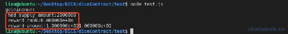

# 7.2 Token 合约实现游戏挖矿

> 游戏挖矿的释放量与项目方解锁代币有直接联系，我们需要先实现挖矿将释放量记录到链上，然后再按照一定比例解锁代币。
> 
> 本节主要内容包含：
> 
> *   挖矿释放 Token 的数据上链
> *   获取游戏挖矿数量
> *   实现游戏挖矿功能
> *   编写相应的 nodejs 测试脚本

## 一、挖矿释放 Token 的数据上链

我们先将游戏挖矿所需记录的数据的表和相关方法实现了，再去实现游戏挖矿。

### 1\. 挖矿释放 Token 需求

游戏投注即挖矿，挖矿就会释放一定数量代币。需要根据挖矿数量去按照一定比例解锁代币，包含：私募、空投、团队激励、项目运营。意思是有玩家挖矿到代币后，项目方才有解锁的代币可使用。具体的释放 比例，请查看”2.2-DICE 游戏项目——产品需求“，具体如下：

> ### 挖矿释放 Token 设计
> 
> | 名称 | 教学币 |
> | --- | --- |
> | 简称 | JXB |
> | 发行总量 | 10 亿个 |
> 
> 1.  投注奖励（60%）：6 亿，投注即挖矿，投注 1 个 EOS 奖励 100JXB，该部分每释放总量的 5%（0.5 亿）后挖矿奖励减半。
> 2.  私募（10%）：1 亿，1EOS 兑换 10000 代币，1 亿代币募集 1 万 EOS。
> 3.  空投（10%）：1 亿，注册即送 1000JXB，与钱包、交易所合作，给账号空投 JXB。
> 4.  项目团队（10%）：1 亿，与投注奖励比例 1:6 被动释放，即释放了投注奖励 6 个才能释放项目团队 1 个。
> 5.  项目运营（10%）：1 亿，投注奖励释放 24%后，即 2.4 亿，然后再比例释放项目运营，投注奖励:项目团队:项目运营 = 36:6:10。

根据挖矿释放 Token 的需求文档，可知投注奖励、项目团队、项目运营的释放有一定的比例联系，所以我们需要对各种类型的释放量记录到链上，然后解锁的时候再根据释放量去按照比例解锁。

### 2\. 表设计：挖矿释放 Token

我们定义 tokensupplys 表，包含字段 value 记录已释放量，释放类型 type 作为 scope。

```js
/**
   * Token 激励发放记录
   * scope 是 type:
   *    为 1,　游戏挖矿
   *    为 2, 项目方运营分成１：游戏挖矿６
   *    为３，项目方团队分成 5：项目方运营分成 3
  */
private:
  struct tokensupply
  {
        asset value;
        uint64_t primary_key() const { return value.symbol.name(); }
  };
  typedef eosio::multi_index<N(tokensupplys), tokensupply> tokensupplys;
```

每个类型的总发行量可以不用记录，后期也可根据释放数据进行调整。私募、空投部分的代币可以随时发行出来，与挖矿释放 Token 没有联系，所以也没有记录到表中。

### 3\. 实现查询和增加 Token 释放量

在 mytoken.cpp 中实现查询各类型释放量的方法，typesupply action 代码如下：

```js
uint64_t token::typesupply(uint8_t type, symbol_name symname)
{
    tokensupplys tokensupplys_table(_self, type);

    auto tokensupplys_itr = tokensupplys_table.find(symname);
    if (tokensupplys_itr == tokensupplys_table.end())
    {
        return 0;
    }
    else
    {
        return tokensupplys_itr->value.amount;
    }
}
```

在 mytoken.cpp 中实现增加释放量的方法，typesupply action 代码如下：

```js
uint64_t token::addsupply(uint8_t type, asset value)
{
    tokensupplys tokensupplys_table(_self, type);

    auto tokensupplys_itr = tokensupplys_table.find(value.symbol.name());
    if (tokensupplys_itr == tokensupplys_table.end())
    {
        tokensupplys_itr = tokensupplys_table.emplace(_self, & {
            a.value = value;
        });
    }
    else
    {
        tokensupplys_table.modify(tokensupplys_itr, 0, & {
            a.value += value;
        });
    }

    return tokensupplys_itr->value.amount;
}
```

上面的代码实现很简单，不再赘述了。

## 二、获取游戏挖矿数量

游戏挖矿每释放总发行量的 5%后挖矿奖励将减半，所以我们需要按照该需求进行实现。

### 1\. 合约实现 mineamount

在 mytoken.cpp 中 mineamount action 代码如下：

```js
float token::mineamount()
{
}
```

由于游戏挖矿数量初始值为 100，即投注 1 个 EOS 奖励 100JXB，所以返回值使用 flaot 即可。

**第一步：**获取代币总发行量。

```js
auto sym_name = jxb_symbol.name();
stats statstable(_self, sym_name);
auto existing = statstable.find(sym_name);
eosio_assert(existing != statstable.end(), "token with symbol does not exist, create token before issue");
const auto &st = *existing;
uint64_t max_supply_amount = st.max_supply.amount;
```

**第二步：**游戏挖矿类型的已释放数量，它 type 为 1。

```js
uint64_t had_supply_amount = typesupply(1, sym_name);
print("\n had_supply_amount:", had_supply_amount);
```

**第三步：**因为游戏挖矿每释放总发行量的 5%后挖矿奖励将减半，以此作为挖矿的等级，第 0 级发行 100，第一级发行 50，每级逐渐减半。

```js
float reward_rank = (had_supply_amount * 20 / max_supply_amount);
print("\n reward_rank:", reward_rank);
```

上面的代码这样就容易理解了`had_supply_amount / (max_supply_amount*5%) = had_supply_amount * 20 / max_supply_amount`。

**第四步：**根据等级挖矿奖励将减半，所以实现如下。

```js
float reward_amount = 100.0 / pow(2, reward_rank);
print("\n reward_amount", reward_amount);
return reward_amount;
```

到此完成了 mineamount action 的实现。下面在 mytoken.cpp 中写一个 test action 对该方法进行测试，验证能不能获取正确的数据，同时 test 生成 ABI。

```js
void token::test()
{
    float reward_amoun = mineamount();
    print("\n reward_amoun:", reward_amoun);
}
```

### 2\. NodeJS 脚本

编译部署 mytoken 合约，然后在 test.js 中调用 test action，如下：

```js
await mytokenContract.test(myUtils.signAction(user))
    .then((data) => {
    })
    .catch((err) => {
        console.log(err)
    })
```

运行脚本`node test.js`后输出如下：


可见当前的奖励为 100，后续会跟根据挖矿发行的数量的增加减半该奖励数据。

### 3\. 合约提供获取游戏挖矿数量的 API

上面的 mineamount action 仅用于合约内部调用，若外部调用还需另外实现公开方法，将结果通过 print 传递到外界。

在 mytoken.cpp 中 getminenum action 代码如下：

```js
void token::getminenum()
{
    print(mineamount());
}
```

实现很简单。注意：通过 eosjs 调用时，返回的输出数据中包含 mineamount 中的所有输出，所以调试成功后需将其它 print 注释掉。如下输出中，我们需注释掉红框中的部分。



## 三、实现游戏挖矿功能

### 1\. 合约实现 gamemining

现在我们需要提供一个公开方法实现游戏挖矿功能，将会在 diceadmin111 合约或者分红合约中进行调用。

在 mytoken.cpp 中 gamemining action 代码如下：

```js
void token::gamemining(account_name to, asset quantity, string memo)
{
}
```

其中参数：

*   to：游戏玩家。
*   quantity：玩家投注的金额。
*   memo：挖矿的备注，需要包含投注 ID，否则(重复交易且参数一样)容易报错。

**第一步：**对玩家投注的代币进行验证，必须是 EOS。另外，还需要对该方法的调用者进行权限验证，必须由发行者签名该交易；但是此处并没有进行验证，因为在下面会调用 issue action，在该方法中将对发行者进行权限验证。

```js
print("\nissue:", name{to}, quantity, memo);
eosio_assert(quantity.symbol == eos_symbol, "can not minning!");
```

**第二步：**根据现在游戏挖矿的奖励数量乘以玩家投注数量，即为该次游戏的挖矿奖励。

```js
uint64_t send_token_mount = mineamount() * quantity.amount;
asset send_token_value = asset(send_token_mount, jxb_symbol);
print("\n send_token_value:", send_token_value);
```

**第三步：**为玩家发行挖矿的代币，并且记录增加游戏挖矿的发行量。

```js
issue(to, issue_token_value, memo);
addsupply(1, issue_token_value);
```

到此完成了 gamemining action 的实现。然后编译部署 mytoken 合约。

### 2\. NodeJS 脚本

**第一步：**在 test 文件夹中新建 query.js 文件，用于查询链上数据，下面先实现查询用户余额。

```js
let query = require("../models/query")
let {
    gameContractAccount,
    poolContractAccount,
    user,
    user2,
    refUser } = require("../config/config")

async function queryBalance() {

    let accounts = [
        user, 
    ]

    for (const i in accounts) {
        let account = accounts[i]
        let data = await query.accountAllBalance(account)
        console.log("balance: ", account, ":", data)
    }
}

queryBalance()
```

**第二步：**在 test.js 中调用 gamemining action，如下：

```js
//游戏挖矿
await mytokenContract.gamemining(user, "1.0000 EOS", "12", myUtils.signAction(issueAccount))
    .then((data) => {
        if (data && data.processed && data.processed.action_traces && data.processed.action_traces.length > 0 && data.processed.action_traces[0].console) {
            let res = data.processed.action_traces[0].console
            console.log(res)
        }
    })
    .catch((err) => {
        console.log(err)
    })
```

**第三步：**依次运行脚本：

```js
node query.js
node test.js
node query.js
node test.js
node query.js
```

输出如下：


主要看红线框出来的部分，每次投注 1EOS 游戏挖矿后自己的余额都会增加 100JXB。

## 总结

本章我们实现了游戏挖矿功能，它的实现步骤是：

*   先获取游戏挖矿发行量，与代币总发行的占比，来确定挖矿奖励的数量。
*   再根据用户投注的金额与挖矿奖励数量的乘积作为用户该次投注的游戏挖矿奖励。
*   释放了该次游戏挖矿奖励后，再将释放量记录到链上，后续的挖矿发行量会根据挖矿奖励的累计值进行变化。

下一节的内容就是根据游戏挖矿发行量去解锁项目方的代币。

**版权声明：博客中的文章版权归博主所有，转载请联系作者（微信：lixu1770105）。**