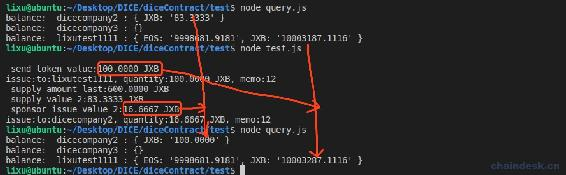
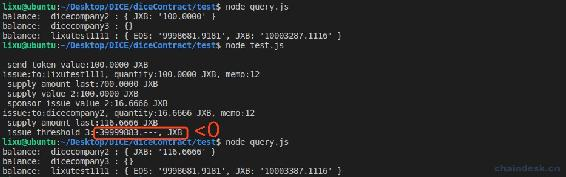
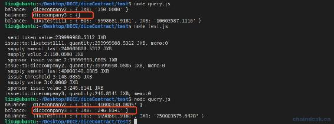
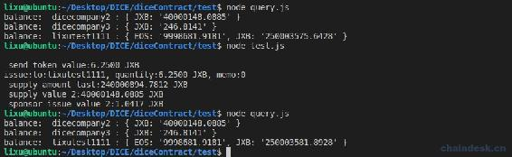

# 7.3 Token 合约实现解锁代币

> 上一节内容介绍了游戏挖矿的实现，本节的内容就是根据游戏挖矿发行量去解锁项目方的代币，包含：项目团队、项目运营两部分。
> 
> 本节主要内容包含：
> 
> *   根据挖矿的解锁规定，按照需求逻辑进行解锁代币
> *   解锁项目团队的代币
> *   解锁项目运营的代币

## 一、解锁项目团队的代币

项目团队、项目运营两部分的解锁规则如下：

> 1.  项目团队（10%）：1 亿，与投注奖励比例 1:6 被动释放，即释放了投注奖励 6 个才能释放项目团队 1 个。
> 2.  项目运营（10%）：1 亿，投注奖励释放 24%后，即 2.4 亿，然后再比例释放项目运营，投注奖励:项目团队:项目运营 = 36:6:10。

应该在挖矿成功后就需要解锁代币，所以在上一节开发的 gamemining action 中需要再调用解锁代币的 action。下面我们先来实现解锁项目团队的代币。

### 1\. 合约实现 unlocktoken_2

首先在 mytoken.hpp 中定义如下两个全局变量：

```js
static const account_name sponsor_issue_account_2 = N(dicecompany2);
static const account_name sponsor_issue_account_3 = N(dicecompany3); 
```

上面两个账户分别用作项目团队、项目运营解锁代币后的接收账号，账号须自行进行创建。

在 mytoken.cpp 中 unlocktoken_2 action 代码如下：

```js
void token::unlocktoken_2(asset supply_amount_last, string memo)
{
} 
```

其中参数：

*   supply_amount_last：上一个类型的已释放量，这里将传入 type 为 1 的已释放量。
*   memo：发行代币时传递的 memo 参数。

**第一步：**获取项目运营已解锁的量，它的 type 为 2。

```js
print("\n supply_amount_last:", supply_amount_last);
//获取项目运营已解锁的量
asset supply_value_2 = typesupply(2, jxb_symbol.name());
print("\n supply_value_2:", supply_value_2); 
```

**第二步：**解锁项目运营的代币，占比游戏挖矿发行量的 1/6，所以代码如下。

```js
//项目运营分成１：奖励玩家６
asset sponsor_issue_value_2 = supply_amount_last / 6 - supply_value_2;
print("\n sponsor_issue_value_2:", sponsor_issue_value_2); 
```

**第三步：**因为游戏挖矿每释放总发行量的 5%后挖矿奖励将减半，以此作为挖矿的等级，第 0 级发行 100，第一级发行 50，每级逐渐减半。

```js
//设置一个界限，需要发放数量大于１０才发放
if (sponsor_issue_value_2.amount > 100000)
{
    issue(sponsor_issue_account_2, sponsor_issue_value_2, memo);
    supply_value_2 = addsupply(2, sponsor_issue_value_2);
} 
```

到此完成了 unlocktoken_2 action 的实现。下面在 mytoken.cpp 的 gamemining action 中调用 unlocktoken_2。

```js
void token::gamemining(account_name to, asset quantity, string memo)
{
    ......

    issue(to, send_token_value, memo);
    asset supply_amount_1 = addsupply(1, send_token_value);
    unlocktoken_2(supply_amount_1, memo);
} 
```

### 2\. NodeJS 脚本

编译部署 mytoken 合约后，依次运行脚本：

```js
node query.js
node test.js
node query.js 
```

输出如下：



主要看红线框出来的部分，每投注 1EOS 游戏挖矿后自己的余额都会增加 100JXB，并且 dicecompany2 账号也会获取解锁到的代币，具体的数字算数这里就不分析了，但是您应该不要省去此步骤，核实玩家、项目运营所解锁的代币数量是否正确。

## 二、解锁项目运营的代币

> 项目运营（10%）：1 亿，投注奖励释放 24%后，即 2.4 亿，然后再比例释放项目运营，投注奖励:项目团队:项目运营 = 36:6:10。

项目运营也可以定义为项目团队释放 4%后，然后再比例释放项目运营，项目团队:项目运营 = 3:5，下面的代码将按照这个思路进行开发。

### 1\. 合约实现 unlocktoken_3

在 mytoken.cpp 中 unlocktoken_3 action 代码如下：

```js
void token::unlocktoken_3(asset supply_amount_last, string memo)
{
} 
```

其中参数：

*   supply_amount_last：上一个类型的已释放量，这里将传入 type 为 2 的已释放量。

**第一步：**获取代币发行总量。

```js
print("\n supply_amount_last:", supply_amount_last);
//获取发行总量
auto sym_name = jxb_symbol.name();
stats statstable(_self, sym_name);
auto existing = statstable.find(sym_name);
asset max_supply_amount = existing->max_supply; 
```

**第二步：**若项目方运营释放量占发行总量的 4%，则开始发放项目方团队分成。

```js
//若项目方运营释放量占发行总量的 4%，则开始发放项目方团队分成
asset issue_threshold_3 = supply_amount_last - (max_supply_amount * 4 / 100);
print("\n issue_threshold_3:", issue_threshold_3); 
```

**第三步：**按照 项目团队 5：项目方运营 3 的比例释放项目团队部分代币，用该类型需发行的总量减去该类型已发行的量。

```js
if (issue_threshold_3.amount > 0)
{
    //项目方团队 5：项目方运营 3
    asset supply_value_3 = typesupply(3, sym_name);
    print("\n supply_value_3:", supply_value_3);
    asset sponsor_issue_value_3 = issue_threshold_3 * 5 / 3 - supply_value_3;
    print("\n sponsor_issue_value_3:", sponsor_issue_value_3);

    ......
} 
```

**第四步：**设置一个界限，需要发放数量大于 10 才发行。

```js
//设置一个界限，需要发放数量大于１０才发放
if (sponsor_issue_value_3.amount > 100000)
{
    issue(sponsor_issue_account_3, sponsor_issue_value_3, memo);
    addsupply(3, sponsor_issue_value_3);
} 
```

到此完成了 unlocktoken_3 action 的实现。下面在 mytoken.cpp 的 unlocktoken_2 action 中调用 unlocktoken_3。

```js
void token::unlocktoken_2(asset supply_amount_last, string memo)
{
    ......

    //设置一个界限，需要发放数量大于１０才发放
    if (sponsor_issue_value_2.amount > 100000)
    {
        issue(sponsor_issue_account_2, sponsor_issue_value_2, memo);
        supply_value_2 = addsupply(2, sponsor_issue_value_2);
        unlocktoken_3(supply_value_2, memo);
    }
} 
```

### 2\. NodeJS 脚本

最后编译部署 mytoken 合约。依次运行脚本：

```js
node query.js
node test.js
node query.js 
```

输出如下：



红线框出来的部分代表没有达到解锁项目运营的要求，需大于零。为了测试能正常的解锁项目运营 type=3 这部分的代币，我们加大投注额，使`issue_threshold_3>0`。因总发行量为 10 亿个，所以我们需总投注 240 万 EOS 才会解锁项目运营 type=3。

下面修改 test.js，调用`gamemining()`传递`2400000.0000 EOS`，如下：

```js
//游戏挖矿
await mytokenContract.gamemining(user, "2400000.0000 EOS", "0", myUtils.signAction(issueAccount))
    .then((data) => {
        if (data && data.processed && data.processed.action_traces && data.processed.action_traces.length > 0 && data.processed.action_traces[0].console) {
            let res = data.processed.action_traces[0].console
            console.log(res)
        }
    })
    .catch((err) => {
        console.log(err)
    }) 
```

再次运行脚本，输出如下：



可以发现 dicecompany3 解锁的相应代币。各项数据大家自行研究正确性，这里不作解释。

下一步，大家再调节押注 1 EOS 去调试解锁的代币是否正确。输出如下：



观察数据我们可以发现：

*   dicecompany2、dicecompany3 解锁账号的余额没有发生变化，代币都没有被解锁。
*   dicecompany2 解锁的代币应该是 1.0417JXB，由于小于 10JXB，所以并未解锁。
*   用户 lixutest1111 的游戏挖矿得到了奖励，数量是 6.2500JXB。
*   挖矿奖励由之前的 100JXB 减半到了现在的 6.2500JXB。

## 三、总结

本节介绍了如何通过游戏挖矿的发行量去解锁项目方的代币，根据需求文档实现了它们相互之间的逻辑，其中项目团队、项目运营的解锁需求还不一样，针对各种需求进行开发，大家自己在开发时应合理对该部分逻辑作变动。

开发到这里，Token 合约就结束了，完成了质押、赎回、挖矿、解锁等功能。下一节我们根据前端接口文档开发后端相应的接口。

**版权声明：博客中的文章版权归博主所有，转载请联系作者（微信：lixu1770105）。**