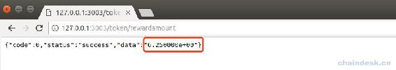
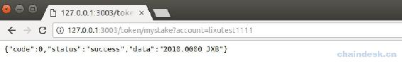
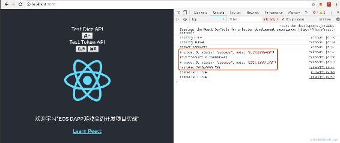
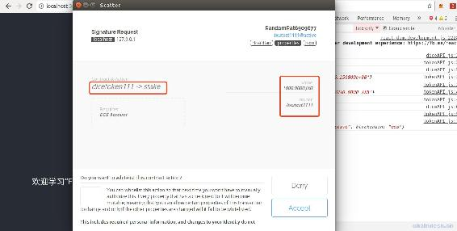
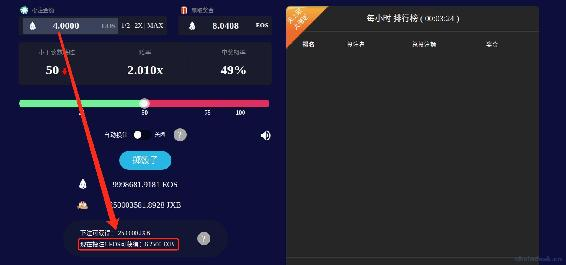
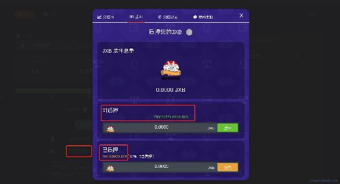

# 七、.4 开发接口：质押、赎回、挖矿、解锁

> mytoken 合约不需要开发 diceServer 后端，只需要提供前端接口的服务即可。本节的内容就先开发 webServer，然后再开发 React 调用合约质押与赎回、访问后端 HTTP 接口。
> 
> 本节主要内容包含：
> 
> *   后端 webServer 实现 HTTP 接口：代币奖励数量
> *   后端 webServer 实现 HTTP 接口：我的质押数量
> *   前端 dice-dapp 与后端和 mytoken 合约交互
> *   启动 DICE DApp，访问 DICE 查看 Token 相关数据与功能

## 一、 后端 webServer 实现 HTTP 接口：代币奖励数量

> mytoken 合约开发完成后，接下来就开始开发 webServer 后端，使用浏览器进行测试。

代币奖励数量即投注 1EOS 奖励的 JXB 数量，就是挖矿奖励，我们需调用合约的 getminenum action。

该接口的数据用于现在是掷骰子按钮下面，提示用户掷骰子有 JXB 奖励。

### 1\. 前端接口说明

> ### 首页—代币奖励数量
> 
> 方式：get
> 
> 接口：/token/rewardamount
> 
> 参数：无
> 
> eg：
> 
> req：`http://127.0.0.1:3003/token/rewardamount`
> 
> res：`{"code":0,"status":"success","data":"2.500000e+01"}`

### 2\. HTTP 接口：代币奖励数量

**第一步：**在 webServer 项目中新建 indextoken.js 文件，代码与 indexdice.js 一致，只有如下三行代码须作修改：

```js
`......
let router = require("./router/token")
......
console.log("正在监听 3003 端口")
server.listen(3003)
......` 
```

**第二步：**在 router 文件夹中新建 token.js，代码如下：

```js
`let router = require('express').Router();
let tokenController = require("../controllers/token")

router.get("/token/rewardamount", tokenController.getRewardAmount)

module.exports = router` 
```

**第三步：**然后在 controllers 文件夹中新建 token.js，并实现 getRewardAmount 方法，前面我们在 test.js 中已经测试通过了，代码如下：

```js
`let { success, fail, signAction } = require("../utils/myUtils")
let myUtils = require("../utils/myUtils")
let config = require("../config/config")

let {
    myTokenContractAccount,
    signAccount } = require("../config/config")

let eos
let mytokenContract;

async function diceInit() {
    eos = myUtils.getEOSJS(config.signAccountPrivate)
    mytokenContract = await eos.contract(myTokenContractAccount)
}

diceInit()

module.exports = {
    //获取游戏挖矿的代币奖励数量
    getRewardAmount: async (req, res) => {
        mytokenContract.getminenum(signAction(signAccount))
        .then((data) => {
            if (data && data.processed && data.processed.action_traces && data.processed.action_traces.length > 0 && data.processed.action_traces[0].console) {
                let result = data.processed.action_traces[0].console
                console.log("getminenum:", result)
                res.send(success(result))
            }
        })
        .catch((err) => {
            console.log(err)
            res.send(fail(err.message))
        })
    },
}` 
```

### 3\. 运行效果

启动 webServer 后端服务`node indextoken.js`，然后使用浏览器访问`http://127.0.0.1:3003/token/rewardamount`，成功获取到了游戏挖矿奖励数量：6.25。



## 二、后端 webServer 实现 HTTP 接口：我的质押数量

### 1\. 前端接口说明

> ### 分红池－我的质押数量
> 
> 方式：get
> 
> 接口：/token/stakes
> 
> 参数：account，账号名称，eg：lixutest1111
> 
> eg：
> 
> req: `http://127.0.0.1:3003/token/mystake?account=lixutest1111`
> 
> res: `{"code":0,"status":"success","data":"100.0000 JXB"}`

### 2\. HTTP 接口：我的质押数量

在 router.js/token.js 文件中添加如下代码，新增一条路由。

```js
`router.get("/token/mystake", diceController.getMyStake)` 
```

然后在 controllers/dice.js 文件中实现 getMyStake 方法，如下：

```js
`// 我的质押数量
getMyStake: async (req, res) => {
    let account = req.query.account
    mytokenContract.getstake(account, signAction(signAccount))
        .then((data) => {
            let result = data.processed.action_traces[0].console
            console.log("result:", result)
            res.send(success(result))
        })
        .catch((err) => {
            console.log(err)
            res.send(fail(err.message))
        })
},` 
```

### 3\. 运行效果

先启动 webServer 后端服务`node indextoken.js`，然后使用浏览器访问接口`http://127.0.0.1:3003/token/mystake?account=lixutest1111`，效果如下：



## 三、前端 dice-dapp 与后端和合约交互

> mytoken 合约、webServer 后端开发完成后，接下来就开始开发 DApp 与后端和合约交互，使用 web 验证它们的正确性。

### 1\. 前端与后端交互

**第一步**：在 dice-dapp/src/config/config.js 中添加后端 token 服务的接口。

```js
`export const tokenUrl = 'http://127.0.0.1:3003';` 
```

**第二步**：在 dice-dapp/src/App.js 中引入 Token 组件。

```js
......
import Token from './components/tokenAPI';
.....

<Dice></Dice>
<Token></Token>

...... 
```

**第三步**：在 dice-dapp/src/components 中新建 tokenAPI.js 文件，实现访问 HTTP 接口：代币奖励数量、我的质押数量，代码如下。

```js
import React, { Component } from 'react';
import $ from 'jquery';
import { tokenUrl, actionAccountDICE } from '../config/config';
import scatterEos from '../utils/scatterUtils';

class Token extends Component {
    async componentDidMount() {
        console.log("Loading TOKEN...")

        /**
         * HTTP
        */
        //代币奖励数量
        $.get(tokenUrl + "/token/rewardamount", function (result) {
            console.log(result)
            console.log("rewardamount:", result.data)
        }.bind(this));

        //我的质押数量
        $.get(tokenUrl + "/token/mystake?account=lixutest1111", function (result) {
            console.log(result)
            console.log("mystake:", result.data)
        }.bind(this));

        /**
         * 合约
        */
        // 连接 Scatter
        const connected = await scatterEos.isConnected()
        console.log("connected:", connected)
        if (!connected) return false;
    }

    render() {
        return (
            <div>Test Token API
                <div>
                    <button onClick={this.clickStake}>质押</button>&nbsp;
                    <button onClick={this.clickUnstake}>赎回</button>
                </div>
            </div>
        );
    }
}

export default Token; 
```

**第四步**：使用浏览器访问 DApp`http://localhost:3000/`，效果如下，在前端成功获取了后端的 HTTP 接口数据。



### 2\. 前端与合约交互

**第一步**：在 dice-dapp/src/components/tokenAPI.js 中实现质押的点击事件 clickStake，代码如下。

```js
async clickStake() {
    //获取当前账号
    const account = await scatterEos.getEosAccount()
    console.log("account:", account)

    //调用 dicetoken111 合约的 stake action
    const tokenContract = await scatterEos.getEosContract(actionAccountDICE)
    const result = await tokenContract.stake(account.name, '1000.0000 JXB', scatterEos.signAction(account));
    console.log("result:", result)
} 
```

先获取 Scatter 钱包中的当前账号，然后再调用 dicetoken111 合约的 stake action。

**第二步**：在 dice-dapp/src/components/tokenAPI.js 中实现质押的点击事件 clickUnstake，代码如下。

```js
async clickUnstake() {
    //获取当前账号
    const account = await scatterEos.getEosAccount()
    console.log("account:", account)

    //调用 dicetoken111 合约的 unstake action
    const tokenContract = await scatterEos.getEosContract(actionAccountDICE)
    const result = await tokenContract.unstake(account.name, '1000.0000 JXB', scatterEos.signAction(account));
    console.log("result:", result)
} 
```

先获取 Scatter 钱包中的当前账号，然后再调用 dicetoken111 合约的 unstake action。

**第三步**：使用浏览器访问 DApp`http://localhost:3000/`，然后点击“质押”按钮，效果如下。



点击“赎回”按钮，的效果类似，我们在 DICE 游戏中再来看质押与赎回完整的效果。

## 四、访问 DICE 游戏

现在已经开发完成了 Token 合约、相关的后端服务，并使用 dice-dapp 验证了正确性，那么最后我们来访问 DICE 游戏看一下 Token 相关数据和功能是否正常。

先启动 webServer 的 dice 服务，`node indexdice.js`。（若要掷骰子，须再启动 diceServer 的 dice 服务）

再启动 clientDice 客户端`yarn start`。

然后浏览器访问`http://localhost:8001/`。

*   查看现在投注可获取的奖励数据。



*   查看我的已质押数量，可质押数量=我的 JXB 余额—已质押数量。



注意：JXB 质押总量数据并未显示，因为该数据我们后端当前并未提供接口，需要在通证经济设计章节中通过 socket 定时推送数据过来。

*   质押功能


*   赎回功能


## 五、总结

经过本章的学习我们完成了质押、赎回、挖矿、解锁的开发，包括 EOS 合约、NodeJS 后端、React 前端，所有功能都围绕着 mytoken 合约展开，下一章将来学习通证经济模型，主要包含 VIP、排行榜、奖池分红、推荐分红等方式来运用 Token 在整个社区的关键作用。

**版权声明：博客中的文章版权归博主所有，转载请联系作者（微信：lixu1770105）。**