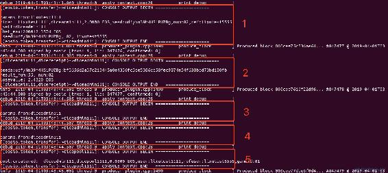
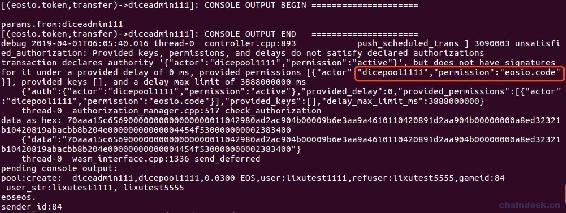
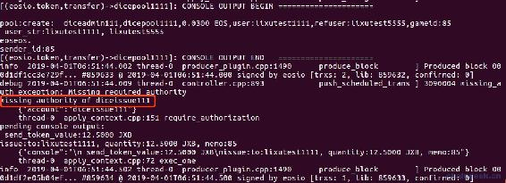
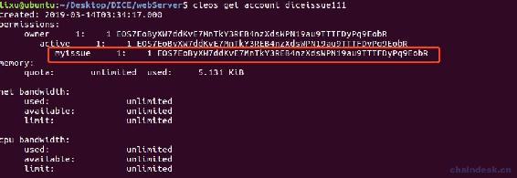
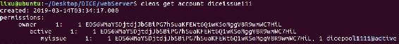
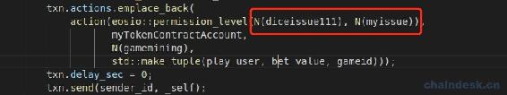
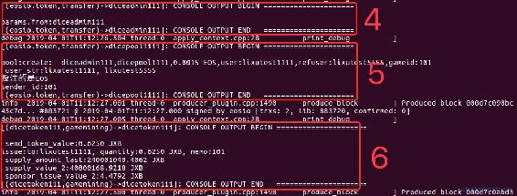

# 8.1 Token 通证经济模型设计

> 本章是开发 pool 合约实现通证经济模型设计，本章的学习将会结合 dice 合约、token 合约、pool 合约，并相互交互。并会对整个 DICE 游戏的逻辑作出总结。
> 
> 本章内容主要包含：
> 
> *   开发 pool 合约
> *   在 create action 中进行通证经济模型设计的数据处理、业务处理
> *   在 pool 合约中为玩家调用游戏挖矿
> *   账号权限设计、权限映射、账号授权等操作

## 一、开发 pool 合约模版

在 diceContract 项目中的 contracts 文件夹中新建 pool 文件夹，与 pool.hpp、pool.cpp 文件。

### 1\. C++编写 pool 合约

pool.hpp 模版代码

```js
`#include <eosiolib/eosio.hpp>
#include <eosiolib/asset.hpp>

using namespace eosio;
using namespace std;

class pool : public eosio::contract
{
public:
  pool(account_name self) : contract(self)
  {
  }

  /**
   * 配置数据
  */
  const symbol_type eos_symbol = string_to_symbol(4, "EOS");
  const symbol_type jxb_symbol = string_to_symbol(4, "JXB");

  /**
 * 公开 API
*/
  //玩家转账后触发的方法。create 该方法禁止生成ＡＢＩ
  void create(account_name from, account_name to, asset value, string memo);
  //测试，上线后删除该方法的ＡＢＩ
  void test(const account_name &user);
};` 
```

pool.cpp 模版代码

```js
`#include <eosiolib/transaction.hpp>
#include "pool.hpp"
#include "helpper.hpp"

using namespace eosio;
using namespace std;
using namespace betclub;

void pool::create(account_name from, account_name to, asset value, string memo)
{
    require_auth(from);

    print("\npool:createred:  ", name{from}, ",", name{to}, ",", value, ",", memo);
}

/**
 * 测试
*/
void pool::test(const account_name &user)
{
    print("\n user:", name{user});
}

#define EOSIO_ABI(TYPE, MEMBERS)                                                                                                                                     \
    extern "C"                                                                                                                                                       \
    {                                                                                                                                                                \
        void apply(uint64_t receiver, uint64_t code, uint64_t action)                                                                                                \
        {                                                                                                                                                            \
            auto self = receiver;                                                                                                                                    \
            if (code == self)                                                                                                                                        \
            {                                                                                                                                                        \
                TYPE thiscontract(self);                                                                                                                             \
                switch (action)                                                                                                                                      \
                {                                                                                                                                                    \
                    EOSIO_API(TYPE, MEMBERS);                                                                                                                        \
                default:                                                                                                                                             \
                    eosio_assert(false, "err action");                                                                                                               \
                    break;                                                                                                                                           \
                }                                                                                                                                                    \
            }                                                                                                                                                        \
            else                                                                                                                                                     \
            {                                                                                                                                                        \
                if (action == N(transfer))                                                                                                                           \
                {                                                                                                                                                    \
                    betclub::mytransfer params = eosio::unpack_action_data<betclub::mytransfer>();                                                                     \
                    if (params.to == self)                                                                                                                           \
                    {                                                                                                                                                \
                        auto sym = params.quantity.symbol;                                                                                                           \
                        if ((code == N(eosio.token) && sym == string_to_symbol(4, "EOS")) || (code == myTokenContractAccount && sym == string_to_symbol(4, "JXB"))) \
                        {                                                                                                                                            \
                            TYPE thiscontract(self);                                                                                                                 \
                            eosio::execute_action(&thiscontract, &pool::create);                                                                                   \
                        }                                                                                                                                            \
                    }                                                                                                                                                \
                }                                                                                                                                                    \
            }                                                                                                                                                        \
        }                                                                                                                                                            \
    }

EOSIO_ABI(pool, (test))` 
```

helpper.hpp 文件是封装的一些帮助 action、常量等。大家在开发中可自行决定是否需要封装，若实现有困难的可添加博主微信进行咨询 lixu1770105。

### 2\. 编译部署合约

在 deploy.js 的 start()方法中添加如下代码

```js
`contractNames.push("pool")
contractAccounts.push("dicepool1111")` 
```

然后运行合约`node deploy.js`完成编译部署工作。

### 3\. 编写测试脚本

在 test.js 文件中添加方法 callPoolAPI，实现如下：

```js
`async function callPoolAPI() {
    let eos = myUtils.getEOSJS(config.signAccountPrivate)
    let myContract = await eos.contract(poolContractAccount)

    await myContract.test(user, myUtils.signAction(user))
        .then((data) => {
            if (data && data.processed && data.processed.action_traces && data.processed.action_traces.length > 0 && data.processed.action_traces[0].console) {
                let res = data.processed.action_traces[0].console
                console.log("res:", res)
            }
        })
        .catch((err) => {
            console.log(err)
        })
}

callPoolAPI()` 
```

运行脚本`node test.js`，结果如下：

```js
`lixu@ubuntu:~/Desktop/DICE/diceContract/test$ node test.js
res:
 user:lixutest1111` 
```

### 4\. 向 pool 合约账号转账

该步骤的目的是验证 pool 合约中的 create action 能否被触发。目前，我们向 pool 合约账号转账是不是有很多种方案，下面简单作下总结：

*   使用 cleos 命令行使用户向 dice 合约账号 diceadmin111 转账。
*   在 test.js 脚本中调用转账。
*   在 dice-app 项目中点击掷骰子按钮也可以。
*   在 clientDice 项目中正常的玩掷骰子也可以。

因为在押注时 dice 合约账号会向 dicepool1111 合约账号转账。不管选择哪种方案，必须开启 diceServer 的 dice 服务，然后任意使用一种方案进行转账，迅速查看 nodeos 日志的输出，如下：



分析以上合约执行流程：

1.  由用户 lixutest1111 向 dice 游戏合约账号 diceadmin111 发起转账，即掷骰子押注。
2.  后端查询到有新的押注，则由合约账号发起开奖操作，并计算出玩家该次押注赢了。
3.  由合约账号 diceadmin111 在自己合约中向用户 lixutest1111 赔付 EOS，需调用 eosio.token 的 transfer 方法。
4.  由合约账号 diceadmin111 在自己合约中向 pool 合约账号 dicepool1111 转账，是用户押注的 1.5%提成。
5.  合约账号 dicepool1111 在它的合约中监听到了转账通知，触发了 create action，从而输出了方法中日志。

## 二、实现 create action

### 1\. 判断转账方是否是自己社区的游戏合约账号

目前该游戏社区只有 dice 游戏，后期可增加判断其他游戏合约账号的条件，若不是游戏合约账号的提成则 retuen 不处理。在 create aciton 中添加如下代码：

```js
`/**
 * 判断转账方是否是自己社区的游戏合约账号
*/
string action_game;
//目前该游戏社区只有 dice 游戏，后期可增加判断其他游戏合约账号的条件，若不是游戏合约账号的提成则 retuen 不处理．
if (from == gameContractAccount)
{
    action_game = "dice";
} else {
    //retuen 就当做是单纯的转账不作处理，但是可以收到转的钱．
    return;
}` 
```

### 2\. 参数处理

对转账的 memo 数据进行处理，获取里面的字段数据，大家应该知道 mome 中的数据结构是在哪里确定的，若没影响请查看“5.3Dice 合约实现开奖”章节末尾的内容。

```js
`/**
 * 参数处理
*/
vector<string> v;
splitstring(memo, v, ",");
string user_str = "";
string refuser_str = "";
string gameid = "";

for (vector<string>::size_type i = 0; i != v.size(); i++)
{
    string key = v[i].substr(0, v[i].find(":"));
    string valuestr = v[i].substr(v[i].find(":") + 1);
    if (key == "user")
    {
        user_str = valuestr;
    }
    else if (key == "refuser")
    {
        refuser_str = valuestr;
    }
    else if (key == "gameid")
    {
        gameid = valuestr;
    }
}
if (!user_str.empty())
{
    print("\n user_str:", user_str, ", ", refuser_str);
}
else
{
    print("\n 此次转账 memo 未满足游戏转账的数据结构. ");
    return;
}

uint128_t game_id = atoi(gameid.c_str());
account_name play_user = string_to_name((char *)user_str.data());
account_name ref_user = string_to_name((char *)refuser_str.data());
asset bet_value = value * 1000 / 15;` 
```

大家需要对每次添加的代码进行编译部署测试，以确保新加代码无误。

### 3\. 业务处理

现在需要对整个社区的经济模型设计作出反响了，对各个业务进行代币奖励和分红奖励。用户每次押注开奖后都需对该次押注进行数据处理，具体包含如下业务需求：

*   调用 mytoken 合约发行挖矿代币
*   给玩家的推荐者分红 10%
*   增加给分红池 50%的分红金额
*   增加给英雄榜 9%的分红金额
*   给项目方剩余利润
*   英雄榜：增加玩家当前小时的累计押注金额
*   VIP：增加玩家累计押注金额，并奖励 VIP 回扣

我们接下来需要对以上需求进行实现，其中增加给分红池和英雄榜分红金额，该部分业务需要在后端实现整点开奖，为用户发放相应奖励。

## 三、在 pool 合约中为玩家调用游戏挖矿

现在我们先来实现第一个业务需求：调用 mytoken 合约发行挖矿代币。

该功能是为了激励玩家押注 EOS，能获取平台币 JXB 的奖励，玩家可以将获得的 JXB 进行币币交易转换为 EOS、可以使用 JXB 押注、可以质押 JXB 获取奖池的各种币的分红。

### 1\. C++代码实现

在上一章开发的 mytoken 合约中我们已经实现了 gamemining action 游戏挖矿功能，现在直接在 create aciton 中调用它即可实现为押注的玩家发行挖矿的代币。

在 create aciton 中接着上面的代码添加如下实现：

```js
`/**
 * 业务处理
*/
//若赌注的是 EOS
if (bet_value.symbol == eos_symbol)
{
    print("\n 投注的是 EOS");
    //1.游戏挖矿，调用 mytoken 合约发行代币
    transaction txn{};
    const uint128_t sender_id = game_id;
    print("\nsender_id:", sender_id);
    txn.actions.emplace_back(
        action(eosio::permission_level(N(diceissue111), N(myissue)),
               myTokenContractAccount,
               N(gamemining),
               std::make_tuple(play_user, bet_value, gameid)));
    txn.delay_sec = 0;
    txn.send(sender_id, _self);
}` 
```

代码解析：

*   注意必须是玩家押注了 EOS 才会给予 JXB 奖励。

*   合约间交互最好使用 deferrer 交易，原因不理解的可以查看“4.6-inline action 与 deferred action”章节的内容。

*   调用 gamemining action 必须使用 JXB 的发行者的权限才行，因为它的内部调用了 issue action，会对发行者的权限进行验证。

*   调用 gamemining action 需要根据它的接口传递相应的参数，接口如下：

    ```js
    `void gamemining(account_name to, asset quantity, string memo);` 
    ```

### 2\. 新增 eosio.code 权限

先部署 pool 合约后进行押注，不出所料将会出现如下缺少 eosio.code 权限的错误：



学习了第四章的同学应该知道该错误如何解决。即跨合约调用，需要使用调用者给合约账号的 eosio.code 授权。此处是我们使用合约账号 dicepool1111 在该合约中调用合约外的 action，所以需使用 dicepool1111 的 active 或自定义权限对 dicepool1111 的 eosio.code 授权。

授权如下：

```js
cleos set account permission dicepool1111 active '{"threshold": 1, "keys": [{"key":"EOS7EoByXW7ddKvE7MnTkY3REB4nzXdsWPN19au9TTTFDyPq9EobR","weight": 1}], "accounts": [{"permission":{"actor":"dicepool1111", "permission":"eosio.code"}, "weight":1}], "waits": []}' 
```

### 3\. 权限映射

对面上面提出的问题，需要 JXB 的发行者的权限，但是目前在 pool 合约内部是没有它的权限的。我们先一步步的根据错误提示来进行解决。

再次进行押注，不出所料将会出现如下缺少 diceissue111 账号签名的错误，JXB 的发行者正是 diceissue111 账号。



现在是 dicepool1111 账号需要 diceissue111 的权限，你可以很简单的设置 diceissue111 的 active 权限去新增账号 dicepool1111 的 active 管理权限，但是这样做是非常不妥不安全的行为，因为 diceissue111 的 active 权限是非常重要的，任何一个账号或者公私钥对掌握了这个权限都可以无障碍的直接拥有了 diceissue111 账号的使用权，这个危害是显而易见的。

那么我们该如何来防范和用什么方案解决呢？对于这个问题在前面的课程中我们还未出现过，需要使用到权限映射。

**第一步**：新增自定义权限

我们给 diceissue111 账号新增一个自定义权限 myissue，操作如下：

```js
cleos set account permission diceissue111 myissue EOS7EoByXW7ddKvE7MnTkY3REB4nzXdsWPN19au9TTTFDyPq9EobR 
```

现在 diceissue111 的权限配置信息如下：



**第二步**：权限映射

diceissue111 设置将 myissue 权限映射到 gamemining 方法上。即`diceissue111@myissue`能通过 gamemining action 对 diceissue111 的权限验证，注意不是映射到 issue action 上。操作如下：

```js
cleos set action permission diceissue111 dicetoken111 gamemining myissue 
```

**第三步**：权限授权

将`diceissue111@myissue`权限授权给`dicepool1111@active`，这样就可以使用 dicepool1111 账号的 active 进行跨合约调用，同时拥有了`diceissue111@myissue`权限，就能通过 issue action 对 diceissue111 的权限验证。操作如下：

```js
cleos set account permission diceissue111 myissue '{"threshold": 1, "keys": [{"key":"EOS7EoByXW7ddKvE7MnTkY3REB4nzXdsWPN19au9TTTFDyPq9EobR","weight": 1}], "accounts": [{"permission":{"actor":"dicepool1111", "permission":"active"}, "weight":1}], "waits": []}' 
```

现在 diceissue111 的权限配置信息如下：



**第四步**：修改 deferr 交易的权限签名

由于 gameming action 需要对 diceissue111 进行权限验证，因此必须使用它进行签名，由于 myissue 权限映射到 gamemining 方法上，因此在 pool.cpp 的 create action 中的修改如下：



现在`dicepool1111@active` 既可以满足跨合约调用条件也能拥有调用 gameming 的权限。

**第五步**：分析运行结果

部署合约后，再次进行押注，nodeos 输出如下：



第 1、2、3 步已省略未截图，在本节内容首部可查看到，在第 5 步 dicepool1111 合约账号收到 diceadmin111 的转账后，它在通知中进行 deferred 交易调用了 gameming action，从而实现了游戏投注挖矿功能，在挖矿功能中又会继续判断是否达到了解锁代币的条件进行解锁。

## 四、总结

本节内容实现了 pool 合约中的最重要也是最难的一个功能：调用 mytoken 合约发行挖矿代币，通过权限映射、账号授权满足了跨合约调用与保证账号的 active 权限安全的作用。

由于时间关系，在本教程中只完成了这一个通证经济模型的业务功能，其它的功能，大家可根据自己的喜好来选择性的开发，若遇到问题可联系博主微信：lixu1770105。pool 合约的相关 NodeJS 后端开发也留给读者自行开发，经过前面两个合约完整的开发教学，实现不会有困难。

下一章我会来介绍当前 EOS DApp 最新的多种黑客攻击方法。

**版权声明：博客中的文章版权归博主所有，转载请联系作者（微信：lixu1770105）。**