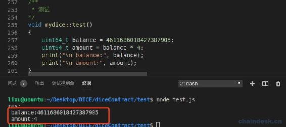
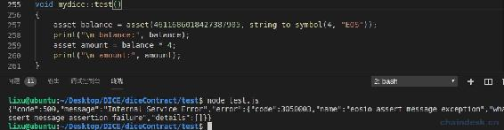
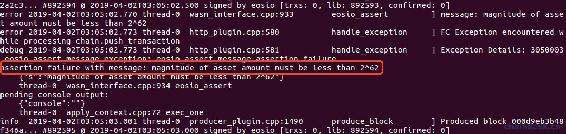

# 九、.1 合约安全——漏洞攻击与防御

> EOS 生态红红火火的建设的同时，频发的安全事件也成为不容忽视的隐患。一些常见的智能合约漏洞几乎适用于所有平台。与以太坊一样，在 EOS 上编写的智能合约需要在主网上上线之前进行审核。合约中的致命错误可以在合约没有经过足够的测试时被利用。在本章内容中快速帮助你避免在 EOS 上开发下一个漏洞百出的 DApp。
> 
> 本章内容主要包含以下攻击：
> 
> *   整数溢出攻击与防御
> *   随机数攻击与防御
> *   重放攻击与防御
> *   假 EOS 攻击与防御
> *   假转账通知攻击与防御
> *   交易回滚攻击与防御
> *   内联反射攻击与防御
> *   同名混淆交易攻击与防御
> *   敏感权限攻击与防御
> *   私钥泄漏防御
> *   拒绝服务/交易阻塞/交易延迟/交易排挤攻击与防御

## 一、整数溢出攻击与防御

### 1\. EOS 合约漏洞代码：批量转账

```js
`typedef struct acnts {
    account_name name0;
    account_name name1;
    account_name name2;
    account_name name3;
} account_names;

void batchtransfer(symbol_name symbol, account_name from, account_names to, uint64_t balance) {
    require_auth(from);
    account fromaccount;

    require_recipient(from);
    require_recipient(to.name0);
    require_recipient(to.name1);
    require_recipient(to.name2);
    require_recipient(to.name3);

    eosio_assert(is_balance_within_range(balance), "invalid balance");
    eosio_assert(balance > 0, "must transfer positive balance");

    uint64_t amount = balance * 4; //Multiplication overflow

    int itr = db_find_i64(_self, symbol, N(table), from);
    eosio_assert(itr >= 0, "Sub-- wrong name");
    db_get_i64(itr, &fromaccount, (account));
    eosio_assert(fromaccount.balance >= amount, "overdrawn balance");

    sub_balance(symbol, from, amount);

    add_balance(symbol, to.name0, balance);
    add_balance(symbol, to.name1, balance);
    add_balance(symbol, to.name2, balance);
    add_balance(symbol, to.name3, balance);
}` 
```

### 2\. 黑客攻击

在进行算术运算时，特别是"+"、"*"可能会导致值溢出，从而导致用户资产丢失。

`uint64_t amount = balance * 4;`，在这行代码中，若 balance 足够大，则会使 amount 益处后值可能很小。

下面我做了一个测试，将`balance = 4611686018427387905;`，这个数值当然是经过计算后得到的，使`* 4`后的值非常小。代码与结果如下：



发生批量转账后，这样黑客的四个收款账号将会获得 461168601842738.7905 EOS，而发起转账的账号只会扣掉 0.0004 EOS。这里用的 EOS 代币做了例子，而任何代币都会有可能发生。

### 3\. 漏洞防御

尽可能使用`asset`结构体进行操作，而不是使用 asset 的 amount 字段操作 uint64_t 类型的 balance。完善后代码如下：



可见执行时报错了，因为超出了 uint64_t 的边界，同时在查看 nodeos 日志的输出如下：



## 二、随机数攻击与防御

### 1\. EOS 合约漏洞代码：生成随机数

```js
`uint8_t random(account_name name, uint64_t game_id)
{
    auto eos_token = eosio::token(N(eosio.token));
    asset pool_eos = eos_token.get_balance(_self, symbol_type(S(4, EOS)).name());
    asset ram_eos = eos_token.get_balance(N(eosio.ram), symbol_type(S(4, EOS)).name());
    asset betdiceadmin_eos = eos_token.get_balance(N(betdiceadmin), symbol_type(S(4, EOS)).name());
    asset newdexpocket_eos = eos_token.get_balance(N(newdexpocket), symbol_type(S(4, EOS)).name());
    asset chintailease_eos = eos_token.get_balance(N(chintailease), symbol_type(S(4, EOS)).name());
    asset eosbiggame44_eos = eos_token.get_balance(N(eosbiggame44), symbol_type(S(4, EOS)).name());
    asset total_eos = asset(0, EOS_SYMBOL);
    //攻击者可通过 inline_action 改变余额 total_eos，从而控制结果
    total_eos = pool_eos + ram_eos + betdiceadmin_eos + newdexpocket_eos + chintailease_eos + eosbiggame44_eos;
    auto mixd = tapos_block_prefix() * tapos_block_num() + name + game_id - current_time() + total_eos.amount;
    const char *mixedChar = reinterpret_cast<const char *>(&mixd);

    checksum256 result;
    sha256((char *)mixedChar, sizeof(mixedChar), &result);

    uint64_t random_num = *(uint64_t *)(&result.hash[0]) + *(uint64_t *)(&result.hash[8]) + *(uint64_t *)(&result.hash[16]) + *(uint64_t *)(&result.hash[24]);
    return (uint8_t)(random_num % 100 + 1);
}` 
```

### 2\. 黑客攻击

*   攻击者可通过 inline_action 改变余额 total_eos，从而控制结果。
*   另外优化后，就算攻击者无法控制其中的 total_eos 变量，由于还有其它的可变量，特别是`current_time()`。黑客可利用交易堵塞的攻击手段将开奖交易推迟到下一个区块打包，从而使开奖结果发生了变化。这个攻击手法在下文会再介绍。

### 3\. 安全防御

请使用官方推荐的方案生成随机数，[官方文档](https://developers.eos.io/eosio-cpp/v1.2.0/docs/random-number-generation)。具体操作如下：

*   需要在外界传入种子到合约。
*   前端后端各传一个种子，使随机数不受单方控制的影响。
*   组合的种子，最终不能加入可变量，特别是"时间、余额"等。

## 三、重放攻击与防御

### 1\. EOS 合约漏洞代码：重放攻击

```js
`//新增游戏
  betings betings_table(_self, _self);
  auto new_game_itr = betings_table.emplace(_self, & {
      g.id = beting_id;
      g.user = user;
      g.value = value;
      g.num = num;
      g.seed = seed;
      g.refuser = ref;
      g.createtime = now();
  });` 
```

### 2\. 黑客攻击

由于合约并未对 seed 种子进行验证，所以黑客根据之前的开奖记录，将知道结果的种子再次传入合约进行押注，从而控制结果。

### 3\. 安全防御

对每个种子记录上链，并且拒绝存在了相同的种子进行押注。

## 四、假 EOS 攻击与防御

### 1\. EOS 合约漏洞代码：假 EOS 攻击

```js
`#define EOSIO_ABI(TYPE, MEMBERS)
extern "C"
{
    void apply(uint64_t receiver, uint64_t code, uint64_t action) {
        auto self = receiver;
        if (code == self)
        {
            TYPE thiscontract(self);
            switch (action)
            {
                EOSIO_API(TYPE, MEMBERS);
            default:
                eosio_assert(false, "err action");
                break;
            }
        }
        else
        {
            if (action == N(transfer))
            {
                betclub::mytransfer params = eosio::unpack_action_data<betclub::mytransfer>();
                if (params.to == self)
                {
                    auto sym = params.quantity.symbol;
                    if (sym == string_to_symbol(4, "EOS"))
                    {
                        TYPE thiscontract(self);
                        eosio::execute_action(&thiscontract, &mydice::transfer);
                    }
                }
            }
        }
    }
}` 
```

### 2\. 黑客攻击

由于未对转账的 EOS 的合约进行判断，黑客可以自己发行一个 EOS 代币，然后使用自己发行的假 EOS 进行押注，那么转入的是假的 EOS，赢了则是 eosio.token 的真的 EOS。

### 3\. 安全防御

对每一种代币验证其发行的合约，包含 EOS 由 eosio.token 发行，其它代币类似。防御后的代码如下：

```js
`if (code == N(eosio.token) && sym == string_to_symbol(4, "EOS"))` 
```

## 五、假转账通知攻击与防御

### 1\. EOS 合约漏洞代码：

```js
`#define EOSIO_ABI(TYPE, MEMBERS)
extern "C"
{
    void apply(uint64_t receiver, uint64_t code, uint64_t action) {
        auto self = receiver;
        if (code == self)
        {
            TYPE thiscontract(self);
            switch (action)
            {
                EOSIO_API(TYPE, MEMBERS);
            default:
                eosio_assert(false, "err action");
                break;
            }
        }
        else
        {
            if (action == N(transfer))
            {
                betclub::mytransfer params = eosio::unpack_action_data<betclub::mytransfer>();
                auto sym = params.quantity.symbol;
                if (code == N(eosio.token) && sym == string_to_symbol(4, "EOS"))
                {
                    TYPE thiscontract(self);
                    eosio::execute_action(&thiscontract, &mydice::transfer);
                }
            }
        }
    }
}` 
```

### 2\. 黑客攻击

由于未对转账的接受者进行验证，没有确保是用户向该合约账号进行的转账，把其他人之间的转账当成给转给自己，直接做了开奖处理。因此黑客自己部署一个合约，在转账时通知项目方的游戏合约账号。

在此次攻击事件中，攻击者使用账号 A 给帐号 B 转账，正常的转账应该是系统合约 eosio.token 在收到“transfer”之后，账号 A 和帐号 B 都能收到转账通知，然而攻击者账号 A 一开始便在账号 B 上部署了合约并增加对其它游戏合约账号（如 EOSBet 合约）的转账通知“require_recipient(N(eosbetdice11))”,这样 EOSBet 也会收到 A 给 B 的转账通知。

EOSBet 合约在收到转账通知后，并没有校验 transfer 中的 to 是否为 _self,就将其错误判断为一笔给自己的正常转账，然后根据平台游戏规则给了账号 A 发送相应的 EOS 奖励，实际上，账号 A 和账号 B 都是黑客自己的账号，黑客正是使用自己的两个不同账号互相转账，以“零成本”骗取了平台巨额奖励。

### 3\. 安全防御

必须对转账的接收者进行验证，即参数`to`必须是合约账号自己才进行开奖操作。防御后的代码如下：

```js
`if (action == N(transfer))
{
    betclub::mytransfer params = eosio::unpack_action_data<betclub::mytransfer>();
    if (params.to == self)
    {
        auto sym = params.quantity.symbol;
        if (code == N(eosio.token) && sym == string_to_symbol(4, "EOS"))
        {
            TYPE thiscontract(self);
            eosio::execute_action(&thiscontract, &mydice::transfer);
        }
    }
}` 
```

## 六、交易回滚攻击与防御

### 1\. 黑客攻击

*   首先：攻击者调用非黑名单合约的 transfer 函数，函数内部有一个 inline action 进行下注，from 填写的是攻击者控制的非黑名单合约帐号，to 填写的是游戏合约帐号。这时，攻击者发送交易是发向游戏合约自己的全节点服务器。使用的是黑名单帐号进行。
*   游戏节点读取到了这笔交易，立刻进行开奖，如果中奖，将对攻击者控制的非黑名单帐号发送 EOS。
*   在经历了一个 1，2 两个操作之后。理论上攻击者控制的非黑名单帐号是进行了余额扣除。然后进行正常的开奖逻辑。到这里之前，一切都是正常的。也许有读者会问，为什么配置了黑名单，交易还能正常发起？原因是这个黑名单生效范围是在 bp 内，普通的全节点的 config.ini 内是没有黑名单的配置的。所以攻击者依然可以发起交易。
*   到此为止，攻击正式开始，也到了最关键的地方，由于项目方节点在收到下注交易的时候已经立马完成了开奖逻辑，而且采用的是线下开奖的模式，即下注交易和开奖交易是两笔不同的交易。但是，这两笔交易仅仅是在项目方的节点内完成，仍然是可逆的。当项目方节点向 bp 广播这两笔交易的时候，由于第一笔下注交易的发起者在 bp 节点的黑名单内，这一笔交易将被回滚，也就是打包失败，而开奖交易的发起者是项目方，不在黑名单之内，会被正常打包。因此两笔交易中的第一笔下注交易一定会被回滚，而开奖交易依旧会被打包，这也就解释了为什么只有开奖记录，而没有下注记录。因为下注记录都被回滚了。

### 2\. 安全防御

*   节点开启 read only 模式，防止节点服务器上出现未确认的块 。
*   建立开奖依赖，如订单依赖，开奖的时候判断订单是否存在，就算在节点服务器上开奖成功，由于在 bp 上下注订单被回滚，所以相应的开奖记录也会被回滚。

## 七、内联反射攻击与防御

### 1\. EOS 合约漏洞代码：

```js
`void apply(uint64_t receiver, uint64_t code, uint64_t action) {
    auto self = receiver;
    if (code == eosio.token)
    {
        .....
    }
    TYPE thiscontract(self);
    switch (action)
    {
        EOSIO_API(TYPE, MEMBERS);
    default:
        eosio_assert(false, "err action");
        break;
    }
}` 
```

### 2\. 黑客攻击

正常的转账流程是：玩家通过调用系统合约(eosio.token)，将 EOS 转账给游戏合约，触发游戏合约的分发逻辑(apply)，进而调用相关函数实现开奖。

而攻击者在自己帐号部署的合约中包含了与游戏合约相同的操作函数，在转账完成后，自行开奖获得奖金。

攻击者在自身合约的函数(pushck)中，内联调用了与游戏合约开奖同名的函数(check)，再通过通知(require_recipient)的方式将信息发送到了游戏合约。此时游戏合约的分发逻辑(apply)没有过滤掉此信息，并调用了开奖函数(check)。

攻击者利用了 EOSIO 系统中对调用合约自身函数不校验权限的漏洞，进而使用游戏合约的帐号权限发起内联调用，致使绕过游戏合约在敏感函数中校验调用者权限的方法(require_auth)，从而获取了游戏合约发放的奖励。

### 3\. 安全防御

必须验证"code == self"。

```js
`void apply(uint64_t receiver, uint64_t code, uint64_t action) {
    auto self = receiver;
    if (code == self)
    {
        TYPE thiscontract(self);
        switch (action)
        {
            EOSIO_API(TYPE, MEMBERS);
        default:
            eosio_assert(false, "err action");
            break;
        }
    }
    else {

    }
}` 
```

## 八、同名混淆交易攻击与防御

包含 aciton 同名攻击和代币同名攻击，分别在上面的"内联反射攻击与防御"、"假 EOS 攻击与防御"部分做出了分析。

## 九、敏感权限攻击与防御

合约中对需要权限操作的 action 未进行权限验证。如：转账时需要对 from 进行验证、开奖时需要对合约账号 _self 进行权限验证。因此我们在公开的 action 中，必须分析确定需要谁的权限才能进行操作。

## 十、私钥泄漏防御

在很多 action 中需要对合约账号自己进行权限验证，如开奖，所以需要将合约账号的私钥放到后端，如 NodeJS，通过 eosjs 与 EOS 区块链交互。那么私钥将会暴露在后端服务器，黑客将会根据服务器 IP 侵入服务器盗取私钥，从而获利。

解决方案：将私钥加密储存在后端服务器，并且禁止公开服务器 IP 地址。然后另外使用一台服务器查询链上数据进行数据处理，提供前端的 API。这样即使黑客侵入了提供 API 的服务器也并不能获得私钥，另外存放私钥的服务器在哪，黑客也无法得知。

## 十一、拒绝服务/交易阻塞/交易延迟/交易排挤攻击与防御

黑客利用伪造的签名发起拒绝服务攻击，与交易阻塞/交易延迟/交易排挤都是类似的攻击，属于公链底层的漏洞，EOS 竞猜类游戏随机数算法中只要包含账号余额或时间因素就存在被攻击可能。

黑客根据查询开奖结果，只要黑客中奖了他就让结果生效，不中奖就一直不生效，直至他中奖。

解决方案：去除可控变量如账号余额或时间因素等参与随机数生成，尽可能避免因阻塞攻击造成资产损失。

下面列出了最近 EOS DApp 被攻击的列表，图片来源于网络


## 总结

EOS DApp 开发中给我出的安全建议：

*   增对以上各种攻击方法，我们在开发合约时应充分考虑到，并做好防御措施。

*   另外需要给合约加一个锁，在突发情况时能冻结合约运行，以使损失降低。

*   增加一个监控系统，监控游戏合约账号、玩家账号，在一个时间段内的资金流转不正常时应及时的停止服务并找出问题解决。

*   实时关注 DApp 最新攻击方法，并及时测试自己开发的合约的安全性并作出修复。

**版权声明：博客中的文章版权归博主所有，转载请联系作者（微信：lixu1770105）。**