# 10.1 部署合约到主网，部署后端与前端到云服务器

> 这将是本教程的最后一个章节，学习如何将项目部署到外网，提供给其它用户使用。
> 
> 本章内容主要包含：
> 
> *   部署合约到主网、Jungle 测试网
> *   部署后端到云服务器
> *   熟悉 pm2、nginx 工具
> *   部署前端到云服务器

## 一、部署合约到主网

到此时，我们在 EOS 本地环境中已经完成了 Dice 合约开发，是时候运行到公网中进行测试了。在部署到主网之前，我们有必要部署到公开的 Jungle 测试网，与 EOS 主网的运行环境类似，部署合约需要消耗 RAM、交易需要消耗 CPU 与 NET。而在本地网络中是不会消耗的，对网络资源也没有任何限制。所以，到目前为止，我们还未涉及到网络资源的买卖抵押相关技术，若对此有不了解的同学可移步到[EOS 钱包实战开发](https://www.chaindesk.cn/witbook/2)，查看"第 9～12"章节，另外在 6 章介绍了如何获取超级节点的 IP 用于 eosjs 的连接。

### 1\. 部署合约在 Jungle 测试网

部署合约在 Jungle 测试网的步骤如下：

*   大家先创建好与本地环境一样的账号，可使用 cleos 的-url 参数指定测试网地址进行创建账号，或者进入[Jungle 测试网](https://monitor.jungletestnet.io/#home)创建账号。

*   通过[Jungle 测试网 Faucet](https://monitor.jungletestnet.io/#home)获取 EOS 测试币。

*   在[Jungle 测试网](https://monitor.jungletestnet.io/#apiendpoints) 的"API"入口获取测试节点地址。

*   为三个合约账号购买足够的网络资源，包括：

    *   购买 RAM
    *   抵押 CPU
    *   抵押 NET

    可通过 cleos 的-url 参数指定测试网地址进行购买，或者使用 eosjs 连接上测试网地址进行购买，调用的 API 参考[EOS 钱包实战开发](https://www.chaindesk.cn/witbook/2)，查看"第 9～12"章节。

*   将 NodeJS 后端的三个项目的 config 中的 eosjs 的配置更改为 Jungle 测试网，包含两个字段：`httpEndpoint`、`chainId`。

*   部署开发的三个合约，然后发行 JXB 代币，并让测试账号和合约账号拥有一定数量的 JXB。

*   到此，合约部署到 Jungle 测试网的过程就完成了。

打开[Jungle 测试网](https://monitor.jungletestnet.io/#home)后是如下界面：

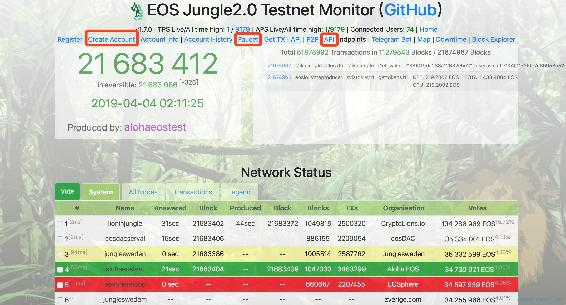

接下来就可以使用 react 前端项目进行测试了，后端项目仍然是本地的，但是 EOS 环境确连接到了公共的测试网络，发生交易后可以在[Jungle 测试网](https://monitor.jungletestnet.io/#home)、[EOSPark 测试网](https://jungle.eospark.com)查询到相应数据。

### 2\. 部署合约到 EOS 主网

合约在 Jungle 测试网中运行稳定之后再来部署到主网（在这之前还有必要进行安全审计）。

部署合约到 EOS 主网与 Jungle 测试网类似，部署合约需要消耗大量 RAM，大家谨慎操作。创建了账号后可以在[EOSPark](https://eospark.com)中进行查看，数据包括：所有代币余额、网络资源、权限配置、actions 交易等。

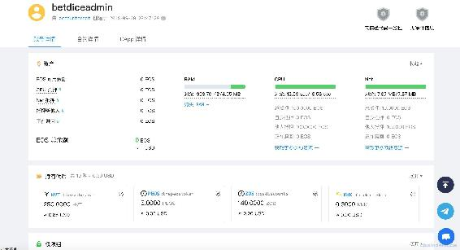

部署合约后可以在合约账号中查看到与合约相关的数据，包括：合约 action 调用记录、调用 action、ABI、历史升级数据等。

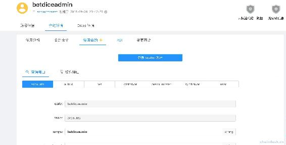

EOS 主网、Jungle 测试网络、服务器搭建的本地网络，下面列出了他们的 chainID 与节点地址。

| 网络类型 | chainID | 节点地址 |
| --- | --- | --- |
| EOS 主网 | aca376f206b8fc25a6ed44dbdc66547 c36c6c33e3a119ffbeaef943642f0e906 | `http://api-mainnet.starteos.io` |
| Jungle 测试网络 | e70aaab8997e1dfce58fbfac80cbbb8f ecec7b99cf982a9444273cbc64c41473 | `http://jungle2.cryptolions.io:80` |
| 服务器搭建的本地网络 | cf057bbfb72640471fd910bcb67639c2 2df9f92470936cddc1ade0e2f2e7dc4f | `http://118.190.112.181:7777` |

## 二、部署后端到云服务器

这个过程可以理解成在外网的一台电脑上运行我们的 NodeJS 后端服务，大家可以到腾讯云、阿里云等供应商购买云服务器，该步骤不做详细说明。然后我们登陆服务器，下载或者更新项目代码。

### 1\. 登陆服务器

可以通过 ssh 远程连接服务器，如下：

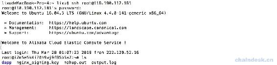

然后使用 git 下载或者更新项目代码。

另外可以使用可视化工具远程登陆服务器，下面是我使用 transmit 工具进行操作的截图，左侧是本地的文件结构，右侧则是远程登陆的用户交互界面。

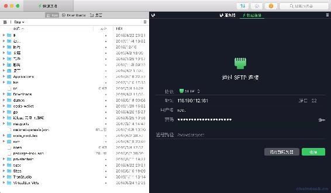

登陆后，界面如下，右侧就是服务器的文件结构。

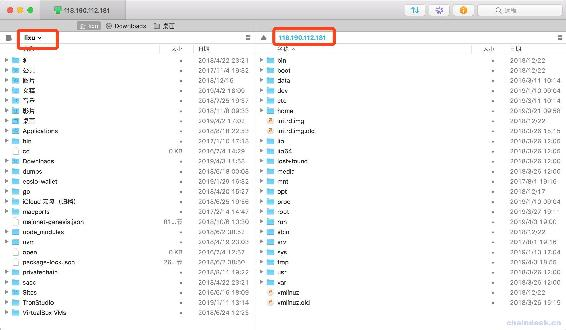

可以直接将本地文件拖到服务器文件中。

通过以上两种方式都可以使服务器有最新的项目源码。

### 2\. 服务器的项目

更新完代码后，服务器上的项目包含：

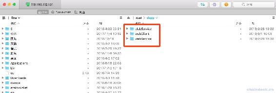

可见有三个项目：

*   webServer：专门与前端交互，支持 RESTful API、socket.io，用于前端查询数据、后端主动推送合约新数据。
*   diceServer：专门与合约交互，主要是调用合约开奖方法。
*   webClient：前端的 React 项目，提供给用户的交互页面。

为了演示，目前我讲 webServer 与 diceServer 都部署到了同一台服务器中。

**切记：**

*   webServer 与 diceServer 正式运营前需分开部署到不同服务器。
*   diceContract 项目一定不能放在任何一台服务器中。

### 3\. 搭建 EOS 环境

在启动服务器服务之前，若需要提供 EOS 本地网络测试环境的话，则要在服务器上搭建 EOS 本地网络，因为本机搭建的 EOS 节点服务，服务器无法访问。但是在服务器中我们无需安装 EOS 合约的编译工具 eosiocpp，因为合约可以在本地编译，然后在本地直接部署到服务器的 EOS 本地网络中。那么部署 EOS 环境咱们前面已经介绍过，建议你使用 docker 快速部署。

### 4\. 启动服务器服务

之前我们的服务是在本地运行的，当我们电脑休眠或者关机后，就无法访问服务了，那么为了服务器能够持久的运行以提供接口服务，该如何处理呢？

需要使用守护进程工具，nodejs 服务常用的是 pm2 工具。安装方法很简单`npm install pm2 -g`。

cd 到 clubServer 项目中，然后使用如下命令启动服务，`diceserver`是这个后端服务的名字，可以自定义。

```js
pm2 start indexdice.js -n diceserver 
```

详情如下：

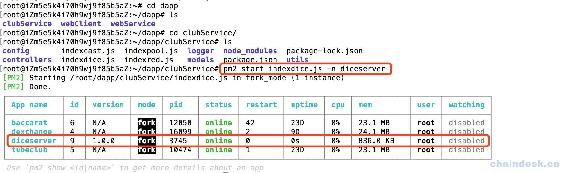

再启动另外一个服务，命名为 poolserver

```js
pm2 start indexpool.js -n poolserver 
```

然后再进入 webServer 中，类似的启动服务：

```js
pm2 start indexdice.js -n diceweb
pm2 start indexpool.js -n poolweb 
```

现在我们启动了四个后端服务，使用`pm2 list`查看，如下：

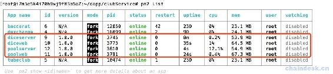

pm2 还有更多的功能用法，如重启`pm2 restart *`、停止`pm2 stop *`、查看日志`pm2 log *`等，详情使用`pm2 -h`查看。

### 5\. 更改前端配置

在部署合约到测试网络中我们是修改后端 eosjs 的配置，现在部署后端到了主网，该修改前端 HTTP 与 webSocket 的服务器地址了，找到`clientDice/src/utils/commUtils.js`文件的位置，修改如下的配置，将`127.0.0.1`改为服务器地址，如我的是`118.190.112.181`。

```js
export const diceUrl = 'http://127.0.0.1:3002';
export const tokenUrl = 'http://127.0.0.1:3003';
export const poolUrl = 'http://127.0.0.1:3004'; 
```

现在，我们还是只能使用局域网打开本地的 React 前端，但是它访问是服务器后端，EOS 的链上数据也是访问的服务器上的 EOS 本地数据。

## 三、部署前端到云服务器

现在该来部署前端到云服务器了，用户就可以在外网访问 DICE 游戏。

打开 clientDice 完整的前端项目，cd 进入后，使用如下命令打包项目

```js
yarn build 
```

效果如下：

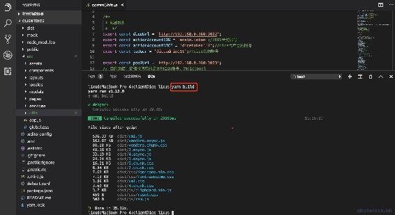

打包成功后，会在项目根目录新生成一个文件夹 dist，里面是项目打包后的所有代码，我们只需要上传 dist 文件夹到服务器即可。如下：

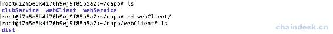

不需要我们再做任何操作，直接使用服务器地址访问 DICE 游戏吧，如我的是`http://118.190.112.181/`。但是前提是服务器上已配置好了 nginx，且已启动`sudo /etc/init.d/nginx start`。

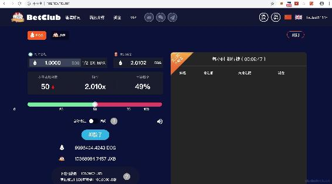

最后合约部署上了主网，则只需要修改 webSever 与 clubServer 的 eosjs 的配置即可。

到此，我们已开发完成了 DICE 游戏的所有技术，包含三个合约、三个 NodeJS 后端、一个 React 前端。熟悉了 EOS DApp 的整套开发流程，且掌握了其中的技术要领，后续就该大家大展身手开发属于自己的 EOS DApp 了。如有疑问或需帮助可联系博主微信：lixu1770105。

最后感谢大家的关注，课程中如有错误希望联系指正。

**版权声明：博客中的文章版权归博主所有，转载请联系作者（微信：lixu1770105）。**