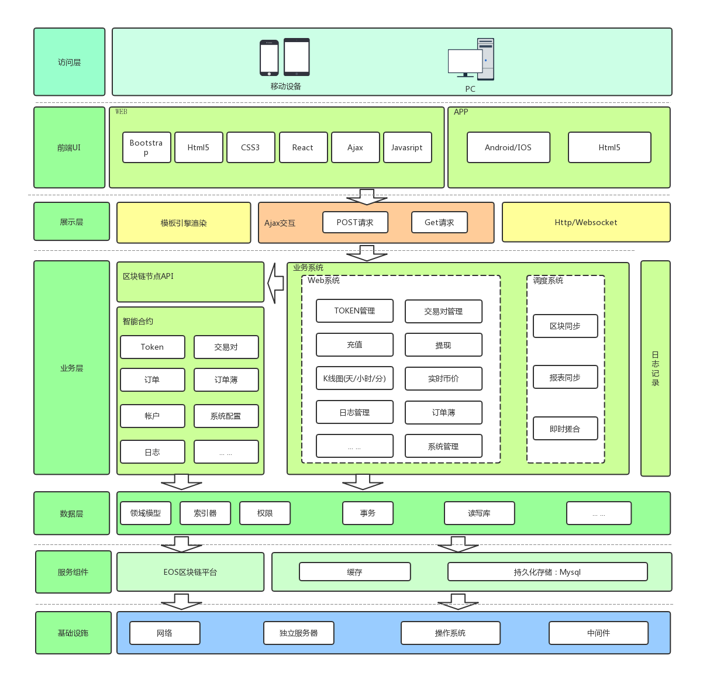

# 第三章 系统架构及功能设计

从技术角度讲， 整个项目的技术架构图如下

从功能结构上，主要划分为六大模块：

*   基础数据管理；
*   订单管理
*   搓合管理
*   系统管理
*   报表管理
*   调度管理

基础数据管理，主要用于维护币种及交易对数据。 币种管理主要用于定义当前交易所所支持的币种， 比如币种名称， 合约名称及资金精度等；交易对管理主要用于定义基准代币可兑换的币种、交易对最小订单量以及手续费等信息；

订单管理， 主要用于维护用户订单数据以及交易所订单薄数据。用户订单功能主要用于记录用户实时创建的买/卖单交易数据， 其中包括交易对、购买价格、订单量、订单状态等数据信息；而订单薄功能主要用于对交易所所有的订单按卖买类型进行分队列排序，从而方便展示当前交易对的交易深度以及供搓合功能处理；

搓合管理， 主要用于实时将订单薄中符中搓合条件的订单进行数据处理，并同时更新用户订单数据以及资金清算等业务；

系统管理， 主要用于维护交易所配置数据以及运营状态。比如，是否锁定或开启交易所；

调度管理， 主要用于实时监控链上搓合成交记录，并实时同步订单数据至数据库，供前端 K 线图的数据展示；

报表管理， 主要用于通过交易市场的交易情况实时展示 K 线图报表数据以及实时更新所有交易对币价信息， 比如：24 小时成交量， 当前币种价格、涨跌幅等信息。

* * *

**小结**

通过本章节的学习，我们了解了整个交易所项目的整体技术架构，包括底层基础设施、服务组件、业务模块、系统划分以及与前端交互展示等，并详细介绍了整个项目的业务模块功能。

* * *

> 在教程中如出现不易理解或存在错误的问题🐛，欢迎加我微信指正! Name: zhangliang | WeChat: rushking2009 | Mail: zhangliang@cldy.org