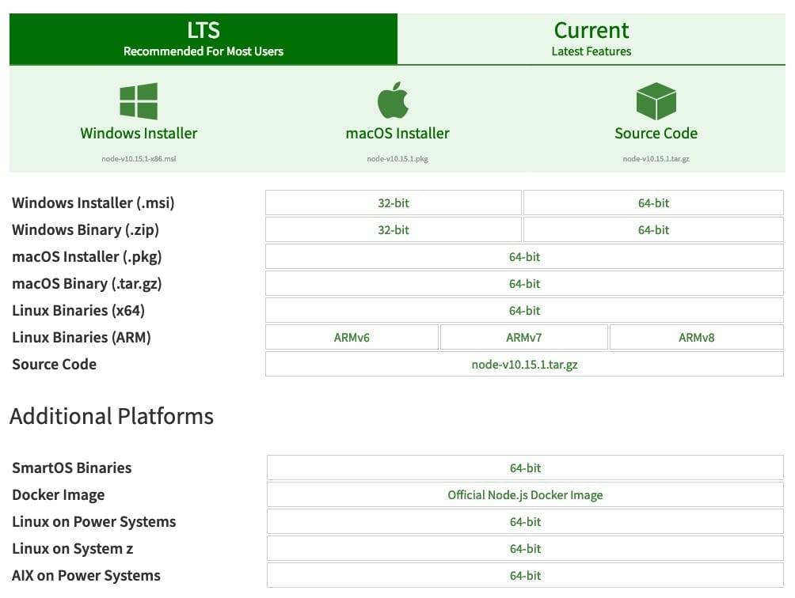

# 5.2 前期环境配置

本章节主要介绍在项目开发之前需要进行配置的开发环境，其中涉及 EOS 私链搭建所需要用到的 Docker、对项目代码进行管理的版本管理工具 Git 等。

* * *

## 1\. Docker 容器

考虑到在实际的项目开发环节中，为了便于调试代码，所以需要在本地进行 EOS 私链环境搭建，而本身如果通过编译安装的方式，那么会花费可能一天的时间用来单单安装环境；为了解决这个问题，我们采用 Docker 容器技术可以快速方便启动的一个干净的私链环境，可以供我们随时删除重建一个开发环境。

*   Mac
    [`docs.docker.com/docker-for-mac/install/`](https://docs.docker.com/docker-for-mac/install/)
*   Linux
    [How To Install and Use Docker on Ubuntu 18.04](https://www.digitalocean.com/community/tutorials/how-to-install-and-use-docker-on-ubuntu-18-04)
*   CentOS
    [`docs.docker.com/install/linux/docker-ce/centos/`](https://docs.docker.com/install/linux/docker-ce/centos/)
*   Window
    [Install Docker Desktop for Windows](https://docs.docker.com/docker-for-windows/)

注： 具体的 EOS 私链如何进行部署，我们将在后续章节进行详细说明。

## 2\. Node.js

因为在 EOS 公链开发生态中，提供了由 js 实现的 eosjs sdk，考虑到方便性，所以我们将采用 Node 技术来进行与公链的交互，以及对外发布数据接口，供前端页面进行数据展示。

下图展示了操作系统用到的 Node 安装包，可通过下面提供的链接访问下载。  [`nodejs.org/en/download/`](https://nodejs.org/en/download/)

除上述安装方式外，也可使用第三方包管理工具进行下载： NVM（Node Version Manager ），是 Node 版本的包管理工具。可以使用此工具方便的进行 Node 版本安装与切换。另外，NVM 工具的安装极其方便，仅需两步。

**1\. 安装软件**

使用 curl

```js
curl -o- https://raw.githubusercontent.com/creationix/nvm/v0.34.0/install.sh | bash 
```

使用 wget

```js
wget -qO- https://raw.githubusercontent.com/creationix/nvm/v0.34.0/install.sh | bash
```

注：以上命令安装成功后，即可以~/.nvm 目录下找到其执行脚本。

**2\. 修改环境变量** 为了使 nvm 命令全局环境下生效，需要进行环境变量设置。

```js
export NVM_DIR="${XDG_CONFIG_HOME/:-$HOME/.}nvm"
[ -s "$NVM_DIR/nvm.sh" ] && \. "$NVM_DIR/nvm.sh" # This loads nvm
```

将以上代码复制到环境变量配置文件 ( `~/.bash_profile`, `~/.zshrc`, `~/.profile`, or `~/.bashrc`， 可根据自己的实现效果选择任一即可)。 最后，通过执行`source ~/<配置文件>`使配置文件生效即可。

## 3\. IDE

关于 IDE 的选择，推荐使用 VSCode。通过一段时间自己的使用，发现经体量小、拥有丰富的组件库，在一个项目里就可以覆盖多模块项目的开发。比如我们即将要开发的交易所项目，就牵扯到 C++、Node.js、react 等多种代码实现，而 vscode 完全可以胜任这种复合工程。

以上纯属个人见议。当然， 大家也可以使用自己顺手的 IDE 进行开发。

官网链接：[`code.visualstudio.com/`](https://code.visualstudio.com/)

## 4\. Git

在项目开发环境，往往都是需要多人共同协作来完成一个项目。那么我们就需要统一的信息版本管理工具，来帮助我们达到高效率工作。尤其是对于程序员来，可能会重复的修改需求，就可能需要我们随时从过去的版本找到一段代码，或者是在多人共同编辑而导致的冲突问题，都可以通过 git 得以解决。

[`git-scm.com/downloads`](https://git-scm.com/downloads)

* * *

通过本小节，我们基本就完成了整个开发环境日常所用到的开发工具。

* * *

> 在教程中如出现错误🐛或不易理解的知识点，欢迎加我微信指正! Name: zhangliang | WeChat: rushking2009 | Mail: zhangliang@cldy.org