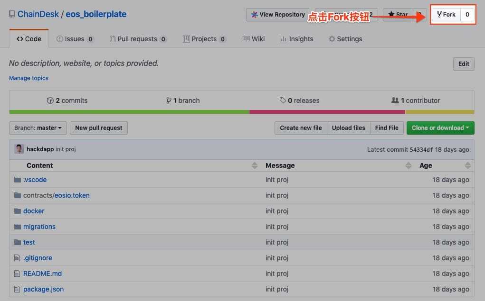
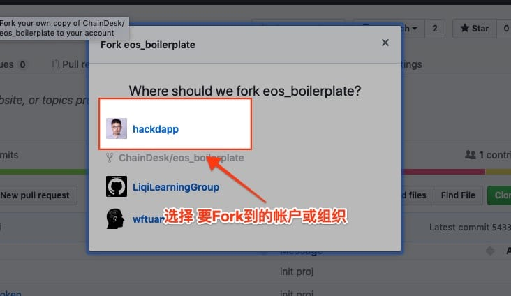
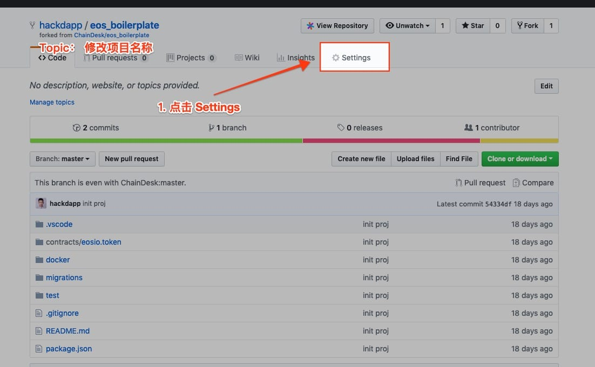
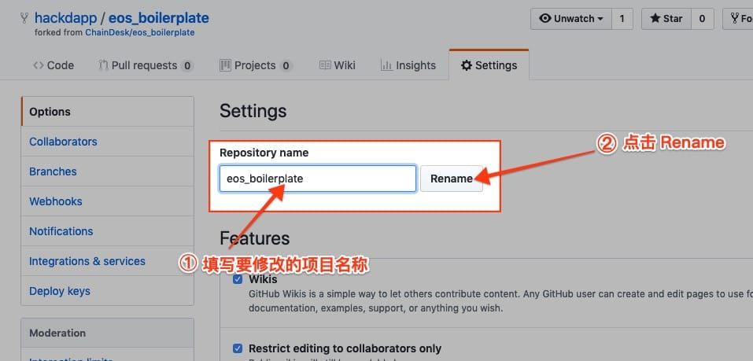
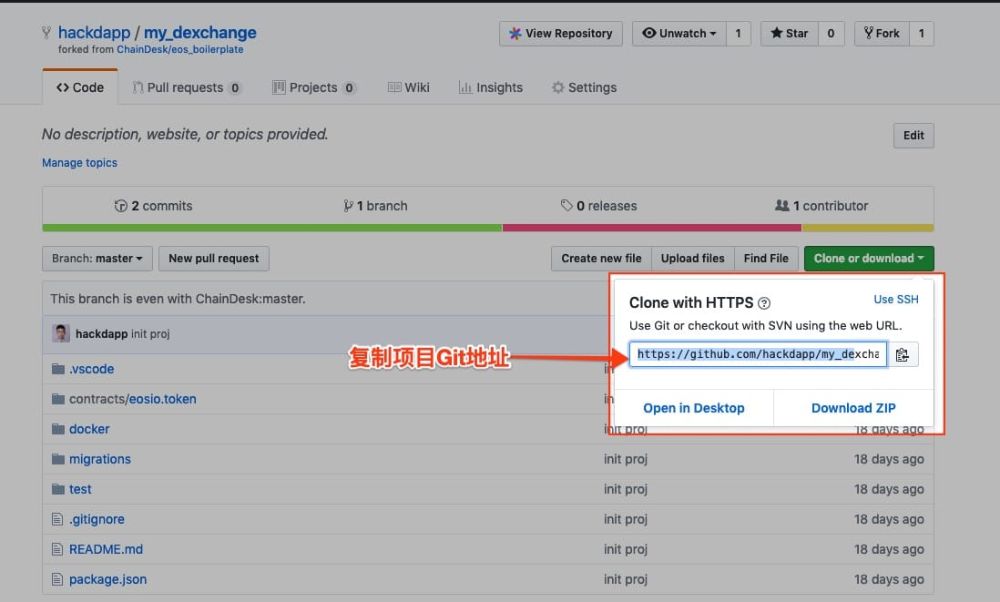
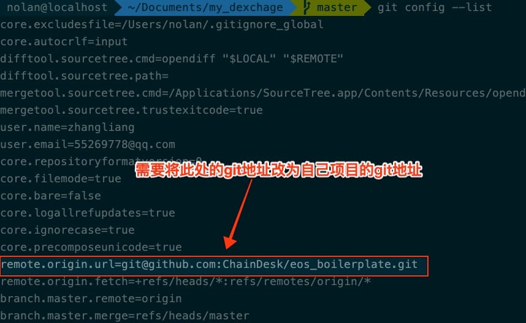
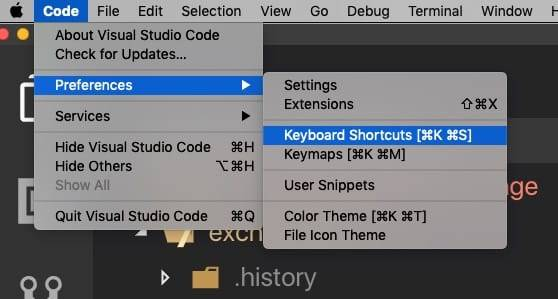
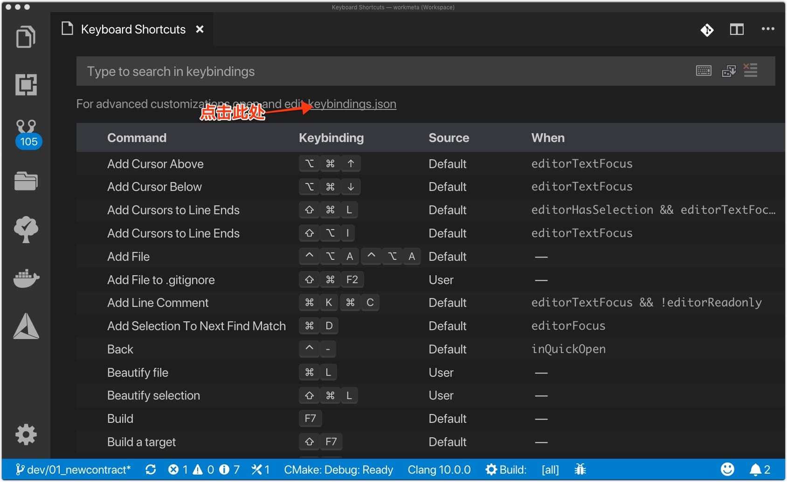
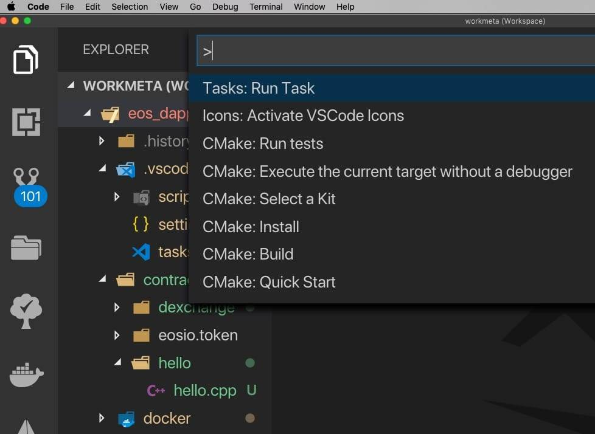
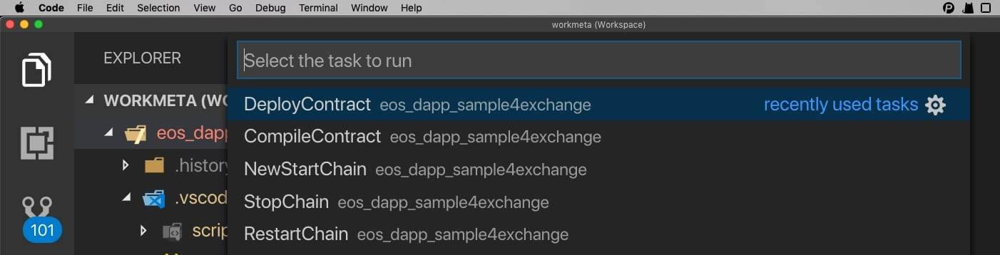

# 5.3 快速搭建基于 Github 的 EOS 模板工程

本章节主要介绍如何快速构建一个基于 EOS 的项目工程结构，以及如何通过本工程快速启动一个 EOS 私链环境、如何编译及发布一个智能合约。 我将会通过演示一个简单示例的开发，来带领大家快速了解此工程结构及工程命令的使用。

* * *

对于熟悉区块链 DApp 开发的朋友可能都比较清楚，所有链 DApp 的开发流程基本就是：链环境搭建、合约编码、合约编译、合约发布四个步骤。

比如在以太坊公链生态体系中，提供了 truffle + Ganache 的组合开发模式，通过这套框架模式可以快速的启动链环境、对合约编译与升级；相反，在 EOS 生态体系中，开发基础设施并不算健全， 只能是程序员在项目开发过程不断总结与优化自己的开发流程，将一些重复性且较为耗时的操作进行脚本化从而达到一些效率上的提升。

毫无例外，我也是在经历几个 EOS DApp 项目的开发过程，不断改进一些中间开发环节的流节，比如：链环境由最初的本地编译改为 docker 部署，从而整合出的一套项目工程模板[eos_boilerplate ](https://github.com/ChainDesk/eos_boilerplate)。

* * *

[eos_boilerplate ](https://github.com/ChainDesk/eos_boilerplate)是基于 EOS 公链设计的一套可快速启动私链环境、快速对智能合约进行编译、调试、发布的标准化工程模板。

该工程模板主要用于：帮助大家快速搭建项目工程，减少在环境搭建、集成前端组件环节的大量时间浪费，让大家集中更多的精力放在具体业务逻辑实现上。

该套模板主要使用`Node.js`、`Docker`、`eosjs`、`Shell`、`jest`四种技术进行项目开发流程简化。该工程支持：

*   一键式启动、停止、重启、重置私链环境
*   一键式编译智能合约
*   一键式发布智能合约
*   多合约文件时，可指定合约进行编译与发布
*   一键式单元测试

* * *

## 第一步、从 GitHub 克隆或 Fork 模板工程

在工程构建这块，提供了两种方式进行项目初始化，任选其一即可。

### 方式一、直接 Fork 模板工程

1.  打开浏览器，访问工程模板项目[ChainDesk/eos_boilerplate](https://github.com/ChainDesk/eos_boilerplate) 
2.  点击页面中的 Fork 按钮。如果你帐户里存在多个组织，需要选择要 fork 到组织帐户或个人帐户  以下界面表示正在 Fork 中，稍等几秒钟即可结束。 
3.  点击页面中的 setting 按钮，修改自己定义的项目名称  
4.  克隆项目到本地环境  打开本地命令窗口, 执行以下克隆命令：

    > git clone git@github.com:ChainDesk/eos_boilerplate.git \<项目名称> 注意： 此处 git 地址需改为自己工程的地址

### 方式二、克隆

1.  在 Github 官网，先注册好自己的 github 帐户
2.  创建自己的项目仓库
3.  打开提供的工程模板项目链接[eos_boilerplate ](https://github.com/ChainDesk/eos_boilerplate)
4.  复制项目 git 地址，打开本地命令窗口，执行克隆操作

    ```js
    > git clone git@github.com:ChainDesk/eos_boilerplate.git my_dexchage
    ```

5.  将克隆项目的远程地址修改为自己的项目仓库  执行以下命令，进行 git 仓库地址修改

    ```js
    > git config remote.origin.url <自己项目仓库地址>

    # 查看是否修改成功
    > git config --list 
    ```

当克隆成功完成后，目录结构如下:

```js
.
├── README.md   //项目文档介绍
├── .vscode     //vscode ide 配置
│   ├── scripts
│   │   ├── compile.sh      //1\. 编译合约
│   │   ├── deploy.sh       //2\. 发布合约
│   │   ├── dockerservice.sh//3\. 容器管理
│   │   └── test.sh         //4\. 测试单个 js 文件
│   └── tasks.json  //启动、暂停私链、编译合约、发布合约任务定义
├── contracts   //智能合约目录列表
│   ├── hello   //示例合约；用户可自定义合约目录
│   │   ├── hello.cpp
│   └── eosio.token
│       ├── eosio.token.cpp
│       ├── eosio.token.hpp
├── docker      //Docker 配置目录
│   ├── scripts 
│   │   ├── continue_blockchain.sh //非首次启动链环境
│   │   ├── create_accounts.sh      //创建 EOS 测试帐户
│   │   ├── data                
│   │   ├── deploy_contract.sh      //发布合约脚本
│   │   ├── eosio.cdt-1.3.2.x86_64.deb
│   │   └── init_blockchain.sh      //首次初始化区块链环境，比如发布缺省合约、创建 EOS 帐户及钱包
│   └── start_eosio_docker.sh       //启动私链脚本
├── migrations
│   └── 5_deploy_contracts.js       //通过脚本发布合约或初始化帐户数据等。
├── package.json
└── test                            //测试用例目录，主要使用 node 编写测试用例
    ├── constants.js
    ├── todolist.spec.js
    └── utils.js

8 directories, 20 files
```

上述目录结构及注释，便是对整个工程的详细描述。

## 第二步、配置 vscode 快捷键

**首先**，通过菜单（code->Preferences->Keyboard Shortcuts）或快捷键（⌘K ⌘S）进入快捷链配置界面 

**然后**，点击界面中的`keybindings.json`进入快捷键自定义文件 

在`keybindings.json`中，添加快捷键与执行脚本间的映射关系

```js
{   //重启原有私链环境
    "key": "ctrl+e",
    "command": "workbench.action.tasks.runTask",
    "args": "RestartChain"
}, {
    //删除原有私链环境数据，重新启动新私链
    "key": "ctrl+shift+e",
    "command": "workbench.action.tasks.runTask",
    "args": "NewStartChain"
}, {
    //停止私链环境
    "key": "ctrl+shift+d",
    "command": "workbench.action.tasks.runTask",
    "args": "StopChain"
}, {
    //编译+发布合约
    "key": "ctrl+r",
    "command": "workbench.action.tasks.runTask",
    "args": "DeployContract"
}, {
    //编译合约
    "key": "ctrl+shift+c",
    "command": "workbench.action.tasks.runTask",
    "args": "CompileContract"
},
```

你可以根据自己的实际情况自由设定不同任务对应的快捷键。

补充一点，即使你不配置快捷键也是可以执行对应脚本的。那就是通过菜单`View->Command Palette`执行`>Tasks:Run Task`, 然后选择要执行的脚本任务名称即可。**脚本任务的名称可从项目工程中.vscode/task.json 中找到**。  

## 第三步、启动私链环境

通过快捷键`ctrl+shift+e`或运行`>Tasks:Run Task`方式直接运行`NewStartChain`任务。 控制台会打印如下信息：

```js
 ____             _             ____                  _
|  _ \  ___   ___| | _____ _ __/ ___|  ___ _ ____   _(_) ___ ___
| | | |/ _ \ / __| |/ / _ \ '__\___ \ / _ \ '__\ \ / / |/ __/ _ \
| |_| | (_) | (__|   <  __/ |   ___) |  __/ |   \ V /| | (_|  __/
|____/ \___/ \___|_|\_\___|_|  |____/ \___|_|    \_/ |_|\___\___|

docker's name:   eos_dapp_sample4exchange
docker's status:         restart
== stop docker container and rm the data dir.
Error response from daemon: No such container: eos_dapp_sample4exchange
Error: No such container: eos_dapp_sample4exchange
=== run docker container from the eosio/eos-dev image ===
b121d77dd864d34ab8dea381fa267fb97c5b423abb953f1675a6ca72aa9ccad0
=== follow eos_dapp_sample4exchange logs ===
=== setup blockchain accounts and smart contract ===
=== install EOSIO.CDT (Contract Development Toolkit) ===
... ...
info  2019-02-28T06:04:07.006 thread-0  producer_plugin.cpp:1490      produce_block        ] Produced block 0000003244f4ed89... #50 @ 2019-02-28T06:04:07.000 signed by eosio [trxs: 0, lib: 49, confirmed: 0]
```

如果能够正常打印`Produced block`信息表明私链正常启动。

## 第四步、编写简单示例合约

为了方便进行工程的演示，在项目根目录 contracts 文件夹里我们事先准备了一个简单的示例合约：

```js
/* filename: hello.cpp */
#include <eosiolib/eosio.hpp>
#include <eosiolib/print.hpp>

using namespace eosio;

class hello : public contract {
  public:
      using contract::contract;

      [[eosio::action]]
      void hi( name user ) {
         print( "Hello, ", user);
      }
};

EOSIO_DISPATCH( hello, (hi))
```

## 第五步、编译合约

**选中要编译的合约文件**，使用快捷键`ctrl+shift+c`，会发现控制台打印:

情况一： 如果显示以下信息，则代表**合约编译正常**

```js
 ____                      _ _       ____            _ _
 / ___|___  _ __ ___  _ __ (_) | ___ / ___|___  _ __ | |_ _ __ __ _  ___| |_
| |   / _ \| '_ ` _ \| '_ \| | |/ _ \ |   / _ \| '_ \| __| '__/ _` |/ __| __|
| |__| (_) | | | | | | |_) | | |  __/ |__| (_) | | | | |_| | | (_| | (__| |_
 \____\___/|_| |_| |_| .__/|_|_|\___|\____\___/|_| |_|\__|_|  \__,_|\___|\__|
                     |_|
contract's name:         hello

Terminal will be reused by tasks, press any key to close it.
```

情况二： 如果显示以下信息，则代表**合约编译失败**

```js
 _
 / ___|___  _ __ ___  _ __ (_) | ___ / ___|___  _ __ | |_ _ __ __ _  ___| |_
| |   / _ \| '_ ` _ \| '_ \| | |/ _ \ |   / _ \| '_ \| __| '__/ _` |/ __| __|
| |__| (_) | | | | | | |_) | | |  __/ |__| (_) | | | | |_| | | (_| | (__| |_
 \____\___/|_| |_| |_| .__/|_|_|\___|\____\___/|_| |_|\__|_|  \__,_|\___|\__|
                     |_|
contract's name:         hello
/opt/eosio/bin/contracts/hello/hello.cpp:12:33: error: expected ';' after expression
         print( "Hello, ", user)
                                ^
                                ;
1 error generated.
The terminal process terminated with exit code: 255
```

## 第六步、发布合约

在保证合约编译正常之后，我们可以直接发布合约至本地私链上。选中要发布的智能合约，执行`ctrl+r`快捷键执行`DeployContract `任务， 如下显示如下信息则表明发布合约成功。

```js
 ____             _              ____            _                  _
|  _ \  ___ _ __ | | ___  _   _ / ___|___  _ __ | |_ _ __ __ _  ___| |_
| | | |/ _ \ '_ \| |/ _ \| | | | |   / _ \| '_ \| __| '__/ _` |/ __| __|
| |_| |  __/ |_) | | (_) | |_| | |__| (_) | | | | |_| | | (_| | (__| |_
|____/ \___| .__/|_|\___/ \__, |\____\___/|_| |_|\__|_|  \__,_|\___|\__|
           |_|            |___/
contract's name:         hello
Unlocked: hackdappexch
Reading WASM from /opt/eosio/bin/compiled_contracts/hello/hello.wasm...
Publishing contract...
executed transaction: 2014ecf0b3d26eb76d7dafaf41d6b6fe140c8583a552db1d85be7ad46eef633e  1440 bytes  1401 us
warn  2019-02-28T06:31:48.857 thread-0  main.cpp:482                  prwarning: transaction executed locally, but may not be confirmed by the network yet
#         eosio <= eosio::setcode               {"account":"hackdappexch","vmtype":0,"vmversion":0,"code":"0061736d0100000001390b60027f7e006000017f6...
#         eosio <= eosio::setabi                {"account":"hackdappexch","abi":"0e656f73696f3a3a6162692f312e30000102686900010475736572046e616d65010...
```

可能有朋友会问，我发布的是 hello 合约，怎么日志中却显示的其它用户呢？ 其实，合约文件的定义与具体的合约名是没有任何关系的，而是你在发布合约时根据自己的需求进行定义的。

正常情况下, 使用 eos 命令发布全约的完整命令是：

```js
> cleos set contract <合约名> <合约文件目录> -p 合约名@active

e.g. 

> cleos set contract hackdappexch compiled_contracts/hello -p hackdappexch@active
```

## 第七步、合约调用

在合约发布成功后，我们尝试调用合约方法

```js
# 1\. 解锁钱包(hackdappexch 帐户已经在初始化链环境时生成)
> cleos wallet unlock -n hackdappexch --password $(cat hackdappexch_wallet_password.txt);

# 2\. 方法调用
> cleos push action hackdappexch hi ["lily"] -p hackdappexch@active
executed transaction: 255c7982471641ae1674a3b44f06dde967e15bdea49e1ce117cca8e63a68f9c7  104 bytes  709 us
#  hackdappexch <= hackdappexch::hi             {"user":"lily"}
>> Hello, lily
```

到此，我们完整演示了如何通过本工程进行启动链环境、合约开发、编译及发布智能合约的一系列完整流程。

* * *

通过本小节，我们学会了在本地快速搭建一个 EOS 工程项目，通过脚本命令快速启动一个本地的私链环境以及通过编译和发布脚本快速部署一个智能合约到私链上。

* * *

> 在教程中如出现错误🐛或不易理解的知识点，欢迎加我微信指正! Name: zhangliang | WeChat: rushking2009 | Mail: zhangliang@cldy.org

 

* * *

### **changelog**

2019-03-04 zhangliang

*   初次发稿

2019-03-16 zhangliang

*   提供两种工程克隆方式