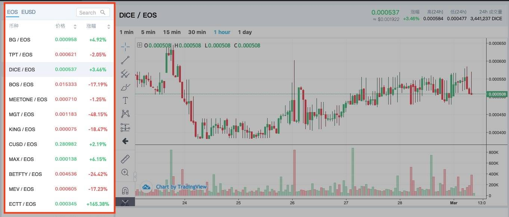

# 六、.4 交易对管理设计与实现

# 交易对功能设计与实现

上一小节讲解并实现了 TOKEN 数据的增删改，那么本小节将对这些 TOKEN 数据进行关系映射，具体数据表现形式就是在交易所中大家所见到的交易对列表数据。如下图所示： 

## 功能介绍

交易对功能：主要用于配置两个 TOKEN 间的映射关系、确定基准代币、兑换代币、最小订单量以及需要收取的交易手续费等数据信息。

示例： 假设： 我们需要创建一个 DICE/EOS 的交易对，那么基准代币就是 EOS，兑换代币就是 DICE。因为基准代币是 EOS，所以我们可以设置最小订单为 0.1 EOS，即不管买单还是卖单其订单价值都不允许小于 0.1EOS。同样，我们也可以设置交易手续费用为 1/1000, 即根据当前买/卖单分别收取或单项收到成交订单金额的 1/1000 手续费

## 数据结构

| 字段 | 数据类型 | 说明 |
| --- | --- | --- |
| 主键 | uint64_t | 可自由设定或由系统生成 |
| 兑换代币 id | uint64_t |  |
| 基准代币 id | uint64_t |  |
| 价格计算精度 | uint32 _t |  |
| 最小订单量 | uint32 _t |  |
| 交易手续费 | uint32_t |  |

注： 在 EOS 智能合约中，金额类型字段往往采用的是由 eoslib 提供的 eosio::asset 数据类型，而在 asset 数据类型内部使用的是整型字段，考虑到数值金额的方便计算少一些数据转换，所以我们统一使用整型字段；另外，因为不同 TOKEN 在发行时支持不同精度的，所以在涉及到金额相关字段都需要进行处理。

**价格计算精度**，因为交易所一般在进行价格展示时默认是保留小数点后六位，所以在价格计算精度配置是可以设置为 1000000.

**最小订单量**，需要根据交易对中 TOKEN 的精度进行设定。比如：DICE/EOS 交易对对应币种精度为 4，而我们的最小订单量是 0.1EOS, 那么应该最小订单量应设置为 0.1 * 10⁴ = 1000.

注：对于数据类型的选用，一定要根据实际业务需求权衡，一方面可以避免数值越界，尤其是对于金额类型的字段；另一方面可以有效节省内存资源，因为在合约中存储同样也是需要支付一定费用的。

## 业务约束

*   仅允许管理员进行操作
*   不允许重复交易对
*   停用交易对时无法进行 TOKEN 交易
*   判断交易对代币是否存在
*   已经存在交易的交易对不允许删除

## 权限要求

*   仅限管理员操作

## 安全问题

*   权限验证
*   方法分级授权，可根据管理角色进行授权。

## 技术实现

由项目成员自主设计与实现。

## 涉及命令知识点

*   查看 Docker 服务

    ```js
    docker ps
    ```

*   进入 Docker 命令窗口

    ```js
     docker exec -it <container name> /bin/bash
    ```

*   解锁钱包

    ```js
    cleos wallet unlock -n <钱包名称> --password <钱包密码>

    # 例如: 打开名称为 hackdappexch 的钱包
    cleos wallet unlock -n hackdappexch --password $(cat hackdappexch_wallet_password.txt);
    ```

*   发布合约

    ```js
    cleos set contract <合约名> <合约目录> -p <合约名>@active
    ```

*   调用合约方法

    ```js
    cleos push action <合约名> <合约方法> [<参数 1>,<参数 2>] -p <合约名>@active
    ```

*   查询数据表

    ```js
    cleos get table <合约名> <scope> <表定义>
    # scope 值取决于实例化索引时所传入的值, 一般实例化索引时传入 _self,即合约本身。
    ```

    * * *

通过本章节的学习、思考与动手实践， 我们完成了交易对功能的数据结构定义、创建交易对、修改交易对及删除交易对方法的代码开发与测试工作。

* * *

> 在教程中如出现错误🐛或不易理解的知识点，欢迎加我微信指正! Name: zhangliang | WeChat: rushking2009 | Mail: zhangliang@cldy.org

* * *

**changelog** 2019-03-01 zhangliang \zhangliang@cldy.org\

*   初次发稿