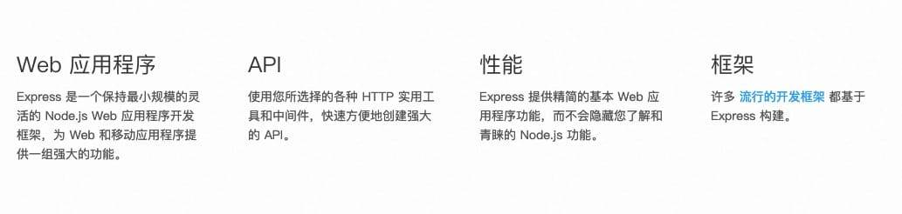
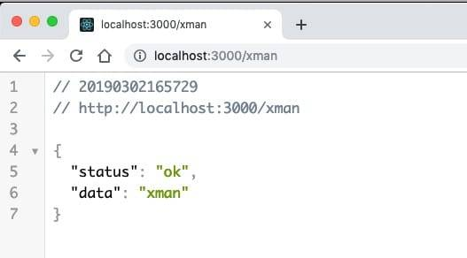
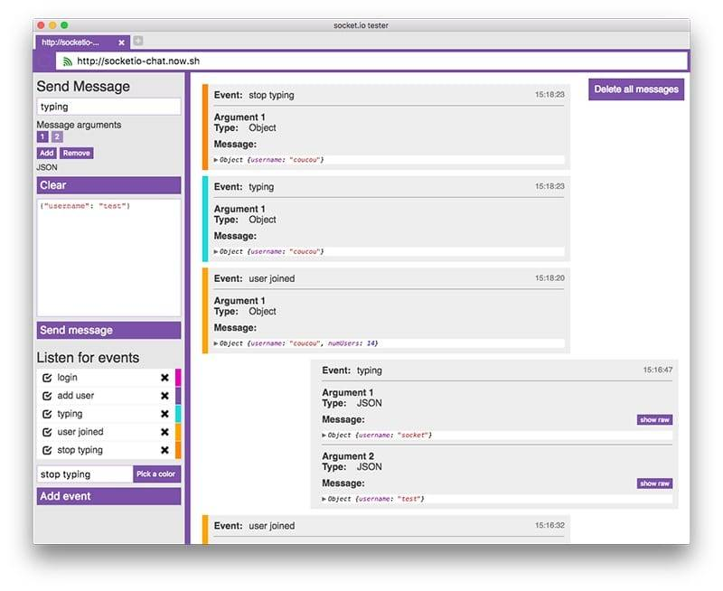

# 7.2 基础框架整合（Express\Node\Log\Profile\Socket)

# 技术框架整合

本小节主人介绍如何基于 Node.js 构建一个标准化的 web 项目，并在此基础上集成 http/socket、定时调度、日志框架、多环境配置、时间处理以及测试组件。

* * *

## 一、构建项目工程

本项目工程我们将选用 Express 框架作为 web 服务框架， Express 是基于 Node.js 平台，快速、开放、极简的 Web 开发框架。 

在开始之前，请先确保自己的电脑已经安装了[Node.js](https://nodejs.org/en/)，因为后续的操作需要用到 npm 命令来帮助我们快速安装各个依赖组件。

1.  新建工程

    ```js
    > mkdir dexchange_web
    > cd dexchange_web
    ```

2.  初始化并配置 Node 工程
    通过`npm init`命令，设置我们工程的基本属性，比如初始版本信息、git 仓库地址、作者、工程介绍等信息，配置完成后会自动生成到`package.json`文件。

    ```js
    > npm init
    package name: (dexchange_web)
    version: (1.0.0)
    description:
    entry point: (index.js)
    test command:
    git repository:
    keywords:
    author:
    license: (ISC)
    About to write to ....../dexchange_web/package.json:

    {
      "name": "dexchange_web",
      "version": "1.0.0",
      "description": "",
      "main": "index.js",
      "scripts": {
        "test": "echo \"Error: no test specified\" && exit 1"
      },
      "author": "",
      "license": "ISC"
    }
    ```

    你也可以在工程根目录下，打开 package.json 文件查看具体配置信息。

3.  安装 express
    通过**npm install**命令快速安装 express 组件，并将组件信息写入 package.json 文件中。

    ```js
    > npm install express --save
    ```

4.  创建 web 服务
    在工程目录下，创建文件， 作为程序运行的入口启动文件。然后，粘贴以下代码到**index.js**文件中

    ```js
    var express = require('express')
    var app     = express()
    var http    = require('http').Server(app)
    var router = express.Router()

    const port = 3000

    app.all('*', function (req, res, next) {
        res.header('Access-Control-Allow-Origin', '*')
        res.header('Access-Control-Allow-Headers', 'Content-Type, Content-Length, Authorization, Accept, X-Requested-With , yourHeaderFeild')
        res.header('Access-Control-Allow-Methods', 'PUT, POST, GET, DELETE, OPTIONS')

        if (req.method == 'OPTIONS') {
            res.send(200)
        } else {
            next()
        }
    })

    router.get('/:name', async function (req, res) {
         res.setHeader('Content-Type', 'application/json')

         res.json({
             status: "ok",
             data: req.params.name
         })
    })

    app.use('/', router)

    app.use(function (req, res, next) {
        res.status(404).send("Sorry, that route doesn't exist. Have a nice day :)")
    })
    http.listen(port, function () {
        console.info('listening on *:' + port)
    })
    ```

5.  运行程序

    ```js
    > node index.js
    ```

6.  通过浏览器访问[`localhost:3000/xman`](http://localhost:3000/nolan)  到此，便完成了一个最简单的支持 http 服务的 web 框架。接下来，我们将一个个的集成 socket 组件、日志组件、日期组件，以支撑新业务需求及线上问题跟踪。

## 二、安装组件

### 1\. SOCKET 组件

**A. 安装**

> npm install socket.io

**B. 集成示例**

1.  实例化 socketserver

    ```js
    var express = require('express')
    var app     = express();
    var http    = require('http').Server(app);
    var socketsvr  = require('socket.io')(http);
    //注：如果不特殊指定 socket 端口的化，将默认采用 http 的端口
    ```

2.  建立 socket 连接

    ```js
    socketsvr.on("connection", function(socket){
        //socket 实例为建立好连接之后，单通道实例
    })
    ```

3.  断开 socket 链接

    ```js
    socketsvr.on("disconnect", function(socket){
    })
    ```

4.  接收消息（单通道）

    ```js
    socket.on("kline.query", function(args){
        console.log(JSON.strify(args));
    })
    //注: kline.query 为自定义事件, args 也可能自由进行设定
    ```

5.  发送消息（单通道）

    ```js
    socket.emit("kline.update", {
        "method": "kline.update", 
        "data": [], 
        "params": []
    })
    //注： kline.update 为自定义事件，返回参数同样可以自己定义
    ```

6.  全局广播

    ```js
    socketsvr.sockets.emit("notifyall", {
        "method": "notifyall", 
        "data": [], 
        "params": []
    })
    ```

**C.在线文档**

[`github.com/socketio/socket.io/blob/df05b73bb93d7c34c758504001f869cb156703d5/docs/API.md`](https://github.com/socketio/socket.io/blob/df05b73bb93d7c34c758504001f869cb156703d5/docs/API.md)

**D. 下载地址**

[`www.npmjs.com/package/socket.io`](https://www.npmjs.com/package/socket.io)

**E.调试工具**

可通过 Socket.io tester 工具可以订阅监听事件并发送消息至 socker 服务器进行接口测试。 

下载地址：[`electronjs.org/apps/socket-io-tester`](http://electronjs.org/apps/socket-io-tester)

### 2\. JSON 请求解析

该组件主要用于解析请求内容为 application/json 类型的数据

**A. 安装**

```js
> npm install body-parser
```

**B. 集成示例**

```js
app.use(bodyParser.urlencoded({
    extended: false
}))
app.use(bodyParser.json());
```

**C. 在线文档**

[`github.com/expressjs/body-parser#readme`](https://github.com/expressjs/body-parser#readme)

**D.下载地址**

[ https://www.npmjs.com/package/body-parser ](https://www.npmjs.com/package/body-parser)

### 3\. 多配置

实现多环境配置，支持开发、测试环境、正式环境不同配置的灵活切换。

**A. 安装**

```js
> npm install nconf
> npm install js-yaml
```

**B. 集成示例**

```js
const nconf = require("nconf")
const yaml = require("js-yaml")

nconf.file({
    file: cfgpath, //可通过 NODE_ENV 的方式加载不同配置。
    format: {
        parse: yaml.safeLoad,
        stringify: yaml.safeDump,
    }
})

nconf.get() 
```

**C. 在线文档**

[`github.com/indexzero/nconf#readme`](https://github.com/indexzero/nconf#readme)

**D.下载地址**

[`www.npmjs.com/package/nconf`](https://www.npmjs.com/package/nconf) [`www.npmjs.com/package/js-yaml`](https://www.npmjs.com/package/js-yaml)

### 4\. 日期组件

**date-fns**是一个提供了丰富的处理时间方法的工具库。比如：格式化时间、日期计算、日期比较等等。

**A. 安装**

```js
> npm install date-fns --save
# or with yarn 
> yarn add date-fns
# or with bower 
> bower install date-fns
```

**B. 集成示例**

1.  日期格式化

    ```js
    dateFns.format(new Date(2014, 1, 11), 'MM/DD/YYYY')
    ```

2.  日期比较

    ```js
    var result = isAfter(new Date(1989, 6, 10), new Date(1987, 1, 11))
    ```

3.  计算开始时间

    ```js
    // The start of a second for 1 December 2014 22:15:45.400:
    var result = startOfSecond(new Date(2014, 11, 1, 22, 15, 45, 400))
    //=> Mon Dec 01 2014 22:15:45.000
    ```

4.  日期计算

    ```js
    // Add 10 days to 1 September 2014:
    var result = addDays(new Date(2014, 8, 1), 10)
    //=> Thu Sep 11 2014 00:00:00
    ```

**C. 在线文档**

[`date-fns.org/v1.30.1/docs/startOfSecond`](https://date-fns.org/v1.30.1/docs/startOfSecond)

**D. 下载地址**

[`www.npmjs.com/package/date-fns`](https://www.npmjs.com/package/date-fns)

### 5\. 日志组件

**A. 安装**

```js
> npm install winston
> npm install winston-daily-rotate-file
```

**B. 集成示例**

```js
const { createLogger, format, transports } = require('winston')
const { combine, timestamp, label, printf } = format
const path = require('path')
const fs = require('fs')
require('winston-daily-rotate-file')

const logger = createLogger({
    format: combine(
        label({
            label   : 'dexchange#' + path.basename(module.parent.filename)
        }),
        format.splat(),
        format.colorize(),
        timestamp({
            format: 'YYYY-MM-DD HH:mm:ss'
        }),
        printf(info => {
            let msg = info.message;
            try {
                if (info.message instanceof Object) {
                    msg = JSON.stringify(info.message);
                } 
            } catch (error) {
                msg = info.message;
            } 
            return `${info.timestamp} [${info.label}] ${info.level}: ${msg}`;
        })
    ),  
    transports: [
        new transports.Console({
            level: cfg.console.level
        }),
        new(transports.DailyRotateFile)({
              level: cfg.file.level,
              filename: path.join('logs', cfg.file.filename),
              datePattern: cfg.file.datePattern,
              zippedArchive: cfg.file.zippedArchive,
              maxSize: cfg.file.maxsize,
              maxFiles: cfg.file.maxFiles
        })
    ]
}); 
```

**C. 在线文档**

[`github.com/winstonjs/winston#table-of-contents`](https://github.com/winstonjs/winston#table-of-contents)

**D. 下载地址**

[`www.npmjs.com/package/winston`](https://www.npmjs.com/package/winston) [`www.npmjs.com/package/winston-daily-rotate-file`](https://www.npmjs.com/package/winston-daily-rotate-file)

### 6\. 数据库及连接池

本项目中我们将采用**mysql2**作为项目的数据库，而 mysequel 组件主要是为了提升查询效率，而引入的数据库连接池，防止频繁的创建数据库连接。

**A. 安装**

```js
> npm install mysequel
> npm install mysql2
```

**B. 集成示例**

1.  初始化 mysql 连接池

    ```js
    const mysequel = require('mysequel');

    this.mysql = mysequel(dbconfig);
    this.mysql.on('query-complete', (type, query, duration) => {
        logger.debug(query, `${type} query completed in ${duration}ms`);
    });
    this.mysql.on('query-error', (err, type, query, duration) => {
        logger.error({
            err,
            query
        }, `${type} query failed after ${duration}ms`);
    });
    ```

    除了 query-complete、query-error 监听事件外，还支持 query-start、query-retry、query-done 等等事件，可根据自己的需求进行代码实现。

2.  插入数据

    ```js
    this.mysql.queryInsert("insert into user (id, name) value (:id, :name)", {
        id: id,
        name: name,
    }).then((result) => {
    }).catch((err) => {;
    })
    ```

3.  修改数据

    ```js
    this.mysql.queryChanged("update user set name = :name where id = :id", {
        id: id,
        name: name,
    }).then((result) => {
    }).catch((err) => {;
    })
    ```

4.  查询批量数据

    ```js
    mysql.query({
        sql: 'SELECT * FROM users LIMIT :limit',
        values: { limit: 10 },
        retry: false
    })
    ```

此处只展示了几个示例代码，如果有其他需求可直接查阅官方在线文档。

**C. 在线文档**

[`github.com/Twipped/mysequel#readme`](https://github.com/Twipped/mysequel#readme)

**D. 下载地址**

[`www.npmjs.com/package/mysequel`](https://www.npmjs.com/package/mysequel) [`www.npmjs.com/package/mysql2`](https://www.npmjs.com/package/mysql2)

### 7\. 调度引擎

**A. 安装**

```js
> npm install node-schedule
```

**B. 集成示例**

```js
var schedule = require('node-schedule');

//每个小时的第 42 分钟执行该任务
var j = schedule.scheduleJob('42 * * * *', function(){
  console.log('The answer to life, the universe, and everything!');
});

-------------------------------------------------------
*    *    *    *    *    *
┬    ┬    ┬    ┬    ┬    ┬
│    │    │    │    │    │
│    │    │    │    │    └ day of week (0 - 7) (0 or 7 is Sun)
│    │    │    │    └───── month (1 - 12)
│    │    │    └────────── day of month (1 - 31)
│    │    └─────────────── hour (0 - 23)
│    └──────────────────── minute (0 - 59)
└───────────────────────── second (0 - 59, OPTIONAL) 
```

**C. 在线文档**

[`github.com/node-schedule/node-schedule#readme`](https://github.com/node-schedule/node-schedule#readme)

**D. 下载地址**

[`www.npmjs.com/package/node-schedule`](https://www.npmjs.com/package/node-schedule)

* * *

通过本章节的学习、思考以及动手实践， 我们完成了基于 Node.js 的多技术组件整合。在此项目中，支持多配置文件（本地、测试环境、正线环境）配置与发布、http/socket、定时调度、日志记录以及按天切割压缩日志等功能。

* * *

> 在教程中如出现错误🐛或不易理解的知识点，欢迎加我微信指正! Name: zhangliang | WeChat: rushking2009 | Mail: zhangliang@cldy.org


* * *

### **changelog**

2019-03-02 zhangliang

*   初次发稿

2019-03-12 zhangliang

*   文档目录序号完善
*   完善文档介绍
*   增加微信图片
*   修改邮箱链接