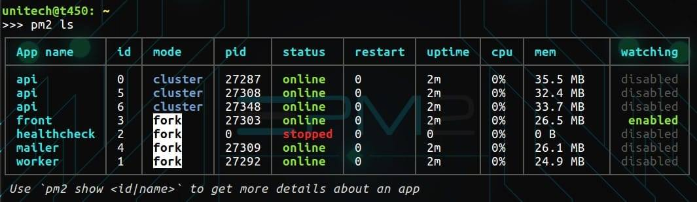

# 9.5 后端服务配置与启动

本小节将介绍如何部署本项目的后端服务，其中包括：对项目参数的配置、日志配置及守护线程的配置

* * *

## 克隆项目

考虑到后续方便更新与升级，我们通过 git-ssh 克隆的方式将项目拉取到服务器上

```js
> git git@github.com:xxx.git
```

然后，编译打包后再部署到对应中间件目录。每次升级事先将原有的目录文件打包备份并进行文件归档。当上线失败时，可快速回滚。

## 参数配置

*   配置后端服务端口，尤其是一机多实例的情况，防止端口冲突
*   配置数据库参数
*   配置公链节点配置
    *   chainid
    *   http
    *   合约名称
    *   调度公钥地址
*   配置调度时间

    ## 配置日志

*   检查日志级别，改为 info 或更高级别
*   修改日志存储目录
*   修改日志切割规则

## 启动并守护服务线程

在系统运行期难免遇到服务中断的情况，所以我们需要一个守护服务保证服务在中断时可以重新启动。 在这里，我们将采用`pm2`程序来守护 Node 后端服务。



**安装 pm2 组件**

```js
> npm install pm2 -g

# 或者

> yarn global add pm2 
```

**启动服务实例**

```js
> pm2 start "npm run start:prod" -n dexchange
```

**查看当前运行实例**

```js
> pm2 ls
┌──────────┬────┬─────────┬──────┬───────┬────────┬─────────┬────────┬──────┬───────────┬──────┬──────────┐
│ App name │ id │ version │ mode │ pid   │ status │ restart │ uptime │ cpu  │ mem       │ user │ watching │
├──────────┼────┼─────────┼──────┼───────┼────────┼─────────┼────────┼──────┼───────────┼──────┼──────────┤
│ serdice  │ 2  │ 1.0.0   │ fork │ 19834 │ online │ 31      │ 6D     │ 0%   │ 49.7 MB   │ root │ disabled │
│ serpool  │ 3  │ 1.0.0   │ fork │ 19815 │ online │ 1       │ 6D     │ 0%   │ 49.3 MB   │ root │ disabled │
│ webdice  │ 0  │ 1.0.0   │ fork │ 19868 │ online │ 31      │ 6D     │ 0.3% │ 93.1 MB   │ root │ disabled │
│ webpool  │ 1  │ 1.0.0   │ fork │ 19853 │ online │ 16      │ 6D     │ 0%   │ 67.3 MB   │ root │ disabled │
└──────────┴────┴─────────┴──────┴───────┴────────┴─────────┴────────┴──────┴───────────┴──────┴──────────┘

```

* * *

通过本小节的学习、思考与动手实践，我们完成了项目上线前数据库、日志文件的参数检查与配置以及 Node 服务的注册与启动。

* * *

> 在教程中如出现错误🐛或不易理解的知识点，欢迎加我微信指正! Name: zhangliang | WeChat: rushking2009 | Mail: zhangliang@cldy.org


注： 有想了解**愿码全思维 IT 工程师加速器**的朋友，可以扫码加群咨询。

* * *

**changelog** 2019-03-06 zhangliang

*   初次发稿