# 十一、.1 零基础体验 EOS 入门合约开发

本教程主要面向初阶开发人员，目的在于带领大家以最简单的示例合约，通过简单但不失完整的流程，体验整个合约的编译、发布与调用过程，从而让大家从直观角度有个清晰的概念认识。

* * *

## 一、帐户注册

### 1\. 生成公私钥地址

在进行帐户注册时，需要事先提供一对公私钥地址，以便在注册帐号时进行绑定使用。可通过[EOS Key Generation](https://nadejde.github.io/eos-token-sale/)网站进行公私钥地址生成。 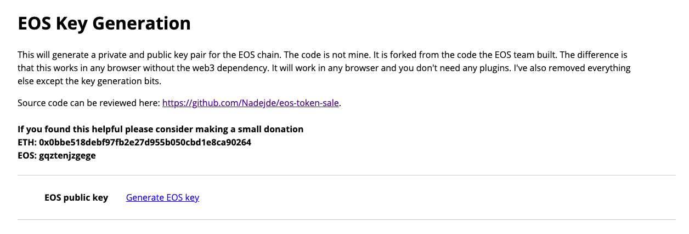 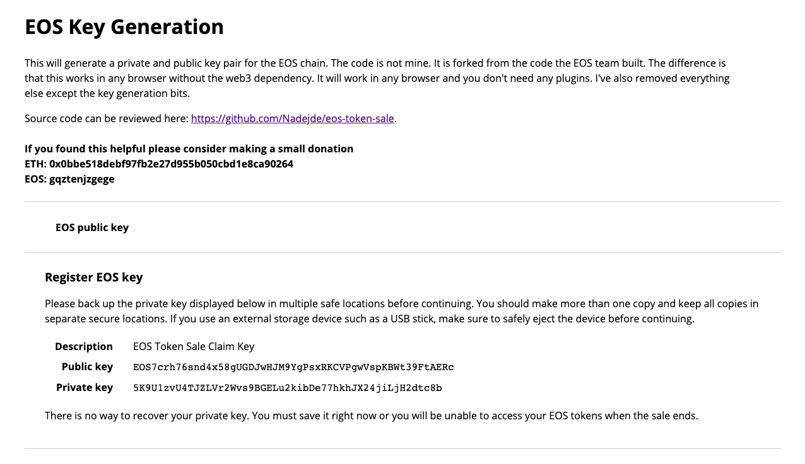

### 2\. 帐号注册

通过[Jungle2.0 - EOS Test Network Monitor (CryptoLions.io)](http://monitor.jungletestnet.io/#home)网站进行 EOS 帐户的创建 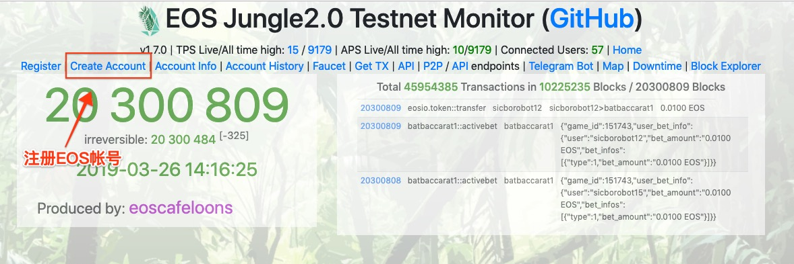 点击图中标红**create account**, 在弹出界面中，填写事先生成的公钥地址 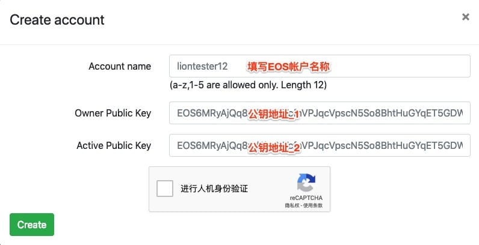 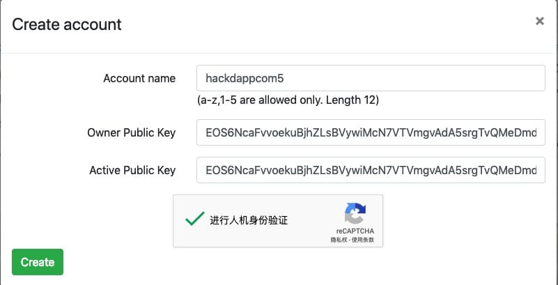 见上图中，需要填写三个信息，其中 account name 主要用于填写我们易于记忆的帐户名称，但其帐户名称长度只允许 12 位长度，且其组成字符也只能从 a-z, 1-5 以及一个点符号组成。 至于 owner public key 和 active public key 分别对应该帐户 owner 权限和 active 权限。如果从安全角度讲，两个权限所对应的公钥地址应该设置成不一样的，这样当 active private key 丢失的时候，可以使用 ower 权限对 active 权限对应的公钥地址进行更换。因为 ower 和 active 权限是有层次关系的，只允许低级权限对下次权限进行操作。在不丢失 ower 私钥的情况下，也可以实现对 ower 权限地址的更换操作。

点击**create**, 创建成功后，会显示如下信息 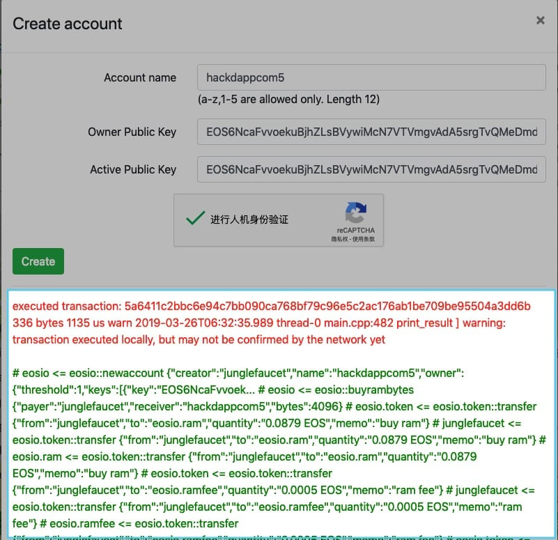

## 二、申领 EOS

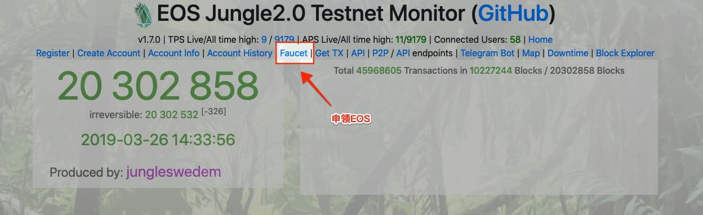 在[Jungle2.0 - EOS Test Network Monitor (CryptoLions.io)](http://monitor.jungletestnet.io/#home)页面，点击菜单栏中的**Faucet**按钮，会弹出如下界面 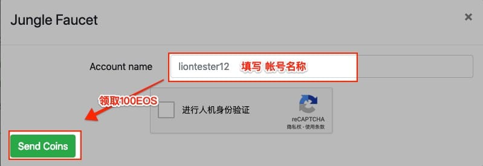

## 三、查看帐户明细(余额 / RAM / CPU / NET 资源)

 在[Jungle2.0 - EOS Test Network Monitor (CryptoLions.io)](http://monitor.jungletestnet.io/#home)页面，点击菜单栏中的**account info**按钮，弹出如下界面： 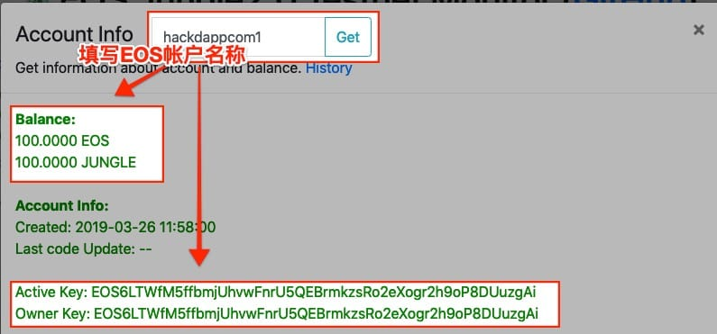 填写帐号名称后，点击**get**按钮, 便可以查到该用户的 EOS 余额及公钥地址信息。

## 四、编译合约

本步骤将使用 EOS 所提供的 cdt 开发工具包完成对简单示例合约的编译工作。

1）在本地安装 eosio-cpp 工具命令

```js
brew tap eosio/eosio.cdt //增加仓库
brew install eosio.cdt   //安装工具包
```

注： 可使用**eosin-cpp --help**命令来查看所有参数说明

```js
> eosio-cpp --help
OVERVIEW: eosio-cpp (Eosio C++ -> WebAssembly compiler)
USAGE: eosio-cpp [options] <input file> ...

OPTIONS:

Generic Options:

  -help                    - Display available options (-help-hidden for more)
  -help-list               - Display list of available options (-help-list-hidden for more)
  -version                 - Display the version of this program

compiler options:

  -C                       - Include comments in preprocessed output
  -CC                      - Include comments from within macros in preprocessed output
```

2）编写简单示例合约(helloworld.cpp)

```js
#include <eosiolib/eosio.hpp>

using namespace eosio;

class [[eosio::contract]] hello : public contract {
  public:
      using contract::contract;

      [[eosio::action]]
      void hi( name user ) {
         print( "Hello, ", user);
      }
};

EOSIO_DISPATCH(hello, (hi)) 
```

3）进行合约编译，生成 abi 合约描述文件及 wasm 合约文件

```js
eosio-cpp -abigen 'contracts/hello.cpp' -o 'contracts/hello.wasm' --contract 'hackdappcom1'
```

编译完成后，会生成 hello.abi、hello.wasm 两个文件。

## 五、购买 RAM、CPU、NET 资源

### 1\. 安装 scatter

在 chrome 浏览器中安装[Chrome 网上应用店 - scatter](https://chrome.google.com/webstore/detail/scatter/ammjpmhgckkpcamddpolhchgomcojkle?hl=zh-CN)插件。

**注: **如果 Chrome 插件商店无法打开，则可以使用[Start | Chrome Extension Downloader](https://chrome-extension-downloader.com/f944f5bf7bc58292048aa5b9bf29dc48/scatter.crx.crx.crx)进行下载。

安装完成后，点击浏览器 scatter 插件，它会先让你进行密码设置等操作。帐户密码设置好后，进入主界面：

**首先**，导入私钥地址。可根据下图进行操作；

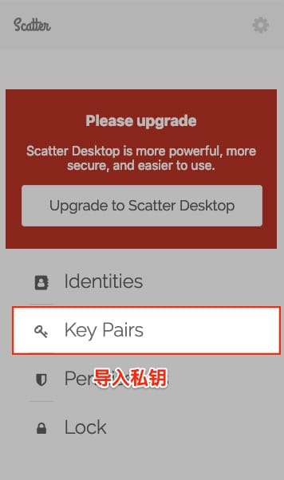

**然后**，将私钥与具体的区块链节点进行绑定操作；  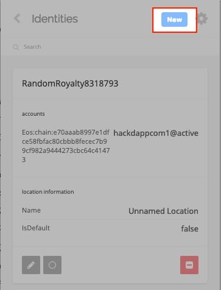 

### 2\. 绑定 scatter 帐号

访问[内存交易 - 钱包 - EOSX - Fastest EOS Block Explorer](https://jungle.eosx.io/tools/ram/buy?symbol=10)网站，绑定 scatter 帐号

 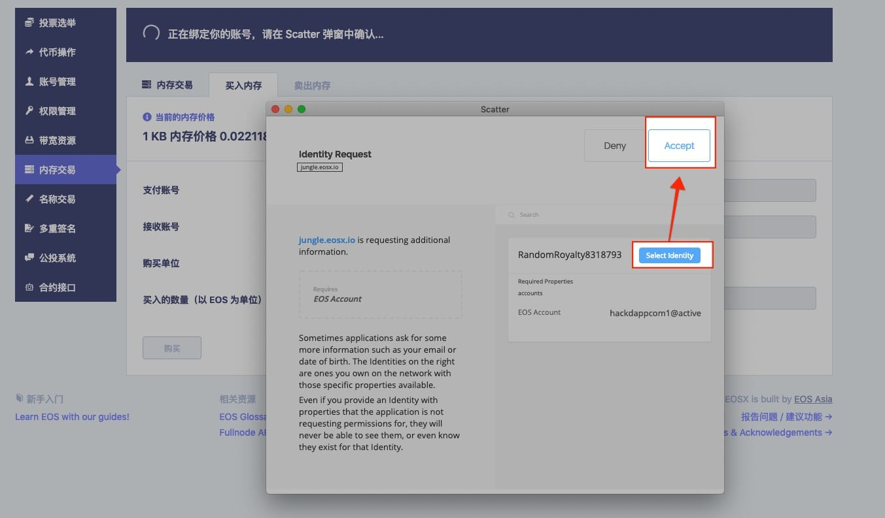

### 3\. 购买资源

**购买 RAM** 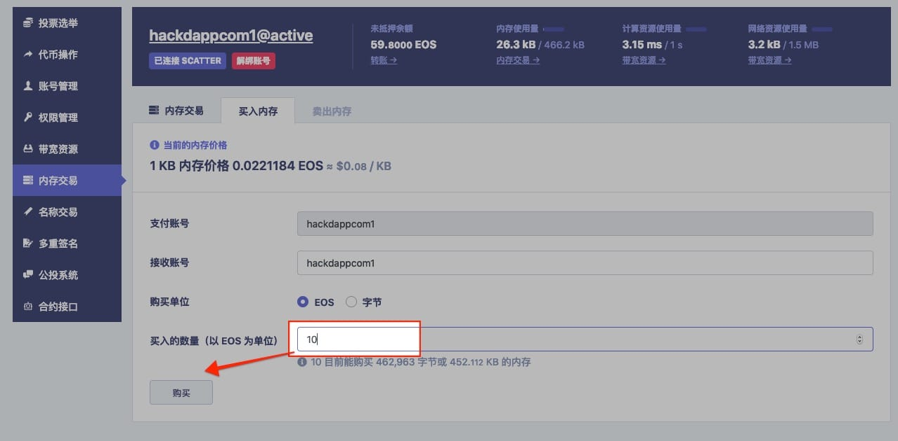 **购买 CPU 与 NET 资源** 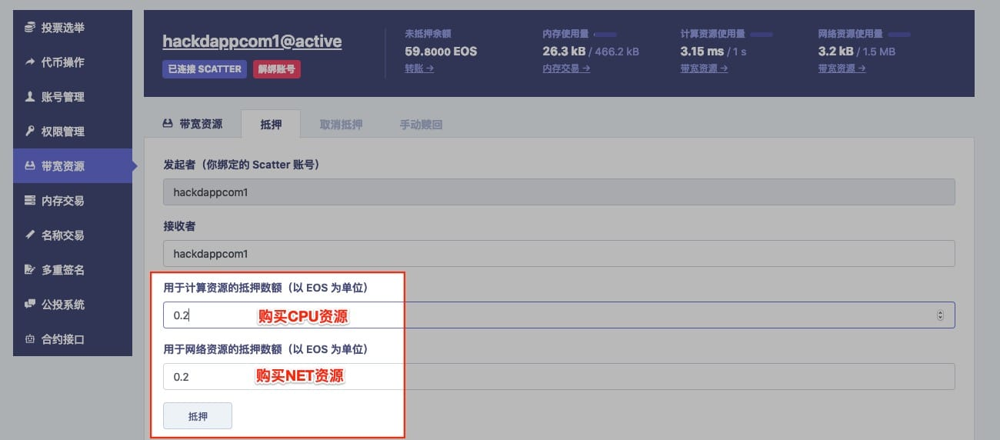

## 六、发布合约

如果你没有事先购买 RAM 资源，可以会提示以下错误信息

```js
{
  "code": 500,
  "message": "Internal Service Error",
  "error": {
    "code": 3080001,
    "name": "ram_usage_exceeded",
    "what": "Account using more than allotted RAM usage",
    "details": [
      {
        "message": "account hackdappcom1 has insufficient ram; needs 26318 bytes has 5471 bytes",
        "file": "resource_limits.cpp",
        "line_number": 213,
        "method": "verify_account_ram_usage"
      }
    ]
  }
}
```

为了方便大家的操作，特提供了一个发布合约的示例工程 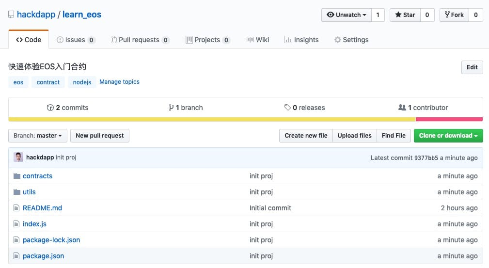 1）克隆示例工程:

```js
git clone git@github.com:hackdapp/learn_eos.git
```

将之前编写的示例合约，放在工程目录 contracts 下

2）编辑配置文件**deploy.js**和**package.json**

```js
//file: deploy.js
const eos = require('./utils/eossdk')({
  chainId: "e70aaab8997e1dfce58fbfac80cbbb8fecec7b99cf982a9444273cbc64c41473",
  httpEndpoint: "http://jungle2.cryptolions.io:80",
  keyProvider: "5JxqGao9rzXWBUDnNzALyxaFdmZYXiZ46EzHL4sJkHkryzCFKxu", //可改为自己的私钥地址
  authorization: 'hackdappcom1@active',//可以改为自己的 eos 帐户
  broadcast: true,
  sign: true
})

const {deployContract} = require('./utils/deploy')

deployContract(eos, { account: "hackdappcom1", contractDir: "./contracts" }).then((result) => {
    console.log(`Deployment successful`, JSON.stringify(result, null , 4))
})
.catch(err => {
    console.error(`Deployment failed`, err)
})
```

同时，还需要再编辑**package.json**

```js
//package.json
{
  "name": "learn_eos",
  "version": "1.0.0",
  "description": "快速体验 EOS 入门合约",
  "main": "index.js",
  "scripts": {
    "test": "echo \"Error: no test specified\" && exit 1",
    "build": "eosio-cpp -abigen 'contracts/hello.cpp' -o 'contracts/hello.wasm' --contract 'hackdappcom1'", //根据自己的情况修改合约名称 --contract '合约帐户名'
    "deploy": "node index.js" 
  },
  "repository": {
    "type": "git",
    "url": "git+https://github.com/hackdapp/learn_eos.git"
  },
  "author": "",
  "license": "ISC",
  "bugs": {
    "url": "https://github.com/hackdapp/learn_eos/issues"
  },
  "homepage": "https://github.com/hackdapp/learn_eos#readme",
  "dependencies": {
    "eosjs": "¹⁶.0.9"
  }
}
```

3）合约发布

```js
npm run deploy
```

显示**Deployment successful**, 则表示发布合约成功。

## 七、测试合约及合约方法调用

### 编写测试文件 index.js

```js
const eos = require('./utils/eossdk')({
  chainId: "e70aaab8997e1dfce58fbfac80cbbb8fecec7b99cf982a9444273cbc64c41473",
  httpEndpoint: "http://jungle2.cryptolions.io:80",
  keyProvider: "5JxqGao9rzXWBUDnNzALyxaFdmZYXiZ46EzHL4sJkHkryzCFKxu",
  authorization: 'hackdappcom1@active',
  broadcast: true,
  sign: true
})

const data = {
    actions: [
        {
          account: 'hackdappcom1',
          name: 'hi',
          authorization: [{
              actor: 'hackdappcom1',
              permission: 'active'
          }],
          data: {"user": "lisa"}
        }
    ]
}

eos.transaction(data).then((result)=>{
    console.log(JSON.stringify(result.processed.action_traces[0].console, null, 4))
}).catch((err)=>{
  console.log(err)
})
```

运行调用命令

```js
node index.js
```

运行结果如下

```js
"Hello, 111" 
```

* * *

通过本章的学习以及自我动手实践，了解在测试网上如何进行私钥生成以及帐号注册，学会如何使用 eosio-cpp 命令编译示例合约以及通过脚本进行合约的发布及测试的完整操作流程。

### 测试网帐号

| 帐户名 | 公钥 | 私钥 |
| --- | --- | --- |
| hackdappcom1 | EOS6LTWfM5ffbmjUhvwFnrU5QEBrmkzsRo2eXogr2h9oP8DUuzgAi | 5JxqGao9rzXWBUDnNzALyxaFdmZYXiZ46EzHL4sJkHkryzCFKxu |
| hackdappcom2 | EOS6qCqbFLuYK5rGK9LDPzcboLqy4phrUxLXLrhLgXxVBpzLzsJke | 5Jnw2anG8Zzy6MuCNxvwmaX5Hu4B6de1uzuae5QyRrUFtyfL2Wo |
| hackdappcom3 | EOS57B3rxRBBUiTyZf9iBxsWyQnvEhq2H95wbBbjdzcLbV1gfJ4zy | 5Ju2NNc24q3jQ2Yc2JcvwWjtGVeAyuWcNsaNVb37u7cmRW56zgc |
| hackdappcom4 | EOS7i5Diz2uqXSpvutmV4DftBRrL1XASzxsSdWBGrgzngPoXhT2dk | 5K6nyWMvpfYnQqLhS545dm53exduJgDBLHMYQ6SCNaPmeHjGZdr |
| hackdappcom5 | EOS6NcaFvvoekuBjhZLsBVywiMcN7VTVmgvAdA5srgTvQMeDmdiAH | 5JjN9efKokkgZYno2qjbE9C7WCGbVpPvgNArKDvcjbDic2pRGCS |

### 参考资料

1.  [`nadejde.github.io/eos-token-sale/`](https://nadejde.github.io/eos-token-sale/)
2.  [`monitor.jungletestnet.io/#home`](http://monitor.jungletestnet.io/#home)
3.  [`jungle.eosx.io/tools/ram/buy?symbol=10`](https://jungle.eosx.io/tools/ram/buy?symbol=10)
4.  [`github.com/hackdapp/learn_eos`](https://github.com/hackdapp/learn_eos)
5.  [`chrome-extension-downloader.com/f944f5bf7bc58292048aa5b9bf29dc48/scatter.crx.crx.crx`](https://chrome-extension-downloader.com/f944f5bf7bc58292048aa5b9bf29dc48/scatter.crx.crx.crx)

* * *

> 在教程中如出现错误🐛或不易理解的知识点，欢迎加我微信指正! Name: zhangliang | WeChat: rushking2009 | Mail: zhangliang@cldy.org